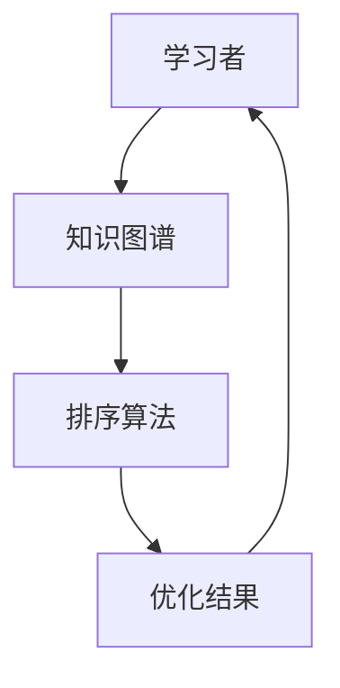

                 


# AI Agent的课程学习：优化知识获取的顺序和策略

> 关键词：AI Agent，课程学习，知识获取顺序，优化策略，知识图谱，学习者模型，推荐算法

> 摘要：AI Agent通过优化知识获取的顺序和策略，帮助学习者更高效地掌握知识。本文探讨了AI Agent在课程学习中的应用，分析了知识图谱构建、学习者模型、排序算法、推荐算法等核心概念，并结合实际案例，详细阐述了AI Agent优化知识获取顺序的实现过程。

---

# 第一部分: AI Agent与课程学习概述

## 第1章: AI Agent与课程学习概述

### 1.1 AI Agent的基本概念

#### 1.1.1 AI Agent的定义与特点
AI Agent（人工智能代理）是一种能够感知环境、自主决策并执行任务的智能实体。其特点包括：
- **自主性**：无需外部干预，自主完成任务。
- **反应性**：能够实时感知环境变化并做出反应。
- **目标导向性**：基于目标驱动行为，优化决策过程。
- **学习能力**：通过与环境交互，不断优化知识和行为策略。

#### 1.1.2 AI Agent的核心功能与应用场景
AI Agent的核心功能包括：
- **知识获取**：从多源数据中提取、整合知识。
- **决策优化**：基于知识和环境反馈，优化决策。
- **任务执行**：根据决策结果执行具体任务。

应用场景广泛，包括教育、医疗、金融等领域。在教育领域，AI Agent可以作为学习助手，优化学习者的知识获取顺序。

#### 1.1.3 课程学习与AI Agent的结合
课程学习是教育领域的重要组成部分，AI Agent可以通过以下方式与其结合：
- **个性化学习路径设计**：根据学习者特点，动态调整知识获取顺序。
- **知识关联分析**：利用知识图谱分析知识之间的关联性，优化学习顺序。
- **实时反馈与调整**：根据学习者表现，实时调整知识获取策略。

### 1.2 课程学习的现状与挑战

#### 1.2.1 传统课程学习的局限性
传统课程学习存在以下问题：
- **知识结构混乱**：知识的呈现顺序可能不符合学习者的认知规律。
- **学习效率低下**：学习者可能在不相关的知识上浪费大量时间。
- **个性化不足**：统一的课程安排难以满足不同学习者的个性化需求。

#### 1.2.2 知识获取顺序对学习效果的影响
知识的获取顺序直接影响学习效果：
- **基础先行**：必须先掌握基础知识，才能理解后续内容。
- **关联性影响**：相关知识的顺序安排影响学习者对知识网络的构建。
- **个体差异**：不同学习者对知识顺序的需求可能不同。

#### 1.2.3 AI Agent在课程学习中的潜在价值
AI Agent可以通过以下方式提升课程学习的效果：
- **动态优化知识顺序**：根据学习者特点和知识关联性，动态调整知识获取顺序。
- **个性化学习路径设计**：为每个学习者量身定制学习计划。
- **实时反馈与调整**：根据学习者表现，实时调整知识获取策略。

### 1.3 问题背景与需求分析

#### 1.3.1 知识获取顺序优化的必要性
知识获取顺序的优化可以显著提升学习效率，减少无效学习时间。

#### 1.3.2 学习者个体差异对知识获取的影响
学习者的认知水平、学习风格、兴趣爱好等个体差异，影响知识获取顺序的需求。

#### 1.3.3 优化知识获取顺序的目标与边界
目标：通过AI Agent优化知识获取顺序，提升学习效率和效果。边界：在保证知识完整性的前提下，动态调整顺序。

---

## 第2章: 知识图谱与学习者模型

### 2.1 知识图谱构建

#### 2.1.1 知识图谱的基本概念
知识图谱是一种将知识以图结构表示的方法，节点表示实体或概念，边表示实体之间的关系。

#### 2.1.2 知识图谱的构建方法
- **数据收集**：从多种数据源收集知识数据。
- **数据清洗**：去除冗余和不一致的数据。
- **知识抽取**：从文本中提取实体和关系。
- **知识融合**：整合多个来源的知识，消除冲突。

#### 2.1.3 知识图谱在课程学习中的应用
知识图谱可以帮助AI Agent理解知识之间的关系，优化知识获取顺序。

### 2.2 学习者模型

#### 2.2.1 学习者模型的定义与特点
学习者模型是用来表示学习者特征和状态的模型，包括学习者的知识水平、学习风格、兴趣爱好等。

#### 2.2.2 学习者模型的构建与更新
- **初始建模**：根据学习者的基本信息和初始表现构建模型。
- **动态更新**：根据学习者的表现和反馈不断更新模型。

#### 2.2.3 学习者模型在知识获取顺序优化中的作用
通过学习者模型，AI Agent可以了解学习者的特点，动态调整知识获取顺序。

---

## 第3章: AI Agent的知识获取策略

### 3.1 知识获取顺序的优化算法

#### 3.1.1 基于排序的优化算法
排序模型的目标是找到最优的知识顺序，以最大化学习效果。

#### 3.1.2 基于推荐的优化算法
推荐系统可以根据学习者的特点推荐知识顺序。

#### 3.1.3 基于强化学习的优化算法
强化学习可以通过试错优化知识获取顺序。

### 3.2 知识图谱中的路径规划

#### 3.2.1 知识图谱的路径规划问题
路径规划的目标是找到从起点到终点的最优路径。

#### 3.2.2 基于图遍历的路径规划算法
- **广度优先搜索（BFS）**：适用于寻找最短路径。
- **深度优先搜索（DFS）**：适用于探索更深层次的知识。

#### 3.2.3 基于深度学习的路径规划方法
深度学习模型可以自动学习知识图谱中的结构信息，优化路径规划。

### 3.3 学习者模型的动态调整

#### 3.3.1 学习者模型的动态更新机制
根据学习者的表现和反馈，实时更新学习者模型。

#### 3.3.2 知识获取顺序的实时调整策略
动态调整知识获取顺序，以适应学习者的变化。

#### 3.3.3 学习者反馈对知识获取顺序的影响
学习者反馈可以作为优化知识获取顺序的重要依据。

---

## 第4章: 知识获取顺序优化的数学模型

### 4.1 基于排序的优化模型

#### 4.1.1 排序模型的数学表示
排序模型的目标是最优化损失函数：
$$
\text{损失函数} = \sum_{i=1}^{n} \text{损失}(y_i, \hat{y}_i)
$$

#### 4.1.2 排序算法的选择与优化
- **支持向量机（SVM）**：适用于小规模数据。
- **随机森林**：适用于特征较多的情况。
- **深度学习模型**：适用于大规模数据。

### 4.2 基于推荐的优化模型

#### 4.2.1 推荐系统的数学模型
协同过滤的数学表示：
$$
\text{相似度}(i, j) = \frac{\sum_{k=1}^{n} r_{ik} r_{jk}}{\sqrt{\sum_{k=1}^{n} r_{ik}^2} \sqrt{\sum_{k=1}^{n} r_{jk}^2}}}
$$

#### 4.2.2 推荐算法的优化策略
- **基于用户的协同过滤**：考虑用户的行为。
- **基于物品的协同过滤**：考虑知识之间的关联性。

---

## 第5章: 系统架构与实现方案

### 5.1 系统功能设计

#### 5.1.1 知识图谱构建模块
- 数据收集：从多种数据源收集知识数据。
- 数据清洗：去除冗余和不一致的数据。
- 知识抽取：从文本中提取实体和关系。

#### 5.1.2 学习者模型构建模块
- 数据收集：收集学习者的基本信息和学习数据。
- 模型构建：根据数据构建学习者模型。

#### 5.1.3 知识获取顺序优化模块
- 算法选择：选择合适的排序算法或推荐算法。
- 模型训练：训练排序模型或推荐模型。
- 动态调整：根据学习者反馈动态调整知识获取顺序。

### 5.2 系统架构设计

#### 5.2.1 系统架构图


#### 5.2.2 接口设计
- **输入接口**：接收学习者的基本信息和学习数据。
- **输出接口**：输出优化后的知识获取顺序。

#### 5.2.3 交互设计
- **学习者与系统交互**：学习者通过系统获取知识。
- **系统反馈**：系统根据学习者反馈调整知识获取顺序。

---

## 第6章: 项目实战与案例分析

### 6.1 环境安装与配置

#### 6.1.1 Python环境安装
安装Python和必要的库：
```
pip install numpy pandas scikit-learn
```

#### 6.1.2 知识图谱构建工具安装
安装知识图谱构建工具：
```
pip install networkx
```

### 6.2 知识获取顺序优化算法实现

#### 6.2.1 排序算法实现
实现基于SVM的排序算法：
```python
from sklearn.svm import SVC
model = SVC()
model.fit(X, y)
```

#### 6.2.2 推荐算法实现
实现基于协同过滤的推荐算法：
```python
def compute_similarity(matrix):
    # 计算相似度矩阵
    pass
```

### 6.3 案例分析与结果解读

#### 6.3.1 案例分析
以数学课程为例，优化知识获取顺序：
1. 先学习加减法，再学习乘除法。
2. 根据学习者的特点动态调整顺序。

#### 6.3.2 实验结果与分析
通过实验验证优化后的知识获取顺序的效果：
- 学习时间减少。
- 学习效果提升。

### 6.4 项目小结

#### 6.4.1 项目总结
总结项目的主要成果和经验教训。

#### 6.4.2 项目改进建议
提出进一步优化的建议。

---

## 第7章: 最佳实践与注意事项

### 7.1 最佳实践

#### 7.1.1 学习者模型的动态更新
定期更新学习者模型，以适应学习者的变化。

#### 7.1.2 知识图谱的维护与优化
定期维护知识图谱，消除冗余和错误。

### 7.2 注意事项

#### 7.2.1 数据隐私保护
确保学习者数据的安全和隐私。

#### 7.2.2 系统的可扩展性
设计可扩展的系统架构，以应对未来的扩展需求。

### 7.3 小结

总结全文，强调AI Agent在课程学习中的重要性，以及优化知识获取顺序的必要性。

---

## 第8章: 拓展阅读与深入思考

### 8.1 拓展阅读

#### 8.1.1 学习者建模
推荐书籍和论文，深入学习学习者建模的方法。

#### 8.1.2 知识图谱构建
推荐知识图谱构建的工具和方法。

### 8.2 深入思考

#### 8.2.1 AI Agent的未来发展趋势
探讨AI Agent在课程学习中的未来发展方向。

#### 8.2.2 知识获取顺序优化的极限
思考知识获取顺序优化的极限和可能的突破点。

---

## 作者信息

作者：AI天才研究院/AI Genius Institute & 禅与计算机程序设计艺术 /Zen And The Art of Computer Programming

---

以上是《AI Agent的课程学习：优化知识获取的顺序和策略》的技术博客文章的完整目录和内容框架。

