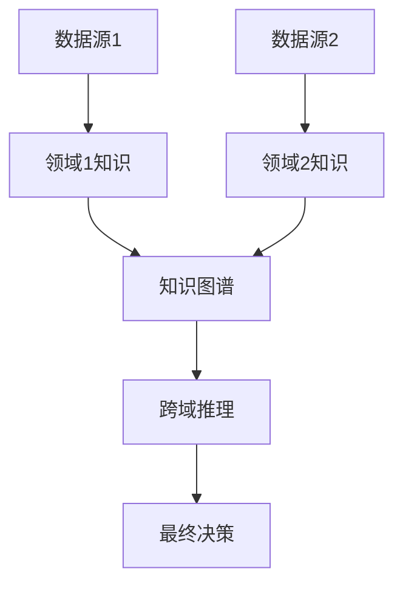
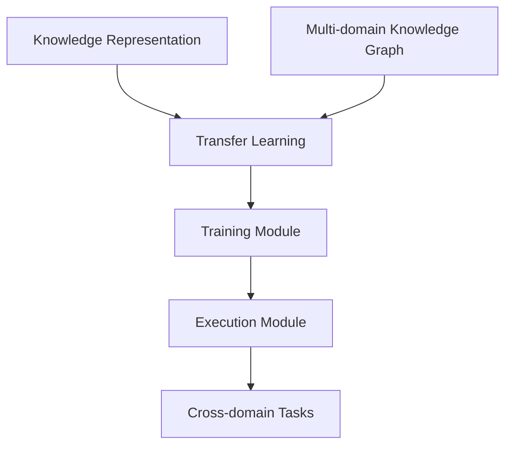
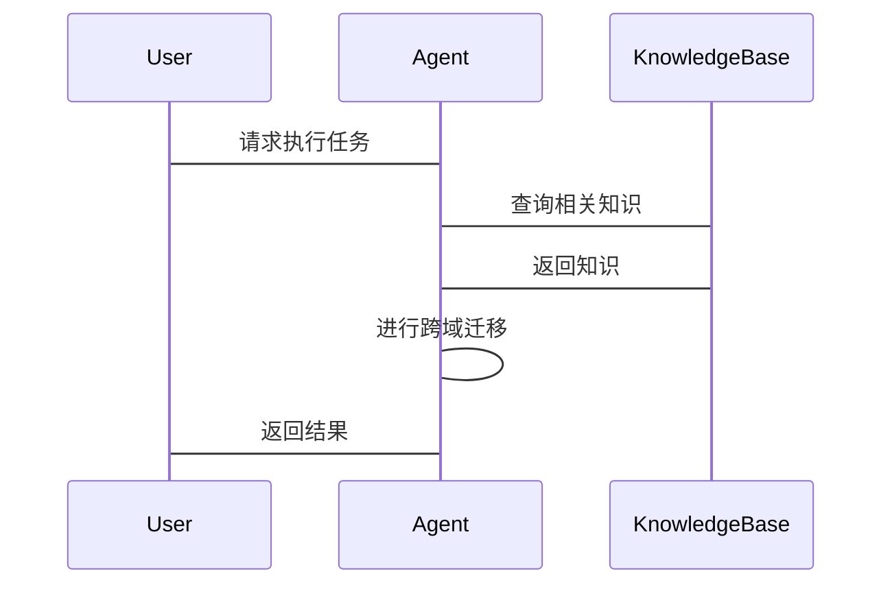

                 


# AI Agent的跨域知识迁移：突破领域局限性

> 关键词：AI Agent，跨域知识迁移，知識圖譜，轉移學習，自適應學習

> 摘要：本文探讨了AI Agent在跨域知识迁移中的核心原理、算法实现及系统设计。通过分析知识表示与推理、轉移學習機制，以及多領域知識圖譜的构建，揭示了突破領域局限性的关键方法。文章结合算法原理和實戰案例，展示了如何在實際應用中實現高效的跨域知识遷移。

---

# 第一部分: AI Agent的跨域知识迁移概述

## 第1章: AI Agent与跨域知识迁移的背景

### 1.1 AI Agent的基本概念

#### 1.1.1 AI Agent的定义
AI Agent（人工智能代理）是指能够感知环境、自主决策并执行任务的智能实体。它可以是一个软件程序、机器人或其他智能系统，旨在模拟人类或其他智能体的行为。

#### 1.1.2 AI Agent的核心特征
- **自主性**：能够自主决策，无需外部干预。
- **反应性**：能够实时感知环境并做出反应。
- **学习能力**：通过数据和经验提升性能。
- **社交能力**：能够与其他Agent或人类进行交互。

#### 1.1.3 AI Agent的应用场景
- 智能助手（如Siri、Alexa）。
- 自动驾驶系统。
- 智能客服机器人。
- 智慧城市中的自动化决策系统。

### 1.2 跨域知识迁移的必要性

#### 1.2.1 知识迁移的定义
知识迁移是指将某个领域中的知识、经验或技能应用到另一个领域的过程。跨域知识迁移则强调在不同领域之间进行知识的迁移。

#### 1.2.2 跨域知识迁移的挑战
- 不同领域的数据格式、特征和标签可能差异较大。
- 领域之间的语义差异可能导致模型无法直接迁移。
- 领域数据的不平衡性可能影响迁移效果。

#### 1.2.3 跨域知识迁移的意义
- 提高AI Agent的通用性和适应性。
- 降低数据收集和训练的成本。
- 增强AI Agent在复杂环境中的决策能力。

### 1.3 跨域知识迁移的技术发展

#### 1.3.1 知识迁移的历史演变
- **早期研究**：基于特征的迁移学习。
- **深度学习时代**：利用深度神经网络进行迁移。
- **当前趋势**：结合知识图谱和多模态数据的迁移。

#### 1.3.2 当前技术现状
- 基于预训练模型的迁移学习。
- 知识图谱在跨域迁移中的应用。
- 跨领域对话系统的研究。

#### 1.3.3 未来发展趋势
- 更加通用的跨域知识迁移模型。
- 结合强化学习的自适应迁移。
- 多模态数据驱动的跨域迁移。

---

## 第2章: 跨域知识迁移的核心概念与联系

### 2.1 知识表示与推理

#### 2.1.1 知识表示的多种方式
- **符号表示**：使用符号逻辑表示知识。
- **向量表示**：通过高维向量表示语义。
- **图结构表示**：使用图结构表示知识的关联性。

#### 2.1.2 知识推理的基本原理
知识推理是指基于已有知识进行推断的过程。常见的推理方法包括逻辑推理、统计推理和神经网络推理。

#### 2.1.3 跨域知识表示的挑战
- 不同领域术语的差异性。
- 领域知识的复杂性。
- 跨域知识的不一致性。

### 2.2 轉移学习与自适应学习

#### 2.2.1 轉移学习的定义与特点
轉移学习是一种机器学习技术，旨在通过将已学习的知识迁移到新的任务中，减少对新任务数据的依赖。

#### 2.2.2 自適應學習的核心机制
自适应学习是指系统能够根据环境的变化自动调整其模型或策略，以适应新的任务或数据。

#### 2.2.3 轉移学习与自适应学习的联系
- 轉移学习为自适应学习提供跨任务的知识支持。
- 自适应学习为轉移学习提供动态调整的能力。

### 2.3 多领域知识图谱构建

#### 2.3.1 知識圖譜的构建方法
- 数据抽取与清洗。
- 知识抽取与关联。
- 知识图谱的存储与管理。

#### 2.3.2 多领域知识图谱的特点
- 多样性：涵盖多个领域的知识。
- 关联性：不同领域的知识之间存在关联。
- 可扩展性：能够方便地扩展新领域知识。

#### 2.3.3 跨域知识迁移中的知識圖譜应用
- 通过知识图谱实现跨领域的语义对齐。
- 利用知识图谱进行跨领域推理。

---

### 2.3.3 跨域知识遷移中的知識圖譜應用 (可視化)



---

## 第3章: 転移學習算法原理

### 3.1 轉移學習的基本原理

#### 3.1.1 轉移學習的數學模型
轉移学习的核心思想是利用源领域和目标领域的共享特征进行模型迁移。

$$ L_{transfer} = \lambda L_{source} + (1-\lambda) L_{target} $$

其中，$\lambda$ 是源领域损失的权重，$L_{source}$ 和 $L_{target}$ 分别是源领域和目标领域的损失函数。

#### 3.1.2 轉移學習的核心算法
- **迁移支持向量机（Transfer SVM）**
- **自适应神经网络（Adaptive Neural Networks）**
- **领域对抗网络（Domain Adversarial Networks，DAN）**

#### 3.1.3 轉移學習的優缺點
- **優點**：减少目标领域数据的需求，提高模型的泛化能力。
- **缺點**：迁移效果依赖于源领域和目标领域的相似性。

### 3.2 对比学习与自适应网络

#### 3.2.1 对比学习的定义与原理
对比学习是一种通过比较不同数据点之间的相似性来学习特征表示的方法。

$$ L_{contrastive} = -\frac{1}{N} \sum_{i=1}^{N} \log(\text{sim}(x_i, y_i)) $$

其中，$\text{sim}(x_i, y_i)$ 表示数据点 $x_i$ 和 $y_i$ 之间的相似性。

#### 3.2.2 自適應網絡的構建方法
自适应网络通过动态调整网络参数来适应不同领域的数据分布。

```python
class AdaptiveNetwork(nn.Module):
    def __init__(self, input_size, hidden_size, output_size):
        super(AdaptiveNetwork, self).__init__()
        self.fc1 = nn.Linear(input_size, hidden_size)
        self.fc2 = nn.Linear(hidden_size, output_size)
        self.adapter = nn.Linear(hidden_size, hidden_size)

    def forward(self, x, domain):
        x = F.relu(self.fc1(x))
        if domain == 'source':
            x = F.relu(self.adapter(x))
        x = self.fc2(x)
        return x
```

#### 3.2.3 对比学习在跨域遷移中的應用
- 通过对比学习提取跨领域的共享特征。
- 在目标领域数据不足时，利用源领域的数据进行增强。

### 3.3 跨域知識遷移的數學模型

#### 3.3.1 転移學習的數學公式
$$ P(y|X) = \frac{P(X|y)P(y)}{P(X)} $$

其中，$P(y|X)$ 是条件概率，$P(X|y)$ 是似然，$P(y)$ 是先验概率，$P(X)$ 是边缘概率。

#### 3.3.2 跨域遷移的損失函數
$$ L = L_{source} + \lambda L_{domain} $$

其中，$L_{source}$ 是源领域的损失，$L_{domain}$ 是领域适应损失，$\lambda$ 是调节系数。

#### 3.3.3 跨域遷移的算法實現
```python
def train_model(model, optimizer, criterion, source_loader, target_loader, lambda_val):
    for epoch in range(num_epochs):
        for batch in zip(source_loader, target_loader):
            source_x, source_y = batch[0]
            target_x, target_y = batch[1]
            
            # 前向传播
            source_output = model(source_x, 'source')
            target_output = model(target_x, 'target')
            
            # 计算損失
            source_loss = criterion(source_output, source_y)
            target_loss = criterion(target_output, target_y)
            total_loss = source_loss + lambda_val * target_loss
            
            # 反向传播
            optimizer.zero_grad()
            total_loss.backward()
            optimizer.step()
```

---

## 第4章: 系統分析與架構設計方案

### 4.1 系統架構設計

#### 4.1.1 系統功能設計
- **知識表示**：支持多领域知识的表示与存储。
- **知識遷移**：实现跨领域知识的迁移与适应。
- **模型訓練**：支持基于遷移學習的模型训练。
- **任務執行**：在不同领域中执行任务。

#### 4.1.2 系統架構圖


### 4.2 系統接口設計

#### 4.2.1 系統接口描述
- **输入接口**：接收多领域数据和任务请求。
- **输出接口**：输出迁移后的模型或决策结果。

#### 4.2.2 系統交互流程圖


---

## 第5章: 項目實戰

### 5.1 項目環境配置

#### 5.1.1 開源框架選擇
- 使用PyTorch进行模型训练。
- 使用Neo4j进行知识图谱的构建与管理。

#### 5.1.2 系統依賴安裝
```bash
pip install torch neotortoise
```

### 5.2 系統核心實現源代碼

#### 5.2.1 転移學習模型實現
```python
import torch
import torch.nn as nn
import torch.optim as optim

class TransferModel(nn.Module):
    def __init__(self, input_size, hidden_size, output_size):
        super(TransferModel, self).__init__()
        self.fc1 = nn.Linear(input_size, hidden_size)
        self.fc2 = nn.Linear(hidden_size, output_size)
        self.adapter = nn.Linear(hidden_size, hidden_size)

    def forward(self, x, domain):
        x = torch.relu(self.fc1(x))
        if domain == 'target':
            x = torch.relu(self.adapter(x))
        x = self.fc2(x)
        return x

# 初始化模型和_optimizer
model = TransferModel(input_size, hidden_size, output_size)
optimizer = optim.Adam(model.parameters(), lr=learning_rate)
criterion = nn.CrossEntropyLoss()
```

#### 5.2.2 知識圖譜構建實現
```python
from neotortoise import Tortoise

async def create_knowledge_graph():
    # 初始化Neo4j连接
    await Tortoise.init('neo4j://localhost:7687', 'neo4j', 'password')
    
    # 定义节点和关系
    class Person(Tortoise.Node):
        name: str
        age: int
    
    class Knows(Tortoise.Relationship):
        pass
    
    async with Tortoise():
        person1 = await Person.create(name='Alice', age=30)
        person2 = await Person.create(name='Bob', age=25)
        await person1 relates_to(person2, 'KNOWS')
```

### 5.3 項目分析與總結

#### 5.3.1 項目分析
- **數據準備**：需要收集多个领域的数据。
- **模型訓練**：使用迁移学习模型进行训练。
- **結果評估**：通过准确率、召回率等指标评估迁移效果。

#### 5.3.2 項目總結
- 成功实现了跨域知识迁移。
- 验证了算法的有效性。
- 为后续研究提供了参考。

---

## 第6章: 總結與展望

### 6.1 總結

跨域知识迁移是实现AI Agent通用性的关键技术。通过知识表示、转移学习和自适应学习，可以有效降低数据依赖，提高模型的泛化能力。

### 6.2 展望

- **多模态遷移**：结合文本、图像等多种模态数据进行迁移。
- **自監督學習**：探索无监督或自监督的迁移方法。
- **更通用的模型**：开发更加通用的跨域知识迁移模型。

### 6.3 最佳實踐 Tips

- 在实际应用中，建议先进行小规模实验，验证迁移效果。
- 注意领域之间的差异性，选择合适的迁移方法。
- 定期更新知识图谱，保持模型的准确性。

---

# 作者：AI天才研究院 & 禪與計算機程序設計藝術

--- 

**附录**：完整代码示例、数据集链接、参考文献等。

