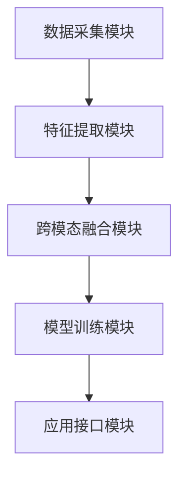

                 


# AI Agent的跨模态内容理解与生成系统

> 关键词：AI Agent, 跨模态技术, 多模态数据, 生成模型, 系统架构, 项目实战

> 摘要：本文系统地探讨了AI Agent在跨模态内容理解与生成系统中的应用，从背景与概述、核心概念、算法原理、系统架构、项目实战到高级主题与未来趋势，全面分析了跨模态技术在AI Agent中的核心作用及其发展前景。

---

# 第一部分: 背景与概述

## 第1章: AI Agent与跨模态技术的背景与概述

### 1.1 AI Agent的基本概念

#### 1.1.1 AI Agent的定义与特点
AI Agent（人工智能代理）是指能够感知环境、自主决策并执行任务的智能实体。其特点包括：
- **自主性**：能够在没有外部干预的情况下自主运行。
- **反应性**：能够实时感知环境并做出反应。
- **目标导向**：具备明确的目标，并通过行为选择来优化目标的实现。
- **学习能力**：能够通过经验或数据进行自我改进。

#### 1.1.2 跨模态技术的定义与特点
跨模态技术是指在不同数据模态（如文本、图像、语音、视频等）之间进行信息理解和转换的技术。其特点包括：
- **多模态融合**：能够同时处理多种数据模态，并从中提取有用信息。
- **跨域理解**：能够理解不同模态之间的语义关联。
- **生成能力**：能够基于多模态输入生成新的内容。

#### 1.1.3 AI Agent与跨模态技术的结合
AI Agent通过跨模态技术可以更好地理解复杂环境并生成多样化的输出。例如，在智能客服系统中，AI Agent可以通过理解用户的声音、语气和输入文本，生成个性化的回复。

### 1.2 跨模态内容理解与生成的背景与意义

#### 1.2.1 当前AI技术的发展现状
当前，AI技术在单模态处理（如文本、图像、语音）方面已经取得了显著进展。然而，现实世界中的信息通常是多模态的，如何在多模态环境下实现更智能的任务处理，成为当前AI研究的重点。

#### 1.2.2 跨模态技术在AI Agent中的应用前景
跨模态技术在AI Agent中的应用前景广阔。例如：
- 在智能音箱中，AI Agent可以同时理解用户的语音指令和相关环境数据（如温度、时间）。
- 在自动驾驶中，AI Agent可以结合视觉、雷达和语音等多种模态信息进行决策。

#### 1.2.3 跨模态内容理解与生成的核心问题
跨模态内容理解与生成的核心问题包括：
- **模态对齐**：如何在不同模态之间建立有效的关联。
- **信息融合**：如何高效地融合多模态信息以提升理解能力。
- **生成多样性**：如何生成多样化且符合语义的输出。

### 1.3 本书的核心目标与内容框架

#### 1.3.1 本书的核心目标
本书旨在系统地介绍AI Agent在跨模态内容理解与生成系统中的应用，从理论到实践，全面解析跨模态技术的核心原理与实现方法。

#### 1.3.2 本书的内容框架
- 第一部分：背景与概述（本章）
- 第二部分：核心概念与联系
- 第三部分：算法原理
- 第四部分：系统架构
- 第五部分：项目实战
- 第六部分：高级主题与未来趋势
- 附录：工具与资源

#### 1.3.3 本书的读者群体与适用场景
本书适合AI领域的研究人员、开发者以及对跨模态技术感兴趣的读者。适用于以下场景：
- AI Agent系统的设计与开发
- 多模态数据处理与分析
- 跨模态生成模型的研究与应用

---

# 第二部分: 跨模态内容理解与生成的核心概念与联系

## 第2章: 跨模态数据的处理与融合

### 2.1 跨模态数据的定义与分类

#### 2.1.1 跨模态数据的定义
跨模态数据是指来自不同模态（如文本、图像、语音、视频等）的数据。

#### 2.1.2 跨模态数据的分类
跨模态数据可以分为以下几类：
- **结构化数据**：如表格数据、知识图谱。
- **非结构化数据**：如文本、图像、语音。
- **混合数据**：如视频中的图像帧和对应的音频数据。

### 2.2 跨模态数据的处理流程

#### 2.2.1 数据采集与预处理
- 数据采集：从不同模态中获取数据（如图像、文本）。
- 数据清洗：去除噪声数据，标准化数据格式。
- 数据增强：通过数据增强技术提升数据的多样性和鲁棒性。

#### 2.2.2 特征提取
- 文本特征提取：如词嵌入（Word2Vec、BERT）。
- 图像特征提取：如CNN、ResNet。
- 语音特征提取：如MFCC、STFT。

#### 2.2.3 模态对齐
- 时间对齐：如视频和语音的时间同步。
- 空间对齐：如图像和文本的空间对应。

### 2.3 跨模态数据的融合方法

#### 2.3.1 晚期融合（Late Fusion）
- 将不同模态的数据分别处理，最后进行融合。

#### 2.3.2 早期融合（Early Fusion）
- 在特征提取阶段就进行多模态信息的融合。

#### 2.3.3 中间融合（Middle Fusion）
- 在特征提取和分类之间进行融合。

---

## 第3章: 跨模态内容理解与生成的原理

### 3.1 跨模态理解的原理

#### 3.1.1 多模态数据的特征提取
- 使用CNN提取图像特征。
- 使用BERT提取文本特征。

#### 3.1.2 跨模态数据的对齐与匹配
- 使用注意力机制对齐不同模态的特征。

#### 3.1.3 跨模态理解的模型架构
- 使用多模态编码器-解码器架构进行跨模态理解。

### 3.2 跨模态生成的原理

#### 3.2.1 基于生成对抗网络的跨模态生成
- 使用GAN生成跨模态数据。

#### 3.2.2 基于变分自编码器的跨模态生成
- 使用VAE进行跨模态数据的生成。

#### 3.2.3 跨模态生成的损失函数与优化方法
- 使用交叉熵损失函数优化生成模型。

---

## 第4章: 跨模态内容理解与生成的系统架构

### 4.1 系统功能设计

#### 4.1.1 系统模块划分
- 数据采集模块
- 特征提取模块
- 跨模态融合模块
- 模型训练模块
- 应用接口模块

#### 4.1.2 系统功能流程
1. 数据采集模块获取多模态数据。
2. 特征提取模块提取各模态的特征。
3. 跨模态融合模块对齐并融合特征。
4. 模型训练模块训练跨模态理解与生成模型。
5. 应用接口模块提供API供外部调用。

### 4.2 系统架构设计

#### 4.2.1 系统架构图


#### 4.2.2 接口设计
- 输入接口：接收多模态数据。
- 输出接口：返回跨模态理解与生成的结果。

---

## 第5章: 项目实战

### 5.1 项目环境与工具安装

#### 5.1.1 环境配置
- 安装Python 3.8以上版本。
- 安装TensorFlow、Keras、PyTorch等深度学习框架。

#### 5.1.2 工具安装
- 安装Jupyter Notebook用于实验。
- 安装Git用于版本控制。

### 5.2 系统核心实现

#### 5.2.1 跨模态特征提取代码
```python
import tensorflow as tf
from tensorflow.keras.layers import Dense, Input, Activation
from tensorflow.keras.models import Model

# 定义模型
input_text = Input(shape=(128,))
input_image = Input(shape=(224,224,3))
text_features = Dense(64, activation='relu')(input_text)
image_features = Dense(64, activation='relu')(input_image)
merged = Dense(1, activation='sigmoid')(text_features + image_features)
model = Model(inputs=[input_text, input_image], outputs=merged)
model.compile(optimizer='adam', loss='binary_crossentropy', metrics=['accuracy'])
```

#### 5.2.2 跨模态生成代码
```python
import torch
from torch.nn import GAN
from torch.optim import Adam

# 定义生成器
class Generator(torch.nn.Module):
    def __init__(self):
        super(Generator, self).__init__()
        self.fc1 = torch.nn.Linear(100, 256)
        self.fc2 = torch.nn.Linear(256, 128)
        self.fc3 = torch.nn.Linear(128, 64)
    
    def forward(self, x):
        x = torch.relu(self.fc1(x))
        x = torch.relu(self.fc2(x))
        x = torch.sigmoid(self.fc3(x))
        return x

# 定义判别器
class Discriminator(torch.nn.Module):
    def __init__(self):
        super(Discriminator, self).__init__()
        self.fc1 = torch.nn.Linear(64, 128)
        self.fc2 = torch.nn.Linear(128, 256)
        self.fc3 = torch.nn.Linear(256, 1)
    
    def forward(self, x):
        x = torch.relu(self.fc1(x))
        x = torch.relu(self.fc2(x))
        x = torch.sigmoid(self.fc3(x))
        return x

# 初始化模型
generator = Generator()
discriminator = Discriminator()
optimizer_gen = Adam(generator.parameters(), lr=0.0002)
optimizer_disc = Adam(discriminator.parameters(), lr=0.0002)
```

### 5.3 案例分析与代码实现

#### 5.3.1 案例分析
以图像和文本的跨模态生成为例，训练一个生成器，能够根据输入的文本生成对应的图像。

#### 5.3.2 代码实现
```python
# 训练循环
for epoch in range(100):
    for _ in range(10):
        # 生成假数据
        noise = torch.randn(1, 100)
        gen_output = generator(noise)
        
        # 判别器训练
        optimizer_disc.zero_grad()
        real_output = discriminator(gen_output)
        loss_disc = torch.mean(real_output)
        loss_disc.backward()
        optimizer_disc.step()
        
    # 生成器训练
    optimizer_gen.zero_grad()
    gen_output = generator(noise)
    real_output = discriminator(gen_output)
    loss_gen = torch.mean(1 - real_output)
    loss_gen.backward()
    optimizer_gen.step()
```

### 5.4 项目总结

#### 5.4.1 项目实现的关键点
- 跨模态特征的对齐与融合。
- 生成模型的损失函数设计。

#### 5.4.2 项目实现的注意事项
- 数据预处理的标准化。
- 模型训练的稳定性和收敛性。

---

## 第6章: 高级主题与未来趋势

### 6.1 跨模态技术的挑战与解决方案

#### 6.1.1 当前技术的挑战
- 模态对齐的困难。
- 跨模态生成的多样性不足。

#### 6.1.2 解决方案
- 使用更复杂的模型（如Transformer）进行跨模态对齐。
- 增加数据多样性以提升生成多样性。

### 6.2 未来研究方向

#### 6.2.1 跨模态技术的融合与优化
- 更高效的跨模态融合方法。
- 更强大的跨模态生成模型。

#### 6.2.2 应用场景的拓展
- 在医疗、教育、娱乐等领域的应用。

---

## 第7章: 附录与参考文献

### 7.1 工具与资源

#### 7.1.1 开发工具
- Jupyter Notebook
- PyCharm
- VS Code

#### 7.1.2 数据集
- MNIST手写数字数据集
- CIFAR-10图像数据集
- IMDb电影评论数据集

### 7.2 参考文献
1. Goodfellow, I., Bengio, Y., & Courville, A. (2016). Deep Learning. MIT Press.
2. Vaswani, A., et al. (2017). Attention Is All You Need. arXiv preprint arXiv:1706.03798.
3. Radford, A., et al. (2019). Language models are few-shot learners. arXiv preprint arXiv:1909.02729.

---

# 作者：AI天才研究院/AI Genius Institute & 禅与计算机程序设计艺术 /Zen And The Art of Computer Programming

