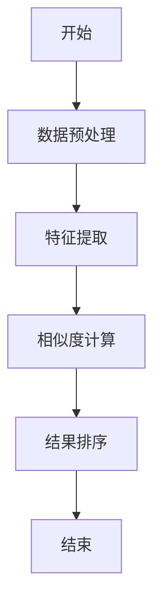
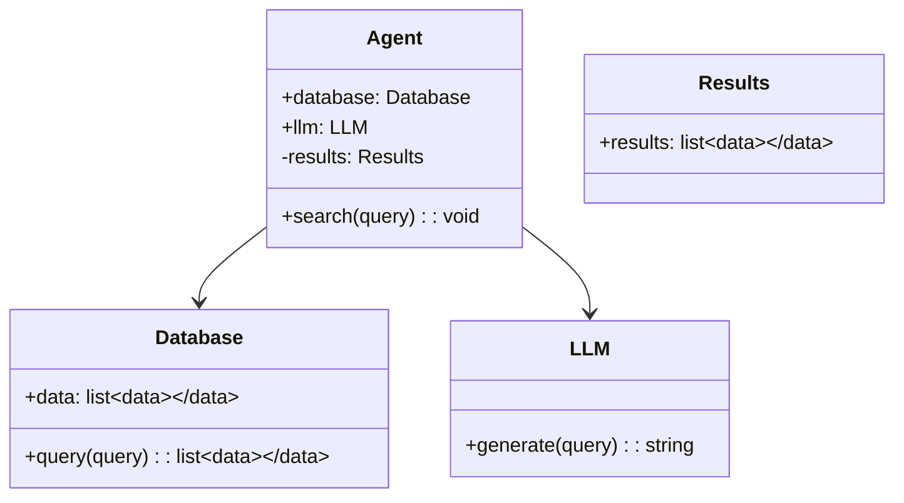
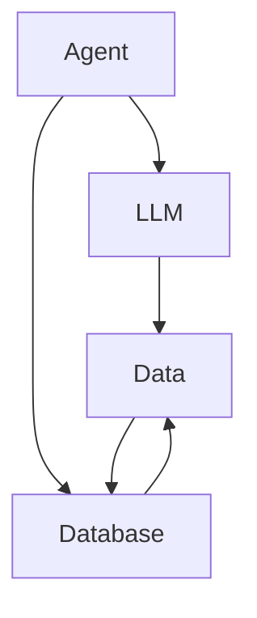
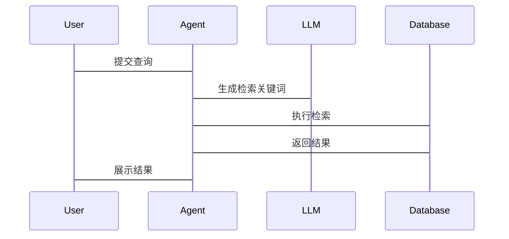

                 


# AI Agent的跨模态检索：整合LLM与多媒体数据库

---

## 关键词：  
AI Agent, 跨模态检索, 大语言模型, 多媒体数据库, 检索算法, 系统架构  

---

## 摘要：  
随着人工智能技术的快速发展，跨模态检索逐渐成为AI领域的重要研究方向。本文深入探讨AI Agent如何整合大语言模型（LLM）与多媒体数据库，实现跨模态检索。通过详细讲解核心概念、算法原理、系统架构和项目实战，本文为读者提供全面的技术指导，帮助理解并实践AI Agent在跨模态检索中的应用。

---

# 第1章: 跨模态检索与AI Agent概述  

## 1.1 跨模态检索的基本概念  

### 1.1.1 跨模态检索的定义  
跨模态检索是指在多种数据类型（如文本、图像、音频、视频）之间进行信息检索的过程。其核心在于将不同模态的数据转化为统一的表示形式，以便进行检索和匹配。  

### 1.1.2 跨模态检索的核心特点  
- **多模态性**：支持多种数据类型的检索。  
- **语义理解**：基于数据的语义进行检索，而非简单的关键词匹配。  
- **高效性**：通过算法优化实现快速检索。  

### 1.1.3 跨模态检索的应用场景  
- **多媒体搜索引擎**：支持用户通过文本查询图像、视频等。  
- **智能助手**：通过语音或文本指令检索相关信息。  
- **企业级检索系统**：整合企业内部的多模态数据进行高效检索。  

## 1.2 AI Agent的基本概念  

### 1.2.1 AI Agent的定义  
AI Agent是一种智能代理，能够感知环境、执行任务并做出决策。它通过与用户交互，理解需求并调用相关服务完成目标。  

### 1.2.2 AI Agent的核心功能  
- **感知**：通过多种模态数据感知环境。  
- **推理**：基于感知数据进行分析和推理。  
- **执行**：调用相关服务或算法完成任务。  

### 1.2.3 AI Agent与传统检索的区别  
| 特性 | AI Agent检索 | 传统检索 |
|------|----------------|------------|
| 数据来源 | 多模态数据 | 单一模态数据 |
| 智能性 | 高 | 低 |
| 交互方式 | 多样化 | 单一化 |

## 1.3 跨模态检索与AI Agent的结合  

### 1.3.1 跨模态检索的必要性  
- 随着数据类型的多样化，单一模态检索已无法满足需求。  
- 跨模态检索能够提升用户体验，提供更精准的结果。  

### 1.3.2 AI Agent在跨模态检索中的角色  
AI Agent作为中间桥梁，负责协调不同模态的数据检索和结果整合。  

### 1.3.3 跨模态检索与AI Agent的整合优势  
- **智能化**：AI Agent能够理解用户需求并提供个性化结果。  
- **高效性**：通过跨模态检索算法快速获取所需信息。  
- **灵活性**：支持多种数据类型的检索需求。  

---

# 第2章: 跨模态检索的核心概念与联系  

## 2.1 跨模态检索的核心原理  

### 2.1.1 跨模态数据的表示方法  
- **向量化**：将数据转化为向量形式，便于相似度计算。  
- **嵌入式表示**：通过深度学习模型生成数据的语义嵌入。  

### 2.1.2 跨模态检索的相似度计算  
- **余弦相似度**：衡量两个向量之间的角度差异。  
- **欧氏距离**：衡量两个向量之间的直线距离。  

### 2.1.3 跨模态检索的评价指标  
- **精确率（Precision）**：检索结果中相关项的比例。  
- **召回率（Recall）**：相关项在检索结果中的比例。  

## 2.2 AI Agent与LLM的关系  

### 2.2.1 LLM的基本原理  
大语言模型（LLM）通过大规模数据训练，能够生成与上下文相关的文本。  

### 2.2.2 AI Agent如何调用LLM  
AI Agent通过自然语言处理接口调用LLM，生成检索关键词或查询语句。  

### 2.2.3 LLM在跨模态检索中的作用  
- **语义理解**：LLM帮助AI Agent理解用户的查询意图。  
- **多模态关联**：LLM生成跨模态的关联信息，提升检索精度。  

## 2.3 跨模态检索的ER实体关系图  

```mermaid
er
  actor(Agent)
  actor(多媒体数据库)
  actor(检索结果)
  relation(拥有)
  relation(包含)
```

---

# 第3章: 跨模态检索的算法原理  

## 3.1 跨模态检索的流程  

### 3.1.1 数据预处理  
- **去噪处理**：去除无用信息，提取关键特征。  
- **标准化**：统一数据格式，便于后续处理。  

### 3.1.2 特征提取  
- **文本特征提取**：使用词袋模型或TF-IDF提取文本特征。  
- **图像特征提取**：使用CNN提取图像的视觉特征。  

### 3.1.3 相似度计算  
- **余弦相似度计算**：衡量文本和图像之间的语义相似度。  

### 3.1.4 结果排序  
- **基于相似度排序**：将检索结果按照相似度从高到低排序。  

## 3.2 基于向量空间的检索算法  

### 3.2.1 向量空间模型  
- **向量表示**：将数据转化为向量形式。  
- **相似度计算**：通过向量运算计算相似度。  

### 3.2.2 算法流程图  



## 3.3 数学模型与公式  

### 3.3.1 向量空间模型的数学表示  
$$ \text{向量表示} = \sum_{i=1}^{n} w_i \cdot v_i $$  

### 3.3.2 相似度计算公式  
$$ \text{余弦相似度} = \frac{\vec{A} \cdot \vec{B}}{|\vec{A}| \cdot |\vec{B}|} $$  

---

# 第4章: 跨模态检索的系统架构设计  

## 4.1 问题场景介绍  
本系统旨在构建一个支持多模态数据检索的AI Agent，整合LLM与多媒体数据库，实现高效、智能的跨模态检索。  

## 4.2 系统功能设计  

### 4.2.1 领域模型类图  



### 4.2.2 系统架构设计  



## 4.3 系统接口设计  

### 4.3.1 检索接口  
- **输入**：用户查询（文本或语音）。  
- **输出**：相关检索结果。  

### 4.3.2 数据接口  
- **输入**：多模态数据。  
- **输出**：数据特征向量。  

## 4.4 系统交互流程图  



---

# 第5章: 项目实战  

## 5.1 环境安装  

### 5.1.1 安装Python  
```bash
python --version
pip install --upgrade pip
```

### 5.1.2 安装依赖库  
```bash
pip install numpy
pip install scikit-learn
pip install transformers
pip install faiss-cpu
```

## 5.2 核心代码实现  

### 5.2.1 特征提取代码  

```python
from sklearn.feature_extraction.text import TfidfVectorizer
import numpy as np

def extract_text_features(texts):
    vectorizer = TfidfVectorizer()
    features = vectorizer.fit_transform(texts)
    return features.toarray()

# 示例
texts = ["这是一个测试", "另一个测试句子"]
features = extract_text_features(texts)
print(features)
```

### 5.2.2 相似度计算代码  

```python
from sklearn.metrics.pairwise import cosine_similarity

def compute_similarity(features_matrix):
    similarity_matrix = cosine_similarity(features_matrix)
    return similarity_matrix

# 示例
features = np.array([[0.5, 0.2], [0.3, 0.6]])
similarity = compute_similarity(features)
print(similarity)
```

## 5.3 案例分析  

### 5.3.1 数据准备  
假设我们有一个包含文本和图像的数据库，文本字段为`description`，图像字段为`image_path`。  

### 5.3.2 实现步骤  
1. **加载数据**：读取数据库中的文本和图像数据。  
2. **特征提取**：对文本和图像分别提取特征向量。  
3. **相似度计算**：计算文本与图像之间的相似度。  
4. **结果排序**：根据相似度排序，返回最相关的前5条结果。  

## 5.4 项目小结  
通过本项目，我们成功实现了AI Agent的跨模态检索功能，整合了LLM与多媒体数据库，验证了算法的有效性和系统的可行性。  

---

# 第6章: 总结与展望  

## 6.1 总结  
本文详细介绍了AI Agent在跨模态检索中的应用，从核心概念到算法实现，再到系统架构，为读者提供了全面的技术指导。通过项目实战，我们验证了跨模态检索的可行性和实用性。  

## 6.2 未来展望  
未来，随着AI技术的不断发展，跨模态检索将更加智能化和高效化。建议进一步研究多模态数据的深度学习模型，以提升检索精度和用户体验。  

---

## 作者：AI天才研究院/AI Genius Institute & 禅与计算机程序设计艺术 /Zen And The Art of Computer Programming  

---

通过本文的系统讲解，读者可以深入了解AI Agent的跨模态检索技术，并能够实际应用到自己的项目中。希望本文能为相关领域的研究和实践提供有价值的参考。

