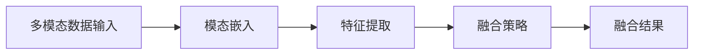
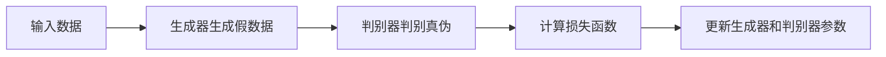
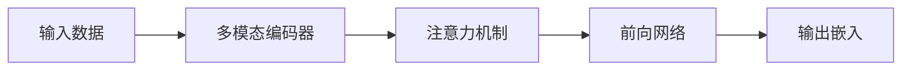
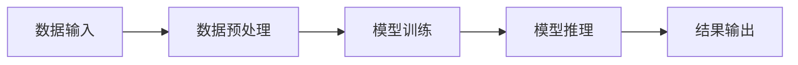

                 


# AI Agent的跨模态理解与生成

## 关键词：
AI Agent，跨模态理解，跨模态生成，多模态数据，机器学习，深度学习，自然语言处理

## 摘要：
本文系统探讨了AI Agent在跨模态理解与生成领域的核心概念、算法原理、系统架构以及项目实战。通过背景介绍、核心概念解析、算法原理阐述、系统架构设计和项目案例分析，深入剖析了AI Agent如何实现跨模态数据的融合、理解与生成。本文旨在为读者提供从理论到实践的全面指导，帮助读者掌握AI Agent在跨模态任务中的应用技术。

---

## 第一部分：AI Agent的背景与基础

### 第1章：AI Agent的基本概念

#### 1.1 AI Agent的定义与特点
AI Agent（人工智能代理）是指能够感知环境、执行任务并做出决策的智能实体。AI Agent的核心特点包括自主性、反应性、目标导向和社交能力。AI Agent可以分为简单反射型、基于模型的反射型、目标驱动型和实用驱动型四种类型，广泛应用于自动驾驶、智能助手、机器人等领域。

#### 1.2 跨模态理解与生成的背景
跨模态理解与生成是指AI Agent能够处理和理解多种模态（如文本、图像、语音）的数据，并生成对应的目标模态输出。随着多模态数据的广泛应用，跨模态技术在自然语言处理、计算机视觉、语音识别等领域的重要性日益凸显。跨模态理解与生成技术能够提升AI Agent的智能性和用户体验，是当前研究的热点。

#### 1.3 本书的核心目标与结构
本书旨在系统介绍AI Agent的跨模态理解与生成技术，涵盖核心概念、算法原理、系统架构和项目实战。通过理论与实践相结合的方式，帮助读者掌握跨模态技术的核心原理和应用场景。

---

## 第二部分：跨模态理解与生成的核心概念

### 第2章：跨模态理解的核心原理

#### 2.1 多模态数据的表示与融合
多模态数据的表示方法包括模态嵌入、特征提取和符号表示。模态嵌入通过将不同模态的数据映射到同一嵌入空间，实现数据的融合。特征提取则是通过CNN、RNN等深度学习模型提取各模态的特征。多模态数据的融合方式包括早期融合（Early Fusion）、晚期融合（Late Fusion）和混合融合（Hybrid Fusion）。

**对比表格：不同模态数据的特征对比**

| 模态类型 | 特征维度 | 优势 | 劣势 |
|----------|----------|------|------|
| 文本      | 词向量、句向量 | 高维、语义丰富 | �易受噪声影响 |
| 图像      | 像素、特征向量 | 高分辨率、细节丰富 | 需大量计算资源 |
| 语音      | 频率谱、时域特征 | 时间序列相关性高 | 易受环境噪声影响 |

**Mermaid流程图：跨模态数据的融合流程**



---

### 第3章：跨模态生成的核心原理

#### 3.1 多模态生成模型的分类
多模态生成模型主要分为两类：基于生成对抗网络（GAN）的模型和基于变分自编码器（VAE）的模型。基于GAN的模型通过判别器和生成器的对抗训练生成高质量的多模态数据，而基于VAE的模型通过最大化似然函数生成多样化的数据。

**数学公式：生成对抗网络的损失函数**

$$ \text{损失函数} = \mathbb{E}_{x,y}[\log D(x,y)] + \mathbb{E}_{z}[\log (1 - D(G(z),z))] $$

**Mermaid流程图：生成对抗网络的训练流程**



#### 3.2 多模态生成模型的实现
多模态生成模型的实现通常包括数据预处理、模型训练和生成阶段。数据预处理包括归一化、数据增强等步骤。模型训练阶段使用反向传播算法优化模型参数，生成阶段通过采样生成器的潜在向量，生成目标模态的数据。

**Python代码示例：生成对抗网络的实现**

```python
import torch
import torch.nn as nn

class Generator(nn.Module):
    def __init__(self, latent_dim, output_dim):
        super(Generator, self).__init__()
        self.fc = nn.Linear(latent_dim, output_dim)
    
    def forward(self, x):
        return torch.sigmoid(self.fc(x))

class Discriminator(nn.Module):
    def __init__(self, input_dim, hidden_dim):
        super(Discriminator, self).__init__()
        self.fc = nn.Linear(input_dim, hidden_dim)
        self.fc2 = nn.Linear(hidden_dim, 1)
    
    def forward(self, x):
        x = torch.relu(self.fc(x))
        return torch.sigmoid(self.fc2(x))

# 初始化模型和优化器
generator = Generator(latent_dim=100, output_dim=784)
discriminator = Discriminator(input_dim=784, hidden_dim=256)
optimizer_g = torch.optim.Adam(generator.parameters(), lr=0.0002)
optimizer_d = torch.optim.Adam(discriminator.parameters(), lr=0.0002)

# 训练过程
for epoch in range(num_epochs):
    for _ in range(train_steps):
        # 生成假数据
        z = torch.randn(batch_size, latent_dim)
        fake_images = generator(z)
        
        # 判别器训练
        optimizer_d.zero_grad()
        real_images = real_images.detach()
        d_loss_real = discriminator(real_images)
        d_loss_fake = discriminator(fake_images)
        d_loss = -torch.mean(torch.log(d_loss_real) + torch.log(1 - d_loss_fake))
        d_loss.backward()
        optimizer_d.step()
        
        # 生成器训练
        optimizer_g.zero_grad()
        g_loss = -torch.mean(torch.log(discriminator(fake_images)))
        g_loss.backward()
        optimizer_g.step()
```

---

## 第三部分：跨模态理解与生成的算法原理

### 第4章：跨模态编码器与解码器的原理

#### 4.1 多模态编码器的实现
多模态编码器通过将不同模态的数据映射到同一嵌入空间，实现数据的融合。常用的编码器包括多模态变换器（Transformer）和多模态循环神经网络（RNN）。

**数学公式：多模态变换器的注意力机制**

$$ \text{注意力权重} = \text{softmax}(\frac{QK^T}{\sqrt{d_k}}) $$

**Mermaid流程图：多模态变换器的架构**



#### 4.2 多模态解码器的实现
多模态解码器通过从嵌入空间生成目标模态的数据。常用的解码器包括多模态生成对抗网络和多模态变分自编码器。

**Python代码示例：多模态生成对抗网络的实现**

```python
import torch
import torch.nn as nn

class MultiModalGenerator(nn.Module):
    def __init__(self, latent_dim, text_dim, image_dim):
        super(MultiModalGenerator, self).__init__()
        self.text_embedding = nn.Linear(text_dim, latent_dim)
        self.image_embedding = nn.Linear(image_dim, latent_dim)
        self.fc = nn.Linear(latent_dim, latent_dim)
    
    def forward(self, text, image):
        text_embed = self.text_embedding(text)
        image_embed = self.image_embedding(image)
        combined = text_embed + image_embed
        output = torch.relu(self.fc(combined))
        return output

class MultiModalDiscriminator(nn.Module):
    def __init__(self, text_dim, image_dim):
        super(MultiModalDiscriminator, self).__init__()
        self.text_embedding = nn.Linear(text_dim, 128)
        self.image_embedding = nn.Linear(image_dim, 128)
        self.fc = nn.Linear(256, 1)
    
    def forward(self, text, image):
        text_embed = self.text_embedding(text)
        image_embed = self.image_embedding(image)
        combined = torch.cat([text_embed, image_embed], dim=1)
        output = torch.sigmoid(self.fc(combined))
        return output
```

---

## 第四部分：跨模态理解与生成的系统架构

### 第5章：AI Agent的系统架构设计

#### 5.1 系统功能设计
AI Agent的系统功能包括数据预处理、模型训练、推理和结果输出。数据预处理模块负责将多模态数据转换为模型可接受的格式，模型训练模块负责优化模型参数，推理模块负责生成目标模态的数据，结果输出模块负责将结果返回给用户。

**Mermaid流程图：AI Agent的系统架构**



#### 5.2 系统架构实现
AI Agent的系统架构包括数据预处理模块、模型训练模块、推理模块和结果输出模块。每个模块通过接口进行通信，实现数据的流动和处理。

**Python代码示例：AI Agent的系统架构实现**

```python
class AIAssistant:
    def __init__(self):
        self.preprocessor = Preprocessor()
        self.trainer = Trainer()
        self.inferencer = Inferencer()
        self.output_formatter = OutputFormatter()
    
    def process_request(self, input_data):
        preprocessed_data = self.preprocessor.preprocess(input_data)
        model_output = self.trainer.train(preprocessed_data)
        generated_output = self.inferencer.infer(model_output)
        formatted_output = self.output_formatter.format(generated_output)
        return formatted_output
```

---

## 第五部分：跨模态理解与生成的项目实战

### 第6章：跨模态项目实战

#### 6.1 项目环境安装
安装必要的依赖库，如TensorFlow、Keras、PyTorch等。

#### 6.2 核心代码实现
实现多模态数据的加载、预处理、模型训练和生成。

**Python代码示例：多模态数据加载与预处理**

```python
import numpy as np

class MultiModalDataset(torch.Dataset):
    def __init__(self, text_data, image_data):
        self.text_data = text_data
        self.image_data = image_data
    
    def __len__(self):
        return len(self.text_data)
    
    def __getitem__(self, idx):
        text = self.text_data[idx]
        image = self.image_data[idx]
        return text, image
```

#### 6.3 项目小结
总结项目实现的关键步骤和注意事项，强调代码的可扩展性和可维护性。

---

## 第六部分：最佳实践与总结

### 第7章：最佳实践

#### 7.1 技术总结
总结AI Agent的跨模态理解与生成技术的核心原理和实现方法，强调多模态数据融合的重要性。

#### 7.2 项目开发 tips
提供项目开发中的注意事项和技巧，如数据预处理的优化、模型训练的加速等。

#### 7.3 未来研究方向
展望跨模态理解与生成技术的未来发展方向，如多模态对抗学习、多模态自监督学习等。

---

## 作者信息

作者：AI天才研究院/AI Genius Institute & 禅与计算机程序设计艺术 /Zen And The Art of Computer Programming

---

本文系统介绍了AI Agent的跨模态理解与生成技术，从理论到实践，帮助读者掌握跨模态技术的核心原理和实现方法。希望本文能为AI Agent的研究和应用提供有价值的参考。

