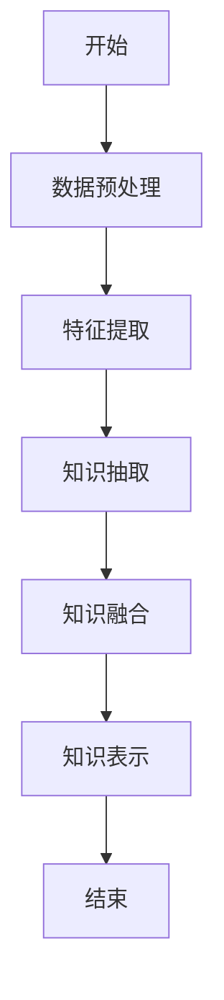
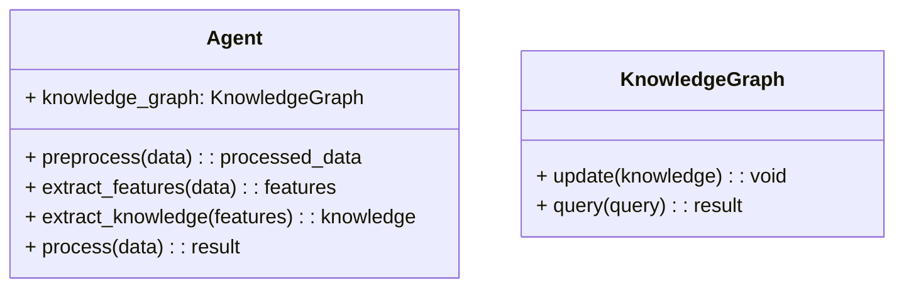
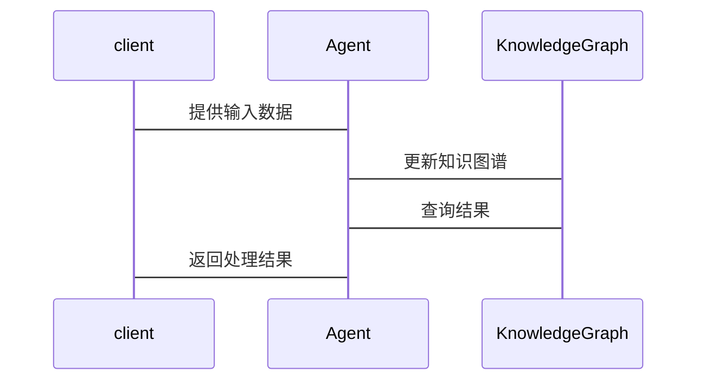

                 


```markdown
# AI Agent的跨模态知识图谱构建与应用

> 关键词：AI Agent, 跨模态知识图谱, 知识图谱构建, 多模态数据处理, 跨模态数据整合

> 摘要：本文深入探讨AI Agent在跨模态知识图谱构建与应用中的作用。通过分析跨模态数据的整合挑战，介绍知识图谱的构建方法，并详细阐述AI Agent在其中的应用策略。文章从理论到实践，结合算法原理、系统架构和项目实战，为读者提供全面的技术指导。

---

## 第1章: 背景介绍

### 1.1 问题背景
#### 1.1.1 多模态数据的兴起
在当今的数据驱动时代，多模态数据（如文本、图像、语音等）的整合需求日益增长。跨模态数据的处理能力成为衡量AI系统性能的重要指标。

#### 1.1.2 知识图谱的重要性
知识图谱通过结构化数据描述世界，能够帮助AI系统更好地理解上下文，实现更智能的决策。

#### 1.1.3 AI Agent在跨模态中的角色
AI Agent作为智能系统的核心，能够处理跨模态数据，构建并应用知识图谱，从而实现更复杂的任务。

### 1.2 问题描述
#### 1.2.1 跨模态数据的整合挑战
多模态数据的异构性使得直接整合变得困难，需要有效的数据处理和融合方法。

#### 1.2.2 知识图谱构建的复杂性
知识图谱的构建涉及数据抽取、实体识别、关系抽取等多个步骤，每个步骤都可能面临挑战。

#### 1.2.3 AI Agent在跨模态中的应用需求
AI Agent需要能够理解并处理多种模态的数据，才能在复杂的场景中发挥作用。

### 1.3 问题解决
#### 1.3.1 跨模态知识图谱的构建方法
通过数据预处理、特征提取、知识抽取和融合等步骤，构建跨模态的知识图谱。

#### 1.3.2 AI Agent在知识图谱中的应用策略
AI Agent利用知识图谱进行推理、问答、推荐等任务，提升系统智能性。

#### 1.3.3 跨模态数据处理的技术选型
选择合适的技术栈，如深度学习、图嵌入等，以应对跨模态数据的挑战。

### 1.4 边界与外延
#### 1.4.1 跨模态知识图谱的定义域
明确知识图谱的边界，聚焦于特定领域或通用场景。

#### 1.4.2 AI Agent的适用场景
AI Agent适用于需要多模态数据处理和知识推理的任务。

#### 1.4.3 知识图谱构建的限制与扩展
知识图谱的构建受到数据质量和数量的限制，但也可通过扩展不断优化。

### 1.5 概念结构与核心要素
#### 1.5.1 知识图谱的核心要素
包括实体、关系、属性和事件等。

#### 1.5.2 AI Agent的功能模块
包括感知、推理、决策和执行模块。

#### 1.5.3 跨模态数据的处理流程
从数据采集、预处理到特征提取、知识抽取的完整流程。

---

## 第2章: 核心概念与联系

### 2.1 AI Agent与跨模态知识图谱的原理
#### 2.1.1 AI Agent的基本原理
AI Agent通过感知环境、推理和决策，执行特定任务。

#### 2.1.2 跨模态知识图谱的构建原理
通过整合多模态数据，构建结构化的知识图谱。

#### 2.1.3 两者的相互作用
AI Agent利用知识图谱进行推理，知识图谱通过AI Agent的应用得以扩展。

### 2.2 核心概念对比
#### 2.2.1 跨模态数据与单一模态数据的对比
| 特性       | 跨模态数据       | 单一模态数据   |
|------------|-----------------|---------------|
| 信息量     | 高              | 低             |
| 复杂性     | 高              | 中             |
| 处理难度   | 高              | 低             |

#### 2.2.2 知识图谱与传统数据库的对比
| 特性       | 知识图谱         | 传统数据库     |
|------------|-----------------|---------------|
| 结构化程度 | 高              | 低             |
| 查询能力   | 强              | 弱             |
| 可扩展性   | 高              | 中             |

#### 2.2.3 AI Agent与传统程序的对比
| 特性       | AI Agent         | 传统程序       |
|------------|-----------------|---------------|
| 智能性     | 高              | 低             |
| 自适应性   | 高              | 无             |
| 学习能力   | 高              | 无             |

### 2.3 ER实体关系图
```mermaid
er
  actor(Agent)
  actor(知识图谱)
  actor(跨模态数据)
  relation(构建)
  relation(应用)
  relation(处理)
```

---

## 第3章: 算法原理讲解

### 3.1 算法流程


### 3.2 Python源代码实现
```python
class Agent:
    def __init__(self):
        self.knowledge_graph = KnowledgeGraph()

    def process(self, input_data):
        # 数据预处理
        processed_data = self.preprocess(input_data)
        # 特征提取
        features = self.extract_features(processed_data)
        # 知识抽取
        knowledge = self.extract_knowledge(features)
        # 知识融合
        self.knowledge_graph.update(knowledge)
        return self.knowledge_graph.query(input_data)

    def preprocess(self, data):
        # 示例预处理逻辑
        return data

    def extract_features(self, data):
        # 示例特征提取逻辑
        return data

    def extract_knowledge(self, features):
        # 示例知识抽取逻辑
        return features
```

### 3.3 数学模型与公式
知识图谱的表示学习可以采用图嵌入方法，例如：
$$
\text{TransE}(h, r, t) = \|h + r - t\|
$$
其中，\(h\)、\(r\)、\(t\)分别表示头节点、关系和尾节点的向量表示。

---

## 第4章: 系统分析与架构设计

### 4.1 系统功能设计


### 4.2 系统架构设计


### 4.3 系统接口设计
- **输入接口**：接收多模态数据
- **输出接口**：返回处理结果
- **内部接口**：知识图谱更新和查询接口

### 4.4 系统交互


---

## 第5章: 项目实战

### 5.1 环境安装
- Python 3.8+
- 知识图谱构建库（如NetworkX）
- 深度学习框架（如TensorFlow）

### 5.2 核心代码实现
```python
import networkx as nx

class KnowledgeGraph:
    def __init__(self):
        self.graph = nx.Graph()

    def update(self, knowledge):
        for entity, relations in knowledge.items():
            for relation, target in relations:
                self.graph.add_edge(entity, target, label=relation)

    def query(self, query):
        return nx.shortest_path(self.graph, source=query, weight='label')
```

### 5.3 案例分析
假设输入为图像和文本数据，AI Agent构建知识图谱后，能够进行图像识别和文本问答。

### 5.4 项目小结
通过实际项目，验证了跨模态知识图谱构建和AI Agent应用的可行性。

---

## 第6章: 最佳实践

### 6.1 小结
AI Agent与跨模态知识图谱的结合是未来智能系统的重要发展方向。

### 6.2 注意事项
- 数据质量对知识图谱构建至关重要
- 算法选择需根据具体场景调整
- 系统架构需考虑扩展性和维护性

### 6.3 拓展阅读
推荐学习相关领域的最新论文和技术博客。

---

## 作者信息

作者：AI天才研究院/AI Genius Institute & 禅与计算机程序设计艺术 /Zen And The Art of Computer Programming
```

