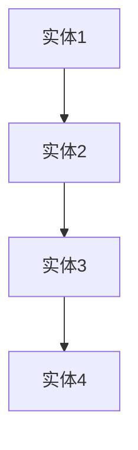
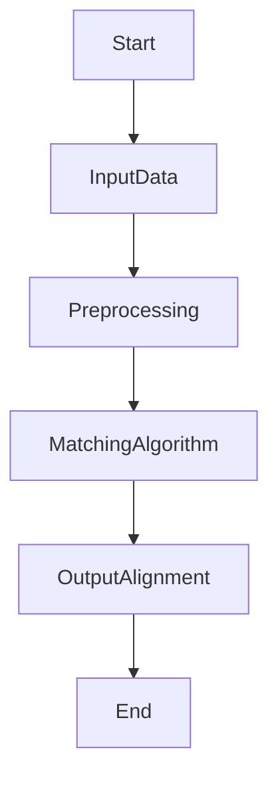
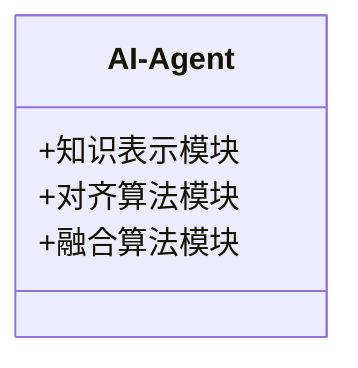
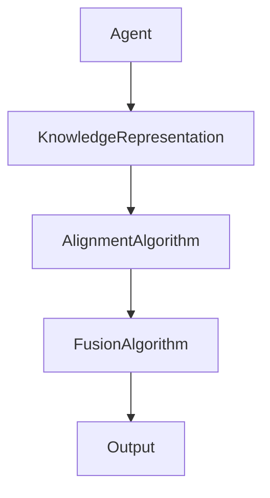
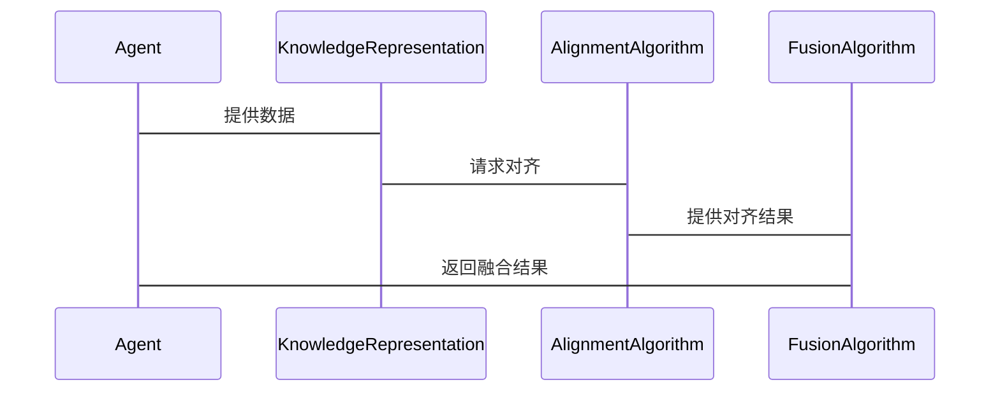

                 


```markdown
# AI Agent的跨模态知识对齐与融合

> 关键词：AI Agent，跨模态知识，知识对齐，知识融合，多模态数据，对齐算法，融合算法

> 摘要：AI Agent在处理跨模态知识时，需要将来自不同模态的数据进行对齐与融合，以实现统一的语义理解。本文从AI Agent的基本概念出发，详细探讨跨模态知识对齐的核心问题，分析对齐算法与融合算法的原理，结合系统架构设计与项目实战，最后总结跨模态知识对齐与融合的实践意义。

---

## 第一部分: AI Agent的跨模态知识对齐与融合背景与概念

### 第1章: AI Agent与跨模态知识概述

#### 1.1 AI Agent的基本概念
- **AI Agent的定义**：AI Agent是指具有感知环境、做出决策并执行动作的智能体。它能够通过传感器获取信息，利用推理能力解决问题，并通过执行器与环境交互。
- **跨模态数据的定义**：跨模态数据指的是来自不同感知模态（如文本、图像、语音、视频等）的数据。这些数据具有不同的特征和语义表示。
- **跨模态知识对齐与融合的必要性**：AI Agent需要在多模态数据中提取语义信息，并通过对齐与融合实现统一的语义理解，从而更好地完成任务。

#### 1.2 跨模态知识对齐的核心问题
- **知识表示的多样性**：不同模态的数据具有不同的表示方式，如文本是符号化的，图像则是基于像素的。
- **跨模态数据的异构性**：不同模态的数据在结构、语义和表达方式上存在差异，导致直接比较和对齐的困难。
- **对齐的目标与挑战**：对齐的目标是找到不同模态数据之间的语义对应关系，但如何处理噪声、歧义和模态间语义差异是主要挑战。

#### 1.3 跨模态知识融合的场景与应用
- **跨模态数据的来源与类型**：文本、图像、语音、视频等。
- **融合的应用场景**：如多模态对话系统、跨模态检索、智能推荐等。
- **融合的潜在价值与意义**：通过融合多模态数据，AI Agent能够更全面地理解环境信息，提高任务执行的准确性和效率。

### 第2章: 跨模态知识对齐的核心概念与联系

#### 2.1 跨模态知识表示的原理
- **知识图谱的构建与表示**：知识图谱是一种结构化的知识表示方式，由实体和关系组成。
- **跨模态数据的表示方法**：利用嵌入技术将不同模态的数据映射到同一空间。
- **知识表示的语义对齐**：通过对不同模态数据的语义进行建模，实现它们之间的对齐。

#### 2.2 跨模态对齐的实体关系图


#### 2.3 跨模态对齐的算法原理


---

## 第二部分: 跨模态知识对齐与融合的算法原理

### 第3章: 跨模态知识对齐的算法原理

#### 3.1 基于嵌入的对齐算法
- **嵌入表示的基本原理**：将实体或概念映射到低维向量空间，使其在向量空间中具有相似度。
- **基于相似度的对齐方法**：通过计算不同模态数据的向量相似度来确定对齐关系。
- **基于距离的对齐方法**：通过计算向量之间的距离来确定对齐关系。

#### 3.2 基于图的对齐算法
- **图结构的构建与表示**：将知识图谱中的实体和关系表示为图结构。
- **基于图的匹配算法**：利用图匹配算法找到图中对应的节点或边。
- **基于图的对齐优化**：通过优化算法提高图匹配的准确性和效率。

### 第4章: 跨模态知识融合的算法原理

#### 4.1 基于规则的融合算法
- **规则的定义与表示**：定义融合规则，如“如果A与B对齐，则C也与D对齐”。
- **基于规则的融合过程**：通过规则将不同模态的数据进行融合。
- **规则的优化与调整**：通过实验和反馈优化融合规则。

#### 4.2 基于学习的融合算法
- **基于神经网络的融合方法**：利用神经网络模型对多模态数据进行融合。
- **注意力机制的应用**：通过注意力机制捕捉不同模态数据的重要性。
- **端到端的融合模型**：构建端到端的深度学习模型实现跨模态数据的融合。

---

## 第三部分: 系统分析与架构设计

### 第5章: 跨模态知识对齐与融合的系统架构设计

#### 5.1 问题场景介绍
- **跨模态数据的异构性**：不同模态的数据具有不同的特征和结构。
- **对齐与融合的复杂性**：需要处理噪声、歧义和语义差异。

#### 5.2 系统功能设计


#### 5.3 系统架构设计


#### 5.4 系统接口设计
- **输入接口**：接收多模态数据。
- **输出接口**：输出对齐后的结果。
- **控制接口**：控制对齐与融合的过程。

#### 5.5 系统交互设计


---

## 第四部分: 项目实战

### 第6章: 跨模态知识对齐与融合的项目实战

#### 6.1 环境安装
- **安装Python环境**：使用Anaconda或虚拟环境。
- **安装依赖库**：如numpy、pandas、scikit-learn、tensorflow等。

#### 6.2 系统核心实现源代码
```python
# 跨模態知識对齊算法實現
import numpy as np

def compute_similarity(embedding1, embedding2):
    return np.dot(embedding1, embedding2) / (np.linalg.norm(embedding1) * np.linalg.norm(embedding2))

# 知識融合算法實現
def fuse_embeddings(embedding1, embedding2, alpha=0.5):
    return embedding1 * alpha + embedding2 * (1 - alpha)
```

#### 6.3 代码应用解读与分析
- **代码功能**：实现跨模态数据的相似度计算和融合。
- **代码优势**：简单易懂，适用于小规模数据的处理。
- **代码优化**：可以引入更复杂的模型，如深度学习模型，提高对齐与融合的准确性。

#### 6.4 实际案例分析
- **案例背景**：假设我们有两个模态的数据，分别是文本和图像。
- **案例实现**：使用上述代码对文本和图像进行对齐和融合。
- **案例结果**：输出融合后的结果，并分析其准确性。

#### 6.5 项目小结
- **项目总结**：实现了一个简单的跨模态知识对齐与融合系统。
- **项目意义**：展示了跨模态知识对齐与融合的基本原理和实现方法。

---

## 第五部分: 总结与展望

### 第7章: 跨模态知识对齊与融合的总结与展望

#### 7.1 总结
- **核心内容回顾**：介绍了AI Agent的跨模态知识对齐与融合的基本概念、算法原理和系统架构设计。
- **主要收获**：理解了跨模态知识对齐与融合的核心问题和实现方法。
- **经验总结**：在实现过程中，需要注意数据的异构性和语义的多样性。

#### 7.2 展望
- **未来研究方向**：研究更高效的对齐算法和融合算法。
- **技术发展趋势**：随着深度学习的发展，跨模态知识对齐与融合将更加智能化和自动化。
- **实践中的挑战**：如何处理大规模数据和复杂的语义关系。

---

## 第六部分: 最佳实践与注意事项

### 第8章: 跨模态知识对齐与融合的最佳实践

#### 8.1 最佳实践
- **数据预处理**：对数据进行清洗和标准化处理。
- **模型选择**：根据数据特点选择合适的对齐和融合算法。
- **模型调优**：通过实验优化模型的参数和结构。

#### 8.2 注意事项
- **数据隐私**：注意保护数据隐私，避免数据泄露。
- **模型鲁棒性**：确保模型具有良好的鲁棒性，能够处理噪声和异常数据。
- **性能优化**：优化模型的计算效率，减少计算资源消耗。

---

## 作者信息

作者：AI天才研究院/AI Genius Institute & 禅与计算机程序设计艺术 /Zen And The Art of Computer Programming
```

