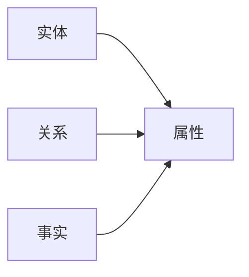
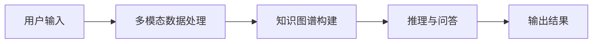

                 


# AI Agent的跨模态知识推理与问答

> 关键词：AI Agent, 跨模态知识推理, 问答系统, 多模态数据, 知识图谱, 推理算法

> 摘要：本文系统地探讨了AI Agent在跨模态知识推理与问答系统中的应用。通过分析多模态数据的特征、构建知识图谱以及设计推理算法，结合实际场景中的系统架构，详细阐述了AI Agent如何实现跨模态数据的高效处理和智能问答。文章内容涵盖背景介绍、核心概念、算法原理、系统设计及项目实战，为读者提供全面的技术解读。

---

# 第一部分: AI Agent与跨模态知识推理基础

## 第1章: AI Agent的基本概念

### 1.1 AI Agent的定义与特点
- **AI Agent**是指具备智能决策和交互能力的计算机程序，能够根据环境信息做出自主决策并执行操作。
- **特点**包括自主性、反应性、目标导向性和社会性。

### 1.2 跨模态数据的定义与特点
- **跨模态数据**指来自不同感知渠道的数据，如文本、图像、音频等。
- **特点**包括异构性、多样性、互补性和关联性。

### 1.3 跨模态知识推理的背景与意义
- **背景**：随着AI技术的发展，跨模态数据处理成为研究热点。
- **意义**：通过跨模态推理，AI Agent能够更好地理解复杂场景，提升问答系统的智能性。

---

## 第2章: 跨模态知识推理的核心概念

### 2.1 跨模态数据的属性特征对比
| 数据类型 | 特征 |
|----------|------|
| 文本      | 结构化、语义丰富 |
| 图像      | 高维、非结构化 |
| 音频      | 时间序列、情感特征 |

### 2.2 跨模态知识推理的ER实体关系图


### 2.3 推理算法的基本原理
- **符号逻辑推理**：基于规则的推理方法。
- **概率推理**：基于贝叶斯网络的推理方法。
- **深度学习推理**：基于神经网络的推理方法。

---

## 第3章: 跨模态知识推理算法原理

### 3.1 多模态对齐算法
- **注意力机制**：通过计算不同模态间的相关性，实现对齐。
- **代码示例**：
```python
def attention(Q, K, V):
    scores = Q @ K.T / np.sqrt(K.shape[-1])
    attention_weights = softmax(scores)
    return attention_weights @ V
```

### 3.2 跨模态推理算法
- **图神经网络**：通过构建知识图谱进行推理。
- **数学公式**：
$$Z = AGCN(X, A)$$
其中，$X$为输入特征，$A$为图的邻接矩阵。

---

## 第4章: 系统分析与架构设计方案

### 4.1 问题场景介绍
- **场景**：用户通过多模态输入进行提问，AI Agent需结合上下文进行推理并回答。

### 4.2 系统功能设计


### 4.3 系统架构设计
- **分层架构**：数据层、计算层、应用层。
- **代码示例**：
```python
class Agent:
    def __init__(self):
        self.processor = DataProcessor()
        self.reasoner = ReasoningModule()
        selfResponder = ResponseGenerator()

    def process_query(self, input):
        data = self.processor.preprocess(input)
        result = self.reasoner.inference(data)
        response = self.responder.generate_response(result)
        return response
```

---

## 第5章: 项目实战与案例分析

### 5.1 环境安装
- **工具**：Python 3.8+, TensorFlow 2.0+, PyTorch 1.9+。
- **安装命令**：
```bash
pip install tensorflow torch numpy
```

### 5.2 核心代码实现
```python
def main():
    # 加载预训练模型
    model = MultiModalAgent()
    # 处理输入
    input_data = read_input()
    # 推理与回答
    result = model.inference(input_data)
    print(result)
```

### 5.3 案例分析
- **案例**：用户提问“如何处理图像中的对象检测问题？”
- **推理过程**：
  1. 提取图像特征。
  2. 对比文本关键词。
  3. 构建相关知识图谱。
  4. 输出答案。

---

## 第6章: 最佳实践与总结

### 6.1 最佳实践
- **数据预处理**：确保数据质量，减少噪声。
- **模型优化**：使用迁移学习和数据增强提升性能。
- **性能调优**：优化计算资源分配，减少推理时间。

### 6.2 小结
- 本文详细探讨了AI Agent在跨模态知识推理与问答系统中的应用，通过理论分析与实践案例，展示了如何构建高效、智能的问答系统。

### 6.3 注意事项
- 确保数据安全与隐私保护。
- 优化模型的可解释性，提升用户体验。

### 6.4 拓展阅读
- 推荐阅读相关书籍《深度学习》和《图神经网络》。

---

作者：AI天才研究院 & 禅与计算机程序设计艺术

