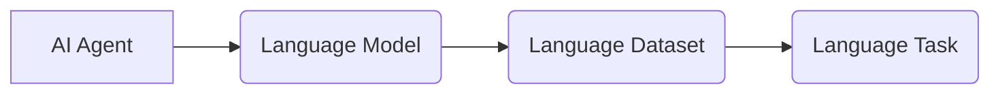
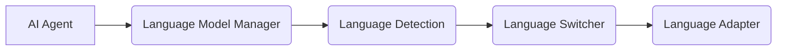
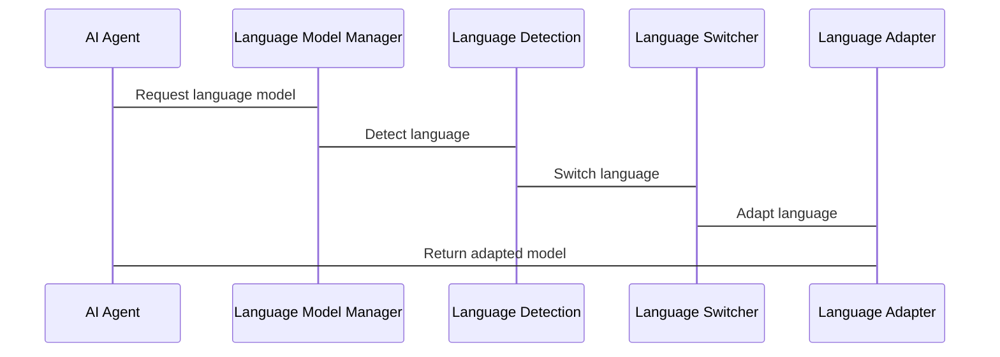

                 


# AI Agent的跨语言学习能力：增强LLM的语言迁移

> 关键词：AI Agent，跨语言学习，LLM，语言迁移，多语言模型，AI语言理解

> 摘要：AI Agent的跨语言学习能力是当前人工智能领域的重要研究方向。本文系统地探讨了如何增强大语言模型（LLM）的跨语言能力，从背景介绍、核心概念、算法原理、系统架构到项目实战，全面分析了AI Agent在多语言环境中的适应性与提升策略。通过深入剖析跨语言学习的原理、算法机制和系统实现，本文为读者提供了从理论到实践的完整指南。

---

## 第1章: 背景介绍

### 1.1 问题背景与描述

#### 1.1.1 AI Agent的定义与核心概念
AI Agent（人工智能代理）是指能够感知环境、自主决策并执行任务的智能体。它具备以下核心能力：
- **感知能力**：通过传感器或数据输入理解环境。
- **决策能力**：基于感知信息做出最优选择。
- **执行能力**：通过动作影响环境或输出结果。
- **学习能力**：通过经验改进性能。

AI Agent的核心目标是实现智能体与环境之间的高效交互，完成特定任务。

#### 1.1.2 跨语言学习的必要性
在多语言环境中，AI Agent需要理解并生成多种语言的文本，以满足全球用户的需求。跨语言学习是实现这一目标的关键技术。跨语言学习的核心在于：
- **语言理解**：能够准确理解多种语言的语义。
- **语言生成**：能够生成准确且自然的多种语言文本。
- **语言迁移**：将一种语言的知识迁移到另一种语言。

#### 1.1.3 当前LLM的语言迁移挑战
当前的大语言模型（LLM）虽然在单语言任务上表现出色，但在跨语言学习中仍面临诸多挑战：
- **数据稀疏性**：小语种数据不足，影响模型的泛化能力。
- **语义差异**：不同语言之间存在语义差异，导致迁移困难。
- **计算复杂度**：跨语言学习需要额外的计算资源。

### 1.2 问题解决与边界

#### 1.2.1 跨语言学习的目标与边界
跨语言学习的目标是提升AI Agent在多种语言环境中的理解和生成能力。其边界包括：
- **任务边界**：专注于语言理解和生成任务，不涉及图像或音频处理。
- **语言边界**：限定支持的语言种类，通常优先支持主流语言。
- **性能边界**：在资源限制下，确保基本的跨语言能力。

#### 1.2.2 语言迁移的核心问题
语言迁移的核心问题包括：
- **跨语言特征提取**：如何提取语言通用的特征。
- **语言间的关联建模**：如何建模不同语言之间的语义关系。
- **迁移策略优化**：如何设计有效的迁移学习策略。

#### 1.2.3 当前技术的局限性
当前技术在跨语言学习中的局限性主要体现在：
- **模型适应性**：通用模型在小语种上的表现不佳。
- **计算资源**：跨语言训练需要更多的计算资源。
- **语料质量**：多语言语料的质量参差不齐。

### 1.3 概念结构与核心要素

#### 1.3.1 AI Agent的语言理解模型
AI Agent的语言理解模型通常包括：
- **词向量表示**：将词语映射为向量。
- **句法分析**：理解句子的结构。
- **语义分析**：理解句子的含义。

#### 1.3.2 LLM的语言迁移能力
大语言模型的语言迁移能力依赖于：
- **预训练参数**：模型的初始参数。
- **跨语言数据**：多语言语料库的规模和多样性。
- **迁移策略**：如何调整模型以适应目标语言。

#### 1.3.3 跨语言学习的系统架构
跨语言学习的系统架构包括：
- **输入模块**：接收多语言输入。
- **处理模块**：进行语言理解和生成。
- **输出模块**：输出目标语言的结果。

---

## 第2章: 跨语言学习的核心概念与联系

### 2.1 核心概念原理

#### 2.1.1 跨语言学习的定义
跨语言学习是指通过学习一种或多种语言的知识，来提升模型在其他语言任务中的性能。其核心在于语言间的知识共享。

#### 2.1.2 LLM的语言迁移能力
大语言模型的语言迁移能力体现在：
- **参数共享**：模型参数可以迁移到不同语言任务。
- **语义对齐**：不同语言之间的语义可以对齐。
- **语言适配**：模型可以根据目标语言进行微调。

#### 2.1.3 AI Agent的多语言交互模型
AI Agent的多语言交互模型包括：
- **多语言输入处理**：同时支持多种语言的输入。
- **语言切换机制**：根据上下文切换语言。
- **多语言输出生成**：生成目标语言的文本。

### 2.2 概念属性特征对比

#### 2.2.1 跨语言学习与单语言学习的对比
| 特性          | 单语言学习           | 跨语言学习           |
|---------------|----------------------|----------------------|
| 数据需求      | 单一语言数据         | 多语言数据           |
| 模型复杂度    | 较低                 | 较高                 |
| 适用场景      | 专门任务             | 多场景               |

#### 2.2.2 不同语言模型的性能差异
- **语法结构差异**：不同语言的语法结构不同，影响模型的泛化能力。
- **词汇差异**：词汇量和词性的不同影响模型的训练效果。
- **语境差异**：语境和文化差异影响模型的理解能力。

#### 2.2.3 AI Agent在多语言环境中的适应性
- **语言适应性**：模型需要快速适应新语言。
- **语义理解**：需要准确理解不同语言的语义。
- **交互流畅性**：需要实现流畅的多语言对话。

### 2.3 ER实体关系图



---

## 第3章: 跨语言学习的算法原理

### 3.1 算法机制

#### 3.1.1 跨语言迁移学习的流程
跨语言迁移学习的流程包括：
1. **数据收集**：收集多语言语料。
2. **模型训练**：在源语言上预训练模型。
3. **跨语言对齐**：对齐不同语言的语义。
4. **目标语言微调**：在目标语言上进行微调。

#### 3.1.2 多语言模型的训练策略
多语言模型的训练策略包括：
- **多任务学习**：同时训练多种语言任务。
- **数据增强**：通过数据增强增加语言多样性。
- **参数共享**：共享语言间的参数。

#### 3.1.3 AI Agent的语言切换机制
AI Agent的语言切换机制包括：
- **语言检测**：自动检测输入语言。
- **语言切换**：根据检测结果切换模型参数。
- **语言适配**：调整模型以适应目标语言。

### 3.2 算法mermaid流程图


### 3.3 算法实现代码

```python
def cross_language_learning(input_language, model):
    # 转换语言
    output_language = model.translate(input_language)
    return output_language
```

### 3.4 数学模型与公式

#### 3.4.1 跨语言学习的数学表示
跨语言学习的概率公式表示为：
$$P(y|x) = f(x)$$
其中，$x$是输入，$y$是输出，$f$是模型函数。

#### 3.4.2 多语言模型的参数共享
多语言模型的参数共享可以表示为：
$$θ = \{θ_1, θ_2, ..., θ_n\}$$
其中，$θ_i$是不同语言的共享参数。

---

## 第4章: 系统分析与架构设计方案

### 4.1 问题场景介绍

#### 4.1.1 多语言环境下的AI Agent需求
在多语言环境中，AI Agent需要满足以下需求：
- **多语言支持**：支持多种语言的输入和输出。
- **语言自适应**：能够根据上下文自动切换语言。
- **高效计算**：在有限的计算资源下实现高效的跨语言处理。

#### 4.1.2 语言迁移的实际应用案例
实际应用案例包括：
- **多语言客服系统**：支持多种语言的客户咨询。
- **跨语言文档翻译**：自动翻译多种语言的文档。
- **多语言对话系统**：实现多语言的实时对话。

### 4.2 系统功能设计

#### 4.2.1 跨语言学习模块
跨语言学习模块包括：
- **语言检测**：检测输入语言。
- **语言对齐**：对齐不同语言的语义。
- **语言切换**：切换模型参数以适应目标语言。

#### 4.2.2 多语言模型管理模块
多语言模型管理模块包括：
- **模型加载**：加载不同语言的模型。
- **模型切换**：根据需求切换模型。
- **模型更新**：更新模型以适应新语言。

#### 4.2.3 语言切换控制模块
语言切换控制模块包括：
- **语言检测器**：检测输入语言。
- **语言切换器**：根据检测结果切换模型。
- **语言适配器**：调整模型以适应目标语言。

### 4.3 系统架构设计

#### 4.3.1 系统架构图



#### 4.3.2 系统交互序列图



---

## 第5章: 项目实战

### 5.1 环境安装

#### 5.1.1 系统环境要求
- **操作系统**：Linux/MacOS/Windows
- **Python版本**：Python 3.8+
- **依赖库**：TensorFlow/PyTorch、transformers库

#### 5.1.2 安装依赖
```bash
pip install transformers tensorflow
```

### 5.2 系统核心实现源代码

#### 5.2.1 多语言模型加载

```python
from transformers import AutoTokenizer, AutoModelForMaskedLM

def load_model(language):
    tokenizer = AutoTokenizer.from_pretrained(f"bert-base-{language}")
    model = AutoModelForMaskedLM.from_pretrained(f"bert-base-{language}")
    return tokenizer, model
```

#### 5.2.2 语言切换控制

```python
class LanguageSwitcher:
    def __init__(self, source_language, target_language):
        self.source_language = source_language
        self.target_language = target_language
    
    def switch(self):
        # 加载目标语言模型
        tokenizer, model = load_model(self.target_language)
        return tokenizer, model
```

#### 5.2.3 跨语言学习实现

```python
class CrossLanguage Learner:
    def __init__(self, source_language, target_language):
        self.source_language = source_language
        self.target_language = target_language
    
    def learn(self, source_text):
        # 加载源语言模型
        source_tokenizer, source_model = load_model(self.source_language)
        # 加载目标语言模型
        target_tokenizer, target_model = load_model(self.target_language)
        # 进行翻译
        translated_text = self.translate(source_text, source_tokenizer, source_model, target_tokenizer, target_model)
        return translated_text
    
    def translate(self, source_text, source_tokenizer, source_model, target_tokenizer, target_model):
        # 分词
        tokens = source_tokenizer.tokenize(source_text)
        # 编码
        input_ids = source_tokenizer.encode(source_text, return_tensors="pt")
        # 解码
        outputs = source_model.generate(input_ids)
        decoded = source_tokenizer.decode(outputs[0].tolist())
        # 翻译
        translated_tokens = target_tokenizer.tokenize(decoded)
        translated_ids = target_tokenizer.encode(decoded, return_tensors="pt")
        translated_outputs = target_model.generate(translated_ids)
        translated_text = target_tokenizer.decode(translated_outputs[0].tolist())
        return translated_text
```

### 5.3 实际案例分析与解读

#### 5.3.1 案例分析
假设我们有一个AI Agent需要支持中文和英文的对话。用户输入中文：“你好，今天天气怎么样？”

1. **语言检测**：检测到输入语言为中文。
2. **语言切换**：切换到英文模型。
3. **翻译**：将中文翻译为英文：“Hello, how's the weather today?”
4. **生成回复**：英文模型生成回复：“Hello! The weather is nice today.”
5. **翻译回中文**：“你好！今天天气很好。”

#### 5.3.2 代码实现解读
- **语言检测**：通过分词和编码检测语言。
- **语言切换**：加载目标语言的模型。
- **翻译**：通过源语言模型生成源语言的翻译，再通过目标语言模型生成目标语言的文本。

### 5.4 项目小结

#### 5.4.1 实战经验总结
- **语言检测的准确性**：影响翻译的正确性。
- **模型切换的效率**：影响系统的响应速度。
- **翻译的准确性**：依赖于模型的训练数据和质量。

#### 5.4.2 问题与解决方案
- **问题**：语言检测错误率高。
  - **解决方案**：使用更先进的语言检测模型，如基于BERT的模型。
- **问题**：翻译准确率低。
  - **解决方案**：增加领域特定的训练数据，使用更精细的翻译模型。
- **问题**：语言切换耗时长。
  - **解决方案**：优化模型加载流程，使用并行计算。

---

## 第6章: 总结与展望

### 6.1 最佳实践 tips

#### 6.1.1 理论知识
- **理解跨语言学习的基本原理**：掌握跨语言学习的核心概念和算法。
- **熟悉多语言模型的训练策略**：了解如何训练和优化多语言模型。
- **掌握语言迁移的数学模型**：理解跨语言学习的数学表示。

#### 6.1.2 工具与资源
- **使用预训练模型**：利用现有的预训练多语言模型，如BERT、GPT。
- **选择合适的框架**：选择适合多语言任务的深度学习框架，如TensorFlow、PyTorch。
- **利用开源库**：使用如transformers库提供的多语言模型。

#### 6.1.3 实践技巧
- **数据清洗**：确保多语言数据的质量。
- **模型微调**：在目标语言上进行微调，提升性能。
- **性能优化**：通过并行计算和模型剪枝优化模型性能。

### 6.2 小结

#### 6.2.1 跨语言学习的核心要点
- **语言理解与生成**：准确理解多种语言，并生成自然的文本。
- **语言迁移**：通过参数共享和对齐实现跨语言迁移。
- **系统架构**：设计高效的系统架构，确保语言切换的流畅性。

#### 6.2.2 系统实现的关键点
- **语言检测**：准确检测输入语言。
- **语言切换**：快速切换模型参数。
- **翻译质量**：确保翻译的准确性和流畅性。

### 6.3 注意事项

#### 6.3.1 說過多的遷移學習可能增加模型的泛化能力
过度依赖迁移学习可能导致模型在目标语言上的表现下降，因为源语言和目标语言可能存在较大的语义差异。

#### 6.3.2 語言數據的質量影響性能
多语言数据的质量直接影响模型的性能，特别是小语种数据的稀疏性和不均衡性会影响模型的泛化能力。

#### 6.3.3 語言模型的計算資源需求
跨语言学习需要大量的计算资源，尤其是在多语言预训练和微调阶段，需要高性能的计算设备。

### 6.4 拓展阅读

#### 6.4.1 相關研究與文獻
- **多语言模型的研究进展**：如“Massively Multilingual Neural Networks”。
- **跨语言学习的最新技术**：如“Cross-Lingual Transfer Learning with BERT”。

#### 6.4.2 推荐的工具与框架
- **Hugging Face的transformers库**：提供丰富的多语言模型。
- **FastDeploy**：用于模型的高效部署和推理。

---

## 作者：AI天才研究院/AI Genius Institute & 禅与计算机程序设计艺术 /Zen And The Art of Computer Programming

