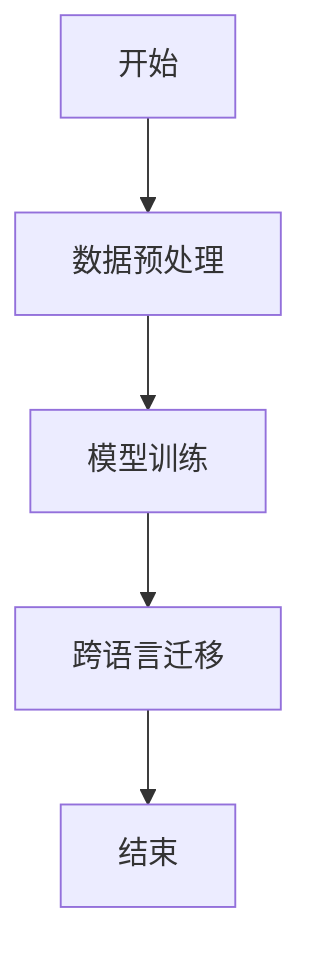
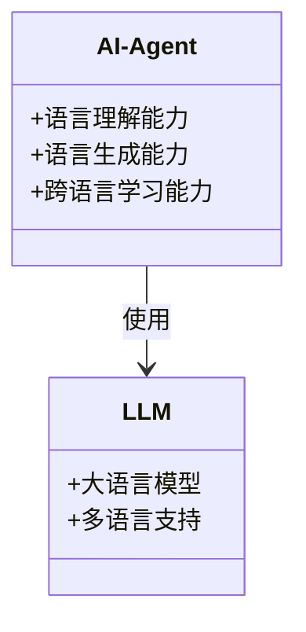
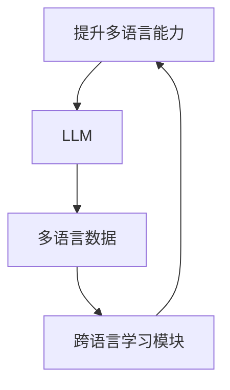
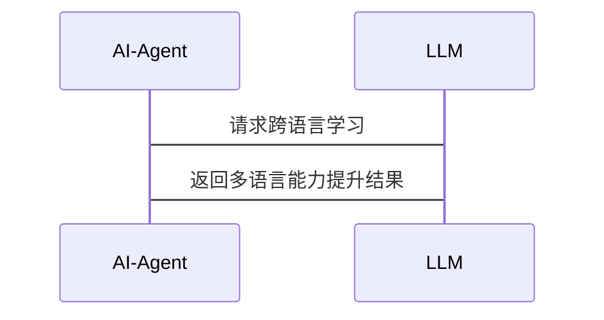

                 


# AI Agent的跨语言学习：增强LLM的多语言能力

> **关键词**：AI Agent，跨语言学习，大语言模型，多语言能力，LLM，增强学习  
> **摘要**：本文深入探讨AI Agent在跨语言学习中的应用，分析如何通过跨语言学习技术增强大语言模型（LLM）的多语言能力。从基础概念到算法原理，再到系统架构和项目实战，全面解析AI Agent与跨语言学习的结合，帮助读者掌握提升LLM多语言能力的核心方法。

---

## 第1章: AI Agent与跨语言学习概述

### 1.1 AI Agent的基本概念

#### 1.1.1 AI Agent的定义
AI Agent（人工智能代理）是指能够感知环境、自主决策并执行任务的智能实体。它可以是一个软件程序，也可以是一个物理机器人，通过与环境交互来完成特定目标。

#### 1.1.2 AI Agent的核心特点
- **自主性**：AI Agent能够自主决策，无需外部干预。
- **反应性**：能够实时感知环境并做出反应。
- **目标导向性**：所有行为都围绕实现特定目标展开。
- **学习能力**：能够通过经验改进自身性能。

#### 1.1.3 AI Agent与传统AI的区别
传统的AI系统通常依赖于固定的规则和程序，而AI Agent具备更强的自主性和适应性，能够动态调整策略以应对复杂环境。

### 1.2 跨语言学习的基本概念

#### 1.2.1 跨语言学习的定义
跨语言学习（Cross-Language Learning）是指在多语言环境下，通过学习不同语言的数据来提升模型的多语言理解和生成能力。

#### 1.2.2 跨语言学习的核心特点
- **多语言支持**：能够理解和生成多种语言。
- **跨语言迁移**：能够在一种语言上学习，迁移到其他语言。
- **语言无关性**：不依赖于特定语言的语法或特征。

#### 1.2.3 跨语言学习与单语言学习的区别
单语言学习仅针对一种语言，而跨语言学习则涉及多种语言，目标是通过跨语言数据提升模型的通用性。

### 1.3 AI Agent在跨语言学习中的作用

#### 1.3.1 AI Agent在跨语言学习中的应用场景
- **多语言对话系统**：支持多种语言的智能对话。
- **跨语言信息检索**：在多种语言中快速检索信息。
- **全球化服务**：为全球用户提供本地化服务。

#### 1.3.2 AI Agent如何增强LLM的多语言能力
AI Agent通过跨语言学习，帮助LLM更好地理解和生成多种语言内容，提升模型的通用性和实用性。

#### 1.3.3 跨语言学习对AI Agent的挑战与机遇
- **挑战**：不同语言之间的语义差异、数据稀缺性、计算资源需求。
- **机遇**：提升AI Agent的多语言能力，拓展应用场景。

---

## 第2章: 大语言模型（LLM）的多语言能力

### 2.1 大语言模型的基本原理

#### 2.1.1 LLM的定义与特点
- **定义**：大语言模型是指基于大量数据训练的大型语言模型，具有强大的语言理解和生成能力。
- **特点**：参数量大、训练数据丰富、通用性强。

#### 2.1.2 LLM的核心技术与实现原理
- **技术**：基于Transformer架构，利用自注意力机制和前馈网络。
- **实现原理**：通过大量数据训练，模型能够捕捉语言的模式和语义信息。

#### 2.1.3 LLM与AI Agent的结合
AI Agent利用LLM的强大语言能力，实现多语言对话、信息检索等功能。

### 2.2 LLM的多语言能力现状

#### 2.2.1 多语言模型的发展历程
- **单语言模型**：早期模型主要针对单一语言。
- **多语言模型**：近年来，多语言模型逐渐成为主流，如Marian、XLM。

#### 2.2.2 当前主流多语言模型的优缺点
- **优点**：支持多种语言，减少数据需求。
- **缺点**：不同语言的性能可能存在差异，训练资源消耗大。

#### 2.2.3 LLM多语言能力的瓶颈与挑战
- **数据稀缺性**：某些语言数据量不足。
- **计算资源需求**：训练多语言模型需要大量算力。

---

## 第3章: 跨语言学习的核心概念与原理

### 3.1 跨语言学习的原理

#### 3.1.1 跨语言学习的定义与核心要素
- **定义**：通过学习多种语言的数据，提升模型的多语言能力。
- **核心要素**：多语言数据、跨语言迁移、语言无关性。

#### 3.1.2 跨语言学习的数学模型与公式
跨语言学习的损失函数可以表示为：
$$ L = \lambda_1 L_{\text{mono}} + \lambda_2 L_{\text{cross}} $$
其中，$\lambda_1$和$\lambda_2$是调节参数，$L_{\text{mono}}$是单语言损失，$L_{\text{cross}}$是跨语言损失。

#### 3.1.3 跨语言学习的实现步骤与流程
1. 数据预处理：收集和整理多语言数据。
2. 模型训练：利用多语言数据训练模型。
3. 跨语言迁移：通过跨语言迁移提升模型性能。

### 3.2 跨语言学习与AI Agent的结合

#### 3.2.1 跨语言学习在AI Agent中的应用场景
- **多语言对话**：支持多种语言的自然语言处理。
- **跨语言信息检索**：在不同语言间快速检索信息。

#### 3.2.2 AI Agent如何利用跨语言学习提升多语言能力
通过跨语言学习，AI Agent能够更好地理解不同语言的语义，提升多语言对话和信息处理的能力。

#### 3.2.3 跨语言学习对AI Agent的性能提升
- **提升准确性**：跨语言学习能够减少语义理解的误差。
- **增强通用性**：支持更多语言，拓展应用场景。

---

## 第4章: 跨语言学习的算法原理与实现

### 4.1 跨语言学习的算法原理

#### 4.1.1 跨语言学习的核心算法与实现步骤
1. 数据预处理：收集多语言数据，进行清洗和标注。
2. 模型训练：利用多语言数据训练模型，采用迁移学习或多任务学习策略。
3. 跨语言迁移：通过调整模型参数，实现跨语言迁移。

#### 4.1.2 跨语言学习的数学模型与公式
跨语言学习的损失函数可以表示为：
$$ L = \lambda_1 L_{\text{mono}} + \lambda_2 L_{\text{cross}} $$
其中，$\lambda_1$和$\lambda_2$是调节参数，$L_{\text{mono}}$是单语言损失，$L_{\text{cross}}$是跨语言损失。

#### 4.1.3 跨语言学习的算法流程图



### 4.2 跨语言学习的代码实现

#### 4.2.1 环境安装
```bash
pip install transformers
```

#### 4.2.2 核心代码实现
```python
from transformers import AutoTokenizer, AutoModelForMaskedLM

tokenizer = AutoTokenizer.from_pretrained('facebook/xlm-roberta-base')
model = AutoModelForMaskedLM.from_pretrained('facebook/xlm-roberta-base')

def cross_language_learning():
    # 数据预处理
    input_text = "The cat is on the mat."
    inputs = tokenizer(input_text, return_tensors='np')
    # 跨语言迁移
    outputs = model(**inputs)
    # 获取预测结果
    predicted_index = outputs logits.argmax(axis=-1)
    predicted_token = tokenizer.decode(predicted_index)
    print(predicted_token)

cross_language_learning()
```

---

## 第5章: 系统分析与架构设计

### 5.1 项目介绍与应用场景

#### 5.1.1 项目介绍
本项目旨在通过跨语言学习技术，提升AI Agent的多语言能力，实现多语言对话和信息检索功能。

#### 5.1.2 应用场景
- **多语言对话系统**：支持多种语言的智能对话。
- **跨语言信息检索**：在不同语言间快速检索信息。

### 5.2 系统功能设计

#### 5.2.1 领域模型设计



#### 5.2.2 系统架构设计



#### 5.2.3 接口设计与交互流程图



---

## 第6章: 项目实战

### 6.1 环境安装

```bash
pip install transformers
```

### 6.2 核心代码实现

```python
from transformers import AutoTokenizer, AutoModelForMaskedLM

tokenizer = AutoTokenizer.from_pretrained('facebook/xlm-roberta-base')
model = AutoModelForMaskedLM.from_pretrained('facebook/xlm-roberta-base')

def cross_language_learning():
    input_text = "The cat is on the mat."
    inputs = tokenizer(input_text, return_tensors='np')
    outputs = model(**inputs)
    predicted_index = outputs.logits.argmax(axis=-1)
    predicted_token = tokenizer.decode(predicted_index)
    print(predicted_token)

cross_language_learning()
```

### 6.3 代码解读与分析

- **代码功能**：实现跨语言学习，提升模型的多语言能力。
- **关键点**：使用预训练的多语言模型，通过跨语言学习提升性能。

### 6.4 实际案例分析

- **案例1**：多语言对话系统
  - **输入**：用户输入多种语言的问题。
  - **输出**：AI Agent能够理解并生成相应的回答。

---

## 第7章: 总结与展望

### 7.1 总结

- **总结**：本文深入探讨了AI Agent在跨语言学习中的应用，分析了如何通过跨语言学习技术增强大语言模型的多语言能力。
- **核心观点**：跨语言学习是提升AI Agent多语言能力的关键技术，具有广泛的应用前景。

### 7.2 展望

- **未来研究方向**：研究更高效的跨语言学习算法，提升AI Agent的多语言能力。
- **应用场景扩展**：探索更多跨语言学习的应用场景，如跨语言情感分析、跨语言机器翻译等。

---

## 结语

AI Agent的跨语言学习是一个充满挑战和机遇的领域。通过跨语言学习技术，我们可以显著提升大语言模型的多语言能力，为AI Agent在多语言环境中的应用提供坚实的技术支持。未来，随着技术的不断进步，跨语言学习将在更多领域展现出其强大的潜力。

---

**作者：AI天才研究院/AI Genius Institute & 禅与计算机程序设计艺术 /Zen And The Art of Computer Programming**

