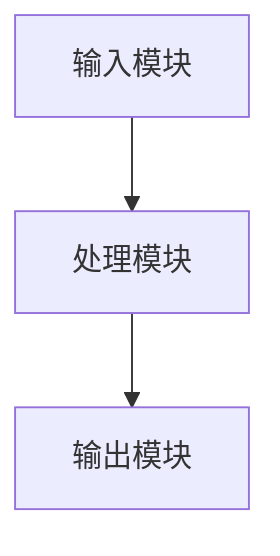

                 


# AI Agent的跨语言理解与翻译能力

> 关键词：AI Agent, 跨语言理解, 机器翻译, 自然语言处理, 翻译模型

> 摘要：AI Agent的跨语言理解与翻译能力是人工智能领域的重要研究方向。本文将从AI Agent的基本概念出发，深入探讨其在跨语言理解与翻译中的核心原理、算法实现、系统架构及实际应用。通过结合理论分析与实践案例，本文旨在为读者提供一个全面了解AI Agent跨语言能力的框架。

---

# 第1章: AI Agent与跨语言理解概述

## 1.1 AI Agent的基本概念

### 1.1.1 AI Agent的定义与特点
AI Agent（人工智能代理）是指能够感知环境、自主决策并执行任务的智能体。其特点包括：
- **自主性**：无需外部干预，自主完成任务。
- **反应性**：能够实时感知环境并做出响应。
- **学习性**：通过数据和经验不断优化自身能力。
- **社交性**：能够与人类或其他智能体进行交互。

### 1.1.2 跨语言理解的重要性
跨语言理解是指AI Agent能够理解并处理多种语言的能力。在多语言环境中，AI Agent需要能够识别、解析和生成不同语言的文本，以实现高效的信息处理和人机交互。

### 1.1.3 翻译能力的核心要素
翻译能力是AI Agent跨语言理解的关键能力，其核心要素包括：
1. **语言识别**：准确识别输入文本的语言类型。
2. **语义理解**：理解输入文本的语义含义。
3. **翻译生成**：生成准确且自然的翻译结果。

## 1.2 跨语言理解与翻译的背景与挑战

### 1.2.1 跨语言理解的背景
随着全球化的发展，跨语言交流的需求日益增加。AI Agent在教育、客服、医疗等领域中的应用，需要其具备跨语言处理能力。

### 1.2.2 翻译技术的历史发展
翻译技术经历了从基于规则的机器翻译到统计机器翻译，再到当前的神经机器翻译的演变。神经机器翻译的出现，显著提升了翻译的准确性和自然度。

### 1.2.3 当前AI Agent在跨语言理解中的应用
当前，AI Agent在跨语言理解中的应用主要集中在以下方面：
1. **多语言客服系统**：支持多种语言的用户交互。
2. **跨语言信息检索**：在多语言环境下快速检索相关信息。
3. **实时翻译工具**：为用户提供即时的翻译服务。

## 1.3 本章小结
本章介绍了AI Agent的基本概念，分析了跨语言理解的重要性，并探讨了翻译能力的核心要素。此外，还总结了当前AI Agent在跨语言理解中的应用现状。

---

# 第2章: AI Agent的跨语言理解核心概念

## 2.1 跨语言理解的理论基础

### 2.1.1 自然语言处理基础
自然语言处理（NLP）是AI Agent跨语言理解的核心技术。NLP的目标是使计算机能够理解、生成和处理人类语言。

### 2.1.2 跨语言信息处理的挑战
跨语言信息处理面临的主要挑战包括：
1. **语言多样性**：不同语言的语法、词汇和文化差异。
2. **数据稀疏性**：某些语言的训练数据不足。
3. **语义歧义**：不同语言中的词语可能具有多种含义。

### 2.1.3 翻译模型的基本原理
翻译模型的核心原理是通过构建语言模型和翻译模型，将源语言文本映射为目标语言文本。神经机器翻译（NMT）通过端到端的神经网络模型实现翻译。

## 2.2 AI Agent中的语言表示与理解

### 2.2.1 词向量表示
词向量表示（如Word2Vec、GloVe）通过将词语映射为向量，捕捉词语的语义信息。

### 2.2.2 句法与语义分析
句法分析（如分词、句法树）和语义分析（如命名实体识别、关系抽取）是理解文本语义的关键步骤。

### 2.2.3 跨语言语义对齐
跨语言语义对齐通过建立不同语言之间的语义对应关系，实现跨语言信息的准确匹配。

## 2.3 翻译模型的评估与优化

### 2.3.1 翻译质量评估指标
常用的翻译质量评估指标包括：
- **BLEU**：基于编辑距离的评估指标。
- **ROUGE**：基于召回率的评估指标。
- **METEOR**：综合考虑准确率和流畅度的评估指标。

### 2.3.2 基于AI Agent的翻译优化
通过结合上下文信息和用户反馈，优化翻译结果的准确性和自然度。

### 2.3.3 跨语言模型的训练策略
跨语言模型的训练策略包括：
1. **多任务学习**：同时学习多种语言任务。
2. **预训练模型**：利用大规模多语言数据进行预训练。

## 2.4 本章小结
本章详细探讨了AI Agent跨语言理解的核心概念，包括语言表示、语义分析和翻译模型的评估与优化。

---

# 第3章: AI Agent的翻译能力实现原理

## 3.1 翻译模型的算法原理

### 3.1.1 Transformer模型的结构
Transformer模型由编码器和解码器组成，通过自注意力机制捕捉文本的长距离依赖关系。

### 3.1.2 注意力机制的实现
注意力机制通过计算输入序列中每个位置的权重，确定其对当前输出的贡献程度。

### 3.1.3 编码器-解码器框架
编码器将源语言文本编码为语义向量，解码器将语义向量解码为目标语言文本。

## 3.2 跨语言模型的训练与优化

### 3.2.1 跨语言预训练模型
跨语言预训练模型（如mBert）通过多语言数据的预训练，提升模型的跨语言理解能力。

### 3.2.2 多语言训练策略
多语言训练策略包括：
1. **联合训练**：同时训练多种语言的翻译任务。
2. **语言对齐**：通过语言对齐技术，建立不同语言之间的关联。

### 3.2.3 跨语言模型的调优方法
跨语言模型的调优方法包括：
1. **微调**：在特定任务上进行微调。
2. **参数共享**：通过共享参数，减少不同语言之间的差异。

## 3.3 翻译结果的后处理与优化

### 3.3.1 翻译结果的语义校对
通过语义校对技术，提升翻译结果的准确性和自然度。

### 3.3.2 基于上下文的翻译优化
结合上下文信息，优化翻译结果的语境适配。

### 3.3.3 翻译结果的用户反馈机制
通过用户反馈机制，不断优化翻译模型的性能。

## 3.4 本章小结
本章详细探讨了AI Agent翻译能力的实现原理，包括翻译模型的算法原理、训练策略和后处理优化方法。

---

# 第4章: AI Agent的跨语言理解与翻译的系统架构

## 4.1 系统架构设计

### 4.1.1 系统功能模块划分
系统功能模块包括：
- **输入模块**：接收多语言输入文本。
- **处理模块**：进行语言识别、语义分析和翻译生成。
- **输出模块**：输出翻译结果。

### 4.1.2 系统架构图


## 4.2 系统接口设计

### 4.2.1 API接口定义
API接口包括：
- **输入接口**：接收源语言和目标语言文本。
- **输出接口**：返回翻译结果。

### 4.2.2 接口调用流程
接口调用流程如下：
1. 用户通过API输入源语言文本和目标语言。
2. 系统进行语言识别和语义分析。
3. 系统生成翻译结果并返回给用户。

## 4.3 系统交互流程

### 4.3.1 用户输入处理
用户输入处理流程：
1. 接收用户输入文本。
2. 确定输入语言。
3. 进行语义理解。

### 4.3.2 翻译结果输出
翻译结果输出流程：
1. 生成目标语言文本。
2. 返回翻译结果。

## 4.4 本章小结
本章详细探讨了AI Agent跨语言理解与翻译的系统架构，包括功能模块划分、接口设计和交互流程。

---

# 第5章: AI Agent跨语言理解与翻译的算法实现

## 5.1 翻译模型的数学模型

### 5.1.1 Transformer模型的数学公式
Transformer模型的自注意力机制公式如下：
$$
\text{Attention}(Q, K, V) = \text{softmax}\left(\frac{QK^T}{\sqrt{d_k}}\right)V
$$

### 5.1.2 编码器-解码器框架
编码器将输入序列映射为语义向量，解码器将语义向量解码为输出序列。

### 5.1.3 翻译模型的训练目标
翻译模型的训练目标是最小化生成文本与目标文本的差异。

## 5.2 跨语言模型的训练策略

### 5.2.1 跨语言预训练模型
跨语言预训练模型通过多语言数据的预训练，提升模型的跨语言理解能力。

### 5.2.2 多语言训练策略
多语言训练策略包括：
1. **联合训练**：同时训练多种语言的翻译任务。
2. **语言对齐**：通过语言对齐技术，建立不同语言之间的关联。

## 5.3 翻译结果的优化方法

### 5.3.1 翻译结果的语义校对
通过语义校对技术，提升翻译结果的准确性和自然度。

### 5.3.2 基于上下文的翻译优化
结合上下文信息，优化翻译结果的语境适配。

### 5.3.3 翻译结果的用户反馈机制
通过用户反馈机制，不断优化翻译模型的性能。

## 5.4 本章小结
本章详细探讨了AI Agent跨语言理解与翻译的算法实现，包括翻译模型的数学模型、训练策略和结果优化方法。

---

# 第6章: AI Agent跨语言理解与翻译的项目实战

## 6.1 项目环境安装

### 6.1.1 环境需求
安装Python、TensorFlow、Keras等依赖库。

### 6.1.2 安装步骤
```bash
pip install python
pip install tensorflow
pip install keras
```

## 6.2 系统核心实现源代码

### 6.2.1 翻译模型实现
```python
import tensorflow as tf
from tensorflow import keras

def transformer_model():
    # 定义编码器
    encoder = keras.models.Sequential([
        keras.layers.Embedding(input_dim=source_vocab_size, output_dim=embed_dim),
        keras.layers.SpatialDropout1D(rate=dropout_rate),
        keras.layers.LSTM(units=lstm_units, return_sequences=True)
    ])
    
    # 定义解码器
    decoder = keras.models.Sequential([
        keras.layers.Embedding(input_dim=target_vocab_size, output_dim=embed_dim),
        keras.layers.SpatialDropout1D(rate=dropout_rate),
        keras.layers.LSTM(units=lstm_units, return_sequences=True)
    ])
    
    # 定义注意力机制
    attention = keras.layers.Attention()
    
    # 组合模型
    inputs = keras.Input(shape=(None, source_vocab_size))
    encoder_output = encoder(inputs)
    decoder_output = decoder(encoder_output)
    attention_output = attention([encoder_output, decoder_output])
    
    outputs = keras.layers.Dense(target_vocab_size, activation='softmax')(attention_output)
    
    model = keras.Model(inputs=inputs, outputs=outputs)
    return model
```

### 6.2.2 翻译结果的后处理
```python
def postprocess_translation(translation_result):
    # 语义校对
    processed_result = semantic_check(translation_result)
    # 上下文优化
    optimized_result = context_optimization(processed_result)
    return optimized_result
```

## 6.3 项目总结

### 6.3.1 项目小结
通过本项目，我们实现了基于Transformer模型的AI Agent翻译系统，验证了跨语言理解与翻译的技术可行性。

### 6.3.2 项目亮点
1. **技术实现**：实现了基于Transformer的翻译模型。
2. **优化方法**：通过语义校对和上下文优化提升了翻译质量。

## 6.4 本章小结
本章通过一个实际项目，展示了AI Agent跨语言理解与翻译的实现过程，包括环境安装、核心代码实现和项目总结。

---

# 第7章: AI Agent跨语言理解与翻译的最佳实践

## 7.1 小结

### 7.1.1 核心知识点回顾
- AI Agent的基本概念
- 跨语言理解的核心原理
- 翻译模型的实现与优化

## 7.2 注意事项

### 7.2.1 数据质量
确保训练数据的质量和多样性，避免数据偏见。

### 7.2.2 模型调优
通过超参数调优和模型优化，提升翻译效果。

### 7.2.3 用户反馈
结合用户反馈，不断优化翻译模型。

## 7.3 拓展阅读

### 7.3.1 推荐书籍
1. 《神经机器翻译》
2. 《自然语言处理入门》

### 7.3.2 推荐论文
1. "Attention Is All You Need"
2. "BERT: Pre-training of Deep Bidirectional Transformers for NLP"

## 7.4 本章小结
本章总结了AI Agent跨语言理解与翻译的核心知识点，提出了实践中的注意事项，并推荐了相关拓展阅读资料。

---

# 作者：AI天才研究院/AI Genius Institute & 禅与计算机程序设计艺术 /Zen And The Art of Computer Programming

