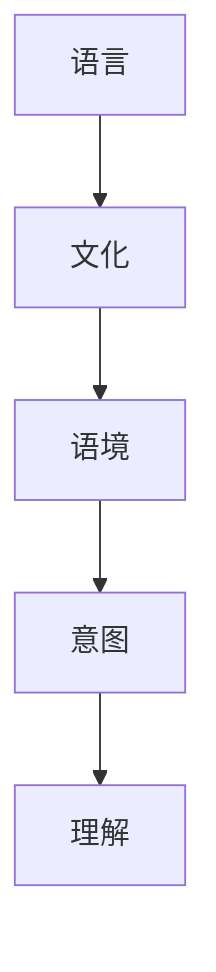
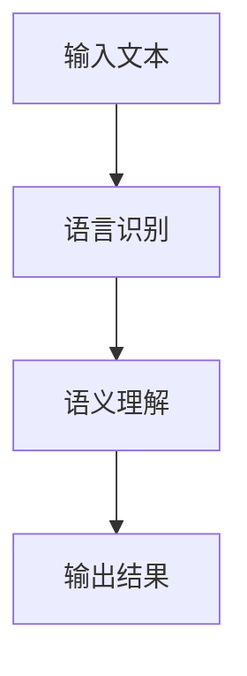
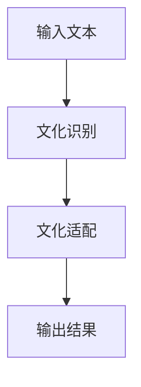
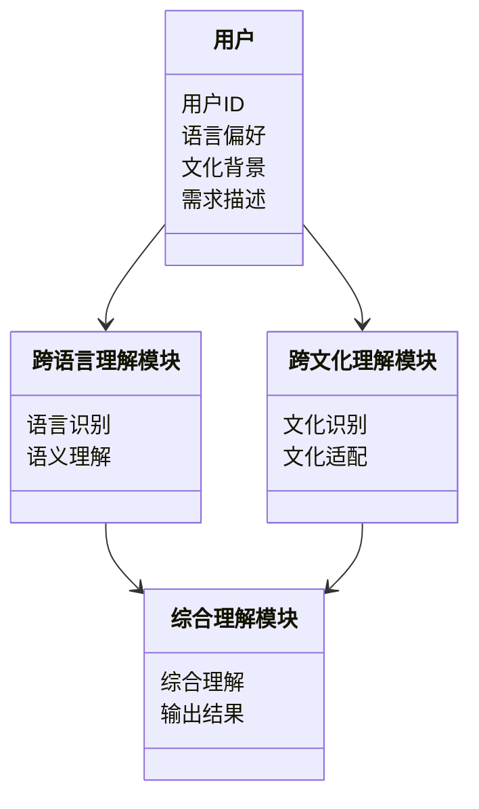
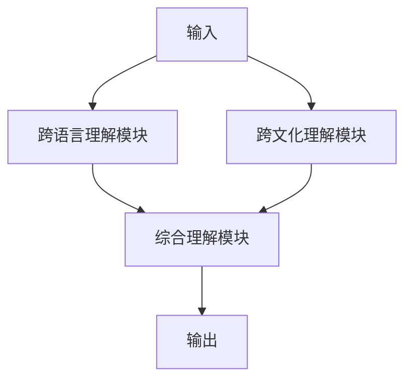
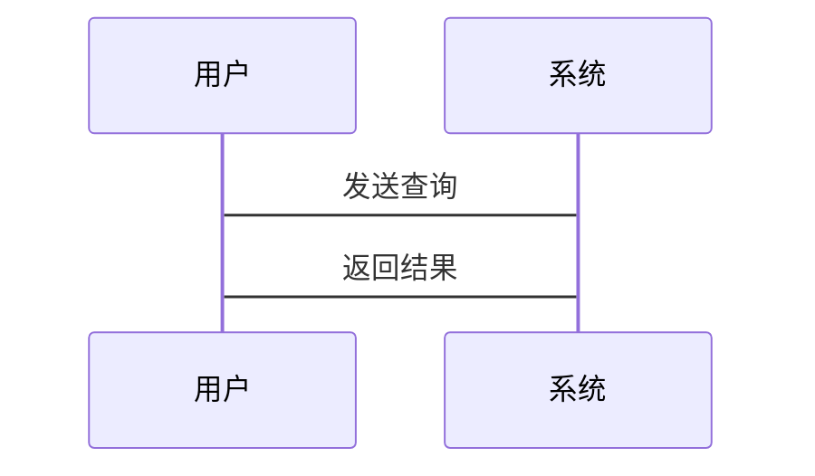

                 


# AI Agent的跨语言跨文化理解能力开发

## 关键词：AI Agent, 跨语言理解, 跨文化理解, 多语言模型, 文化适应, 自然语言处理

## 摘要：  
随着全球化进程的加速和多语言环境的普及，AI Agent需要具备跨语言和跨文化理解能力，以更好地满足不同语言和文化背景用户的需求。本文从AI Agent的背景、核心概念、算法原理、系统架构、项目实战和最佳实践等方面，全面探讨AI Agent跨语言跨文化理解能力的开发。通过详细的技术分析和实际案例，本文为开发者提供了一套完整的解决方案，帮助他们构建具备跨语言和跨文化理解能力的AI Agent系统。

---

# 第一部分: AI Agent的跨语言跨文化理解能力开发背景与核心概念

## 第1章: 背景介绍

### 1.1 问题背景
#### 1.1.1 AI Agent的定义与核心功能
AI Agent（人工智能代理）是一种能够感知环境、理解用户需求，并通过自主决策和行动来满足用户需求的智能系统。其核心功能包括自然语言理解、意图识别、信息检索和任务执行。

#### 1.1.2 跨语言与跨文化理解的必要性
在多语言和多文化环境中，用户可能使用不同的语言表达需求，或者在不同文化背景下具有不同的沟通习惯和语境。AI Agent需要能够理解这些差异，才能准确地满足用户需求。

#### 1.1.3 当前AI Agent在跨语言跨文化理解中的挑战
- **语言多样性**：不同语言的语法结构、词汇含义和语境差异使得跨语言理解具有挑战性。
- **文化差异**：不同文化背景下的用户可能具有不同的沟通习惯、价值观和文化敏感性。
- **数据稀缺性**：跨语言和跨文化数据的获取和标注成本较高，限制了模型的训练效果。

### 1.2 问题描述
#### 1.2.1 跨语言理解的基本概念
跨语言理解是指AI Agent能够理解不同语言之间的语义差异，并在多种语言之间进行准确的信息转换。

#### 1.2.2 跨文化理解的核心问题
跨文化理解是指AI Agent能够理解不同文化背景下的语境、习惯和价值观，并在这些背景下进行有效的交流。

#### 1.2.3 AI Agent在跨语言跨文化理解中的目标
AI Agent的目标是通过跨语言和跨文化理解能力，为用户提供准确、自然和文化敏感的服务。

### 1.3 问题解决
#### 1.3.1 跨语言理解的实现方法
- **多语言模型训练**：使用多种语言的语料库进行模型训练，使模型能够理解不同语言的语义。
- **跨语言迁移学习**：利用已有的单语言模型进行跨语言迁移，降低多语言训练的成本。

#### 1.3.2 跨文化理解的实现策略
- **文化特征提取**：通过分析不同文化背景下的语言特征，提取文化相关的特征。
- **文化适配模型**：构建文化适配模型，根据用户的文化背景调整理解和生成策略。

#### 1.3.3 AI Agent如何整合跨语言与跨文化能力
AI Agent需要整合跨语言和跨文化理解能力，通过语言理解和文化适配的协同工作，实现对用户需求的准确理解。

### 1.4 边界与外延
#### 1.4.1 跨语言理解的边界
跨语言理解的边界包括语言的语法结构、词汇含义和语境，但不包括语言之外的语境信息。

#### 1.4.2 跨文化理解的边界
跨文化理解的边界包括文化背景、习惯和价值观，但不包括用户的个性化偏好。

#### 1.4.3 AI Agent跨语言跨文化理解能力的外延
AI Agent的跨语言跨文化理解能力可以扩展到多语言和多文化场景，如国际商务、跨文化沟通和全球客服等领域。

### 1.5 核心概念与组成
#### 1.5.1 跨语言理解的核心要素
- **多语言语料库**：用于训练多语言模型的语料库。
- **跨语言模型**：能够理解多种语言的模型。
- **语言特征提取**：提取语言相关的特征。

#### 1.5.2 跨文化理解的核心要素
- **文化语料库**：用于训练文化适配模型的语料库。
- **文化特征提取**：提取文化相关的特征。
- **文化适配模型**：根据用户的文化背景调整理解和生成策略。

#### 1.5.3 AI Agent跨语言跨文化理解能力的组成结构
1. 跨语言理解模块：负责理解多种语言的语义。
2. 跨文化理解模块：负责理解不同文化背景下的语境和习惯。
3. 综合理解模块：整合跨语言和跨文化理解结果，生成最终的理解结果。

---

# 第二部分: AI Agent的跨语言跨文化理解能力的核心概念与联系

## 第2章: 核心概念与联系

### 2.1 跨语言理解的核心原理
#### 2.1.1 多语言模型的训练原理
多语言模型通过在多种语言的语料库上进行训练，学习语言间的共性和差异。例如，使用多语言预训练模型（如Marian）进行跨语言翻译和理解。

#### 2.1.2 跨语言理解的实现机制
跨语言理解的实现机制包括：
- **语言特征提取**：通过语言模型提取语言相关的特征。
- **跨语言映射**：将不同语言的特征映射到相同的语义空间。
- **语义理解**：在语义空间中进行语义理解。

#### 2.1.3 跨语言模型的优缺点对比
| 模型类型 | 优点 | 缺点 |
|----------|------|------|
| 单语言模型 | 语言内准确性高 | 无法处理跨语言场景 |
| 多语言模型 | 能处理多种语言 | 需要大量多语言数据 |
| 跨语言迁移模型 | 数据需求低 | 语义准确性可能较低 |

### 2.2 跨文化理解的核心原理
#### 2.2.1 文化理解的基本概念
文化理解是指理解不同文化背景下的沟通习惯、价值观和文化敏感性。

#### 2.2.2 跨文化理解的实现方法
- **文化特征提取**：通过分析文化相关的语料库，提取文化特征。
- **文化适配模型**：构建文化适配模型，根据用户的文化背景调整理解和生成策略。

#### 2.2.3 跨文化模型的优缺点对比
| 模型类型 | 优点 | 缺点 |
|----------|------|------|
| 文化无关模型 | 数据需求低 | 文化敏感性差 |
| 文化适配模型 | 文化敏感性高 | 数据需求高 |
| 跨文化迁移模型 | 数据需求低 | 文化适配性有限 |

### 2.3 跨语言与跨文化理解的关系
#### 2.3.1 跨语言理解与跨文化理解的相互作用
- 跨语言理解为跨文化理解提供语言基础。
- 跨文化理解为跨语言理解提供语境支持。

#### 2.3.2 跨语言与跨文化理解的协同效应
- 跨语言理解能够帮助模型理解不同语言的语义。
- 跨文化理解能够帮助模型理解不同文化背景下的语境。

#### 2.3.3 跨语言与跨文化理解的差异与联系
- **差异**：跨语言理解关注语言本身，跨文化理解关注文化背景。
- **联系**：跨语言理解是跨文化理解的基础，而跨文化理解为跨语言理解提供语境支持。

### 2.4 核心概念对比表
| 对比维度 | 跨语言理解 | 跨文化理解 |
|----------|------------|------------|
| 核心目标 | 理解不同语言的语义 | 理解不同文化背景下的语境 |
| 数据需求 | 需要多语言语料库 | 需要文化相关语料库 |
| 实现方法 | 多语言模型训练 | 文化适配模型构建 |

### 2.5 ER实体关系图


---

# 第三部分: AI Agent跨语言跨文化理解能力的算法原理

## 第3章: 算法原理讲解

### 3.1 跨语言理解的算法原理
#### 3.1.1 多语言模型的训练流程
1. 数据准备：收集和整理多语言语料库。
2. 模型选择：选择适合多语言任务的模型架构（如Marian）。
3. 模型训练：使用多语言语料库进行模型训练。
4. 模型优化：通过调整超参数和优化算法提升模型性能。

#### 3.1.2 跨语言理解的算法实现


#### 3.1.3 跨语言模型的数学公式
损失函数：
$$L = \sum_{i=1}^{n} (y_i - \hat{y}_i)^2$$

优化器：
$$\theta_{new} = \theta_{old} - \eta \cdot \frac{\partial L}{\partial \theta}$$

### 3.2 跨文化理解的算法原理
#### 3.2.1 文化特征提取算法
1. 数据准备：收集和整理文化相关语料库。
2. 特征提取：通过文本分析技术提取文化特征。
3. 特征选择：选择具有代表性的文化特征。

#### 3.2.2 跨文化理解的算法实现


#### 3.2.3 跨文化模型的数学公式
文化适配概率：
$$P(c|t) = \frac{\exp(\theta_c)}{\sum_{c'} \exp(\theta_{c'})}$$

---

# 第四部分: AI Agent跨语言跨文化理解能力的系统分析与架构设计

## 第4章: 系统分析与架构设计

### 4.1 系统功能设计
#### 4.1.1 领域模型


#### 4.1.2 系统架构设计


### 4.2 系统接口与交互
#### 4.2.1 系统接口设计
- **输入接口**：接收用户输入的文本或语音。
- **输出接口**：输出理解和生成的结果。

#### 4.2.2 系统交互设计


---

# 第五部分: AI Agent跨语言跨文化理解能力的项目实战

## 第5章: 项目实战

### 5.1 环境安装
- **Python 3.8+**
- **TensorFlow或PyTorch**
- **Hugging Face Transformers库**

### 5.2 系统核心实现源代码
```python
# 跨语言理解模块
from transformers import MarianTokenizer, MarianMTModel

tokenizer = MarianTokenizer.from_pretrained(" MarianTokenizer ")
model = MarianMTModel.from_pretrained(" MarianMTModel ")

def cross_language_understanding(text):
    inputs = tokenizer(text, return_tensors="pt")
    outputs = model.generate(inputs.input_ids)
    return tokenizer.decode(outputs[0], skip_special_tokens=True)

# 跨文化理解模块
from sentence_transformers import SentenceTransformer

model = SentenceTransformer('all-MiniLM-L6-v2')

def cross_cultural_understanding(text):
    embeddings = model.encode(text)
    return embeddings
```

### 5.3 代码应用解读与分析
- **跨语言理解模块**：使用预训练的多语言模型进行文本理解。
- **跨文化理解模块**：通过文本嵌入捕捉文化特征。

### 5.4 实际案例分析
案例：跨文化客服系统
- **输入**：用户用中文提问关于日本文化的问题。
- **处理**：
  1. 跨语言理解模块：识别用户语言为中文。
  2. 跨文化理解模块：识别用户需求与日本文化相关。
  3. 综合理解模块：生成文化相关的回答。

### 5.5 项目小结
通过实际案例，展示了AI Agent跨语言跨文化理解能力的实际应用，验证了系统设计的有效性。

---

# 第六部分: AI Agent跨语言跨文化理解能力的最佳实践

## 第6章: 最佳实践

### 6.1 小结
AI Agent的跨语言跨文化理解能力是实现全球化服务的关键技术。

### 6.2 注意事项
- 数据质量：确保多语言和文化相关数据的质量。
- 模型选择：选择适合任务的模型和算法。
- 文化敏感性：在设计和实现过程中，注意文化敏感性问题。

### 6.3 拓展阅读
- 《多语言自然语言处理》
- 《跨文化计算与信息处理》

---

# 作者

作者：AI天才研究院/AI Genius Institute & 禅与计算机程序设计艺术 /Zen And The Art of Computer Programming

