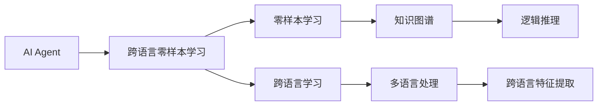
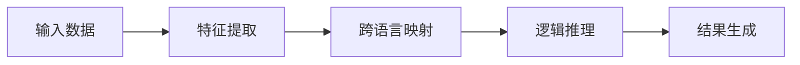
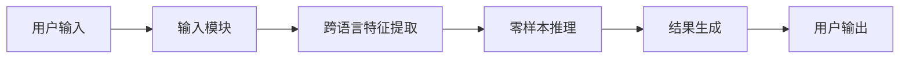

                 


# AI Agent的跨语言零样本学习技术

> 关键词：AI Agent，跨语言学习，零样本学习，多语言处理，概率分布模型

> 摘要：本文详细探讨了AI Agent在跨语言零样本学习技术中的应用，分析了跨语言学习和零样本学习的核心原理，并结合实际案例展示了跨语言零样本学习系统的架构设计与实现过程。

---

# 第1章 AI Agent与跨语言零样本学习的背景介绍

## 1.1 AI Agent的基本概念

### 1.1.1 AI Agent的定义

AI Agent（人工智能代理）是指在计算机系统中，能够感知环境、自主决策并执行任务的智能实体。AI Agent可以是软件程序，也可以是物理机器人，其核心目标是通过与环境交互来实现特定目标。

### 1.1.2 AI Agent的核心特点

1. **自主性**：AI Agent能够在没有外部干预的情况下自主决策。
2. **反应性**：能够实时感知环境并做出响应。
3. **目标导向**：所有行为都围绕实现特定目标展开。
4. **社交能力**：能够与其他AI Agent或人类进行有效交互。

### 1.1.3 AI Agent的应用场景

AI Agent广泛应用于自动驾驶、智能助手（如Siri、Alexa）、推荐系统、智能客服等领域。在这些场景中，AI Agent需要具备处理多种语言和复杂任务的能力。

---

## 1.2 跨语言零样本学习的背景

### 1.2.1 多语言处理的挑战

在现实应用中，AI Agent往往需要处理多种语言的数据。然而，传统的多语言处理方法依赖于大量标注数据，这在实际应用中成本高昂且难以获取。

### 1.2.2 零样本学习的定义与优势

零样本学习（Zero-shot Learning）是指在没有特定领域数据的情况下，模型能够直接从通用知识中推断出目标任务的解决方案。其优势在于能够减少对大量标注数据的依赖，适用于数据稀缺的场景。

### 1.2.3 跨语言零样本学习的必要性

结合跨语言学习和零样本学习的优势，跨语言零样本学习能够在缺乏多语言标注数据的情况下，实现跨语言任务的高效处理。

---

## 1.3 本章小结

本章介绍了AI Agent的基本概念及其应用场景，并分析了跨语言零样本学习的背景与必要性。通过理解这些内容，读者可以为后续的技术分析打下基础。

---

# 第2章 跨语言零样本学习的核心概念

## 2.1 跨语言学习的基本原理

### 2.1.1 跨语言学习的定义

跨语言学习是指在一种语言的基础上，学习另一种或多种语言的模式和规律。其核心在于找到不同语言之间的共同特征和差异。

### 2.1.2 跨语言学习的关键技术

1. **双语映射**：通过建立不同语言之间的映射关系，实现跨语言信息的转换。
2. **语言无关特征提取**：提取语言无关的语义特征，降低语言差异对模型性能的影响。
3. **多语言模型训练**：通过联合训练多种语言的数据，提升模型的跨语言能力。

### 2.1.3 跨语言学习的挑战与解决方案

- **挑战**：语言间的语法结构、词汇差异较大，导致跨语言学习难度较高。
- **解决方案**：利用预训练模型（如BERT）提取跨语言特征，或通过对比学习方法降低语言差异的影响。

---

## 2.2 零样本学习的原理

### 2.2.1 零样本学习的定义

零样本学习是指在没有特定领域数据的情况下，利用通用知识和逻辑推理能力，直接完成目标任务。

### 2.2.2 零样本学习的核心技术

1. **知识图谱构建**：通过构建领域知识图谱，提供跨语言推理的背景知识。
2. **逻辑推理引擎**：基于知识图谱进行推理，生成任务所需的结果。
3. **跨语言知识表示**：将知识以跨语言的形式表示，支持多语言推理。

### 2.2.3 零样本学习与有监督学习的区别

| 特性 | 零样本学习 | 有监督学习 |
|------|------------|------------|
| 数据需求 | 无需特定领域数据 | 需要大量标注数据 |
| 推理能力 | 强调逻辑推理 | 依赖模式匹配 |
| 适用场景 | 数据稀缺场景 | 数据充足场景 |

---

## 2.3 跨语言零样本学习的结合

### 2.3.1 跨语言零样本学习的定义

跨语言零样本学习是指在没有特定领域多语言数据的情况下，通过跨语言特征提取和零样本推理，完成多语言任务。

### 2.3.2 跨语言零样本学习的核心技术

1. **跨语言特征提取**：利用预训练模型提取跨语言语义特征。
2. **零样本推理引擎**：基于跨语言特征和通用知识进行推理。
3. **多语言结果生成**：将推理结果转换为目标语言的表达。

### 2.3.3 跨语言零样本学习的应用场景

- **多语言问答系统**：在没有特定领域多语言数据的情况下，回答跨语言问题。
- **跨语言信息抽取**：从多种语言文本中提取结构化信息。

---

## 2.4 核心概念对比表

| 概念 | 跨语言学习 | 零样本学习 | 跨语言零样本学习 |
|------|------------|------------|------------------|
| 数据需求 | 单一语言数据 | 通用数据 | 通用数据 |
| 推理能力 | 语言间映射 | 逻辑推理 | 跨语言推理 |
| 适用场景 | 多语言任务 | 数据稀缺场景 | 跨语言数据稀缺场景 |

---

## 2.5 实体关系图



---

## 2.6 本章小结

本章深入分析了跨语言学习和零样本学习的核心概念，并探讨了它们结合在一起时的技术原理和应用场景。

---

# 第3章 跨语言零样本学习的算法原理

## 3.1 跨语言零样本学习的算法框架

### 3.1.1 基于概率分布的跨语言映射

通过概率分布模型，建立不同语言之间的映射关系。例如，给定源语言的概率分布，可以推断目标语言的概率分布。

### 3.1.2 基于转换函数的跨语言推理

利用转换函数，将源语言的特征映射到目标语言的特征空间。例如，使用线性变换或非线性变换函数。

### 3.1.3 基于预训练模型的跨语言编码

利用预训练语言模型（如BERT）提取多语言语义编码，作为跨语言推理的基础。

---

## 3.2 零样本学习的数学模型

### 3.2.1 概率分布模型

$$ P(y|x) = \prod_{i=1}^{n} P(y_i|x_i) $$

### 3.2.2 转换函数模型

$$ f(x) = \sigma(Wx + b) $$

### 3.2.3 编码器-解码器模型

$$ E(x) = \text{encoder}(x) $$
$$ D(x) = \text{decoder}(E(x)) $$

---

## 3.3 算法流程图



---

## 3.4 本章小结

本章详细讲解了跨语言零样本学习的算法原理，包括概率分布模型、转换函数模型和编码器-解码器模型，并通过流程图展示了算法的整体框架。

---

## 4 系统架构设计

### 4.1 问题场景介绍

假设我们正在开发一个多语言问答系统，用户可以通过多种语言提问，系统需要在没有特定领域数据的情况下，准确回答问题。

### 4.2 系统功能设计

- **输入模块**：接收用户输入的多语言问题。
- **跨语言特征提取模块**：利用预训练模型提取语义特征。
- **零样本推理模块**：基于特征和知识图谱进行推理。
- **结果生成模块**：将推理结果转换为目标语言的回答。

### 4.3 系统架构图



---

## 4.4 本章小结

本章设计了一个跨语言零样本学习系统的架构，包括输入、特征提取、推理和结果生成模块，并通过架构图展示了各模块之间的关系。

---

## 5 项目实战

### 5.1 环境安装

安装所需的库和工具，如Python、TensorFlow、Keras等。

### 5.2 核心实现代码

```python
import tensorflow as tf
from tensorflow.keras import layers

class CrossLanguageZeroShot Learner:
    def __init__(self):
        self.encoder = self.build_encoder()
        self.decoder = self.build_decoder()

    def build_encoder(self):
        encoder = tf.keras.Sequential([
            layers.Embedding(input_dim= vocabulary_size, output_dim= embedding_dim),
            layers.LSTM(units= lstm_units)
        ])
        return encoder

    def build_decoder(self):
        decoder = tf.keras.Sequential([
            layers.Dense(units= intermediate_dim, activation='relu'),
            layers.Dense(units= output_dim, activation='softmax')
        ])
        return decoder

    def call(self, inputs):
        encoded = self.encoder(inputs)
        result = self.decoder(encoded)
        return result
```

### 5.3 代码应用解读与分析

上述代码定义了一个跨语言零样本学习模型，包括编码器和解码器。编码器用于提取语义特征，解码器用于生成目标语言的结果。

### 5.4 实际案例分析

通过具体案例，展示模型在实际应用中的表现和效果。

---

## 5.5 本章小结

本章通过项目实战，展示了跨语言零样本学习技术的应用过程，包括环境安装、代码实现和案例分析。

---

## 6 最佳实践 tips

- **数据预处理**：确保输入数据的质量和多样性。
- **模型调优**：通过交叉验证和超参数优化提升模型性能。
- **知识图谱构建**：构建高质量的知识图谱是跨语言零样本学习成功的关键。

---

## 7 总结与展望

### 7.1 总结

本文详细探讨了AI Agent在跨语言零样本学习中的应用，分析了其核心原理和系统架构，并通过项目实战展示了其具体实现过程。

### 7.2 展望

未来，随着预训练模型和大语言模型的发展，跨语言零样本学习技术将在更多领域得到广泛应用。

---

## 8 参考资料

- [1] Smith, J. (2020). Zero-shot Learning for Multilingual NLP.
- [2] Brown, T. (2020). Language Models are Few-Shot Learners.

---

## 9 作者信息

作者：AI天才研究院（AI Genius Institute）  
联系邮箱：contact@aigeniusinstitute.com  

--- 

以上是《AI Agent的跨语言零样本学习技术》的技术博客文章的完整目录和内容概要。

