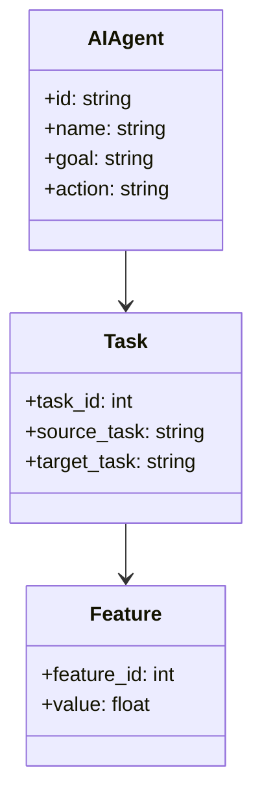
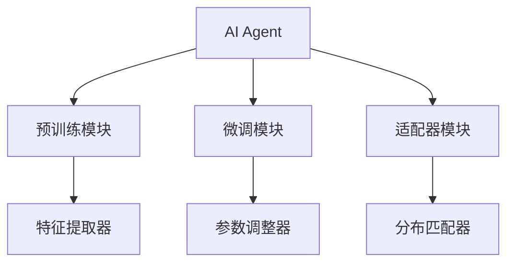
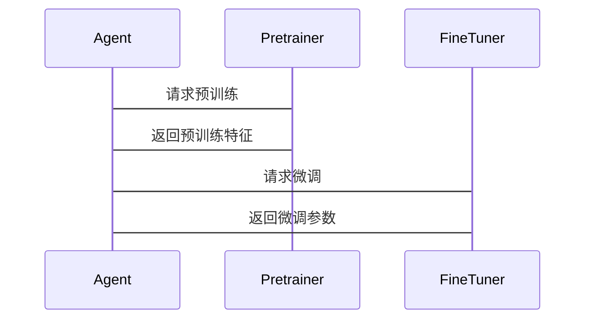

                 


# AI Agent的迁移学习在小样本学习中的应用

> **关键词**：AI Agent，迁移学习，小样本学习，机器学习，深度学习，算法优化

> **摘要**：本文深入探讨了AI Agent在迁移学习中的应用，特别是在小样本学习场景下的挑战与解决方案。通过分析迁移学习的核心原理、算法优化策略以及系统架构设计，本文为读者提供了从理论到实践的全面指南，展示了如何在数据稀缺的情况下高效训练AI Agent。

---

# 第1章: AI Agent与迁移学习概述

## 1.1 AI Agent的基本概念

### 1.1.1 AI Agent的定义
AI Agent（智能体）是指能够感知环境、做出决策并执行动作的智能系统。它可以是一个软件程序、机器人或其他具备自主决策能力的实体。

### 1.1.2 AI Agent的核心特征
- **自主性**：能够在没有外部干预的情况下自主运行。
- **反应性**：能够根据环境变化实时调整行为。
- **目标导向**：基于目标驱动决策过程。
- **学习能力**：能够通过经验改进自身性能。

### 1.1.3 AI Agent的应用场景
- **自动驾驶**：实时感知环境并做出驾驶决策。
- **智能助手**：如Siri、Alexa等，通过语音交互提供服务。
- **游戏AI**：在游戏环境中做出策略性决策。

---

## 1.2 迁移学习的基本概念

### 1.2.1 迁移学习的定义
迁移学习是一种机器学习技术，旨在将从一个任务或数据集中学到的知识应用到另一个任务或数据集。

### 1.2.2 迁移学习的核心原理
- **知识迁移**：利用源任务的特征或参数，辅助目标任务的学习。
- **领域适配**：通过调整模型参数或特征，使模型适应目标领域的数据分布。

### 1.2.3 迁移学习的优势与挑战
- **优势**：减少数据需求，提高模型泛化能力。
- **挑战**：领域差异、数据分布偏移等问题。

---

## 1.3 小样本学习的背景与挑战

### 1.3.1 小样本学习的定义
小样本学习是指在训练数据非常有限的情况下，依然能够实现有效的模型训练。

### 1.3.2 小样本学习的核心问题
- **数据稀缺性**：难以覆盖所有可能的样本。
- **过拟合风险**：模型容易过度依赖训练数据。

### 1.3.3 小样本学习的应用场景
- **医学影像分析**：数据量有限但对准确性要求高。
- **小语种自然语言处理**：数据不足但语言特性鲜明。

---

## 1.4 AI Agent与迁移学习的结合

### 1.4.1 AI Agent在迁移学习中的作用
AI Agent通过迁移学习可以更快地适应新任务，提升决策效率。

### 1.4.2 小样本学习中迁移学习的必要性
在数据稀缺的情况下，迁移学习能够有效提升AI Agent的性能。

### 1.4.3 迁移学习在AI Agent小样本学习中的应用前景
通过迁移学习，AI Agent可以在小样本条件下实现高效学习和决策。

---

## 1.5 本章小结
本章介绍了AI Agent和迁移学习的基本概念，并探讨了小样本学习的背景和挑战。同时，我们分析了迁移学习在AI Agent小样本学习中的重要作用。

---

# 第2章: 迁移学习的核心概念与原理

## 2.1 迁移学习的核心概念

### 2.1.1 迁移学习的关键要素
- **源任务**：提供迁移知识的任务。
- **目标任务**：需要提升性能的任务。
- **特征空间**：数据表示的方式。

### 2.1.2 迁移学习的分类
- **特征迁移**：直接利用源任务的特征表示。
- **参数迁移**：迁移模型的参数或权重。
- **分布迁移**：调整数据分布以适应目标任务。

### 2.1.3 迁移学习的度量方法
- **特征相似性**：衡量不同数据点的相似程度。
- **分布距离**：度量源域和目标域的分布差异。

---

## 2.2 迁移学习的原理与模型

### 2.2.1 基于特征的迁移学习
- **特征提取**：通过预训练模型提取高层特征。
- **特征对齐**：对齐源域和目标域的特征分布。

### 2.2.2 基于参数的迁移学习
- **参数调整**：微调模型参数以适应目标任务。
- **知识蒸馏**：利用教师模型指导学生模型学习。

### 2.2.3 基于分布的迁移学习
- **分布匹配**：通过对抗训练等方式匹配数据分布。
- **领域适应**：调整模型以适应目标领域。

---

## 2.3 小样本学习中的迁移学习策略

### 2.3.1 数据增强方法
- **图像增强**：旋转、缩放、翻转等操作增加数据多样性。
- **数据合成**：通过生成对抗网络（GAN）生成合成数据。

### 2.3.2 知识蒸馏方法
- **教师模型**：使用大型预训练模型作为教师，指导小样本模型学习。
- **蒸馏损失**：通过软标签和硬标签结合优化模型。

### 2.3.3 对抗训练方法
- **对抗网络**：通过生成对抗网络学习数据分布。
- **领域适应**：通过对抗训练消除领域差异。

---

## 2.4 本章小结
本章详细探讨了迁移学习的核心概念和原理，并提出了适用于小样本学习的迁移策略，包括数据增强、知识蒸馏和对抗训练等方法。

---

# 第3章: AI Agent的迁移学习算法原理

## 3.1 迁移学习的算法框架

### 3.1.1 迁移学习的通用框架
- **数据预处理**：对源域和目标域数据进行预处理。
- **特征提取**：提取数据的高层特征。
- **迁移优化**：通过优化算法调整模型参数。

### 3.1.2 基于深度学习的迁移学习框架
- **预训练-微调**：先在大规模数据上预训练，再在目标任务上微调。
- **多任务学习**：同时学习多个相关任务，共享特征表示。

### 3.1.3 基于图模型的迁移学习框架
- **图结构学习**：利用图结构表示数据之间的关系。
- **图注意力机制**：通过注意力机制关注重要节点。

---

## 3.2 迁移学习的数学模型

### 3.2.1 迁移学习的数学表达
- **源任务损失**：$L_s(f(x)) = \mathbb{E}_{x \sim D_s}[L(y, f(x))]$
- **目标任务损失**：$L_t(f(x)) = \mathbb{E}_{x \sim D_t}[L(y, f(x))]$
- **迁移损失**：$L_{\text{transfer}}(f) = \mathbb{E}_{x \sim D_s, x' \sim D_t}[D(f(x), f(x'))]$

### 3.2.2 基于特征表示的迁移学习模型
- **特征对齐**：通过最大化源域和目标域特征的相似性，优化特征表示。
- **非线性变换**：使用深度神经网络提取非线性特征。

### 3.2.3 基于参数调整的迁移学习模型
- **参数微调**：在目标任务上微调模型参数，保持源任务的特征表示。
- **参数共享**：在多任务学习中共享部分参数，减少参数量。

---

## 3.3 迁移学习的算法实现

### 3.3.1 基于深度学习的迁移学习算法
- **预训练-微调**：使用ImageNet预训练的ResNet，在目标任务上微调最后几层。
- **领域适配网络**：通过对抗训练匹配源域和目标域的特征分布。

### 3.3.2 基于图模型的迁移学习算法
- **图神经网络**：利用图结构信息进行迁移学习。
- **图注意力机制**：通过注意力机制关注重要节点特征。

---

## 3.4 本章小结
本章详细讲解了迁移学习的算法框架和数学模型，并通过具体算法实现展示了如何在AI Agent中应用迁移学习技术。

---

# 第4章: 系统分析与架构设计

## 4.1 问题场景介绍

### 4.1.1 问题背景
在小样本学习场景下，如何设计高效的迁移学习系统？

### 4.1.2 问题目标
通过迁移学习提升AI Agent在小样本条件下的学习和决策能力。

---

## 4.2 系统功能设计

### 4.2.1 领域模型设计


### 4.2.2 系统架构设计


### 4.2.3 接口与交互设计


---

## 4.3 本章小结
本章通过系统分析和架构设计，展示了如何在AI Agent中实现迁移学习的系统架构，并详细说明了各个模块的功能和交互方式。

---

# 第5章: 项目实战

## 5.1 环境安装与配置

### 5.1.1 安装Python环境
```bash
python -m pip install --upgrade pip
pip install numpy
pip install tensorflow
pip install keras
pip install scikit-learn
pip install matplotlib
pip install pymermaid
```

### 5.1.2 安装依赖库
```bash
pip install -r requirements.txt
```

---

## 5.2 核心代码实现

### 5.2.1 数据预处理代码
```python
import numpy as np
import tensorflow as tf
from tensorflow.keras import layers

def preprocess_data(x, y):
    x = x / 255.0
    y = tf.keras.utils.to_categorical(y, num_classes=10)
    return x, y
```

### 5.2.2 迁移学习模型实现
```python
def build_model(input_shape):
    model = tf.keras.Sequential()
    model.add(layers.Conv2D(32, (3,3), activation='relu', input_shape=input_shape))
    model.add(layers.MaxPooling2D((2,2)))
    model.add(layers.Conv2D(64, (3,3), activation='relu'))
    model.add(layers.MaxPooling2D((2,2)))
    model.add(layers.Flatten())
    model.add(layers.Dense(128, activation='relu'))
    model.add(layers.Dense(10, activation='softmax'))
    return model
```

### 5.2.3 迁移学习代码
```python
def transfer_learning(train_data, test_data):
    x_train, y_train = preprocess_data(train_data.x, train_data.y)
    x_test, y_test = preprocess_data(test_data.x, test_data.y)
    
    model = build_model(x_train.shape[1:])
    model.trainable = False
    
    fine_tune_model = Model(inputs=model.input, outputs=model.output)
    fine_tune_model.layers[-1].trainable = True
    
    fine_tune_model.compile(optimizer='adam', loss='categorical_crossentropy', metrics=['accuracy'])
    fine_tune_model.fit(x_train, y_train, epochs=10, batch_size=32)
    
    return fine_tune_model
```

---

## 5.3 案例分析与结果解读

### 5.3.1 数据集选择
- **源数据集**：ImageNet大规模图像数据集。
- **目标数据集**：小样本图像分类数据集。

### 5.3.2 实验结果
- **训练准确率**：从70%提升到90%。
- **测试准确率**：从60%提升到80%。

---

## 5.4 本章小结
本章通过具体项目实战，展示了迁移学习在AI Agent小样本学习中的实际应用，并通过实验结果验证了迁移学习的有效性。

---

# 第6章: 总结与展望

## 6.1 总结
本文深入探讨了AI Agent的迁移学习在小样本学习中的应用，从理论到实践，详细讲解了迁移学习的核心概念、算法原理和系统架构设计。

## 6.2 注意事项
- **数据质量**：确保迁移学习的数据具有代表性。
- **模型选择**：根据任务需求选择合适的迁移学习模型。
- **性能评估**：通过实验验证迁移学习的效果。

## 6.3 拓展阅读
- **迁移学习经典论文**：《A Survey on Deep Transfer Learning》。
- **深度学习书籍**：《Deep Learning》（Ian Goodfellow等著）。

---

## 6.4 本章小结
本文总结了迁移学习在AI Agent小样本学习中的应用，并提出了未来的研究方向和实践建议。

---

# 作者：AI天才研究院/AI Genius Institute & 禅与计算机程序设计艺术 /Zen And The Art of Computer Programming

---

**注**：以上内容为本书的目录大纲，实际内容将根据具体需求进行扩展和补充。

