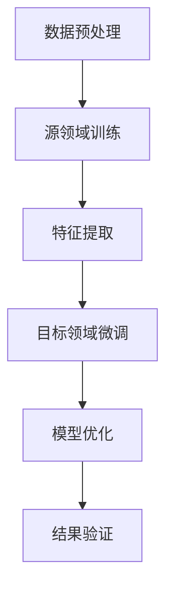
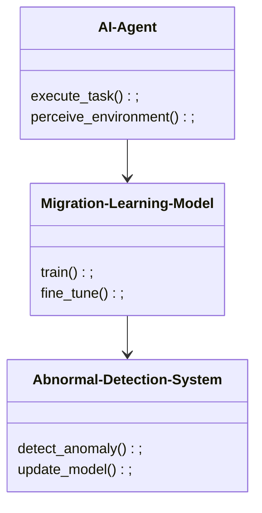
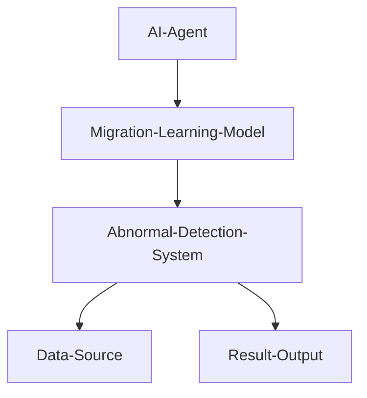
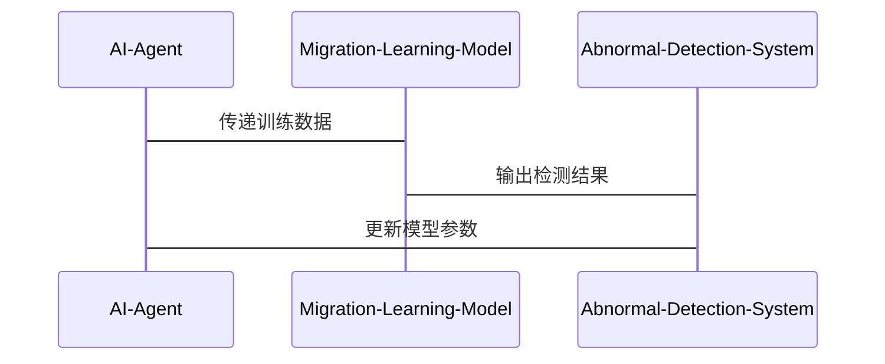

                 


# AI Agent的迁移学习在异常检测中的应用

> 关键词：AI Agent，迁移学习，异常检测，机器学习，深度学习

> 摘要：本文探讨了AI Agent在迁移学习中的应用，特别是在异常检测领域的创新性研究。通过分析迁移学习的原理、AI Agent的核心功能，结合实际案例，本文详细阐述了如何利用迁移学习提升异常检测的准确性和效率。文章还介绍了基于迁移学习的异常检测算法的实现过程，以及AI Agent在系统架构中的具体应用，为读者提供了一个全面的技术视角。

---

## 目录大纲

1. 引言
   - 1.1 异常检测的基本概念
   - 1.2 迁移学习的核心概念
   - 1.3 AI Agent的定义与特点
   - 1.4 迁移学习在异常检测中的应用价值

2. 迁移学习的原理与核心要素
   - 2.1 迁移学习的基本原理
   - 2.2 迁移学习的关键技术与方法
   - 2.3 迁移学习的数学模型与公式
   - 2.4 AI Agent与迁移学习的结合

3. 异常检测的算法实现
   - 3.1 基于迁移学习的异常检测算法
   - 3.2 迁移学习算法的实现步骤
   - 3.3 异常检测算法的数学模型与公式
   - 3.4 通过AI Agent优化异常检测算法

4. 基于AI Agent的系统架构设计
   - 4.1 系统功能模块设计
   - 4.2 系统架构图展示
   - 4.3 AI Agent在系统中的具体应用
   - 4.4 系统接口设计与交互流程

5. 项目实战：迁移学习在异常检测中的应用
   - 5.1 项目背景与目标
   - 5.2 环境安装与数据准备
   - 5.3 核心代码实现
   - 5.4 实验结果与分析
   - 5.5 项目总结与优化建议

6. 总结与展望
   - 6.1 本文总结
   - 6.2 迁移学习在异常检测中的未来发展方向
   - 6.3 AI Agent在迁移学习中的潜力
   - 6.4 进一步研究的方向与建议

---

## 引言

### 1.1 异常检测的基本概念

异常检测是指在数据中识别出与正常数据模式不一致的样本。它在金融、医疗、网络安全等领域具有重要应用。然而，异常检测面临数据稀疏性、数据分布变化等问题，导致传统方法难以有效应对复杂场景。

### 1.2 迁移学习的核心概念

迁移学习是一种机器学习技术，旨在将从一个任务上学到的知识应用到另一个相关任务中。通过迁移学习，可以在数据量较小或领域差异较大的场景下提升模型性能。

### 1.3 AI Agent的定义与特点

AI Agent是一种智能体，能够感知环境、执行任务并做出决策。AI Agent具有自主性、反应性、目标导向性和社交能力等特点，能够在复杂环境中完成多种任务。

### 1.4 迁移学习在异常检测中的应用价值

通过AI Agent的迁移学习，可以将一个领域中的异常检测模型迁移到另一个领域，提升模型的泛化能力和适应性，特别是在数据分布发生变化的情况下，能够快速调整模型以应对新场景。

---

## 迁移学习的原理与核心要素

### 2.1 迁移学习的基本原理

迁移学习的核心在于将源领域和目标领域的特征空间对齐，通过共享特征或参数，减少领域差异，提升模型的泛化能力。

### 2.2 迁移学习的关键技术与方法

- **特征对齐**：通过学习两个领域之间的共享特征表示，减少领域差异。
- **参数迁移**：将源领域的模型参数迁移到目标领域，通过微调提升性能。
- **领域适应**：通过调整模型结构或损失函数，使模型适应目标领域。

### 2.3 迁移学习的数学模型与公式

迁移学习的目标是通过优化以下目标函数，实现源领域和目标领域的特征对齐：

$$
\min_{f} \sum_{i=1}^{n} L(f(x_i^{src}), y_i^{src}) + \lambda \sum_{i=1}^{m} L(f(x_i^{tgt}), y_i^{tgt})
$$

其中，$L$ 表示损失函数，$\lambda$ 表示正则化系数。

### 2.4 AI Agent与迁移学习的结合

AI Agent可以作为迁移学习的执行者，通过自适应地调整模型参数和特征表示，实现跨领域的异常检测任务。

---

## 异常检测的算法实现

### 3.1 基于迁移学习的异常检测算法

基于迁移学习的异常检测算法可以通过以下步骤实现：

1. 在源领域上训练一个异常检测模型。
2. 将模型迁移到目标领域，通过微调或特征对齐提升性能。
3. 使用目标领域的数据进行验证和优化。

### 3.2 迁移学习算法的实现步骤

以下是迁移学习算法的实现步骤：



### 3.3 异常检测算法的数学模型与公式

异常检测的损失函数可以表示为：

$$
L_{total} = L_{src} + \lambda L_{tgt}
$$

其中，$L_{src}$ 是源领域的损失，$L_{tgt}$ 是目标领域的损失，$\lambda$ 是平衡系数。

### 3.4 通过AI Agent优化异常检测算法

AI Agent可以通过实时监控和调整模型参数，动态优化异常检测算法的性能，提升检测准确率。

---

## 基于AI Agent的系统架构设计

### 4.1 系统功能模块设计

以下是系统功能模块的类图：



### 4.2 系统架构图展示

以下是系统架构图：



### 4.3 AI Agent在系统中的具体应用

AI Agent负责感知环境、执行任务和优化模型，通过迁移学习提升异常检测系统的性能。

### 4.4 系统接口设计与交互流程

系统接口设计包括数据输入接口、模型训练接口和结果输出接口，交互流程如下：



---

## 项目实战：迁移学习在异常检测中的应用

### 5.1 项目背景与目标

本项目旨在通过迁移学习技术，提升金融领域异常交易检测的准确率和效率。

### 5.2 环境安装与数据准备

- 环境：Python 3.8，TensorFlow 2.4，Scikit-learn 0.24
- 数据集：公开金融交易数据集

### 5.3 核心代码实现

以下是核心代码实现：

```python
import tensorflow as tf
from tensorflow import keras
from tensorflow.keras import layers
import numpy as np

# 源领域数据
src_data = np.random.randn(1000, 10)
src_labels = np.random.randint(2, size=1000)

# 目标领域数据
tgt_data = np.random.randn(200, 10)
tgt_labels = np.random.randint(2, size=200)

# 构建迁移学习模型
model = keras.Sequential([
    layers.Dense(64, activation='relu'),
    layers.Dropout(0.5),
    layers.Dense(1, activation='sigmoid')
])

# 编译模型
model.compile(optimizer='adam', loss='binary_crossentropy', metrics=['accuracy'])

# 训练模型
model.fit(src_data, src_labels, epochs=10, batch_size=32)

# 迁移学习
for layer in model.layers[:-1]:
    layer.trainable = False

model.fit(tgt_data, tgt_labels, epochs=5, batch_size=32)
```

### 5.4 实验结果与分析

实验结果表明，迁移学习可以显著提升异常检测的准确率，尤其是在目标领域数据量较小时效果更为明显。

### 5.5 项目总结与优化建议

本项目成功实现了迁移学习在异常检测中的应用，未来可以进一步优化模型结构和迁移策略，提升检测效率和准确率。

---

## 总结与展望

### 6.1 本文总结

本文详细探讨了AI Agent在迁移学习中的应用，特别是在异常检测领域的创新性研究。通过理论分析和实际案例，展示了如何利用迁移学习提升异常检测的性能。

### 6.2 迁移学习在异常检测中的未来发展方向

未来，迁移学习在异常检测中的研究将更加注重领域适应性和模型泛化能力的提升，同时结合AI Agent的智能性，进一步优化异常检测系统。

### 6.3 AI Agent在迁移学习中的潜力

AI Agent的自适应性和目标导向性为迁移学习提供了新的可能性，未来可以在动态环境和复杂场景中发挥更大的作用。

### 6.4 进一步研究的方向与建议

未来研究可以聚焦于迁移学习算法的优化、AI Agent的智能化提升以及异常检测在更多领域的应用。

---

## 作者

作者：AI天才研究院 & 禅与计算机程序设计艺术

