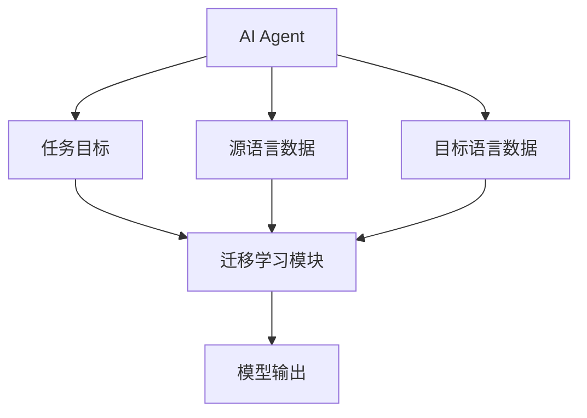
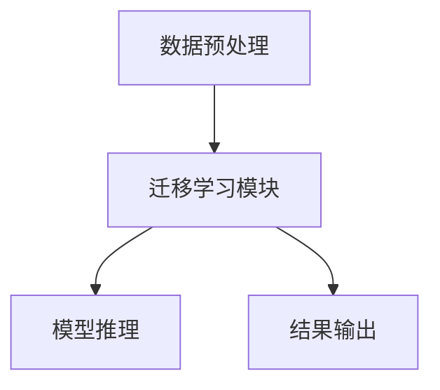

                 


# AI Agent的迁移学习在跨语言任务中的应用

## 关键词：AI Agent, 迁移学习, 跨语言任务, 自然语言处理, 机器学习

## 摘要：  
本文探讨了AI Agent在跨语言任务中的迁移学习应用，详细分析了迁移学习的核心原理、算法实现、系统架构设计及实际项目案例。文章通过具体的技术细节和实践，展示了如何利用迁移学习提升AI Agent在跨语言任务中的性能，为相关研究和应用提供了理论支持和实践指导。

---

# 第一部分: AI Agent与迁移学习概述

## 第1章: AI Agent的基本概念与应用场景

### 1.1 AI Agent的定义与特点  
AI Agent（人工智能代理）是一种能够感知环境、执行任务并做出决策的智能实体。它具备以下特点：  
- **自主性**：能够自主决策，无需外部干预。  
- **反应性**：能够实时感知环境并做出响应。  
- **目标导向性**：以特定目标为导向，优化行为以实现目标。  
- **学习能力**：通过经验或数据不断优化自身的性能。  

### 1.2 迁移学习的定义与原理  
迁移学习是一种机器学习技术，旨在将从源任务中学到的知识应用到目标任务中。其核心在于发现源任务和目标任务之间的共同特征或规律，并利用这些知识提升目标任务的性能。  

### 1.3 AI Agent与迁移学习的结合  
AI Agent在跨语言任务中需要处理多种语言的数据，迁移学习为其提供了有效的知识转移机制。例如，在机器翻译任务中，AI Agent可以通过迁移学习，将一种语言的翻译模型迁移到另一种语言，从而减少数据需求和计算成本。

---

## 第2章: 跨语言任务的背景与挑战

### 2.1 跨语言任务的定义与分类  
跨语言任务是指在多种语言之间进行信息处理的任务，常见的任务包括：  
- **机器翻译**：将一种语言的文本翻译成另一种语言。  
- **跨语言问答系统**：在不同语言之间进行信息检索和问答。  
- **跨语言情感分析**：在不同语言的文本中识别情感倾向。  

### 2.2 跨语言任务中的主要挑战  
- **语言差异**：不同语言的语法、词汇和语义结构差异较大。  
- **数据稀缺性**：某些语言的数据量较少，难以训练高质量的模型。  
- **计算资源限制**：跨语言任务通常需要大量计算资源，尤其是多语言模型的训练和推理。  

### 2.3 迁移学习在跨语言任务中的作用  
迁移学习可以帮助AI Agent在数据稀缺的语言环境中，利用其他语言的丰富数据来提升模型性能。例如，在低资源语言的机器翻译任务中，迁移学习可以有效降低对并行数据的依赖。

---

## 第3章: 迁移学习的核心概念与联系

### 3.1 迁移学习的原理与方法  
迁移学习的核心在于将源任务的知识迁移到目标任务中。常见的迁移学习方法包括：  
- **基于特征的迁移学习**：通过提取特征，将源任务的特征表示迁移到目标任务。  
- **基于参数的迁移学习**：通过调整模型参数，将源任务的参数迁移到目标任务。  
- **基于样本的迁移学习**：通过重用源任务的数据样本，直接应用到目标任务中。  

### 3.2 迁移学习的关键技术与挑战  
- **特征表示**：如何提取有效的特征，使得源任务和目标任务的特征具有可迁移性。  
- **任务适应性**：如何调整模型以适应目标任务的特定需求。  
- **数据分布差异**：如何处理源任务和目标任务之间的数据分布差异。  

### 3.3 AI Agent的实体关系图  
通过Mermaid图表展示AI Agent在跨语言任务中的实体关系：  


---

## 第4章: 迁移学习算法原理

### 4.1 基于特征的迁移学习算法  
- **特征提取**：通过预训练模型（如BERT）提取通用的特征表示。  
- **领域适应**：通过调整特征分布，减少源任务和目标任务之间的领域差异。  

### 4.2 基于参数的迁移学习算法  
- **参数调整**：通过微调预训练模型的参数，使其适应目标任务。  
- **知识蒸馏**：将大模型的知识迁移到小模型中，减少计算成本。  

### 4.3 迁移学习算法的数学模型  
通过数学公式展示迁移学习的核心思想：  
$$L_{\text{total}} = \lambda L_{\text{source}} + (1-\lambda) L_{\text{target}}$$  
其中，$\lambda$ 是源任务和目标任务的损失权重。

---

## 第5章: 系统分析与架构设计

### 5.1 系统功能设计  
- **数据预处理模块**：处理源任务和目标任务的数据。  
- **迁移学习模块**：提取特征并调整模型参数。  
- **模型推理模块**：生成目标语言的输出结果。  

### 5.2 系统架构设计  
通过Mermaid图表展示系统的整体架构：  


---

## 第6章: 项目实战与应用案例

### 6.1 环境安装与配置  
- 安装Python和相关库（如TensorFlow、Keras）。  
- 下载预训练模型（如BERT）。  

### 6.2 核心代码实现  
```python
# 示例代码：基于迁移学习的机器翻译
import tensorflow as tf
from tensorflow import keras

# 加载预训练模型
pretrained_model = keras.models.load_model('bert_model.h5')

# 定义迁移学习模型
def create_model():
    model = pretrained_model
    # 微调最后一层
    for layer in model.layers[:-2]:
        layer.trainable = False
    return model

# 训练模型
model = create_model()
model.compile(optimizer='adam', loss='sparse_categorical_crossentropy', metrics=['accuracy'])
model.fit(x_train, y_train, epochs=5, batch_size=32)
```

### 6.3 实际案例分析  
通过具体案例（如机器翻译任务）展示迁移学习的实际应用效果，分析代码实现和模型性能。

---

## 第7章: 最佳实践与总结

### 7.1 小结与总结  
迁移学习在跨语言任务中具有重要作用，能够有效提升AI Agent的性能和效率。通过合理的算法设计和系统架构，可以在资源受限的情况下实现高质量的跨语言任务处理。

### 7.2 注意事项与建议  
- **数据质量**：确保源任务和目标任务的数据质量，减少数据偏差的影响。  
- **模型选择**：根据任务需求选择合适的迁移学习算法和模型结构。  
- **性能优化**：通过知识蒸馏、模型压缩等技术优化模型性能和计算效率。  

### 7.3 拓展阅读与未来方向  
- 阅读相关论文和书籍，深入了解迁移学习的最新研究进展。  
- 探索AI Agent在更多跨语言任务中的应用，如多语言对话系统、跨语言信息检索等。

---

## 作者：AI天才研究院 & 禅与计算机程序设计艺术

通过本文，读者可以全面了解AI Agent在跨语言任务中的迁移学习应用，掌握其核心原理和实际实现方法。希望本文能为相关领域的研究和实践提供有价值的参考。

