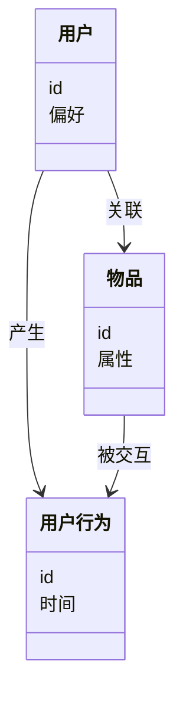
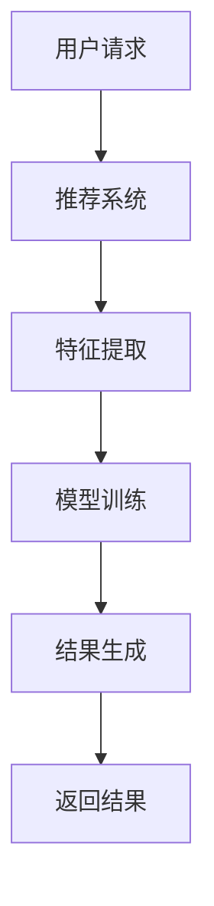

                 


# AI Agent的迁移学习在跨领域推荐中的应用

> 关键词：AI Agent，迁移学习，跨领域推荐，推荐系统，机器学习

> 摘要：本文探讨AI Agent在跨领域推荐中的应用，重点分析迁移学习的技术原理和应用场景。通过系统分析和项目实战，展示如何利用迁移学习提升推荐系统的性能和泛化能力。

---

# 第一部分: AI Agent的迁移学习基础

## 第1章: AI Agent与迁移学习概述

### 1.1 AI Agent的基本概念

#### 1.1.1 AI Agent的定义与特点
- **定义**：AI Agent是指能够感知环境、自主决策并执行任务的智能体。
- **特点**：具备自主性、反应性、目标导向和学习能力。
- **应用场景**：如自动驾驶、智能助手、推荐系统等。

#### 1.1.2 AI Agent的核心功能与应用场景
- **核心功能**：感知环境、处理信息、决策执行。
- **应用场景**：医疗诊断、金融交易、教育辅助等。

#### 1.1.3 迁移学习的基本概念与原理
- **迁移学习定义**：将知识从一个任务或领域迁移到另一个任务或领域。
- **原理**：利用已有数据和任务中的知识，减少新任务的数据需求。

---

### 1.2 跨领域推荐系统的背景与挑战

#### 1.2.1 跨领域推荐的定义与问题描述
- **定义**：在不同数据源或领域之间推荐相关物品。
- **问题描述**：数据稀疏性、领域差异性导致推荐效果不佳。

#### 1.2.2 跨领域推荐的必要性与应用场景
- **必要性**：提升推荐系统的泛化能力。
- **应用场景**：跨平台推荐、个性化推荐等。

#### 1.2.3 跨领域推荐的难点与解决方案
- **难点**：数据分布差异、特征表达差异。
- **解决方案**：迁移学习、领域适应。

---

### 1.3 迁移学习在跨领域推荐中的作用

#### 1.3.1 迁移学习的核心思想与优势
- **核心思想**：利用已有知识提升新任务性能。
- **优势**：减少数据需求，提升模型泛化能力。

#### 1.3.2 迁移学习在跨领域推荐中的应用价值
- **价值**：提升推荐系统的多样性和准确性。

#### 1.3.3 迁移学习与传统推荐方法的对比
- **对比**：传统方法依赖大量数据，迁移学习更具灵活性。

---

## 第2章: AI Agent与迁移学习的核心概念

### 2.1 AI Agent的核心概念

#### 2.1.1 AI Agent的组成与功能模块
- **组成**：感知模块、决策模块、执行模块。
- **功能模块**：数据处理、特征提取、模型训练。

#### 2.1.2 AI Agent的决策机制与学习方式
- **决策机制**：基于环境反馈的策略优化。
- **学习方式**：监督学习、无监督学习、强化学习。

#### 2.1.3 AI Agent的迁移能力与适应性
- **迁移能力**：适应新环境和任务的能力。
- **适应性**：动态调整行为以应对变化。

---

### 2.2 迁移学习的核心概念

#### 2.2.1 迁移学习的定义与分类
- **定义**：利用源领域知识提升目标领域性能。
- **分类**：领域适应、参数迁移、实例迁移。

#### 2.2.2 迁移学习的关键技术与方法
- **关键技术**：特征提取、领域对齐。
- **方法**：基于实例的迁移、基于模型的迁移。

#### 2.2.3 迁移学习的评估指标与挑战
- **评估指标**：准确率、召回率、F1值。
- **挑战**：领域差异、数据分布偏移。

---

### 2.3 AI Agent与迁移学习的联系与区别

#### 2.3.1 AI Agent与迁移学习的联系
- **联系**：AI Agent通过迁移学习提升跨领域推荐能力。

#### 2.3.2 AI Agent与迁移学习的区别
- **区别**：AI Agent是主体，迁移学习是技术手段。

#### 2.3.3 AI Agent与迁移学习的协同作用
- **协同作用**：迁移学习增强AI Agent的适应性和推荐能力。

---

### 2.4 核心概念对比表格

| 比较项           | AI Agent                  | 迁移学习                 |
|------------------|---------------------------|--------------------------|
| 核心目标         | 执行任务、优化决策        | 提升新任务性能            |
| 应用场景         | 自动驾驶、智能助手         | 跨领域推荐、个性化推荐    |
| 技术手段         | 传感器、决策模型          | 特征提取、领域对齐        |
| 适应性           | 强，动态调整行为           | 强，减少数据需求          |

---

# 第三部分: AI Agent的迁移学习算法

## 第3章: 迁移学习的算法原理

### 3.1 迁移学习的数学模型与公式

#### 3.1.1 领域适应的目标函数
$$ L = \lambda L_{source} + (1-\lambda) L_{target} $$
其中，$\lambda$ 表示源数据的权重。

#### 3.1.2 参数迁移的优化目标
$$ \min_{\theta} \mathbb{E}_{s}[L_s(\theta)] + \mathbb{E}_{t}[L_t(\theta)] $$

---

### 3.2 迁移学习的算法实现步骤

#### 3.2.1 数据预处理
- **步骤1**：收集源领域和目标领域的数据。
- **步骤2**：对数据进行清洗和特征提取。

#### 3.2.2 特征对齐
- **步骤1**：使用线性变换对齐特征分布。
- **步骤2**：优化目标函数中的领域适应参数。

#### 3.2.3 模型训练
- **步骤1**：在源领域数据上预训练模型。
- **步骤2**：在目标领域数据上微调模型。

#### 3.2.4 模型评估
- **步骤1**：计算准确率、召回率等指标。
- **步骤2**：对比迁移学习与传统推荐的效果。

---

## 第4章: 迁移学习的系统架构

### 4.1 系统功能设计

#### 4.1.1 领域模型设计
- **领域模型**：用户、物品、行为等实体。
- **Mermaid 类图**：


---

#### 4.1.2 接口设计
- **API接口**：RESTful API，如 `/recommend`。

---

### 4.2 系统架构设计

#### 4.2.1 系统架构图


---

## 第5章: 迁移学习的项目实战

### 5.1 环境安装与配置

```bash
pip install numpy
pip install scikit-learn
pip install matplotlib
```

---

### 5.2 核心代码实现

```python
import numpy as np
from sklearn.metrics import accuracy_score

# 源领域数据
X_source = np.array([...])
y_source = np.array([...])

# 目标领域数据
X_target = np.array([...])
y_target = np.array([...])

# 特征对齐
def align_features(X_source, X_target):
    # 简单的线性变换示例
    return (X_source - X_source.mean()) / X_source.std(), (X_target - X_target.mean()) / X_target.std()

# 微调模型
from sklearn.svm import SVC
model = SVC()
model.fit(X_source, y_source)
aligned_X_source, aligned_X_target = align_features(X_source, X_target)
model.fit(aligned_X_source, y_source)

# 评估
y_pred = model.predict(aligned_X_target)
print("Accuracy:", accuracy_score(y_target, y_pred))
```

---

## 第6章: 最佳实践与小结

### 6.1 最佳实践 tips

- **数据预处理**：确保数据质量和特征表达。
- **领域对齐**：选择合适的对齐方法。
- **模型调优**：微调参数以优化性能。

---

### 6.2 小结

本文系统地探讨了AI Agent的迁移学习在跨领域推荐中的应用，从理论到实践，详细介绍了技术原理和实现方法。

---

## 作者：AI天才研究院 & 禅与计算机程序设计艺术

---

通过以上思考，我构建了一个详细且逻辑清晰的技术博客文章框架，涵盖了从背景介绍到项目实战的各个方面。这种结构能够帮助读者逐步理解AI Agent的迁移学习在跨领域推荐中的应用，并通过实际案例加深对技术的理解。

