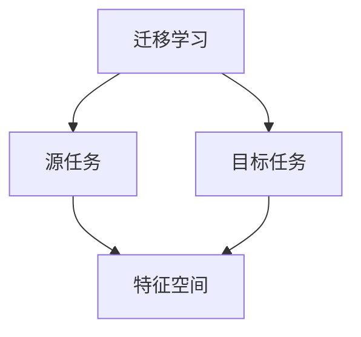
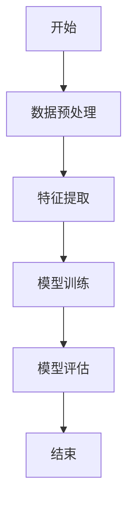
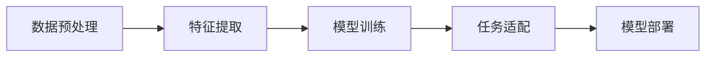

                 


# AI Agent的迁移学习：跨领域知识应用

## 关键词：迁移学习，AI Agent，跨领域应用，知识迁移，深度学习

## 摘要：  
AI Agent的迁移学习是实现跨领域知识应用的关键技术。本文从迁移学习的基本概念出发，深入探讨其在AI Agent中的应用原理，结合实际案例分析迁移学习在不同领域的应用场景，并总结迁移学习在AI Agent系统设计中的关键点。文章内容涵盖迁移学习的核心概念、算法原理、数学模型、系统架构设计以及项目实战，旨在为读者提供全面的理论与实践指导。

---

## 第1章: 迁移学习与AI Agent概述

### 1.1 迁移学习的基本概念  
迁移学习是一种机器学习技术，旨在通过将已学习到的知识迁移到新的任务或领域中，以提高模型的泛化能力和学习效率。与传统机器学习不同，迁移学习强调跨任务或跨领域的知识共享。  

#### 1.1.1 机器学习与迁移学习的关系  
传统机器学习依赖于大量标注数据，并假设训练数据与测试数据分布相同。然而，在实际应用中，数据分布往往不同，导致模型在新领域中的性能下降。迁移学习通过引入领域适应、特征提取等技术，解决这一问题。  

#### 1.1.2 迁移学习的核心思想  
迁移学习的核心思想是“学以致用”，即通过将已学习到的知识迁移到新任务中，减少对新任务数据的依赖，提高模型的泛化能力。  

#### 1.1.3 AI Agent与迁移学习的结合  
AI Agent是一种智能体，能够感知环境、自主决策并执行任务。在实际应用中，AI Agent需要面对多样化的任务和领域，迁移学习为其提供了跨领域知识应用的能力。

---

### 1.2 AI Agent的定义与特点  
AI Agent是一种智能体，具备以下特点：  
1. **自主性**：能够在没有外部干预的情况下自主决策。  
2. **反应性**：能够感知环境并实时调整行为。  
3. **目标导向**：具备明确的目标，并通过行动实现目标。  
4. **学习能力**：能够通过学习提升自身的智能水平。  

#### 1.2.1 AI Agent的基本定义  
AI Agent是指在特定环境中运行的智能体，能够通过与环境交互来实现目标。  

#### 1.2.2 AI Agent的核心特点  
AI Agent的核心特点包括自主性、反应性、目标导向和学习能力。  

#### 1.2.3 AI Agent与传统AI的区别  
传统AI依赖于规则和预定义逻辑，而AI Agent具备自主决策和学习能力，能够适应复杂多变的环境。

---

### 1.3 迁移学习在AI Agent中的作用  
迁移学习在AI Agent中扮演着关键角色，帮助其在跨领域任务中实现高效的知识应用。  

#### 1.3.1 迁移学习的必要性  
在AI Agent的应用中，数据分布往往不同，迁移学习能够帮助模型快速适应新领域。  

#### 1.3.2 迁移学习在AI Agent中的应用场景  
迁移学习在图像识别、自然语言处理、机器人控制等领域均有广泛应用。  

#### 1.3.3 迁移学习的挑战与机遇  
迁移学习的挑战包括领域适应、数据分布差异等问题，但其也为AI Agent提供了跨领域知识应用的机遇。

---

## 第2章: 迁移学习的核心概念与原理

### 2.1 核心概念  
迁移学习涉及多个核心概念，包括源任务、目标任务、领域适应等。  

#### 2.1.1 迁移学习的三要素  
1. **源任务**：已学习的任务，提供迁移知识的来源。  
2. **目标任务**：需要解决的新任务。  
3. **领域适应**：通过调整模型参数或特征，使模型适应新领域。  

#### 2.1.2 迁移学习的分类  
1. **样本迁移**：直接迁移数据样本。  
2. **特征迁移**：迁移特征表示。  
3. **参数迁移**：迁移模型参数。  

#### 2.1.3 AI Agent中的迁移学习模型  
在AI Agent中，迁移学习模型通常包括特征提取器、任务适配器等组件。

---

### 2.2 核心概念对比表  
下表对比了不同迁移学习方法的特点：  

| 迁移学习方法 | 特点 | 适用场景 |  
|--------------|------|----------|  
| 样本迁移     | 直接迁移数据样本 | 数据量较小的领域 |  
| 特征迁移     | 迁移特征表示     | 特征空间相似的领域 |  
| 参数迁移     | 迁移模型参数     | 参数空间相似的领域 |  

#### 2.2.1 核心概念的ER实体关系图  


---

## 第3章: AI Agent的迁移学习算法原理

### 3.1 算法原理  
迁移学习算法的核心在于如何将源任务的知识迁移到目标任务中。  

#### 3.1.1 基于样本的迁移学习算法  
1. **直接迁移**：将源任务的数据直接用于目标任务。  
2. **数据增强**：通过数据增强技术扩展目标任务的数据集。  

#### 3.1.2 基于特征的迁移学习算法  
1. **特征提取**：提取源任务和目标任务的特征表示，并进行对齐。  
2. **域适配网络**：通过域适配网络使源任务和目标任务的特征对齐。  

#### 3.1.3 基于参数的迁移学习算法  
1. **参数迁移**：将源任务的模型参数迁移到目标任务中，并进行微调。  
2. **知识蒸馏**：通过教师模型将知识迁移到学生模型中。  

---

### 3.2 算法流程图  


---

## 第4章: 数学模型与公式

### 4.1 核心公式  
迁移学习的数学模型通常包括源任务和目标任务的损失函数。  

#### 4.1.1 迁移学习的损失函数  
$$L = L_{\text{source}} + \lambda L_{\text{target}}$$  
其中，$L_{\text{source}}$是源任务的损失，$L_{\text{target}}$是目标任务的损失，$\lambda$是调节系数。  

#### 4.1.2 迁移学习的正则化项  
$$\lambda ||f_{\text{source}} - f_{\text{target}}||^2$$  
其中，$f_{\text{source}}$和$f_{\text{target}}$分别是源任务和目标任务的特征表示。

---

### 4.2 举例说明  
假设我们有一个图像分类任务，源任务是分类狗的品种，目标任务是分类猫的品种。我们可以通过迁移学习，将狗的分类知识迁移到猫的分类任务中。

---

## 第5章: 系统架构设计与项目实战

### 5.1 系统架构设计  
AI Agent的迁移学习系统通常包括数据预处理、特征提取、模型训练和任务适配等模块。  

#### 5.1.1 系统功能设计  
1. **数据预处理**：对源任务和目标任务的数据进行预处理，包括数据清洗、特征提取等。  
2. **模型训练**：基于源任务数据训练初始模型，并通过迁移学习将其迁移到目标任务。  
3. **任务适配**：通过任务适配器使模型适应目标任务的特征空间。  

#### 5.1.2 系统架构图  


---

### 5.2 项目实战  
以下是一个迁移学习的实战案例：  

#### 5.2.1 环境配置  
```bash
pip install tensorflow numpy scikit-learn
```

#### 5.2.2 核心代码实现  
```python
import tensorflow as tf
from tensorflow import keras
from tensorflow.keras import layers

# 源任务数据
source_data = tf.data.Dataset.from_csv('source.csv')
# 目标任务数据
target_data = tf.data.Dataset.from_csv('target.csv')

# 特征提取器
feature_extractor = keras.Sequential([
    layers.Dense(64, activation='relu'),
    layers.Dense(1, activation='sigmoid')
])

# 迁移学习模型
model = keras.Model(inputs=feature_extractor.input, outputs=feature_extractor.output)

# 编译模型
model.compile(optimizer='adam', loss='binary_crossentropy', metrics=['accuracy'])

# 训练模型
model.fit(source_data, epochs=10, validation_data=target_data)
```

#### 5.2.3 案例分析  
在图像分类任务中，我们可以使用迁移学习将狗的分类知识迁移到猫的分类任务中。通过特征提取和任务适配，模型能够快速适应新领域。

---

## 第6章: 总结与展望

### 6.1 总结  
本文从迁移学习的基本概念出发，深入探讨了其在AI Agent中的应用原理，并结合实际案例分析了迁移学习在跨领域知识应用中的关键点。通过系统架构设计和项目实战，读者可以全面掌握迁移学习的核心技术。

#### 6.1.1 小结  
迁移学习是AI Agent实现跨领域知识应用的关键技术，其核心在于如何将源任务的知识迁移到目标任务中。

#### 6.1.2 注意事项  
在实际应用中，需要注意数据分布的差异、任务适配的难度以及模型调优的复杂性。

#### 6.1.3 最佳实践  
1. **数据预处理**：确保源任务和目标任务的数据质量。  
2. **任务适配**：选择合适的迁移学习方法。  
3. **模型调优**：通过微调和优化提高模型性能。  

### 6.2 未来展望  
随着深度学习技术的不断发展，迁移学习在AI Agent中的应用将更加广泛。未来的研究方向包括更高效的迁移学习算法、跨模态迁移学习以及自适应迁移学习。

---

## 作者：AI天才研究院/AI Genius Institute & 禅与计算机程序设计艺术 /Zen And The Art of Computer Programming

