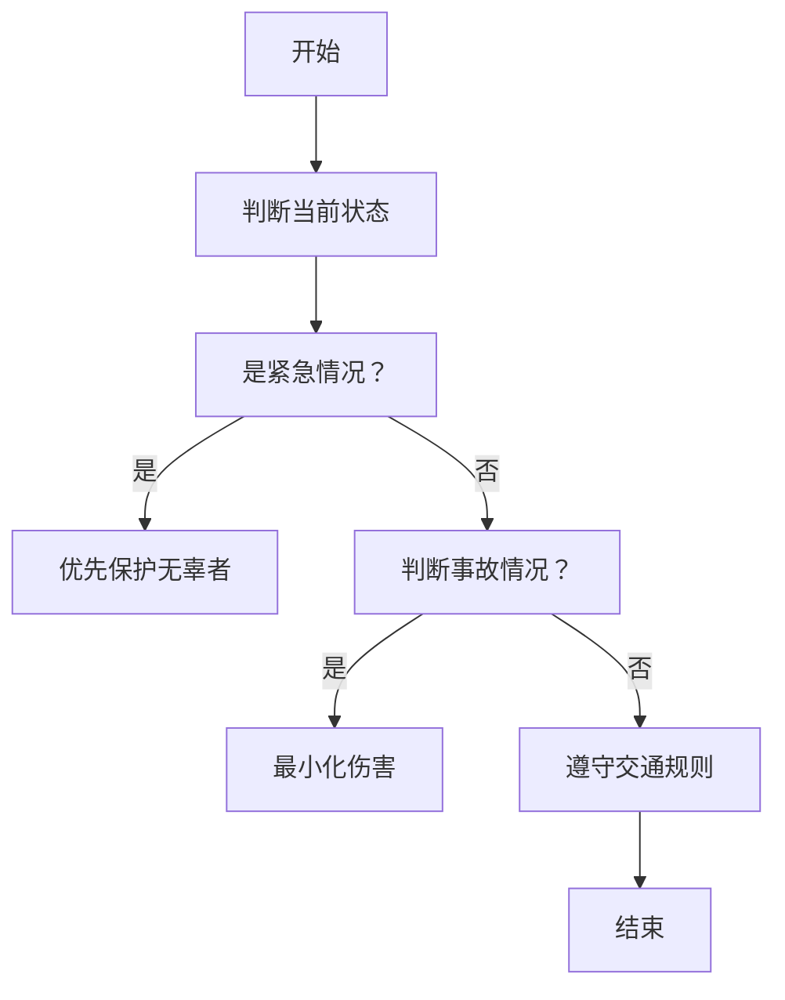
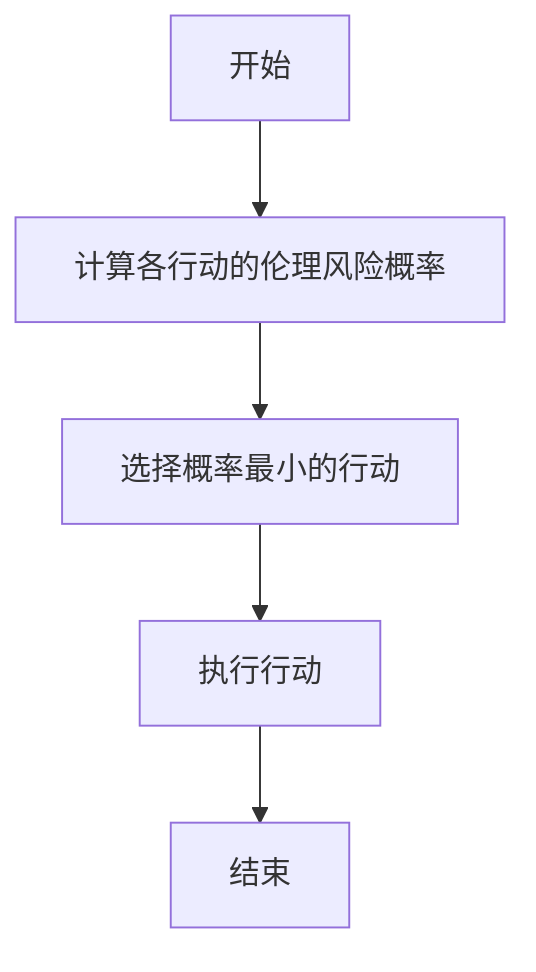
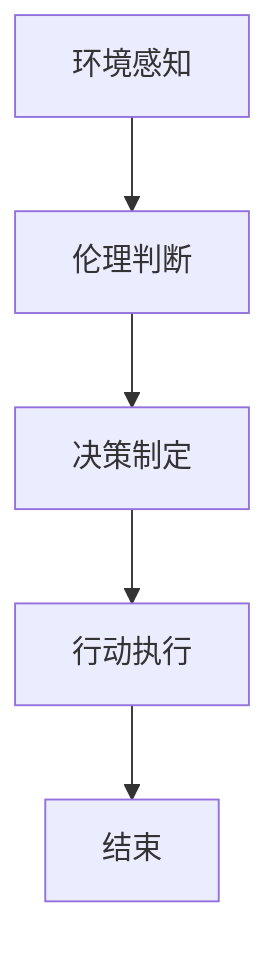
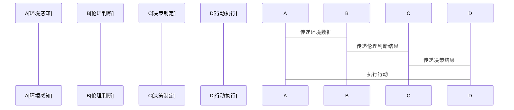

                 


# AI Agent的道德决策框架：伦理AI实践

**关键词**：AI Agent、道德决策框架、伦理AI、算法原理、系统架构、项目实战

**摘要**：本文系统性地探讨了AI Agent的道德决策框架，从核心概念、算法原理到系统架构、项目实战，全面解析了伦理AI的实践路径。通过详细分析AI Agent在道德决策中的角色与挑战，结合实际案例和代码实现，为构建更透明、可解释的AI系统提供了理论与实践指导。

---

## 第一部分：AI Agent的道德决策框架概述

### 第1章：AI Agent与道德决策框架的背景介绍

#### 1.1 AI Agent的基本概念

##### 1.1.1 AI Agent的定义与分类
AI Agent（人工智能代理）是指能够感知环境并采取行动以实现目标的智能体。AI Agent可以分为**反应式代理**、**基于模型的代理**、**目标驱动的代理**和**效用驱动的代理**。

| **分类**         | **定义**                                                                 |
|-------------------|--------------------------------------------------------------------------|
| 反应式代理       | 基于当前感知做出实时反应，不依赖内部状态模型。                          |
| 基于模型的代理   | 使用内部状态模型来预测环境变化，制定长期计划。                          |
| 目标驱动的代理   | 根据预设目标选择行动，优化决策以最大化目标实现。                        |
| 效用驱动的代理   | 根据效用函数评估不同行动的收益，选择最优行动。                          |

##### 1.1.2 AI Agent的核心属性与特征
AI Agent的核心属性包括**自主性**（Autonomy）、**反应性**（Reactivity）、**目标导向性**（Goal-Oriented）和**学习能力**（Learnability）。其特征主要体现在**环境感知**、**决策优化**和**行为执行**三个层面。

##### 1.1.3 AI Agent与人类决策的异同点
AI Agent与人类决策的异同点如下：

| **维度**         | **AI Agent**                          | **人类**                              |
|-------------------|--------------------------------------|---------------------------------------|
| 决策速度         | 快速且高效                            | 较慢，受情绪和认知限制                 |
| 决策依据         | 数据驱动，基于规则或模型              | 综合考虑情感、经验、社会规范等         |
| 可解释性         | 通常可解释，基于规则或概率模型        | 常不可解释，受主观因素影响             |
| 可控性           | 决策过程可被编程或监控                | 决策过程难以完全掌控                 |

#### 1.2 道德决策框架的背景与重要性

##### 1.2.1 道德决策的定义与内涵
道德决策是指在遵循伦理规范的前提下，选择最优行动的过程。在AI Agent中，道德决策框架是确保其行为符合伦理标准的核心机制。

##### 1.2.2 AI Agent在道德决策中的角色
AI Agent在道德决策中的角色主要体现在**决策辅助**、**自动执行**和**伦理验证**三个方面。例如，在自动驾驶中，AI Agent需要在紧急情况下做出符合伦理的决策。

##### 1.2.3 道德决策框架的必要性与挑战
AI Agent的道德决策框架是实现**可信AI**的核心，其必要性体现在**减少伦理风险**、**提升用户信任**和**符合法律法规**三个方面。然而，其面临的主要挑战包括**伦理模糊性**、**跨文化差异**和**技术实现复杂性**。

#### 1.3 伦理AI的实践与应用

##### 1.3.1 伦理AI的定义与目标
伦理AI是指在设计和应用AI系统时，遵循伦理规范，确保其行为符合人类价值观。其目标是实现**公平性**、**透明性**和**可解释性**。

##### 1.3.2 AI Agent在伦理决策中的应用场景
AI Agent在伦理决策中的应用场景包括**医疗辅助诊断**、**自动驾驶决策**和**智能客服系统**等。

##### 1.3.3 伦理AI的现状与发展趋势
当前，伦理AI的研究主要集中在**可解释性AI**（XAI）、**伦理框架标准化**和**跨学科协作**三个方面。未来，伦理AI将更加注重**动态伦理适应**和**人机协作优化**。

---

### 第2章：AI Agent的道德决策框架的核心概念

#### 2.1 道德决策框架的原理与机制

##### 2.1.1 道德决策的基本原理
道德决策的基本原理是基于**伦理原则**（如公正、不伤害）和**情境分析**，选择最优行动。

##### 2.1.2 AI Agent的决策过程与道德判断的关系
AI Agent的决策过程可以分为**感知环境**、**分析情境**、**制定决策**和**执行行动**四个阶段。道德判断贯穿整个过程，确保决策符合伦理规范。

##### 2.1.3 道德框架在AI Agent决策中的作用
道德框架通过提供**伦理约束**、**价值导向**和**情境适应**，确保AI Agent的决策符合人类伦理标准。

#### 2.2 道德决策框架的核心要素

##### 2.2.1 道德原则与价值观的定义
道德原则是AI Agent决策的基石，包括**尊重**、**公正**、**责任**和** beneficence**（行善）。

##### 2.2.2 道德规则与约束条件
道德规则是AI Agent必须遵循的规则，例如**自动驾驶中的优先保护行人**。

##### 2.2.3 道德情境的识别与分析
道德情境是指需要伦理判断的具体场景。例如，在自动驾驶中，AI Agent需要判断是否优先保护车内乘客还是路边行人。

#### 2.3 道德决策框架的属性对比

##### 2.3.1 不同道德框架的对比分析
以下是几种常见道德框架的对比：

| **框架**         | **核心理念**                          | **适用场景**                          |
|-------------------|--------------------------------------|---------------------------------------|
| 基于规则的框架   | 遵循预设的伦理规则                    | 适用于规则明确的场景                  |
| 基于后果的框架   | 最大化整体收益                        | 适用于复杂动态场景                    |
| 基于义务的框架   | 履行道德义务                          | 适用于责任明确的场景                  |

##### 2.3.2 道德决策框架的优缺点
以下是道德决策框架的优缺点对比：

| **框架**         | **优点**                              | **缺点**                              |
|-------------------|--------------------------------------|---------------------------------------|
| 基于规则的框架   | 实现简单，易于解释                    | 无法应对复杂或模糊的伦理问题          |
| 基于后果的框架   | 灵活性高，适应性强                    | 计算复杂，难以实时决策                |
| 基于义务的框架   | 强调责任，逻辑清晰                    | 难以量化，实现难度大                  |

##### 2.3.3 道德决策框架的适用场景
不同道德框架适用于不同的场景：

- **基于规则的框架**适用于规则明确的场景，如自动驾驶中的交通规则。
- **基于后果的框架**适用于复杂动态的场景，如医疗诊断中的权衡决策。
- **基于义务的框架**适用于责任明确的场景，如法律合规。

---

### 第3章：AI Agent道德决策框架的算法原理

#### 3.1 道德决策算法的概述

##### 3.1.1 道德决策算法的基本概念
道德决策算法是用于实现AI Agent道德决策的数学模型或逻辑规则。

##### 3.1.2 道德决策算法的分类
道德决策算法主要分为**基于规则的算法**和**基于概率的算法**。

##### 3.1.3 道德决策算法的优缺点
基于规则的算法实现简单，但缺乏灵活性；基于概率的算法灵活性高，但计算复杂。

#### 3.2 基于规则的道德决策算法

##### 3.2.1 基于规则的决策机制
基于规则的决策机制通过预设的伦理规则，直接映射到具体行动。

例如，以下是一个简单的基于规则的道德决策算法：

```python
def decide_action(state):
    if state == "emergency":
        return "protect_innocent"
    elif state == "accident":
        return "minimize_harm"
    else:
        return "follow_rules"
```

##### 3.2.2 规则的定义与实现
规则的定义需要明确条件和行动。例如：

| **条件**         | **行动**                              |
|-------------------|--------------------------------------|
| 紧急情况         | 优先保护无辜者                        |
| 事故情况         | 最小化伤害                            |
| 正常情况         | 遵守交通规则                          |

##### 3.2.3 基于规则的算法流程图
以下是一个基于规则的道德决策算法的流程图：



---

#### 3.3 基于概率的道德决策算法

##### 3.3.1 概率推理的基本原理
基于概率的道德决策算法通过计算不同行动的伦理风险概率，选择最优行动。

##### 3.3.2 贝叶斯网络在道德决策中的应用
贝叶斯网络可以用于表示不同行动的伦理风险和收益之间的关系。

##### 3.3.3 基于概率的算法流程图
以下是一个基于概率的道德决策算法的流程图：



---

## 第四部分：AI Agent道德决策框架的数学模型与公式

### 第4章：道德决策框架的数学模型与公式

#### 4.1 道德决策的基本数学模型

##### 4.1.1 道德决策的数学表达式
道德决策的数学表达式可以表示为：

$$
\text{决策} = \argmin_{a} \text{伦理风险}(a)
$$

其中，\(a\) 表示行动，\(\text{伦理风险}(a)\) 表示行动 \(a\) 的伦理风险值。

##### 4.1.2 道德权重的计算公式
道德权重的计算公式可以表示为：

$$
\text{权重}_i = \frac{\text{伦理重要性}(i)}{\sum_{j=1}^{n} \text{伦理重要性}(j)}
$$

其中，\(i\) 表示第 \(i\) 个伦理原则，\(n\) 表示伦理原则的总数。

##### 4.1.3 道德风险的评估模型
道德风险的评估模型可以表示为：

$$
\text{总风险} = \sum_{i=1}^{n} \text{权重}_i \times \text{风险}_i
$$

其中，\(\text{风险}_i\) 表示第 \(i\) 个伦理原则的风险值。

---

### 第5章：AI Agent道德决策框架的系统架构与实现

#### 5.1 系统分析与架构设计

##### 5.1.1 问题场景介绍
在自动驾驶中，AI Agent需要在紧急情况下做出道德决策，例如在撞车时选择优先保护车内乘客还是路边行人。

##### 5.1.2 系统功能设计
系统功能包括：

1. **环境感知**：通过传感器感知环境。
2. **伦理判断**：基于道德框架判断当前场景。
3. **决策制定**：根据伦理判断制定行动。
4. **行动执行**：执行决策。

##### 5.1.3 系统架构图
以下是系统架构图：



##### 5.1.4 接口设计
系统接口包括：

- **输入接口**：传感器数据
- **输出接口**：执行指令
- **通信接口**：与外部系统交互

##### 5.1.5 交互设计
系统交互流程如下：



---

### 第6章：AI Agent道德决策框架的项目实战

#### 6.1 项目环境与安装

##### 6.1.1 环境要求
- Python 3.8+
- Python库：numpy、pandas、scikit-learn

##### 6.1.2 安装依赖
```bash
pip install numpy pandas scikit-learn
```

#### 6.2 核心代码实现

##### 6.2.1 基于规则的道德决策实现

```python
def ethical_decision(state):
    if state == "emergency":
        return "protect_innocent"
    elif state == "accident":
        return "minimize_harm"
    else:
        return "follow_rules"
```

##### 6.2.2 基于概率的道德决策实现

```python
from sklearn.naive_bayes import GaussianNB
import numpy as np

# 训练数据
X = np.array([[1, 0], [0, 1], [1, 1]])
y = np.array(["protect", "harm", "protect"])

# 创建模型
model = GaussianNB()
model.fit(X, y)

# 预测
def predict_ethical_decision(features):
    return model.predict([features])
```

---

## 第五部分：AI Agent道德决策框架的优化与展望

### 第7章：AI Agent道德决策框架的优化策略

#### 7.1 道德决策框架的动态适应性优化
动态适应性优化是指根据环境变化实时调整道德框架。

##### 7.1.1 动态伦理适应的实现方法
动态伦理适应可以通过**在线学习**和**反馈机制**实现。

##### 7.1.2 动态伦理适应的数学模型
动态伦理适应的数学模型可以表示为：

$$
\text{更新权重} = \alpha \times \text{旧权重} + (1-\alpha) \times \text{新权重}
$$

其中，\(\alpha\) 是学习率。

---

### 第8章：AI Agent道德决策框架的未来展望

#### 8.1 伦理AI的未来发展
伦理AI的未来发展将更加注重**动态伦理适应**和**人机协作优化**。

#### 8.2 道德决策框架的技术趋势
技术趋势包括**可解释性AI**（XAI）、**跨学科协作**和**伦理标准化**。

---

## 第六部分：总结与参考文献

### 第9章：总结与参考文献

#### 9.1 总结
本文系统性地探讨了AI Agent的道德决策框架，从核心概念、算法原理到系统架构、项目实战，全面解析了伦理AI的实践路径。

#### 9.2 参考文献
1. Russell, S., & Norvig, P. (2010). Artificial Intelligence: A Modern Approach.
2. Bostrom, N. (2014). Ethic

