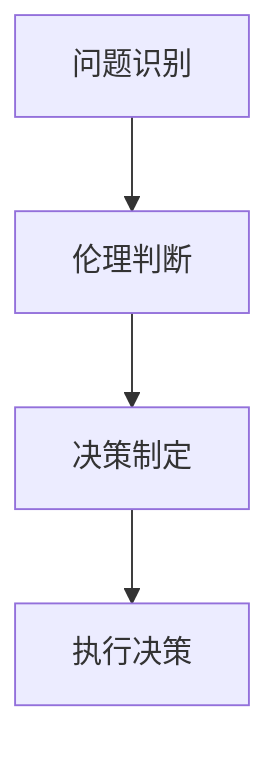

                 


# AI Agent的道德决策框架：在人工智能中植入伦理考量

---

## 关键词：
AI Agent, 道德决策, 伦理框架, 强化学习, 伦理规则, 系统架构, 案例分析

---

## 摘要：
随着人工智能技术的快速发展，AI Agent（智能体）在各个领域的应用越来越广泛。然而，AI Agent的决策过程往往缺乏明确的伦理考量，这可能导致一系列伦理问题。本文旨在构建一个AI Agent的道德决策框架，通过伦理学、博弈论和强化学习等多学科的结合，探讨如何在AI系统中植入伦理考量。文章从道德决策的理论基础出发，详细分析了道德决策框架的设计与实现，提出了基于伦理规则的决策算法，并通过实际案例展示了如何在系统架构中实现伦理决策。最后，本文总结了AI Agent道德决策框架的意义，并提出了未来的研究方向。

---

## 第一部分: AI Agent的道德决策框架概述

---

## 第1章: AI Agent与道德决策概述

### 1.1 AI Agent的基本概念

#### 1.1.1 AI Agent的定义与分类
AI Agent（人工智能智能体）是指能够感知环境、自主决策并执行任务的智能系统。根据功能和应用场景的不同，AI Agent可以分为以下几类：
- **简单反射型Agent**：基于当前输入做出简单反应，如PID控制器。
- **基于模型的反射型Agent**：利用内部模型进行状态预测和决策，如自动驾驶中的路径规划系统。
- **目标驱动型Agent**：基于预设目标进行决策，如智能音箱的语音交互系统。
- **效用驱动型Agent**：通过最大化效用函数进行决策，如推荐系统。

#### 1.1.2 AI Agent的核心特征
- **自主性**：能够在没有外部干预的情况下自主决策。
- **反应性**：能够实时感知环境并做出反应。
- **目标导向性**：基于目标进行决策和行动。
- **学习能力**：能够通过经验改进自身的决策能力。

#### 1.1.3 AI Agent的应用场景
AI Agent广泛应用于自动驾驶、智能助手、机器人、推荐系统等领域。例如，自动驾驶汽车需要在复杂的交通环境中做出实时决策，涉及安全性和伦理问题。

---

### 1.2 道德决策的定义与重要性

#### 1.2.1 道德决策的基本概念
道德决策是指在遵循伦理规范和价值观的基础上，做出最优决策的过程。在AI Agent中，道德决策尤为重要，因为AI系统可能面临涉及人类生命和利益的关键决策。

#### 1.2.2 道德决策在AI Agent中的作用
- **避免伦理风险**：确保AI系统的决策符合人类伦理规范。
- **提升社会接受度**：通过伦理决策，增强人类对AI技术的信任。
- **处理复杂场景**：在复杂的现实场景中，道德决策能够帮助AI系统做出合理的权衡。

#### 1.2.3 道德决策的挑战与复杂性
- **多目标冲突**：在某些情况下，不同的伦理目标可能冲突，需要进行权衡。
- **不确定性**：现实世界中的信息往往不完全，决策需要在不确定条件下进行。
- **文化差异**：不同文化背景下，伦理规范可能不同，如何在AI系统中统一处理是一个挑战。

---

### 1.3 AI Agent道德决策框架的背景与意义

#### 1.3.1 AI技术发展的现状与趋势
随着深度学习和强化学习技术的快速发展，AI Agent的能力不断提升，应用场景也逐渐扩展。然而，技术的进步也带来了新的伦理问题。

#### 1.3.2 道德决策在AI中的必要性
AI Agent的决策可能影响人类的生命和财产，因此必须在设计中植入伦理考量，确保决策的合理性和合规性。

#### 1.3.3 框架设计的目标与价值
本文的目标是设计一个通用的道德决策框架，能够在不同场景下指导AI Agent的决策过程，同时具备灵活性和可扩展性。

---

## 第2章: 道德决策的理论基础

### 2.1 伦理学基础

#### 2.1.1 伦理学的基本概念
伦理学是研究道德原则和规范的学科，主要包括元伦理学、规范伦理学和应用伦理学。

#### 2.1.2 主要伦理学流派与理论
- **义务论**：强调行为的义务性，代表人物是康德。
- **功利主义**：以最大幸福原则为核心，代表人物是密尔。
- **美德伦理学**：强调个人的品德和美德，代表人物是亚里士多德。

#### 2.1.3 伦理学在AI中的应用
AI Agent需要在决策过程中遵循一定的伦理原则，如功利主义中的“最大化整体幸福”可以用于自动驾驶中的紧急情况决策。

---

### 2.2 道德决策的逻辑与模型

#### 2.2.1 道德决策的逻辑结构
道德决策通常包括以下几个步骤：
1. **问题识别**：识别需要解决的伦理问题。
2. **信息收集**：收集与问题相关的所有信息。
3. **伦理判断**：基于伦理原则进行判断。
4. **决策制定**：综合判断结果，制定最终决策。

#### 2.2.2 道德决策模型的分类
- **基于规则的模型**：根据预设的伦理规则进行决策。
- **基于案例的模型**：通过类比已有的案例进行决策。
- **基于效用的模型**：以效用最大化为目标进行决策。

#### 2.2.3 道德决策模型的优缺点
- **基于规则的模型**：简单易行，但可能无法处理复杂场景。
- **基于案例的模型**：灵活性高，但需要大量的案例库。
- **基于效用的模型**：能够处理复杂场景，但计算复杂度高。

---

### 2.3 博弈论与道德决策

#### 2.3.1 博弈论的基本概念
博弈论是研究理性主体之间策略互动的数学理论，常用于分析竞争与合作的关系。

#### 2.3.2 博弈论在道德决策中的应用
在自动驾驶中，博弈论可以用于分析车辆与行人之间的互动，确保决策的最优性。

#### 2.3.3 博弈论与道德决策的结合
通过将博弈论的分析框架与伦理学的规范相结合，可以更好地解决复杂场景下的道德决策问题。

---

## 第3章: 道德决策框架的核心要素

### 3.1 道德决策框架的结构

#### 3.1.1 框架的组成要素
- **伦理规则库**：包含各种伦理规范和原则。
- **决策逻辑引擎**：负责根据输入信息和伦理规则进行推理。
- **权衡机制**：在冲突的伦理目标中进行权衡，确定最优决策。

#### 3.1.2 各要素之间的关系
伦理规则库为决策逻辑引擎提供约束条件，权衡机制则在多个可能的决策中选择最优解。

---

### 3.2 道德决策规则的制定

#### 3.2.1 道德规则的分类
- **刚性规则**：明确且不可变通的规则，如“禁止伤害人类”。
- **柔性规则**：可以根据具体情况调整的规则，如“尽量减少财产损失”。

#### 3.2.2 道德规则的表达方式
- **逻辑表达式**：通过逻辑条件表达规则，如“如果条件A成立，则执行动作B”。
- **自然语言描述**：用自然语言描述规则，如“在紧急情况下优先保护人类生命”。

---

### 3.3 道德决策的优先级与权衡

#### 3.3.1 决策优先级的确定
在多目标冲突的情况下，需要根据伦理规范确定决策的优先级。

#### 3.3.2 决策权衡的策略
- **最大最小策略**：在最坏情况下选择最优解。
- **效用最大化策略**：选择能够带来最大效用的决策。

#### 3.3.3 权衡中的伦理考量
在权衡过程中，需要综合考虑不同伦理目标的权重，确保决策的合理性和道德性。

---

## 第4章: 道德决策框架的算法实现

### 4.1 基于伦理规则的决策树算法

#### 4.1.1 决策树的基本概念
决策树是一种树状结构，用于表示可能的决策路径和结果。

#### 4.1.2 道德决策树的设计
以下是一个简单的道德决策树示例：



#### 4.1.3 决策树的实现步骤
1. **问题识别**：识别需要解决的伦理问题。
2. **伦理判断**：根据伦理规则进行判断。
3. **决策制定**：综合判断结果，制定最终决策。
4. **执行决策**：将决策付诸实施。

---

### 4.2 基于强化学习的道德决策算法

#### 4.2.1 强化学习的基本原理
强化学习是一种通过试错机制，学习最优策略的方法。

#### 4.2.2 基于伦理学的强化学习
在强化学习中，奖励函数需要包含伦理考量，确保决策的道德性。

#### 4.2.3 算法实现
以下是一个简单的强化学习算法示例：

```python
class AI-Agent:
    def __init__(self):
        self.state = initial_state
        self.possible_actions = ['action1', 'action2', 'action3']
        self伦理规则 = {
            'action1': '优先保护人类生命',
            'action2': '减少财产损失',
            'action3': '避免伤害'
        }

    def decide(self):
        for action in self.possible_actions:
            if self.伦理规则[action] == '优先保护人类生命':
                return action
        return self.possible_actions[0]
```

---

## 第5章: 道德决策框架的系统架构

### 5.1 系统功能模块划分

#### 5.1.1 输入处理模块
负责接收外部输入并进行预处理。

#### 5.1.2 决策计算模块
根据输入信息和伦理规则进行推理，生成决策。

#### 5.1.3 输出控制模块
将决策结果输出到执行模块或用户界面。

---

### 5.2 系统架构的ER图设计

#### 5.2.1 实体与关系的定义
- **实体**：用户、系统、决策规则。
- **关系**：用户与系统通过输入输出交互，系统与决策规则库进行数据交互。

#### 5.2.2 ER图的详细设计
```mermaid
erd
    user --| 多 | decision_rule: 用户定义的伦理规则
    system --| 多 | decision_rule: 系统内置的伦理规则
    user --> system: 输入请求
    system --> user: 返回决策结果
```

---

## 第6章: 道德决策框架的项目实战

### 6.1 环境安装

#### 6.1.1 安装Python和必要的库
```bash
pip install numpy
pip install matplotlib
pip install scikit-learn
```

#### 6.1.2 安装决策树和强化学习库
```bash
pip install scikit-learn
pip install keras
pip install tensorflow
```

---

### 6.2 系统核心实现

#### 6.2.1 决策树实现
```python
from sklearn.tree import DecisionTreeClassifier
import pandas as pd

# 数据准备
data = pd.DataFrame({
    '特征1': [1, 0, 1, 0],
    '特征2': [0, 1, 1, 1],
    '决策': ['A', 'B', 'C', 'D']
})

# 模型训练
model = DecisionTreeClassifier()
model.fit(data[['特征1', '特征2']], data['决策'])

# 预测
print(model.predict([[1, 1]]))
```

#### 6.2.2 强化学习实现
```python
import numpy as np
import gym

# 环境定义
env = gym.make('CustomEnv-v0')

# 策略定义
policy = np.array([0.5, 0.5])

# 训练过程
for _ in range(1000):
    state = env.reset()
    done = False
    while not done:
        action = np.random.choice([0, 1], p=policy)
        next_state, reward, done, _ = env.step(action)
        # 更新策略
        policy[action] += reward
        policy = policy / np.sum(policy)
```

---

## 第7章: 总结与展望

### 7.1 本章总结
本文详细介绍了AI Agent的道德决策框架，从理论基础到算法实现，再到系统架构，全面探讨了如何在AI系统中植入伦理考量。

### 7.2 注意事项
- **伦理规则的可扩展性**：需要根据实际场景调整伦理规则。
- **算法的可解释性**：确保决策过程透明，便于人类理解和监督。
- **数据的隐私保护**：在处理用户数据时，必须遵守相关隐私法规。

### 7.3 拓展阅读
- **推荐书籍**：《伦理学入门》、《强化学习实战》。
- **推荐阅读论文**：探讨AI伦理的最新研究成果。

---

## 作者：AI天才研究院/AI Genius Institute & 禅与计算机程序设计艺术 /Zen And The Art of Computer Programming

---

这篇文章系统地介绍了AI Agent的道德决策框架，从理论到实践，为读者提供了全面的知识和见解。希望对您在AI伦理和决策系统设计方面有所帮助！

