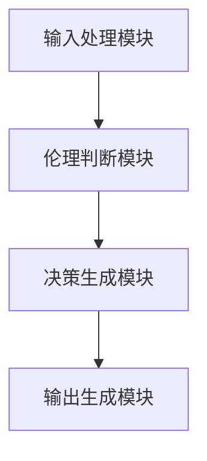

                 


# AI Agent的道德决策：在LLM中植入伦理框架

## 关键词
AI Agent，道德决策，LLM，伦理框架，人工智能，决策算法，系统架构，项目实战

## 摘要
本文探讨了在AI Agent中实现道德决策的重要性，特别是在大型语言模型（LLM）中植入伦理框架的技术挑战与解决方案。文章从背景与概念入手，详细分析了伦理框架的设计原则、算法实现、系统架构，并通过项目实战展示了如何在实际场景中应用这些伦理框架。最后，文章总结了当前技术的局限性，并展望了未来的发展方向。

---

# 第一部分：AI Agent的道德决策基础

## 第1章：AI Agent与道德决策概述

### 1.1 AI Agent的基本概念
#### 1.1.1 什么是AI Agent
AI Agent（人工智能代理）是指能够感知环境、自主决策并执行任务的智能实体。它可以是一个软件程序、机器人或任何能够执行复杂决策的系统。

#### 1.1.2 AI Agent的类型
1. **简单反射型AI Agent**：基于预定义的规则做出反应，适用于简单场景。
2. **基于模型的AI Agent**：利用环境模型进行决策，适用于复杂场景。
3. **学习型AI Agent**：通过机器学习技术不断优化决策策略。
4. **人机协作型AI Agent**：与人类协同工作，结合人类反馈进行决策。

#### 1.1.3 AI Agent的应用场景
- **智能家居**：根据用户行为调整家电使用。
- **自动驾驶**：在复杂交通环境中做出安全决策。
- **医疗辅助**：协助医生进行诊断和治疗方案选择。

### 1.2 道德决策的重要性
#### 1.2.1 为什么AI需要道德决策
AI Agent在处理涉及人类或社会的决策时，必须考虑伦理因素，以避免潜在的负面影响。

#### 1.2.2 道德决策的定义与特征
- **定义**：道德决策是指在决策过程中遵循伦理规范和价值观。
- **特征**：可解释性、一致性、动态性。

#### 1.2.3 道德决策在AI Agent中的作用
- **提升信任度**：用户更愿意与遵循道德规范的AI交互。
- **减少负面后果**：避免因决策失误导致的损失。
- **符合法律法规**：确保AI行为符合社会规范。

---

## 第2章：LLM与道德决策的关系

### 2.1 大型语言模型（LLM）概述
#### 2.1.1 LLM的基本原理
大型语言模型通过深度学习技术，从海量数据中学习语言模式，并生成自然语言文本。

#### 2.1.2 LLM的优势与挑战
- **优势**：强大的语言理解和生成能力。
- **挑战**：缺乏对决策后果的深度理解，可能产生不符合伦理的输出。

#### 2.1.3 LLM在道德决策中的潜力
通过训练数据中的伦理信息，LLM可以辅助AI Agent做出符合伦理的决策。

### 2.2 LLM与道德决策的结合
#### 2.2.1 LLM如何支持道德决策
通过生成符合伦理的决策建议，LLM为AI Agent提供了道德决策的基础。

#### 2.2.2 LLM在道德决策中的应用案例
- **医疗领域**：生成符合伦理的诊断建议。
- **法律领域**：提供符合法律规范的法律意见。

#### 2.2.3 LLM道德决策的局限性
- **数据偏差**：训练数据中的伦理偏见可能影响决策。
- **缺乏动态调整**：固定的训练数据难以应对复杂的伦理场景。

---

## 第3章：伦理框架的核心概念

### 3.1 伦理框架的定义与分类
#### 3.1.1 伦理框架的定义
伦理框架是一种用于指导决策的规则和原则的集合，用于确保决策符合伦理规范。

#### 3.1.2 主要的伦理框架类型
1. **功利主义框架**：以最大化整体利益为目标。
2. **义务论框架**：基于个人的义务和责任做出决策。
3. **美德伦理框架**：基于个体的美德和价值观做出决策。

#### 3.1.3 伦理框架的选择标准
- **适用性**：是否适用于特定场景。
- **可操作性**：是否易于实现。
- **可解释性**：是否易于理解和解释。

### 3.2 伦理框架与AI Agent的结合
#### 3.2.1 伦理框架在AI决策中的作用
通过提供明确的决策规则，伦理框架为AI Agent提供了道德决策的基础。

#### 3.2.2 伦理框架的动态调整
根据环境和用户反馈，动态调整伦理框架的规则和优先级。

#### 3.2.3 伦理框架的可解释性
确保用户能够理解AI Agent的决策过程和依据。

---

## 第4章：伦理框架的设计与实现

### 4.1 伦理框架的设计原则
#### 4.1.1 原则一：明确性
伦理框架的规则和原则必须清晰明确，避免歧义。

#### 4.1.2 原则二：可操作性
伦理框架必须能够被AI Agent理解和执行，确保可操作性。

#### 4.1.3 原则三：可扩展性
伦理框架应具备扩展性，能够适应不同场景和需求。

### 4.2 伦理框架的实现步骤
#### 4.2.1 步骤一：需求分析
根据具体场景和目标，明确伦理框架的需求。

#### 4.2.2 步骤二：框架设计
设计符合需求的伦理框架，包括规则和优先级。

#### 4.2.3 步骤三：模型实现
将伦理框架嵌入到AI Agent的决策模型中，确保其能够被调用和执行。

#### 4.2.4 步骤四：测试与优化
通过测试和反馈，不断优化伦理框架的性能和效果。

---

## 第5章：伦理框架的算法实现

### 5.1 伦理决策算法概述
#### 5.1.1 算法的基本原理
伦理决策算法通过分析输入信息，结合伦理框架，生成符合伦理的决策。

#### 5.1.2 算法的主要步骤
1. **输入分析**：解析输入信息，提取关键特征。
2. **伦理判断**：根据伦理框架，判断决策的伦理影响。
3. **决策生成**：生成符合伦理的决策方案。

### 5.2 伦理框架的数学模型
#### 5.2.1 模型的基本结构
伦理决策模型可以表示为：
$$
D = f_{ethics}(I, E)
$$
其中，$D$ 是决策，$I$ 是输入信息，$E$ 是伦理框架，$f_{ethics}$ 是伦理判断函数。

#### 5.2.2 模型的输入与输出
- **输入**：环境信息、用户需求、历史记录。
- **输出**：符合伦理的决策方案。

#### 5.2.3 模型的训练与优化
通过监督学习和强化学习，不断优化伦理判断函数，提升决策的伦理性和准确性。

### 5.3 伦理框架的实现代码
```python
def ethical_decision_model(input_info, ethics_framework):
    # 分析输入信息
    key_features = extract_features(input_info)
    # 应用伦理框架
    ethical_impact = assess_ethics(key_features, ethics_framework)
    # 生成决策
    decision = generate_decision(key_features, ethical_impact)
    return decision
```

---

## 第6章：系统架构与项目实战

### 6.1 系统架构设计
#### 6.1.1 系统功能设计
- **输入处理模块**：接收并解析输入信息。
- **伦理判断模块**：基于伦理框架，判断决策的伦理影响。
- **决策生成模块**：生成符合伦理的决策方案。
- **输出生成模块**：将决策方案转化为输出。

#### 6.1.2 系统架构图


### 6.2 项目实战
#### 6.2.1 环境安装
安装必要的库和工具，例如Python、TensorFlow、Hugging Face Transformers等。

#### 6.2.2 核心代码实现
```python
def main():
    # 加载伦理框架
    ethics_framework = load_ethics_model()
    # 初始化AI Agent
    agent = AIAgent(ethics_framework)
    # 接收输入
    input_info = input("请输入决策信息：")
    # 生成决策
    decision = agent.make_ethical_decision(input_info)
    # 输出结果
    print(f"决策结果：{decision}")

if __name__ == "__main__":
    main()
```

#### 6.2.3 代码解读与分析
- **加载伦理框架**：使用预训练的伦理框架模型，确保决策的伦理性。
- **初始化AI Agent**：创建AI Agent实例，并注入伦理框架。
- **接收输入**：从用户输入获取决策信息。
- **生成决策**：基于伦理框架和输入信息，生成符合伦理的决策。
- **输出结果**：将决策结果输出给用户。

#### 6.2.4 实际案例分析
以自动驾驶场景为例，当遇到紧急情况时，AI Agent需要在保护乘客和减少伤害之间做出伦理决策。

---

## 第7章：总结与展望

### 7.1 最佳实践 Tips
- **选择合适的伦理框架**：根据具体场景选择适合的伦理框架。
- **确保可解释性**：保证用户能够理解AI的决策过程。
- **动态调整**：根据反馈不断优化伦理框架和决策模型。

### 7.2 小结
本文详细探讨了在AI Agent中实现道德决策的技术挑战和解决方案，特别是在大型语言模型中植入伦理框架的关键步骤和方法。

### 7.3 注意事项
- **数据隐私**：确保在处理用户数据时遵守隐私保护法规。
- **伦理审查**：在实际应用中，需通过伦理审查和法律合规。

### 7.4 拓展阅读
- 推荐阅读《道德机器》（"Moral Machines"）等相关书籍，深入了解伦理决策的理论与实践。

---

# 作者：AI天才研究院 & 禅与计算机程序设计艺术

