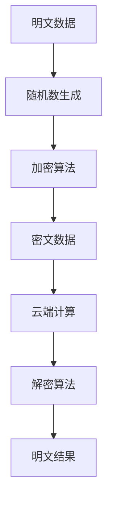

                 


# AI Agent的隐私保护与安全机制

> 关键词：AI Agent，隐私保护，安全机制，数据加密，差分隐私，身份认证

> 摘要：本文深入探讨了AI Agent在隐私保护与安全机制方面的关键问题，从核心概念到算法原理，再到系统架构设计和项目实战，全面解析如何在AI Agent中实现有效的隐私保护与安全机制。文章通过详细的理论分析和实际案例，为读者提供了一套完整的解决方案。

---

# 第一部分: AI Agent的隐私保护与安全机制概述

## 第1章: AI Agent的背景与核心概念

### 1.1 AI Agent的基本概念

#### 1.1.1 AI Agent的定义与分类
AI Agent（人工智能代理）是指能够感知环境、自主决策并执行任务的智能实体。根据功能和应用场景，AI Agent可以分为以下几类：
- **简单反射型Agent**：基于固定的规则执行任务。
- **基于模型的反射型Agent**：具备环境模型，能够根据模型进行推理。
- **目标驱动型Agent**：根据目标选择最优行动。
- **效用驱动型Agent**：通过最大化效用函数来优化决策。

#### 1.1.2 AI Agent的核心功能与特点
AI Agent的核心功能包括：
- **感知**：通过传感器或API获取环境信息。
- **推理**：基于获取的信息进行分析和决策。
- **规划**：制定行动计划。
- **执行**：根据规划执行任务。
- **学习**：通过经验改进性能。

其特点包括自主性、反应性、目标导向性和智能性。

#### 1.1.3 AI Agent的应用场景与发展趋势
AI Agent广泛应用于自动驾驶、智能助手、机器人、智能推荐系统等领域。随着技术进步，AI Agent正朝着更智能化、协同化和自适应性的方向发展。

---

### 1.2 隐私保护与安全机制的背景

#### 1.2.1 数字化时代的数据隐私问题
在数字化时代，数据成为核心资产，隐私泄露的风险急剧增加。AI Agent在处理数据时，可能面临数据被篡改、窃取或滥用的风险。

#### 1.2.2 AI Agent中的隐私泄露风险
AI Agent在执行任务时，可能暴露用户数据、算法细节和决策逻辑，导致隐私泄露。

#### 1.2.3 安全机制的重要性与挑战
安全机制是保护AI Agent的核心，但实现起来面临技术复杂性和性能优化的双重挑战。

---

## 1.3 本章小结
本章介绍了AI Agent的基本概念、核心功能和应用场景，并分析了隐私保护与安全机制的重要性。为后续内容奠定了基础。

---

# 第二部分: AI Agent的隐私保护核心概念与技术

## 第2章: 隐私保护的核心概念与技术

### 2.1 数据隐私保护的原理

#### 2.1.1 数据加密技术
数据加密是通过数学算法将数据转换为不可读的形式，常见的加密算法包括：
- **对称加密**：如AES。
- **非对称加密**：如RSA。
- **同态加密**：允许在加密状态下进行计算。

#### 2.1.2 数据匿名化技术
数据匿名化通过删除或脱敏敏感信息，减少身份识别风险。

#### 2.1.3 数据访问控制
通过访问控制列表（ACL）限制数据访问权限。

---

### 2.2 安全机制的实现原理

#### 2.2.1 加密算法在隐私保护中的应用
加密算法用于保护数据在传输和存储过程中的安全性。例如，使用AES加密敏感数据。

#### 2.2.2 身份认证与权限管理
通过身份认证（如OAuth）和权限管理（如RBAC）控制数据访问权限。

#### 2.2.3 数据完整性与抗抵赖性
通过哈希函数（如SHA-256）验证数据完整性，防止数据篡改。

---

### 2.3 核心概念对比分析

#### 2.3.1 数据加密与数据匿名化的对比
| 对比维度 | 数据加密 | 数据匿名化 |
|----------|----------|------------|
| 目标     | 保护数据 confidentiality | 隐藏身份 identity |
| 实现方式 | 加密算法 | 脱敏处理   |
| 适用场景 | 传输和存储 | 数据发布   |

---

## 2.4 本章小结
本章详细介绍了数据隐私保护的核心技术，包括加密、匿名化和访问控制，并通过对比分析帮助读者理解不同技术的适用场景。

---

# 第三部分: AI Agent隐私保护的算法原理

## 第3章: 隐私保护算法的原理与实现

### 3.1 同态加密算法

#### 3.1.1 同态加密的基本原理
同态加密允许在加密数据上进行计算，最终得到与明文计算相同的结果。例如，使用Paillier加密算法进行加法运算。

#### 3.1.2 加密与解密的数学模型
- 加密函数：$Enc(m) = (c_0, c_1) = (1, m \cdot r + b)$，其中$r$是随机数，$b$是随机噪声。
- 解密函数：$Dec(c_0, c_1) = c_1 / c_0 - b$。

#### 3.1.3 实现流程（附mermaid图）



---

### 3.2 差分隐私技术

#### 3.2.1 差分隐私的定义与核心思想
差分隐私通过在数据中添加噪声，确保单条数据的隐私保护。

#### 3.2.2 数学模型与公式
差分隐私的隐私保证可以通过以下公式表示：
$$P(Q(D) \in S) \geq P(Q(D') \in S) - \epsilon$$
其中，$\epsilon$是隐私预算，控制隐私泄露程度。

#### 3.2.3 实现步骤与代码示例

```python
def add_noise(data, epsilon):
    import numpy as np
    sensitivity = 1  # 数据敏感度
    noise = np.random.laplace(0, sensitivity / epsilon)
    return data + noise
```

---

### 3.3 身份认证算法

#### 3.3.1 基于哈希的认证机制
- 用户端：$h = hash(password)$
- 服务端：验证$h == hash(输入的密码)$

---

## 3.4 本章小结
本章详细介绍了同态加密和差分隐私的算法原理，并通过代码示例展示了实现方法。

---

# 第四部分: AI Agent隐私保护的系统架构设计

## 第4章: 系统架构与功能设计

### 4.1 系统功能模块划分

#### 4.1.1 数据采集模块
负责收集环境数据，并进行初步处理。

#### 4.1.2 数据加密模块
对敏感数据进行加密处理。

#### 4.1.3 安全传输模块
通过安全通道传输数据，防止数据被截获。

#### 4.1.4 权限管理模块
控制数据访问权限，确保只有授权用户才能访问数据。

---

### 4.2 系统架构设计

#### 4.2.1 分层架构设计
- **数据层**：存储和管理数据。
- **逻辑层**：处理业务逻辑。
- **表示层**：与用户交互。

#### 4.2.2 微服务架构设计
- **API Gateway**：统一入口。
- **服务节点**：独立的服务模块。
- **数据库**：存储数据。

---

## 4.3 本章小结
本章详细描述了AI Agent隐私保护系统的架构设计，包括功能模块划分和架构图。

---

# 第五部分: 项目实战与案例分析

## 第5章: 项目实战与案例分析

### 5.1 项目环境配置

#### 5.1.1 开发环境搭建
安装Python、Flask框架、加密库等。

#### 5.1.2 依赖库安装
使用pip安装必要的库：
```bash
pip install flask cryptography
```

---

### 5.2 核心功能实现

#### 5.2.1 数据加密模块实现

```python
from cryptography.hazmat.primitives.asymmetric import padding
from cryptography.hazmat.primitives.asymmetric.rsa import RSAPublicKey
from cryptography.hazmat.primitives import hashes

def encrypt_data(public_key: RSAPublicKey, data: bytes) -> bytes:
    cipher = padding.RSAPKCS1v1_5Codec()
    encrypted = cipher.encrypt(public_key, data)
    return encrypted
```

---

## 5.3 本章小结
本章通过实际案例展示了AI Agent隐私保护项目的实现过程，包括环境配置和核心功能实现。

---

# 结语

AI Agent的隐私保护与安全机制是实现智能化系统的重要保障。通过本文的详细讲解，读者可以深入了解相关技术和实现方法，并在实际项目中应用这些知识。

---

# 作者

作者：AI天才研究院/AI Genius Institute & 禅与计算机程序设计艺术 /Zen And The Art of Computer Programming

