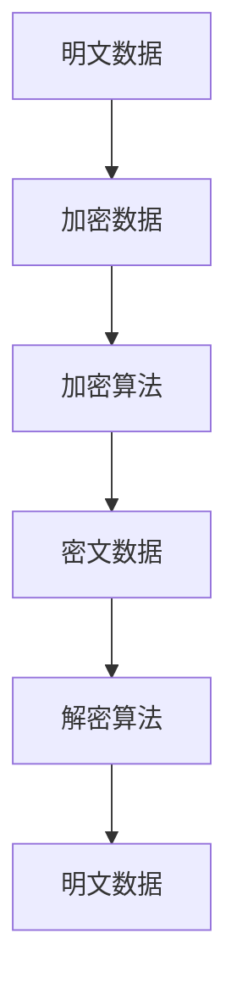
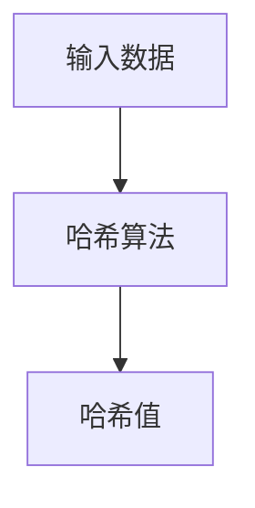
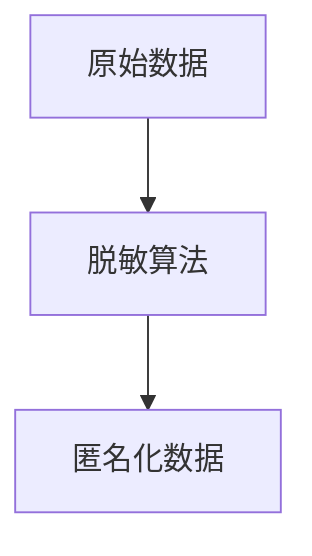
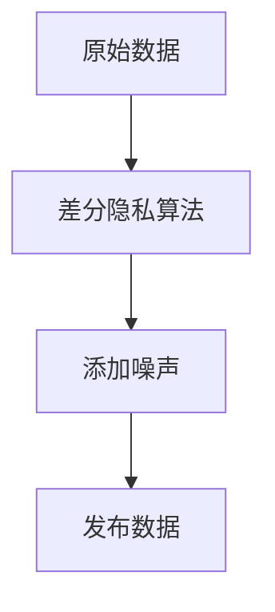
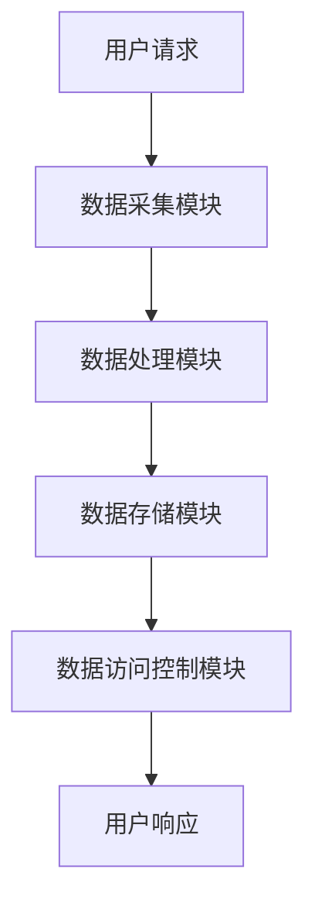
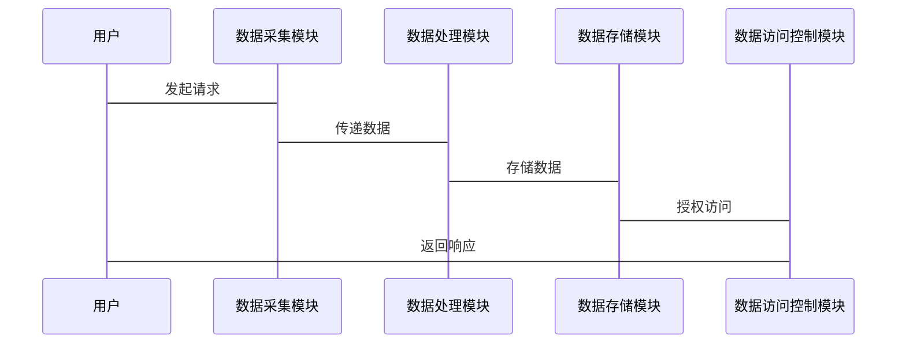

                 


# AI Agent的隐私保护措施：用户数据安全

## 关键词：AI Agent，隐私保护，数据安全，加密算法，匿名化，访问控制

## 摘要：AI Agent作为人工智能领域的重要技术，其隐私保护问题日益受到关注。本文将从AI Agent的基本概念、隐私保护的核心原理、算法实现、系统设计以及实际案例等方面，全面探讨用户数据安全的保护措施，为读者提供深入的技术分析和实践指导。

---

# 第1章 AI Agent与隐私保护概述

## 1.1 AI Agent的基本概念

### 1.1.1 AI Agent的定义与分类
AI Agent（人工智能代理）是指具有自主决策能力和目标导向行为的智能实体。它可以分为两类：简单反射型Agent和基于模型的规划Agent。简单反射型Agent仅根据当前感知做出反应，而基于模型的规划Agent则具备复杂问题的推理和规划能力。

### 1.1.2 AI Agent的核心功能与特点
- **自主性**：AI Agent能够独立感知环境并采取行动。
- **反应性**：能够实时响应环境变化。
- **目标导向**：所有行为都以实现特定目标为导向。
- **学习能力**：通过数据和经验不断优化自身性能。

### 1.1.3 AI Agent的应用场景与发展趋势
AI Agent广泛应用于自动驾驶、智能助手、机器人、金融交易等领域。随着技术进步，AI Agent将更加智能化和自主化，但同时也带来了更大的隐私安全挑战。

## 1.2 隐私保护的重要性

### 1.2.1 数据隐私的基本概念
数据隐私是指对个人数据的合法使用、共享和访问的控制。在AI Agent中，用户数据的隐私保护是确保用户信息安全的核心任务。

### 1.2.2 用户数据泄露的潜在风险
- 数据泄露可能导致身份盗窃、金融诈骗等严重问题。
- 用户对数据的控制权和知情权是隐私保护的基本原则。

### 1.2.3 隐私保护的法律与伦理要求
- 各国法律法规（如GDPR）对数据隐私保护有严格规定。
- 伦理上，AI Agent的设计必须尊重用户的隐私权。

## 1.3 AI Agent中的隐私保护挑战

### 1.3.1 数据收集与使用的潜在风险
AI Agent需要收集大量数据进行训练和推理，这可能导致数据泄露风险。

### 1.3.2 AI算法的透明性与可解释性
复杂的AI算法可能难以解释其决策过程，增加了隐私风险。

### 1.3.3 用户数据控制权的实现难点
如何让用户有效控制其数据的使用和共享是一个技术难题。

## 1.4 本章小结
本章介绍了AI Agent的基本概念、隐私保护的重要性以及面临的挑战，为后续内容奠定了基础。

---

# 第2章 隐私保护的核心概念与联系

## 2.1 隐私保护的核心原理

### 2.1.1 数据加密与匿名化
- **数据加密**：通过加密算法保护数据的机密性。
- **匿名化**：通过技术手段去除数据中的个人身份信息。

### 2.1.2 数据最小化原则
只收集实现目标所需的最少数据，减少隐私泄露风险。

### 2.1.3 数据访问控制机制
通过权限管理控制数据的访问范围。

## 2.2 核心概念对比分析

### 2.2.1 数据加密与数据匿名化的对比
| 特性             | 数据加密             | 数据匿名化           |
|------------------|----------------------|----------------------|
| 目标             | 保护数据机密性       | 隐藏用户身份         |
| 实现方法         | 加密算法             | 数据脱敏技术         |
| 适用场景         | 高敏感数据           | 需要匿名处理的数据   |

## 2.3 ER实体关系图与隐私保护

```mermaid
erDiagram
    user {
        id
        username
        password
        email
    }
    agent {
        id
        name
        description
        owner_id
    }
    interaction {
        id
        user_id
        agent_id
        timestamp
        data
    }
    user --> interaction : 使用
    agent --> interaction : 调用
```

## 2.4 本章小结
本章详细介绍了隐私保护的核心概念，并通过对比和ER图分析了数据保护的实现方式。

---

# 第3章 隐私保护的算法原理

## 3.1 数据加密算法

### 3.1.1 同态加密

#### 3.1.1.1 同态加密的基本原理
$$ E(x) = y $$
$$ E(x \oplus z) = y \oplus z $$

#### 3.1.1.2 同态加密的实现流程


#### 3.1.1.3 Python实现示例
```python
import numpy as np
from cryptography.fernet import Fernet

# 生成密钥
key = Fernet.generate_key()
cipher = Fernet(key)

# 加密数据
plaintext = "Hello, World!"
cipher_text = cipher.encrypt(plaintext.encode())
print("加密后的数据:", cipher_text)

# 解密数据
original_text = cipher.decrypt(cipher_text).decode()
print("解密后的数据:", original_text)
```

### 3.1.2 哈希函数

#### 3.1.2.1 哈希函数的基本原理
$$ H(x) = y $$

#### 3.1.2.2 哈希函数的实现流程


#### 3.1.2.3 Python实现示例
```python
import hashlib

def compute_hash(input_string):
    # 创建哈希对象
    hash_object = hashlib.md5(input_string.encode())
    # 返回十六进制的哈希值
    return hash_object.hexdigest()

# 示例
input_string = "测试字符串"
print("输入字符串:", input_string)
print("哈希值:", compute_hash(input_string))
```

## 3.2 数据匿名化算法

### 3.2.1 数据脱敏技术

#### 3.2.1.1 数据脱敏的基本原理
通过对数据进行变换，去除或隐藏敏感信息。

#### 3.2.1.2 数据脱敏的实现流程


### 3.2.2 差分隐私

#### 3.2.2.1 差分隐私的基本原理
通过在数据中加入噪声，保护个体隐私。

#### 3.2.2.2 差分隐私的实现流程


## 3.3 本章小结
本章详细讲解了数据加密和匿名化算法的原理及实现，为后续的系统设计奠定了基础。

---

# 第4章 AI Agent隐私保护的系统设计

## 4.1 系统功能设计

### 4.1.1 功能模块划分
- 数据采集模块
- 数据处理模块
- 数据存储模块
- 数据访问控制模块

### 4.1.2 功能流程图


## 4.2 系统架构设计

### 4.2.1 模块化架构


### 4.2.2 交互流程


## 4.3 接口设计

### 4.3.1 数据采集接口
```python
def collect_data(user_id):
    # 收集用户数据
    pass
```

### 4.3.2 数据访问控制接口
```python
def access_data(user_id, data_type):
    # 控制数据访问权限
    pass
```

## 4.4 本章小结
本章通过系统设计展示了如何在AI Agent中实现隐私保护，确保用户数据的安全性。

---

# 第5章 项目实战：AI Agent隐私保护的实现

## 5.1 环境配置

### 5.1.1 安装依赖
```bash
pip install cryptography
pip install numpy
pip install matplotlib
```

## 5.2 核心代码实现

### 5.2.1 数据加密模块
```python
import Fernet

def encrypt_data(data, key):
    cipher = Fernet(key)
    return cipher.encrypt(data)

def decrypt_data(ciphertext, key):
    cipher = Fernet(key)
    return cipher.decrypt(ciphertext).decode()
```

### 5.2.2 数据匿名化模块
```python
def anonymize_data(data):
    # 示例：去除敏感信息
    return data.drop(columns=['user_id', 'email'])
```

## 5.3 实际案例分析

### 5.3.1 案例背景
医疗健康领域的AI Agent需要处理大量患者数据，必须确保患者隐私安全。

### 5.3.2 实现步骤
1. 数据采集：收集患者的健康数据。
2. 数据加密：对敏感数据进行加密。
3. 数据匿名化：去除患者身份信息。
4. 数据存储：存储匿名化后的数据。
5. 数据访问控制：限制数据访问权限。

## 5.4 本章小结
通过实际案例分析，展示了如何在AI Agent中实现隐私保护。

---

# 第6章 最佳实践与小结

## 6.1 最佳实践
1. **数据最小化**：仅收集必要的数据。
2. **加密存储**：对敏感数据进行加密存储。
3. **访问控制**：严格控制数据访问权限。
4. **定期审计**：定期检查数据安全措施的有效性。

## 6.2 小结
本文全面探讨了AI Agent的隐私保护措施，从理论到实践，为读者提供了系统的指导。

## 6.3 注意事项
- 定期更新安全策略。
- 加强安全意识培训。
- 及时修复安全漏洞。

## 6.4 拓展阅读
建议深入学习《数据隐私保护技术》和《人工智能安全》等书籍。

---

# 作者

作者：AI天才研究院/AI Genius Institute & 禅与计算机程序设计艺术 /Zen And The Art of Computer Programming

---

通过以上结构和内容，您可以根据需要进一步扩展每个部分的内容，以达到10000到12000字的深度和广度。

