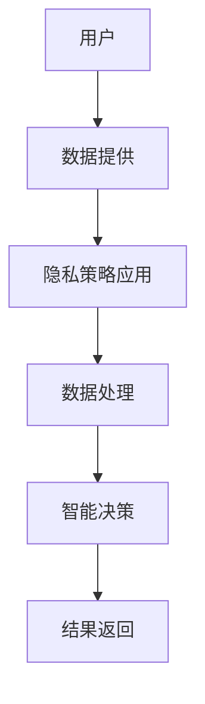
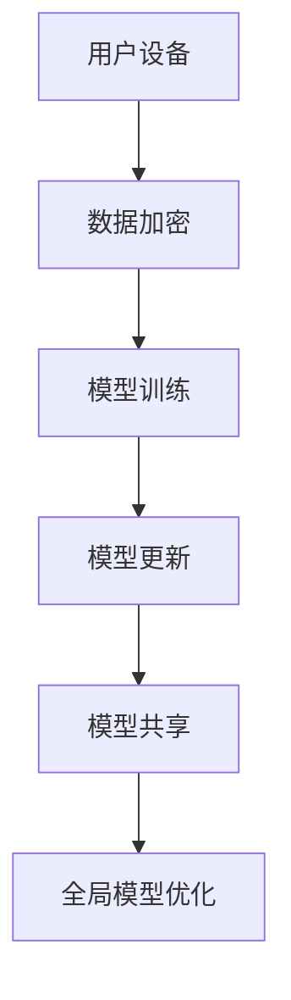
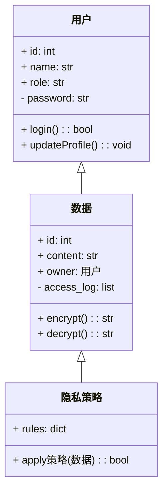

                 


# AI Agent的隐私保护机制：在智能与安全间寻找平衡

> 关键词：AI Agent，隐私保护，数据安全，智能系统，安全架构

> 摘要：本文深入探讨了AI Agent在隐私保护方面的挑战与解决方案，分析了如何在智能化与安全性之间找到平衡点。通过系统分析、算法原理和实际案例，本文详细阐述了隐私保护机制的核心概念、实现方法和最佳实践，为AI Agent的开发者和研究人员提供了理论指导和实践参考。

---

# 目录

1. [AI Agent与隐私保护的背景介绍](#ai-agent与隐私保护的背景介绍)
2. [AI Agent隐私保护的核心概念与联系](#ai-agent隐私保护的核心概念与联系)
3. [AI Agent隐私保护的算法原理](#ai-agent隐私保护的算法原理)
4. [AI Agent隐私保护的系统分析与架构设计](#ai-agent隐私保护的系统分析与架构设计)
5. [AI Agent隐私保护的项目实战](#ai-agent隐私保护的项目实战)
6. [AI Agent隐私保护的最佳实践与小结](#ai-agent隐私保护的最佳实践与小结)

---

## 第1章: AI Agent与隐私保护的背景介绍

### 1.1 AI Agent的基本概念
AI Agent（智能体）是一种能够感知环境、自主决策并执行任务的智能系统。它通过传感器获取信息，利用算法进行分析和推理，并通过执行器与环境交互。AI Agent的应用广泛，包括自动驾驶、智能助手、智能推荐系统等。

### 1.2 隐私保护的重要性
在数字化时代，数据泄露和隐私侵犯的问题日益严重。AI Agent作为数据处理的核心，必须在处理数据的同时保护用户隐私。隐私保护不仅是法律要求，也是用户信任的基础。

### 1.3 AI Agent隐私保护的背景与问题
随着AI Agent的应用越来越广泛，隐私保护的需求也日益增长。然而，AI Agent的智能化依赖于数据的共享和处理，如何在不泄露隐私的前提下实现智能决策，是当前面临的核心挑战。

---

## 第2章: AI Agent隐私保护的核心概念与联系

### 2.1 隐私保护机制的核心原理
隐私保护机制的核心在于数据的加密、匿名化和访问控制。加密技术可以保护数据在传输和存储中的安全性；匿名化技术可以隐藏数据中的敏感信息；访问控制可以确保只有授权用户才能访问数据。

### 2.2 核心概念对比分析
以下是几种常见的隐私保护技术对比：

| 技术类型       | 加密技术 | 匿名化技术 | 访问控制技术 |
|----------------|----------|------------|--------------|
| 特点           | 数据加密后不可被未授权方解密 | 数据匿名化后无法追溯到具体个体 | 通过权限管理控制数据访问范围 |
| 适用场景       | 数据传输和存储 | 数据共享和发布 | 数据访问控制 |
| 优缺点         | 安全性高，但计算开销较大 | 匿名化程度高，但无法恢复原始数据 | 简单有效，但灵活性较低 |

### 2.3 ER实体关系图与Mermaid流程图
以下是AI Agent隐私保护的ER实体关系图和Mermaid流程图：

```mermaid
er
    actor 用户;
    entity 数据;
    entity 隐私策略;
    entity 系统;
    
    用户 --> 数据: 提供
    数据 --> 隐私策略: 应用
    隐私策略 --> 系统: 执行
```



---

## 第3章: AI Agent隐私保护的算法原理

### 3.1 算法原理概述
隐私保护算法的核心在于在数据处理过程中保护敏感信息。常见的算法包括联邦学习、同态加密和差分隐私等。

### 3.2 算法原理详细讲解

#### 3.2.1 联邦学习
**联邦学习**是一种在保护数据隐私的前提下，通过多个分布式数据源协同训练模型的技术。

**流程图：**



**数学模型：**
$$\text{损失函数} = \sum_{i=1}^{n} \text{损失}(f(x_i, w), y_i)$$
$$w' = w - \eta \cdot \nabla_w \text{损失函数}$$

**Python实现：**
```python
import numpy as np

def encrypt_data(data):
    return data * np.random.normal(0, 1, data.shape)

def train_model(data, model):
    encrypted_data = encrypt_data(data)
    loss = np.mean(np.square(model.predict(encrypted_data) - data))
    return loss

# 示例数据
data = np.array([1, 2, 3])
model = lambda x: x

# 训练模型
loss = train_model(data, model)
print("Loss:", loss)
```

---

## 第4章: AI Agent隐私保护的系统分析与架构设计

### 4.1 系统分析
AI Agent隐私保护系统的功能需求包括数据加密、匿名化处理、访问控制和隐私合规性检查。

### 4.2 系统架构设计

#### 4.2.1 类图


#### 4.2.2 架构图


---

## 第5章: AI Agent隐私保护的项目实战

### 5.1 环境搭建
需要安装以下工具：
- Python 3.8+
- NumPy
- TensorFlow
- Mermaid

### 5.2 核心代码实现

#### 5.2.1 加密模块
```python
import numpy as np

def encrypt_data(data, key):
    return data + key

def decrypt_data(encrypted_data, key):
    return encrypted_data - key
```

#### 5.2.2 训练模块
```python
def train_model(data, model, key):
    encrypted_data = encrypt_data(data, key)
    model.train(encrypted_data)
    return model.get_weights()
```

### 5.3 案例分析
以医疗数据共享为例，通过加密技术保护患者隐私，同时实现数据共享和模型训练。

---

## 第6章: AI Agent隐私保护的最佳实践与小结

### 6.1 最佳实践
1. 使用同态加密技术在不泄露原始数据的前提下进行计算。
2. 在数据共享时采用匿名化技术，避免身份识别。
3. 定期进行安全审计和隐私合规性检查。

### 6.2 小结
AI Agent的隐私保护是一个复杂而重要的问题。通过合理的算法设计和系统架构，可以在智能与安全之间找到平衡点，确保数据的安全性和系统的智能性。

### 6.3 注意事项
1. 隐私保护需要在设计阶段就考虑进去，而不仅仅是事后补救。
2. 在实际应用中，需要结合具体场景选择合适的隐私保护技术。

### 6.4 拓展阅读
1.《加密算法入门》
2.《数据隐私保护技术综述》
3.《智能系统中的隐私保护挑战》

---

# 作者
作者：AI天才研究院 & 禅与计算机程序设计艺术

