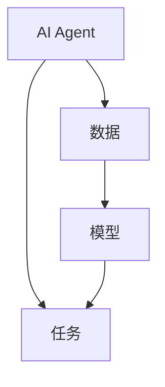
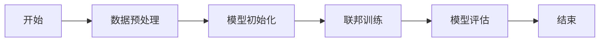
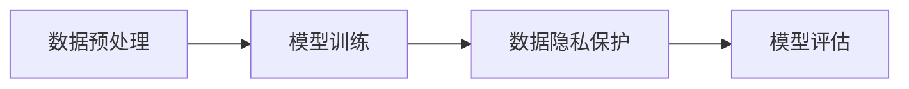

                 


# AI Agent的隐私保护联邦学习：数据不出本地的协作训练

> 关键词：AI Agent, 隐私保护, 联邦学习, 数据协作, 分布式计算

> 摘要：本文深入探讨了AI Agent在隐私保护联邦学习中的应用，介绍了如何在数据不出本地的前提下实现协作训练。文章从背景、原理、算法、系统设计到实战项目，全面解析了隐私保护联邦学习的核心概念与技术实现。

---

# 第1章: AI Agent与隐私保护联邦学习概述

## 1.1 AI Agent的基本概念

### 1.1.1 AI Agent的定义与特点
AI Agent（人工智能代理）是一种能够感知环境、自主决策并执行任务的智能实体。它具有以下特点：
- **自主性**：能够自主决策，无需外部干预。
- **反应性**：能根据环境变化调整行为。
- **目标导向**：以实现特定目标为导向。

### 1.1.2 AI Agent的核心功能与应用场景
AI Agent的核心功能包括数据处理、决策制定和任务执行。应用场景广泛，如自动驾驶、智能助手、智能推荐等。

### 1.1.3 AI Agent与传统AI的区别
AI Agent强调自主性和目标导向，而传统AI更注重数据处理和模式识别。

## 1.2 隐私保护联邦学习的背景与意义
### 1.2.1 数据隐私保护的重要性
数据隐私保护是当前信息社会的核心需求，尤其是在数据泄露风险日益增加的背景下。

### 1.2.2 联邦学习的概念与特点
联邦学习是一种分布式机器学习技术，允许多个参与方在不共享原始数据的情况下进行模型训练。

### 1.2.3 隐私保护联邦学习的必要性
保护数据隐私的同时实现协作训练，是联邦学习的核心目标。

## 1.3 AI Agent与隐私保护联邦学习的结合
### 1.3.1 数据不出本地的协作训练
AI Agent在本地进行数据处理和模型训练，数据无需离开本地。

### 1.3.2 AI Agent在联邦学习中的角色
AI Agent作为协作节点，负责数据处理和模型更新。

### 1.3.3 隐私保护联邦学习的核心目标
确保数据隐私的前提下，实现模型的协作优化。

## 1.4 本章小结
本章介绍了AI Agent的基本概念、隐私保护联邦学习的背景及其结合的意义。

---

# 第2章: 隐私保护联邦学习的核心概念与联系

## 2.1 联邦学习的原理与流程
### 2.1.1 联邦学习的基本原理
通过数据不共享，模型参数在各方之间进行同步和更新。

### 2.1.2 联邦学习的流程与步骤
1. 数据预处理
2. 模型初始化
3. 联邦训练
4. 模型评估

### 2.1.3 联邦学习的优缺点
优点：数据隐私保护，资源利用高效；缺点：通信开销大，模型收敛慢。

## 2.2 隐私保护技术的核心原理
### 2.2.1 数据加密与隐私保护
通过加密技术保护数据不被未经授权的访问。

### 2.2.2 差分隐私与同态加密
差分隐私通过添加噪声保护数据，同态加密允许在加密状态下进行计算。

### 2.2.3 隐私保护技术的对比分析
| 技术 | 优点 | 缺点 |
|------|------|------|
| 数据加密 | 保护数据 | 通信效率降低 |
| 差分隐私 | 隐私保护 | 精度可能降低 |
| 同态加密 | 支持加密计算 | 计算复杂度高 |

## 2.3 AI Agent与联邦学习的实体关系图



## 2.4 本章小结
本章分析了联邦学习的原理、隐私保护技术及其在AI Agent中的应用。

---

# 第3章: 隐私保护联邦学习的算法原理

## 3.1 联邦学习的数学模型与公式
### 3.1.1 联邦学习的数学模型
$$ L = \sum_{i=1}^{n} f_i(w) $$
其中，$f_i$表示第$i$个参与方的损失函数，$w$是模型参数。

### 3.1.2 数据聚合与模型更新的公式推导
模型更新公式：
$$ w_{new} = w_{old} + \sum_{i=1}^{n} \Delta w_i $$

### 3.1.3 数据隐私保护的数学证明
通过差分隐私，证明模型更新的隐私保护性。

## 3.2 隐私保护联邦学习的算法流程


## 3.3 隐私保护联邦学习的实现代码

### 3.3.1 环境安装与配置
```bash
pip install numpy
pip install tensorflow
```

### 3.3.2 数据预处理代码
```python
import numpy as np

# 生成数据
X = np.random.randn(100, 2)
y = np.random.randint(2, size=100)
```

### 3.3.3 联邦训练代码
```python
import tensorflow as tf

# 初始化模型
model = tf.keras.Sequential([
    tf.keras.layers.Dense(64, activation='relu'),
    tf.keras.layers.Dense(1, activation='sigmoid')
])

# 编译模型
model.compile(optimizer='adam', loss='binary_crossentropy', metrics=['accuracy'])

# 训练模型
model.fit(X, y, epochs=10, batch_size=32)
```

## 3.4 本章小结
本章详细讲解了隐私保护联邦学习的算法原理和实现代码。

---

# 第4章: 隐私保护联邦学习的系统分析与架构设计

## 4.1 系统功能设计
### 4.1.1 数据预处理模块
负责数据清洗和格式转换。

### 4.1.2 模型训练模块
执行模型训练和更新。

### 4.1.3 数据隐私保护模块
实现数据加密和隐私保护。

### 4.1.4 模型评估模块
评估模型性能并优化。

## 4.2 系统架构设计


## 4.3 本章小结
本章分析了系统功能设计和架构设计。

---

# 第5章: 隐私保护联邦学习的项目实战

## 5.1 环境安装与配置
```bash
pip install numpy
pip install tensorflow
pip install matplotlib
```

## 5.2 核心实现代码
```python
import numpy as np
import tensorflow as tf
import matplotlib.pyplot as plt

# 数据生成
X = np.random.randn(100, 2)
y = np.random.randint(2, size=100)

# 初始化模型
model = tf.keras.Sequential([
    tf.keras.layers.Dense(64, activation='relu'),
    tf.keras.layers.Dense(1, activation='sigmoid')
])

# 编译模型
model.compile(optimizer='adam', loss='binary_crossentropy', metrics=['accuracy'])

# 训练模型
history = model.fit(X, y, epochs=10, batch_size=32, verbose=0)

# 可视化训练过程
plt.plot(history.history['loss'])
plt.xlabel('Epoch')
plt.ylabel('Loss')
plt.show()
```

## 5.3 实际案例分析
以分类任务为例，展示模型训练和评估过程。

## 5.4 项目小结
总结项目实现过程中的经验与教训。

---

# 第6章: 总结与展望

## 6.1 本章总结
回顾全文，总结隐私保护联邦学习的核心内容。

## 6.2 未来展望
展望隐私保护联邦学习的发展方向和应用前景。

## 6.3 最佳实践tips
- 数据预处理要充分。
- 模型训练要定期验证。
- 隐私保护技术要选择合适。

## 6.4 作者信息
作者：AI天才研究院 & 禅与计算机程序设计艺术

---

# 附录

## 附录A: 术语表
列出文章中出现的术语及其定义。

## 附录B: 参考文献
列出参考文献和相关资料。

---

# 结束语
感谢您的阅读！如需进一步探讨，请随时联系。

---

