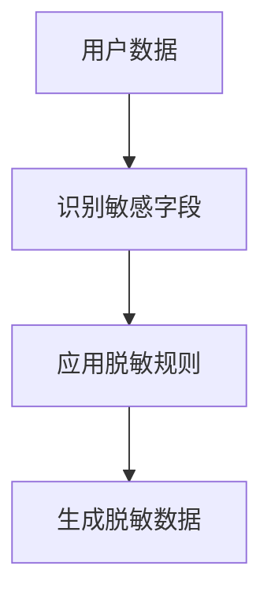
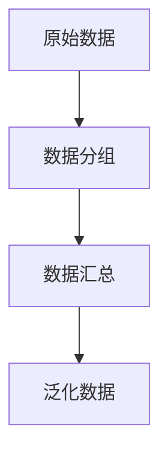
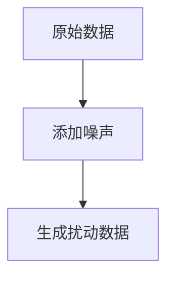
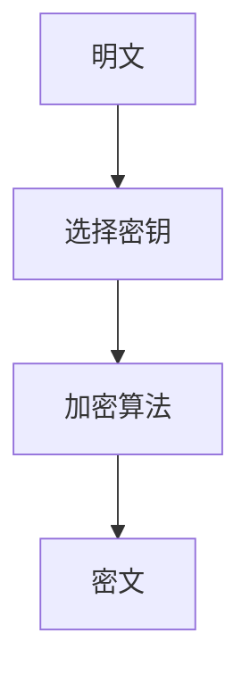
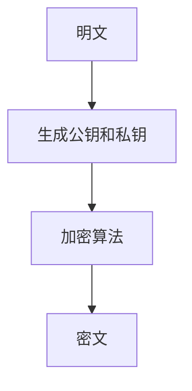
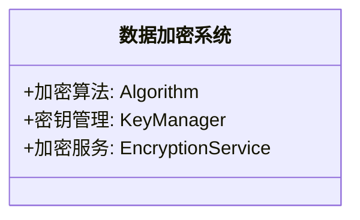
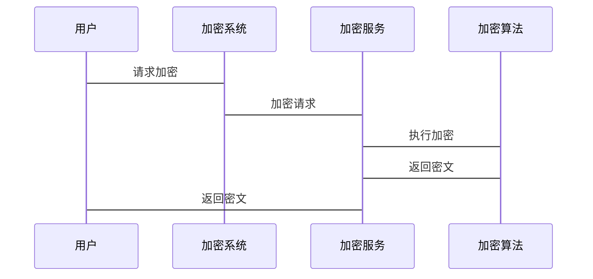
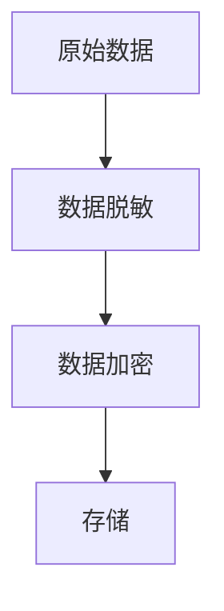

                 


# AI Agent的隐私保护：数据匿名化与加密

> 关键词：AI Agent, 数据隐私, 数据匿名化, 数据加密, 隐私保护

> 摘要：本文深入探讨了AI Agent的隐私保护问题，重点分析了数据匿名化与加密技术在保护AI Agent数据隐私中的作用。文章从背景、概念、技术原理、系统架构、项目实战等多个维度展开，详细讲解了数据匿名化与加密的方法、算法原理、系统设计以及实际应用案例，最后给出了最佳实践和未来研究方向。

---

## 第1章: AI Agent与隐私保护概述

### 1.1 AI Agent的基本概念

#### 1.1.1 AI Agent的定义与特点
AI Agent（智能体）是指能够感知环境、自主决策并执行任务的智能系统。它通常具备以下特点：
- **自主性**：能够在没有外部干预的情况下独立运作。
- **反应性**：能够根据环境反馈调整行为。
- **目标导向性**：具备明确的目标，能够为目标优化决策。
- **学习能力**：能够通过数据和经验不断优化自身的性能。

#### 1.1.2 AI Agent的类型与应用场景
AI Agent可以分为以下几类：
- **简单反射型智能体**：基于当前感知做出反应，适用于简单的任务。
- **基于模型的反射型智能体**：利用内部模型进行规划和决策，适用于复杂任务。
- **目标驱动型智能体**：以目标为导向，持续优化行为以达到目标。
- **实用驱动型智能体**：基于效用函数，选择最优行为。

AI Agent广泛应用于自动驾驶、智能助手、推荐系统、机器人控制等领域。

#### 1.1.3 AI Agent与隐私保护的关系
AI Agent在执行任务时，通常需要处理大量的数据，包括用户数据、环境数据等。这些数据可能包含敏感信息，如用户的地理位置、行为习惯等。如果这些数据未得到妥善保护，可能导致隐私泄露，引发法律和伦理问题。因此，隐私保护是AI Agent设计中的重要一环。

---

### 1.2 隐私保护的核心问题

#### 1.2.1 数据隐私的基本概念
数据隐私是指对数据的访问权、使用权和披露权的控制。隐私保护的目标是确保数据在收集、存储、处理和传输过程中不被未经授权的主体获取或滥用。

#### 1.2.2 AI Agent中的隐私泄露风险
AI Agent在处理数据时，可能面临以下隐私泄露风险：
- **数据收集阶段**：未经授权收集敏感数据。
- **数据存储阶段**：存储的敏感数据被未授权访问。
- **数据处理阶段**：处理过程中数据被篡改或滥用。
- **数据传输阶段**：数据在传输过程中被截获或窃取。

#### 1.2.3 隐私保护的目标与边界
隐私保护的目标是在确保数据可用性的前提下，最大限度地减少隐私泄露风险。隐私保护的边界包括：
- **数据最小化**：只收集必要的数据。
- **数据匿名化**：对敏感数据进行脱敏处理，使其无法关联到具体个人。
- **数据加密**：对敏感数据进行加密，防止未经授权的访问。

---

## 第2章: 数据匿名化与加密的基本概念

### 2.1 数据匿名化的定义与方法

#### 2.1.1 数据匿名化的定义
数据匿名化是指通过技术手段对数据进行处理，使得数据无法被关联到具体个人，同时保持数据的可用性。

#### 2.1.2 数据匿名化的实现技术
数据匿名化的主要技术包括：
- **数据脱敏**：通过删除、加密或替换敏感信息，使数据无法还原到原始形式。
- **数据泛化**：通过汇总或合并数据，降低数据的粒度，使得数据无法关联到具体个人。
- **数据扰动**：通过添加噪声或随机化处理，使得数据无法被精确还原。

#### 2.1.3 数据匿名化的优缺点对比

| 技术 | 优点 | 缺点 |
|------|------|------|
| 数据脱敏 | 实现简单，成本低 | 可能无法完全匿名化，存在可逆风险 |
| 数据泛化 | 匿名化效果好，适用于统计分析 | 无法支持细粒度查询 |
| 数据扰动 | 匿名化效果好，支持细粒度查询 | 可能影响数据的准确性 |

#### 2.1.4 数据匿名化的ER实体关系图
```mermaid
er
    %% 数据匿名化 ER 实体关系图
    图例:
        实体: 实体框
        属性: 实体框中的矩形
        关系: 连接线
    实体:
        用户
        匿名化数据
    关系:
        用户 --> 匿名化数据
```

### 2.2 数据加密的基本原理

#### 2.2.1 加密算法的分类与特点
加密算法主要分为对称加密和非对称加密两类。

- **对称加密**：加密和解密使用相同的密钥。优点是速度快，适用于大量数据加密；缺点是密钥分发容易被截获。
- **非对称加密**：加密和解密使用不同的密钥。优点是安全性高，适用于身份验证和数字签名；缺点是加密速度较慢。

#### 2.2.2 对称加密与非对称加密的对比

| 技术 | 对称加密 | 非对称加密 |
|------|----------|------------|
| 密钥 | 同一密钥 | 公钥和私钥 |
| 速度 | 快 | 较慢 |
| 安全性 | 较低 | 较高 |
| 应用 | 数据加密 | 数字签名 |

#### 2.2.3 加密算法在数据保护中的应用
加密算法广泛应用于数据存储和传输过程中，确保数据的机密性和完整性。

---

## 第3章: 数据匿名化技术

### 3.1 数据匿名化的实现方法

#### 3.1.1 数据脱敏技术

##### 3.1.1.1 数据脱敏的基本原理
数据脱敏是通过删除、加密或替换敏感信息，使数据无法被还原到原始形式。例如，对用户的身份证号进行脱敏处理，可以保留部分信息，如“1234**** ****5678”。

##### 3.1.1.2 数据脱敏的实现步骤



##### 3.1.1.3 数据脱敏的Python实现
```python
def data_masking(data, mask_pattern):
    masked_data = []
    for item in data:
        masked_item = item[:len(item)//2] + mask_pattern + item[len(item)//2:]
        masked_data.append(masked_item)
    return masked_data
```

#### 3.1.2 数据泛化技术

##### 3.1.2.1 数据泛化的基本原理
数据泛化是通过汇总或合并数据，降低数据的粒度，使得数据无法关联到具体个人。例如，将用户的年龄从25岁泛化为20-30岁。

##### 3.1.2.2 数据泛化的实现步骤



#### 3.1.3 数据扰动技术

##### 3.1.3.1 数据扰动的基本原理
数据扰动是通过添加噪声或随机化处理，使得数据无法被精确还原。例如，对用户的地理位置添加随机偏移。

##### 3.1.3.2 数据扰动的实现步骤



### 3.2 数据匿名化的数学模型

#### 3.2.1 数据匿名化的目标函数
$$ \text{目标函数} = \min_{x} \text{损失}(x) + \lambda \cdot \text{风险}(x) $$

其中，$\text{损失}(x)$表示数据匿名化后的可用性损失，$\text{风险}(x)$表示隐私泄露风险。

#### 3.2.2 数据匿名化的约束条件
$$ \text{约束条件} = \{ x | \text{隐私风险}(x) \leq \epsilon \} $$

其中，$\epsilon$表示可接受的隐私风险阈值。

---

## 第4章: 数据加密技术

### 4.1 数据加密的基本原理

#### 4.1.1 对称加密算法

##### 4.1.1.1 AES加密算法
AES（高级加密标准）是一种广泛使用的对称加密算法，支持128、192和256位密钥长度。

##### 4.1.1.2 AES加密的实现步骤



##### 4.1.1.3 AES加密的Python实现
```python
from cryptography.hazmat.primitives.ciphers import Cipher, algorithms, modes
from cryptography.hazmat.primitives.asymmetric import padding

key = b'Secret key'
cipher = Cipher(algorithms.AES(key), modes.ECB())
encryptor = cipher.encryptor()
ciphertext = encryptor.update(b'Plaintext') + encryptor.finalize()
```

#### 4.1.2 非对称加密算法

##### 4.1.2.1 RSA加密算法
RSA（ Rivest-Shamir-Adleman）是一种常用的非对称加密算法，基于大整数分解的困难性。

##### 4.1.2.2 RSA加密的实现步骤



##### 4.1.2.3 RSA加密的Python实现
```python
from cryptography.hazmat.primitives.asymmetric.rsa import *
from cryptography.hazmat.primitives.asymmetric import padding

private_key = rsa.generate_private_key(
    public_exponent=65537,
    key_size=2048
)
public_key = private_key.public_key()
encrypted_data = public_key.encrypt(b'Plaintext', padding.PKCS1v15())
```

### 4.2 数据加密的系统架构

#### 4.2.1 加密系统功能设计



#### 4.2.2 加密系统的交互流程



---

## 第5章: AI Agent中的数据匿名化与加密结合

### 5.1 联合技术的应用场景

#### 5.1.1 数据匿名化与加密的协同作用
数据匿名化和加密可以结合使用，进一步增强隐私保护。例如，先对数据进行脱敏处理，再进行加密存储。

#### 5.1.2 联合技术的实现步骤



### 5.2 联合技术的优势

| 技术组合 | 优势 |
|----------|------|
| 数据脱敏 + 加密 | 高效保护敏感数据，防止数据泄露 |
| 数据泛化 + 加密 | 适用于统计分析，保护数据隐私 |
| 数据扰动 + 加密 | 适用于精准查询，保护数据隐私 |

---

## 第6章: 隐私保护的挑战与未来方向

### 6.1 隐私保护的挑战

#### 6.1.1 技术挑战
- 数据匿名化与加密技术的效率问题。
- 数据匿名化与加密技术的可逆性问题。

#### 6.1.2 算法挑战
- 数据匿名化与加密算法的鲁棒性问题。
- 数据匿名化与加密算法的可扩展性问题。

### 6.2 隐私保护的未来方向

#### 6.2.1 新型加密技术
- 同态加密：支持在加密数据上进行计算。
- 哈希加密：支持高效的数据完整性验证。

#### 6.2.2 智能合约
- 通过智能合约实现数据访问控制。
- 通过智能合约实现数据共享。

---

## 结论

本文详细探讨了AI Agent的隐私保护问题，重点分析了数据匿名化与加密技术在保护AI Agent数据隐私中的作用。通过结合数据脱敏、数据泛化、数据扰动等多种技术，可以有效降低隐私泄露风险。未来，随着新型加密技术和智能合约的应用，AI Agent的隐私保护将更加高效和智能化。

---

## 作者

作者：AI天才研究院/AI Genius Institute & 禅与计算机程序设计艺术 /Zen And The Art of Computer Programming

