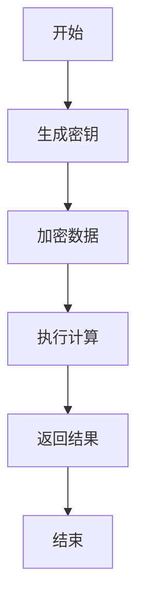
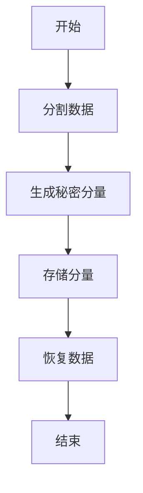
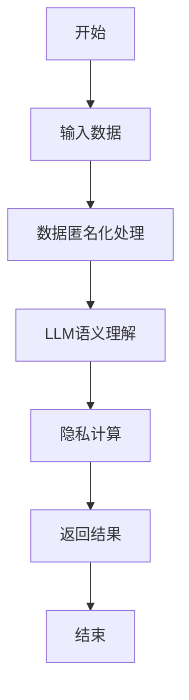
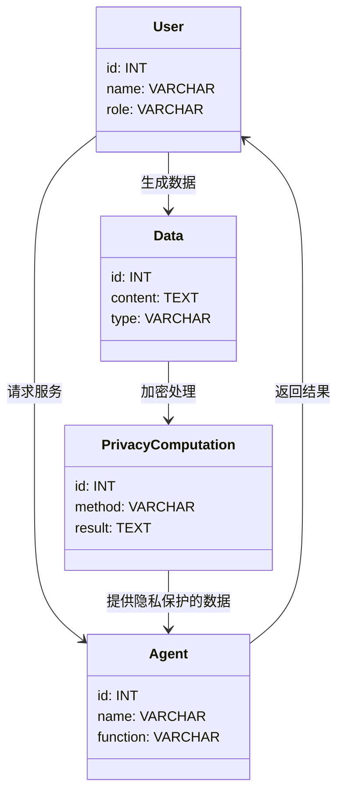
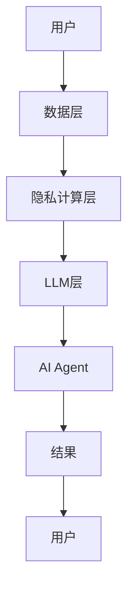
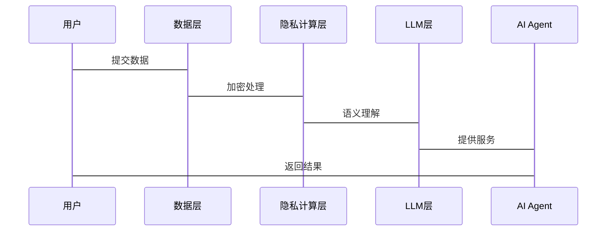

                 


# AI Agent的隐私计算：在保护数据隐私的同时应用LLM

## 关键词：AI Agent, 隐私计算, 大语言模型, 数据隐私, 隐私保护

## 摘要：  
随着人工智能和大数据技术的快速发展，数据隐私保护成为一个重要议题。AI Agent结合大语言模型（LLM）的应用虽然强大，但其数据处理过程可能面临隐私泄露的风险。本文将深入探讨如何在保护数据隐私的前提下，利用隐私计算技术在AI Agent中应用LLM。通过理论分析与实际案例相结合，我们探讨了隐私计算的核心原理、算法实现、系统架构设计以及实际应用中的挑战和解决方案。

---

# 第一部分: AI Agent与隐私计算的背景介绍

## 第1章: 问题背景与核心概念

### 1.1 问题背景

#### 1.1.1 数据隐私的重要性
在数字化时代，数据成为企业和社会的重要资产。数据隐私保护不仅是法律要求，也是用户信任的基础。AI Agent作为智能决策和执行的实体，依赖于数据进行推理和行动，因此数据隐私保护至关重要。

#### 1.1.2 AI Agent的应用场景
AI Agent广泛应用于智能客服、自动驾驶、智能家居、金融投资等领域。这些场景中，AI Agent需要处理大量敏感数据，如用户对话记录、位置信息、交易记录等。如何在利用这些数据的同时保护隐私，是当前面临的重要挑战。

#### 1.1.3 隐私计算的需求与挑战
隐私计算旨在在不泄露原始数据的情况下，进行数据处理和分析。随着AI Agent的普及，隐私计算的需求日益增加，但实现起来面临技术复杂性和性能优化等挑战。

---

### 1.2 核心概念

#### 1.2.1 AI Agent的定义与特征
AI Agent是一种智能实体，能够感知环境、自主决策并执行任务。其核心特征包括自主性、反应性、目标导向和社会能力。

#### 1.2.2 隐私计算的核心理念
隐私计算是在数据不被完全暴露的前提下，进行数据处理和分析的技术。其目标是确保数据的可用性，同时保护数据的隐私性。

#### 1.2.3 LLM在AI Agent中的作用
大语言模型（LLM）为AI Agent提供了强大的自然语言处理能力，使其能够理解、生成和推理文本信息。结合隐私计算，LLM可以在保护数据隐私的前提下，为AI Agent提供智能服务。

---

## 第2章: 问题描述与解决思路

### 2.1 数据隐私面临的挑战

#### 2.1.1 数据泄露的风险
AI Agent在处理数据时，可能因为安全漏洞或不当操作导致数据泄露，威胁用户隐私和企业安全。

#### 2.1.2 数据孤岛问题
不同系统和部门之间的数据孤岛问题，限制了数据的共享和利用，增加了隐私保护的复杂性。

#### 2.1.3 数据使用中的伦理问题
AI Agent在利用数据时，可能涉及用户不知情的情况，引发伦理争议。

### 2.2 AI Agent与LLM的结合

#### 2.2.1 LLM的基本原理
LLM通过大规模数据训练，掌握了丰富的语义信息，能够理解和生成自然语言文本。AI Agent利用LLM的能力，提升自身的智能水平。

#### 2.2.2 AI Agent的决策机制
AI Agent基于LLM提供的语义理解和上下文信息，结合隐私保护策略，做出符合隐私要求的决策。

#### 2.2.3 隐私计算在AI Agent中的应用
通过隐私计算技术，AI Agent可以在本地或可信环境中处理数据，确保数据隐私的同时，利用LLM进行智能服务。

---

## 第3章: 隐私计算的边界与外延

### 3.1 隐私计算的边界

#### 3.1.1 数据范围的界定
隐私计算仅处理特定范围内的数据，避免对其他数据的不必要处理。

#### 3.1.2 计算过程的边界
隐私计算的处理过程必须在用户授权的范围内进行，避免越权操作。

#### 3.1.3 隐私保护的法律框架
隐私计算需要遵守相关法律法规，确保数据处理的合法性。

### 3.2 隐私计算的外延

#### 3.2.1 隐私保护的技术手段
隐私计算可以采用多种技术手段，如同态加密、秘密分享等，以保护数据隐私。

#### 3.2.2 隐私计算的应用场景
隐私计算不仅应用于AI Agent，还可用于金融、医疗、教育等多个领域。

#### 3.2.3 隐私计算的未来趋势
随着技术进步，隐私计算将更加智能化和普及化，成为数据处理的基础技术。

---

# 第二部分: 核心概念与联系

## 第4章: 隐私计算的核心原理

### 4.1 隐私计算的基本原理

#### 4.1.1 数据加密与解密
隐私计算通过加密技术，确保数据在传输和存储过程中的安全性。

#### 4.1.2 数据匿名化技术
通过数据匿名化处理，去除或脱敏敏感信息，降低隐私泄露风险。

#### 4.1.3 数据共享的隐私保护
在数据共享过程中，采用隐私保护机制，确保数据不被滥用。

---

### 4.2 AI Agent的决策机制

#### 4.2.1 基于LLM的决策模型
AI Agent利用LLM进行语义理解和上下文推理，做出智能化决策。

#### 4.2.2 隐私保护下的决策优化
在隐私保护的前提下，优化AI Agent的决策过程，提升效率和准确性。

#### 4.2.3 决策过程中的隐私风险
分析AI Agent决策过程中可能存在的隐私泄露风险，并提出防范措施。

---

## 第5章: 核心概念的对比与分析

### 5.1 隐私计算与传统数据处理的对比

#### 5.1.1 数据处理方式的对比
传统数据处理依赖于数据的全量暴露，而隐私计算在数据不暴露的情况下完成处理。

#### 5.1.2 数据安全的对比
传统数据处理面临较高的隐私泄露风险，而隐私计算在数据处理过程中保护隐私。

#### 5.1.3 数据共享的对比
传统数据共享需要依赖信任关系，而隐私计算通过技术手段实现数据的安全共享。

---

### 5.2 隐私计算与AI Agent的结合

#### 5.2.1 隐私计算在AI Agent中的应用
通过隐私计算技术，AI Agent能够在保护数据隐私的前提下，利用LLM提供智能服务。

#### 5.2.2 AI Agent与隐私计算的关系
AI Agent是隐私计算的应用场景之一，而隐私计算则是保护AI Agent数据隐私的关键技术。

---

## 第6章: 核心概念的图表分析

### 6.1 隐私计算与AI Agent的概念属性对比

| **属性**       | **隐私计算**           | **AI Agent**             |
|------------------|------------------------|--------------------------|
| 核心目标         | 保护数据隐私           | 提供智能决策和执行服务   |
| 技术手段         | 加密、匿名化、隐私共享 | 语义理解、决策优化、执行 |
| 应用场景         | 数据分析、金融、医疗   | 智能客服、自动驾驶、金融 |

---

### 6.2 ER实体关系图

```mermaid
erDiagram
    user {
        id INT
        name VARCHAR
        role VARCHAR
    }
    data {
        id INT
        content TEXT
        type VARCHAR
    }
    agent {
        id INT
        name VARCHAR
        function VARCHAR
    }
    privacy_computation {
        id INT
        method VARCHAR
        result TEXT
    }
    user --> data : 生成数据
    user --> agent : 请求服务
    data --> privacy_computation : 加密处理
    privacy_computation --> agent : 提供隐私保护的数据
    agent --> user : 返回结果
```

---

# 第三部分: 算法原理讲解

## 第7章: 隐私计算的算法实现

### 7.1 同态加密算法

#### 7.1.1 算法原理
同态加密允许在加密数据上进行计算，结果在解密后与直接在明文上计算结果相同。

#### 7.1.2 实现步骤


#### 7.1.3 Python代码实现
```python
import numpy as np

def encrypt(x, public_key):
    return x * public_key

def decrypt(y, private_key):
    return y / private_key

x = 5
public_key = 2
y = encrypt(x, public_key)
result = decrypt(y, public_key)
print(result)  # 输出 5
```

---

### 7.2 秘密分享算法

#### 7.2.1 算法原理
秘密分享技术将数据分割成多个密钥分量，只有同时拥有足够多的密钥分量才能恢复原始数据。

#### 7.2.2 实现步骤


#### 7.2.3 Python代码实现
```python
def secret_share(x, threshold=2):
    import random
    coefficients = [x] + [random.randint(0, 100) for _ in range(threshold-1)]
    shares = []
    for i in range(threshold):
        shares.append(sum(coefficients[j] * (i+1)**j for j in range(len(coefficients))))
    return shares

def secret_combine(shares):
    n = len(shares)
    matrix = [[1] + [(i+1)**j for j in range(n-1)] for i in range(n)]
    coefficients = np.linalg.solve(matrix, shares)
    x = coefficients[0]
    return x

shares = secret_share(10, threshold=2)
recovered_x = secret_combine(shares)
print(recovered_x)  # 输出 10
```

---

## 第8章: 基于LLM的隐私保护算法

### 8.1 算法原理
结合LLM的语义理解和隐私计算技术，实现数据的隐私保护。

### 8.2 实现步骤


---

### 8.3 Python代码实现
```python
def privacy_protect(data, model):
    # 数据匿名化处理
    anonymized_data = data.replace("姓名", "用户")
    # LLM语义理解
    response = model.analyze(anonymized_data)
    # 隐私计算
    result = model.privacy_compute(response)
    return result

# 示例
data = "姓名：张三，地址：北京市"
model = LLM_Model()
result = privacy_protect(data, model)
print(result)  # 示例输出：用户来自北京市
```

---

# 第四部分: 系统分析与架构设计

## 第9章: 系统架构设计

### 9.1 问题场景介绍
AI Agent需要在保护数据隐私的前提下，利用LLM提供智能服务。

### 9.2 系统功能设计

#### 9.2.1 领域模型类图


---

### 9.2.2 系统架构图


---

## 第10章: 接口设计与交互流程

### 10.1 接口设计

#### 10.1.1 API定义
```plaintext
POST /privacy-agent
{
    "data": "用户数据",
    "function": "隐私计算"
}
```

### 10.2 交互流程图


---

# 第五部分: 项目实战

## 第11章: 项目实战

### 11.1 环境安装

#### 11.1.1 安装依赖
```bash
pip install numpy
pip install transformers
pip install matplotlib
```

### 11.2 核心代码实现

#### 11.2.1 数据匿名化处理
```python
def anonymize_data(data):
    import re
    anonymized = re.sub(r'\b[A-Za-z]+[A-Za-z0-9_]*\b', '用户', data)
    return anonymized
```

#### 11.2.2 隐私计算实现
```python
def privacy_compute(data, model):
    anonymized_data = anonymize_data(data)
    response = model.generate(anonymized_data)
    return response
```

---

## 第12章: 案例分析与实现

### 12.1 案例分析
医疗数据共享中的隐私保护。通过隐私计算技术，保护患者隐私的同时，支持医疗数据的共享和分析。

---

### 12.2 代码实现
```python
def medical_data_analysis(data):
    anonymized_data = anonymize_data(data)
    analysis_result = model.analyze(anonymized_data)
    return analysis_result
```

---

## 第13章: 项目小结

### 13.1 项目总结
通过本项目，我们展示了如何在AI Agent中利用隐私计算技术保护数据隐私，同时实现大语言模型的智能服务。

### 13.2 经验总结
- 隐私计算是保护数据隐私的关键技术。
- AI Agent与LLM的结合能够提供强大的智能服务。
- 数据匿名化和同态加密是实现隐私保护的重要手段。

---

# 第六部分: 最佳实践与小结

## 第14章: 最佳实践

### 14.1 小结
本文深入探讨了AI Agent在隐私保护下的大语言模型应用，通过理论分析和实际案例，展示了隐私计算的核心原理和实现方法。

### 14.2 注意事项
- 数据匿名化处理要确保不会影响数据分析的准确性。
- 隐私计算算法的选择要考虑性能和安全性。
- 在实际应用中，需结合具体场景选择合适的隐私保护技术。

### 14.3 拓展阅读
建议读者进一步学习同态加密、秘密分享等隐私计算技术，以及研究最新的隐私保护算法和应用场景。

---

# 作者：AI天才研究院/AI Genius Institute & 禅与计算机程序设计艺术 /Zen And The Art of Computer Programming

---

感谢您的耐心阅读！希望本文能为AI Agent的隐私计算研究提供有价值的参考和启发。

