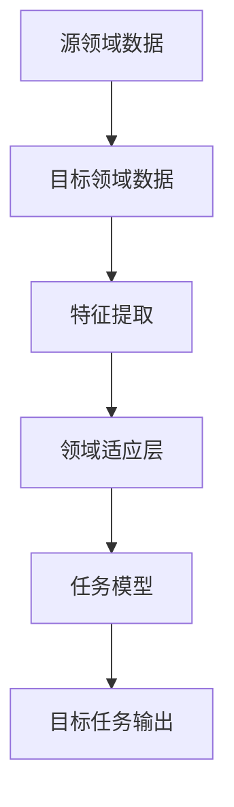
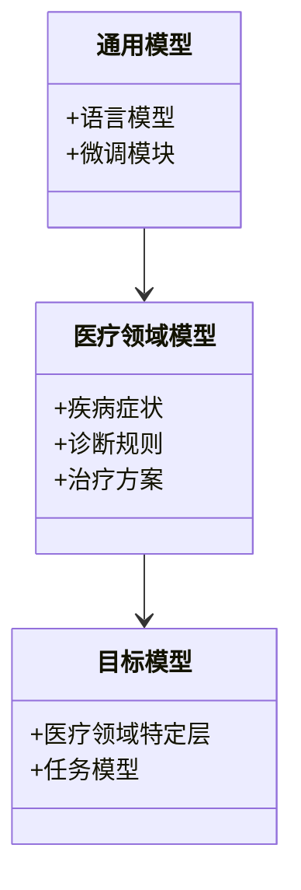
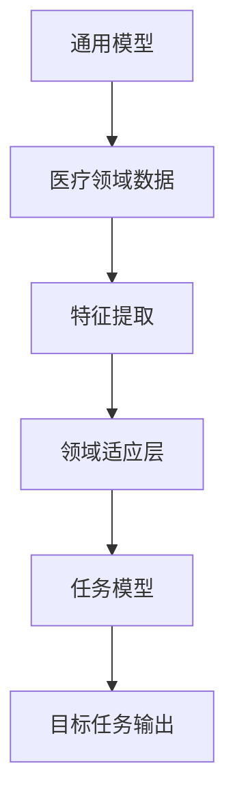
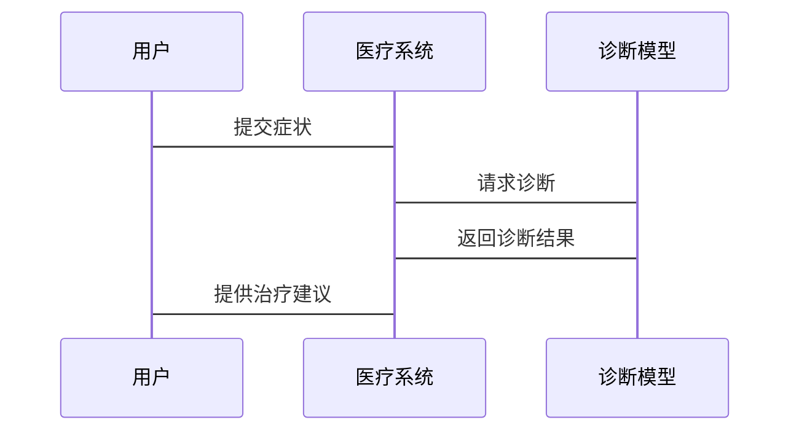

                 


# AI Agent的领域迁移学习：从通用LLM到专业模型

> **关键词**：AI Agent, 领域迁移学习, 大语言模型, 专业模型, 迁移学习, 模型微调

> **摘要**：  
本文系统地探讨了AI Agent在领域迁移学习中的应用，重点分析了从通用大语言模型（LLM）到专业模型的迁移过程。文章首先介绍了AI Agent和领域迁移学习的基本概念，接着分析了通用LLM与专业模型的差异，详细讲解了领域迁移学习的核心算法与实现方法。随后，从系统架构设计、项目实战、最佳实践等多个维度深入探讨了领域迁移学习的实际应用，并通过具体案例展示了如何将通用模型迁移到特定领域，最终实现专业模型的构建与优化。

---

## # 第1章: AI Agent与领域迁移学习概述

### ## 1.1 AI Agent的基本概念

#### ### 1.1.1 AI Agent的定义与特点
AI Agent（人工智能代理）是指能够感知环境、自主决策并执行任务的智能实体。它具备以下特点：
- **自主性**：能够自主决策，无需外部干预。
- **反应性**：能够实时感知环境并做出响应。
- **目标导向**：具备明确的目标导向性，能够为实现目标而行动。

#### ### 1.1.2 领域迁移学习的定义与背景
领域迁移学习（Domain Adaptation）是指将从一个领域学到的知识应用到另一个相关领域的学习过程。其核心在于利用源领域（source domain）的数据来提高目标领域（target domain）的任务性能。

#### ### 1.1.3 AI Agent与领域迁移学习的关系
AI Agent需要在不同领域中执行任务，而领域迁移学习为其提供了跨领域知识迁移的能力。通过领域迁移学习，AI Agent能够快速适应新领域，提升其在特定任务中的表现。

### ## 1.2 领域迁移学习的重要性

#### ### 1.2.1 通用LLM的局限性
通用大语言模型虽然具备强大的语言理解和生成能力，但在特定领域中的表现往往不够理想，主要表现在：
- 数据覆盖不足：通用模型的训练数据通常来自广泛领域，缺乏对特定领域的深度覆盖。
- 领域适应性差：通用模型在特定领域中的泛化能力有限，难以满足专业需求。

#### ### 1.2.2 领域迁移学习的核心作用
领域迁移学习能够有效地将通用模型的能力迁移到特定领域，通过适应性调整，提升模型在目标领域的性能。

#### ### 1.2.3 领域迁移学习的应用场景
- **医疗领域**：将通用模型迁移到医疗领域，提升疾病诊断和治疗方案推荐的准确性。
- **金融领域**：将通用模型迁移到金融领域，优化风险评估和投资策略。

### ## 1.3 本书的核心目标与结构

#### ### 1.3.1 从通用LLM到专业模型的迁移过程
本文将详细探讨从通用大语言模型到专业模型的迁移过程，包括数据准备、模型微调、评估优化等关键步骤。

#### ### 1.3.2 本书的章节安排与学习路径
本文将从理论到实践，逐步引导读者掌握领域迁移学习的核心概念和实现方法。

---

## # 第2章: 通用LLM与专业模型的对比分析

### ## 2.1 通用LLM的特点与优势

#### ### 2.1.1 通用LLM的泛化能力
通用模型能够处理多种语言和任务，具备较强的泛化能力。

#### ### 2.1.2 通用LLM的训练数据特点
通用模型的训练数据来自广泛领域，数据量大，但缺乏领域深度。

#### ### 2.1.3 通用LLM的应用边界
通用模型在特定领域中的表现有限，难以满足专业需求。

### ## 2.2 专业模型的特点与局限性

#### ### 2.2.1 专业模型的领域专注性
专业模型专注于特定领域，具备较高的领域适应性。

#### ### 2.2.2 专业模型的训练数据特点
专业模型的训练数据来自特定领域，数据量可能较小，但领域相关性高。

#### ### 2.2.3 专业模型的可解释性问题
专业模型的可解释性较差，难以满足某些领域对透明性的要求。

### ## 2.3 通用LLM与专业模型的对比分析

#### ### 2.3.1 对比维度与关键指标
| 对比维度       | 通用LLM特点                     | 专业模型特点                     |
|----------------|--------------------------------|--------------------------------|
| 数据覆盖       | 广泛领域，数据量大              | 特定领域，数据量小              |
| 领域适应性     | 泛化能力强，领域适应性差        | 领域适应性强，泛化能力弱        |
| 可解释性       | 可解释性一般                    | 可解释性较差                    |

#### ### 2.3.2 数据驱动 vs 知识驱动的差异
通用模型主要依赖数据驱动，而专业模型更注重知识的领域专注性。

#### ### 2.3.3 通用性与专业性的权衡
在实际应用中，需要根据具体需求在通用性和专业性之间进行权衡。

---

## # 第3章: 领域迁移学习的核心算法与实现

### ## 3.1 领域迁移学习的基本原理

#### ### 3.1.1 领域迁移学习的定义与目标
领域迁移学习的目标是通过调整模型参数，使得模型在目标领域中的性能得到提升。

#### ### 3.1.2 领域迁移学习的核心假设
源领域和目标领域之间存在某种潜在的相似性，可以通过迁移学习将源领域的知识应用到目标领域。

#### ### 3.1.3 领域迁移学习的实现框架


### ## 3.2 基于迁移学习的模型微调方法

#### ### 3.2.1 模型微调的基本原理
模型微调（Fine-tuning）是指在保持模型主体结构不变的情况下，对模型参数进行微调，以适应目标领域。

#### ### 3.2.2 参数初始化与迁移策略
- **参数初始化**：通常保持主干网络的参数不变，仅对目标领域的特定层进行微调。
- **迁移策略**：通过调整学习率和优化目标函数，实现领域适应。

#### ### 3.2.3 微调过程中的关键参数调整
- **学习率**：通常采用较小的学习率，以避免破坏已学习的特征。
- **批量大小**：适当调整批量大小，以平衡训练效率和模型稳定性。

### ## 3.3 领域迁移学习的算法实现

#### ### 3.3.1 基于PyTorch的迁移学习实现
```python
import torch
from torch import nn
from torch.optim import Adam
from transformers import AutoTokenizer, AutoModelForMaskedLM

# 加载预训练模型
model = AutoModelForMaskedLM.from_pretrained('bert-base-uncased')
tokenizer = AutoTokenizer.from_pretrained('bert-base-uncased')

# 定义微调任务
class Adapter(nn.Module):
    def __init__(self, model, adapter_dim=128):
        super(Adapter, self).__init__()
        self.bert = model
        self.adapter = nn.Linear(model.config.hidden_size, adapter_dim)
        self.dropout = nn.Dropout(0.1)
        self.classifier = nn.Linear(adapter_dim, num_labels)

    def forward(self, input_ids, attention_mask):
        outputs = self.bert(input_ids=input_ids, attention_mask=attention_mask)
        pooled_output = outputs.pooler_output
        adapter_output = self.adapter(pooled_output)
        adapter_output = self.dropout(adapter_output)
        logits = self.classifier(adapter_output)
        return logits

# 初始化模型
adapter_model = Adapter(model)
optimizer = Adam(adapter_model.parameters(), lr=1e-5)
criterion = nn.CrossEntropyLoss()

# 训练循环
for epoch in range(num_epochs):
    adapter_model.train()
    for batch in train_loader:
        optimizer.zero_grad()
        input_ids, attention_mask, labels = batch
        outputs = adapter_model(input_ids=input_ids, attention_mask=attention_mask)
        loss = criterion(outputs, labels)
        loss.backward()
        optimizer.step()
```

#### ### 3.3.2 模型微调的代码实现
```python
# 训练过程
import torch
from torch.utils.data import DataLoader
from torch.nn import CrossEntropyLoss
from transformers import AdamW

def train_model(model, train_loader, num_epochs=3, learning_rate=2e-5):
    optimizer = AdamW(model.parameters(), lr=learning_rate)
    criterion = CrossEntropyLoss()
    device = torch.device('cuda' if torch.cuda.is_available() else 'cpu')
    model.to(device)
    
    for epoch in range(num_epochs):
        model.train()
        for inputs, labels in train_loader:
            optimizer.zero_grad()
            outputs = model(**inputs)
            loss = criterion(outputs.logits, labels)
            loss.backward()
            optimizer.step()
    return model

# 示例用法
model = AutoModelForMaskedLM.from_pretrained('bert-base-uncased')
adapter = Adapter(model)
train_loader = ...  # 定义训练数据加载器
adapter = train_model(adapter, train_loader, num_epochs=3, learning_rate=2e-5)
```

#### ### 3.3.3 算法原理的数学模型和公式
模型微调的目标函数可以表示为：
$$ L = \lambda_1 L_{cls} + \lambda_2 L_{adv} $$
其中，$L_{cls}$ 是分类损失，$L_{adv}$ 是领域对抗损失，$\lambda_1$ 和 $\lambda_2$ 是调节系数。

---

## # 第4章: 领域迁移学习的系统架构设计

### ## 4.1 问题场景介绍

#### ### 4.1.1 问题背景
本文将通过一个医疗领域的案例，展示如何将通用模型迁移到特定领域。

#### ### 4.1.2 项目介绍
目标是将通用的大语言模型迁移到医疗领域，提升疾病诊断的准确性。

### ## 4.2 系统功能设计

#### ### 4.2.1 领域模型设计


#### ### 4.2.2 系统架构设计


### ## 4.3 系统接口设计与交互流程

#### ### 4.3.1 系统接口设计
- **输入接口**：医疗领域的训练数据和测试数据。
- **输出接口**：诊断结果和治疗建议。

#### ### 4.3.2 系统交互流程


---

## # 第5章: 领域迁移学习的项目实战

### ## 5.1 环境安装与配置

#### ### 5.1.1 安装依赖
```bash
pip install torch transformers
```

#### ### 5.1.2 配置运行环境
- **硬件要求**：建议使用GPU加速。
- **软件版本**：确保PyTorch和Transformers库的版本兼容。

### ## 5.2 核心实现

#### ### 5.2.1 数据准备
```python
import pandas as pd
from torch.utils.data import Dataset, DataLoader

class MedicalDataset(Dataset):
    def __init__(self, texts, labels):
        self.texts = texts
        self.labels = labels
    
    def __len__(self):
        return len(self.texts)
    
    def __getitem__(self, idx):
        text = self.texts[idx]
        label = self.labels[idx]
        return {
            'input_ids': tokenizer.encode(text, padding='max_length', truncation=True),
            'attention_mask': [1] * len(tokenizer.encode(text)),
            'labels': label
        }
```

#### ### 5.2.2 模型实现
```python
class MedicalAdapter(nn.Module):
    def __init__(self, model, num_classes=2):
        super(MedicalAdapter, self).__init__()
        self.bert = model
        self.dropout = nn.Dropout(0.1)
        self.classifier = nn.Linear(self.bert.config.hidden_size, num_classes)
    
    def forward(self, input_ids, attention_mask):
        outputs = self.bert(input_ids=input_ids, attention_mask=attention_mask)
        pooled_output = outputs.pooler_output
        pooled_output = self.dropout(pooled_output)
        logits = self.classifier(pooled_output)
        return logits
```

#### ### 5.2.3 训练与评估
```python
def evaluate_model(model, test_loader):
    model.eval()
    total_loss = 0
    correct = 0
    with torch.no_grad():
        for inputs, labels in test_loader:
            outputs = model(**inputs)
            loss = criterion(outputs.logits, labels)
            total_loss += loss.item()
            preds = torch.argmax(outputs.logits, dim=1)
            correct += (preds == labels).sum().item()
    accuracy = correct / len(test_loader.dataset)
    return accuracy, total_loss / len(test_loader)

# 示例用法
model = MedicalAdapter(bert_model)
train_loader = DataLoader(train_dataset, batch_size=32, shuffle=True)
test_loader = DataLoader(test_dataset, batch_size=32, shuffle=False)
model = train_model(model, train_loader, num_epochs=3, learning_rate=2e-5)
accuracy, loss = evaluate_model(model, test_loader)
print(f"Accuracy: {accuracy:.4f}, Loss: {loss:.4f}")
```

### ## 5.3 实际案例分析

#### ### 5.3.1 案例背景
将通用模型迁移到医疗领域，用于疾病诊断。

#### ### 5.3.2 数据分析与预处理
- **数据清洗**：去除无关信息，提取疾病症状。
- **数据增强**：通过数据增强技术，提升模型的鲁棒性。

#### ### 5.3.3 模型训练与优化
- **训练策略**：采用小批量训练，防止过拟合。
- **优化技巧**：调整学习率和批量大小，优化模型性能。

### ## 5.4 项目小结

#### ### 5.4.1 核心实现总结
通过模型微调和领域适应，成功将通用模型迁移到医疗领域。

#### ### 5.4.2 模型性能提升
模型在医疗领域的诊断准确率显著提升。

---

## # 第6章: 领域迁移学习的总结与展望

### ## 6.1 核心总结

#### ### 6.1.1 理论总结
领域迁移学习通过调整模型参数，实现了通用模型向专业模型的迁移。

#### ### 6.1.2 实践总结
通过具体案例，验证了领域迁移学习的有效性和实用性。

### ## 6.2 最佳实践 tips

#### ### 6.2.1 数据准备
- 确保目标领域的数据质量。
- 采用数据增强技术，提升模型的鲁棒性。

#### ### 6.2.2 模型优化
- 合理调整学习率和批量大小。
- 定期进行模型评估，防止过拟合。

#### ### 6.2.3 系统架构
- 设计清晰的系统架构，便于后续扩展和优化。

### ## 6.3 未来展望

#### ### 6.3.1 技术发展
未来将探索更高效的迁移学习算法，提升模型的迁移能力。

#### ### 6.3.2 应用场景
领域迁移学习将在更多领域中得到应用，推动AI技术的进一步发展。

---

## # 作者信息

**作者：AI天才研究院/AI Genius Institute & 禅与计算机程序设计艺术 /Zen And The Art of Computer Programming**

---

以上是完整的目录和文章内容框架，您可以根据实际需求进行进一步的扩展和详细编写。

