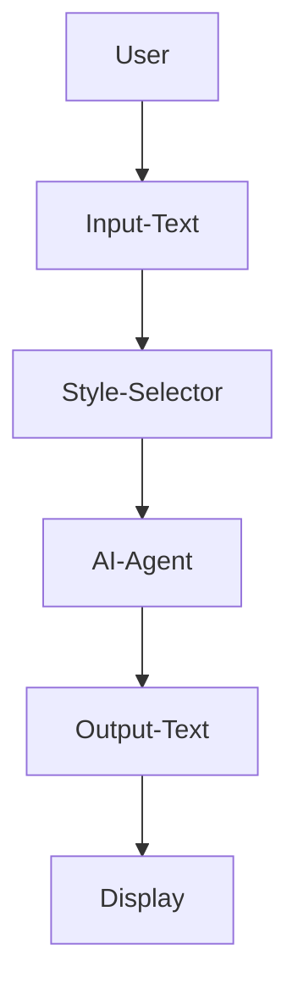

                 


# AI Agent的风格迁移：实现LLM的个性化表达

## 关键词：AI Agent、风格迁移、LLM、个性化表达、文本生成、自然语言处理、深度学习

## 摘要：  
本文探讨如何通过AI Agent实现大语言模型（LLM）的个性化表达，重点分析风格迁移的技术原理、实现方法及其在文本生成中的应用。通过背景介绍、核心概念、算法原理、系统架构、项目实战等部分，深入解析风格迁移在AI Agent中的作用，帮助读者理解如何利用深度学习技术让LLM生成更具个性化和多样化的文本内容。

---

# 第一部分: AI Agent的风格迁移概述

## 第1章: AI Agent与风格迁移的背景介绍

### 1.1 问题背景与描述
#### 1.1.1 AI Agent的核心概念
AI Agent（人工智能代理）是一种能够感知环境、自主决策并执行任务的智能实体。在自然语言处理领域，AI Agent通常指能够理解和生成人类语言的智能系统，例如智能对话系统、文本生成工具等。

#### 1.1.2 风格迁移的定义与特点
风格迁移是指将一种风格的文本内容转换为另一种风格的过程。例如，将正式的法律文本转换为口语化的解释文本，或将文学性强的文本转换为技术文档。风格迁移的核心在于保留原文内容的同时，改变其表达方式。

#### 1.1.3 LLM在风格迁移中的应用
大语言模型（LLM）如GPT-3、PaLM等具备强大的文本生成能力，能够通过风格迁移技术生成符合特定需求的文本。例如，在客户服务中，AI Agent可以根据用户偏好生成不同语气的回复；在内容创作中，AI Agent可以将复杂的技术文档转换为易于理解的文章。

### 1.2 问题解决与边界
#### 1.2.1 风格迁移在AI Agent中的作用
风格迁移使AI Agent能够适应不同的应用场景和用户需求。例如，在教育领域，AI Agent可以将复杂的学术论文转化为学生易于理解的语言；在商业领域，AI Agent可以生成符合品牌风格的营销文案。

#### 1.2.2 风格迁移的边界与外延
风格迁移的边界在于保持原文内容不变，同时改变表达方式。外延则包括从文本到图像、音频等多种形式的风格迁移。本文主要关注文本领域的风格迁移。

#### 1.2.3 核心概念的结构与组成
风格迁移的实现涉及特征提取、风格编码、内容保持和风格融合四个关键步骤。特征提取用于提取文本内容的语义信息，风格编码用于捕捉目标风格的特征，内容保持确保生成文本与原文内容一致，风格融合则是将目标风格应用于原文内容的过程。

### 1.3 核心要素与概念联系
#### 1.3.1 核心要素的对比分析
| 核心要素 | 描述 |
|----------|------|
| 内容 | 文本的主题和信息 |
| 风格 | 文本的表达方式和语气 |
| 语境 | 生成文本的上下文环境 |
| 目标 | 用户期望的生成结果 |

#### 1.3.2 ER实体关系图的构建
```mermaid
er
    entity AI-Agent {
        id
        name
        style-preference
    }
    entity Style-Features {
        id
        feature-name
        feature-value
    }
    entity Text-Content {
        id
        text
        context
    }
    AI-Agent -- Style-Features: 使用特定风格特征进行生成
    AI-Agent -- Text-Content: 根据上下文生成相关内容
    Style-Features -- Text-Content: 风格特征应用于文本内容
```

---

## 第2章: 核心概念与联系

### 2.1 风格迁移与LLM的关系
#### 2.1.1 风格迁移的原理
风格迁移通过改变文本的表达方式，使其适应特定场景或用户需求。LLM具备强大的文本生成能力，能够通过微调或提示工程技术实现风格迁移。

#### 2.1.2 LLM的核心属性特征
- **上下文理解能力**：LLM能够理解文本的上下文关系。
- **多语言支持**：LLM能够处理多种语言和文化背景的文本。
- **生成多样性**：LLM能够生成多种风格和语气的文本。

#### 2.1.3 核心概念的联系分析
风格迁移依赖于LLM的文本生成能力，而LLM则通过风格迁移技术实现个性化表达。两者相辅相成，共同推动AI Agent在文本生成领域的应用。

### 2.2 核心概念的对比分析
#### 2.2.1 风格迁移与传统文本生成的对比
| 方面       | 风格迁移         | 传统文本生成       |
|------------|------------------|-------------------|
| 目标       | 改变表达方式     | 生成新内容       |
| 输入       | 原文内容 + 风格  | 无特定输入风格   |
| 输出       | 与原文内容一致   | 内容可能不同      |

#### 2.2.2 LLM与传统NLP模型的对比
| 方面       | LLM             | 传统NLP模型       |
|------------|------------------|-------------------|
| 模型复杂度  | 高度复杂         | 较低复杂度         |
| 上下文理解 | 强大的上下文理解 | 较弱的上下文理解   |
| 生成能力   | 高度生成能力     | 较低生成能力       |

#### 2.2.3 实体关系图的绘制
```mermaid
er
    entity Style-Transfer {
        id
        source-style
        target-style
    }
    entity LLM {
        id
        model-parameters
    }
    Style-Transfer -- LLM: 使用LLM实现风格迁移
```

---

## 第3章: 算法原理与数学模型

### 3.1 风格迁移的算法原理
#### 3.1.1 变分自编码器（VAE）的原理
变分自编码器是一种生成模型，通过编码器将输入数据映射到潜在空间，再通过解码器将潜在空间的数据映射回原始数据空间。在风格迁移中，编码器用于提取文本内容的特征，解码器用于生成目标风格的文本。

#### 3.1.2 生成对抗网络（GAN）的原理
生成对抗网络由生成器和判别器组成。生成器负责生成目标风格的文本，判别器负责区分生成文本和真实文本。通过不断训练，生成器能够生成越来越逼真的文本。

#### 3.1.3 LLM的风格迁移算法
LLM的风格迁移算法通常基于微调（Fine-tuning）技术。通过在特定风格的数据集上微调LLM，使其能够生成符合目标风格的文本。

### 3.2 数学模型与公式
#### 3.2.1 VAE的数学模型
$$ p(x) = \int p_\theta(x|z)p(z)dz $$
其中，$p_\theta(x|z)$是解码器的概率分布，$p(z)$是潜在变量$z$的先验分布。

#### 3.2.2 GAN的数学模型
生成器的损失函数：
$$ \mathcal{L}_G = \mathbb{E}_{z \sim p(z)}[\log D(G(z))] $$
判别器的损失函数：
$$ \mathcal{L}_D = \mathbb{E}_{x \sim p(x)}[\log(1 - D(x))] + \mathbb{E}_{z \sim p(z)}[\log D(G(z))] $$

---

## 第4章: 系统分析与架构设计

### 4.1 系统功能设计
- **文本输入**：用户输入需要迁移风格的文本。
- **风格选择**：用户选择目标风格。
- **风格迁移**：系统根据选择的风格生成目标风格的文本。
- **结果输出**：生成的文本输出给用户。

### 4.2 系统架构设计


### 4.3 接口设计
- **输入接口**：接收用户输入的文本和风格选择。
- **输出接口**：输出生成的文本。

### 4.4 交互流程
1. 用户输入需要迁移风格的文本。
2. 用户选择目标风格。
3. AI Agent根据输入文本和目标风格生成新的文本。
4. 生成的文本输出给用户。

---

## 第5章: 项目实战

### 5.1 环境安装
- Python 3.8及以上
- PyTorch 1.9及以上
- transformers库

### 5.2 核心代码实现
```python
from transformers import AutoModelForCausalLM, AutoTokenizer

model_name = "gpt2"
tokenizer = AutoTokenizer.from_pretrained(model_name)
model = AutoModelForCausalLM.from_pretrained(model_name)

def transfer_style(source_text, target_style):
    input_ids = tokenizer.encode(source_text, return_tensors="pt")
    output = model.generate(input_ids, max_length=50, do_sample=True)
    return tokenizer.decode(output[0], skip_special_tokens=True)
```

### 5.3 案例分析
输入原文：“The quick brown fox jumps over the lazy dog.”
目标风格：幽默
生成结果：“The quick brown fox jumps over the lazy dog—what a show-off!”

---

## 第6章: 最佳实践与小结

### 6.1 小结
本文详细介绍了AI Agent的风格迁移技术，分析了其在LLM中的应用，展示了如何通过深度学习算法实现个性化表达。

### 6.2 注意事项
- 风格迁移需要大量高质量的训练数据。
- 在实际应用中，需注意文本生成的准确性和伦理问题。

### 6.3 未来趋势
未来，风格迁移技术将更加智能化和个性化，AI Agent将能够处理更多样化和复杂的风格迁移任务。

---

# 作者：AI天才研究院 & 禅与计算机程序设计艺术

---

**摘要：** 本文系统地探讨了AI Agent的风格迁移技术，分析了其在LLM中的应用，展示了如何通过深度学习算法实现个性化表达。通过背景介绍、核心概念、算法原理、系统架构、项目实战等部分，深入解析了风格迁移在AI Agent中的作用，帮助读者理解如何利用深度学习技术让LLM生成更具个性化和多样化的文本内容。

