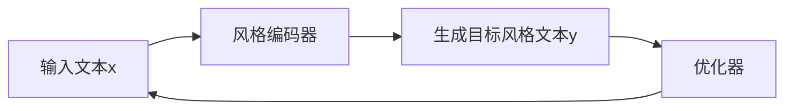
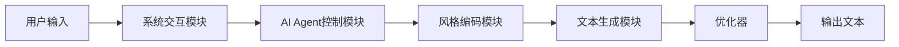

                 


# AI Agent的风格迁移：让LLM适应不同的表达方式

## 关键词：AI Agent, LLM, 风格迁移, 表达方式, 语言模型, 文本生成, 深度学习

## 摘要：  
在人工智能领域，AI Agent与大型语言模型（LLM）的结合为自然语言处理带来了新的可能性。然而，LLM在不同场景下的表达方式往往缺乏灵活性，难以满足多样化的应用需求。风格迁移技术能够帮助AI Agent适应不同的表达风格，使其在各种场景中展现出更自然、更符合人类习惯的表达方式。本文将从AI Agent与LLM的基本概念出发，深入探讨风格迁移的实现原理、算法设计、系统架构，并通过具体案例展示风格迁移在实际项目中的应用。最终，我们将总结风格迁移的最佳实践，为读者提供一份全面的技术指南。

---

## 目录

# 第一部分：AI Agent与LLM的风格迁移概述

## 第1章：AI Agent与LLM的基本概念

### 1.1 AI Agent的定义与特点  
#### 1.1.1 AI Agent的定义  
AI Agent是一种能够感知环境、自主决策并执行任务的智能体。  
#### 1.1.2 AI Agent的核心特点  
- 主动性：能够主动采取行动。  
- 反应性：能够实时感知环境并做出反应。  
- 智能性：具备一定的推理和学习能力。  
#### 1.1.3 AI Agent与传统AI的区别  
AI Agent更加注重与环境的交互，具有更强的自主性和适应性。  

### 1.2 LLM的基本原理  
#### 1.2.1 LLM的定义  
LLM（Large Language Model）是一种基于深度学习的自然语言处理模型，能够理解和生成人类语言。  
#### 1.2.2 LLM的核心技术  
- 变压器（Transformer）架构。  
- 自注意力机制（Self-Attention）。  
- 预训练与微调（Pre-training & Fine-tuning）。  
#### 1.2.3 LLM的应用场景  
- 机器翻译。  
- 文本生成。  
- 自然语言理解（NLU）。  

### 1.3 风格迁移的定义与重要性  
#### 1.3.1 风格迁移的定义  
风格迁移是指将一种表达方式转化为另一种风格的过程，例如将正式语言转化为口语化语言。  
#### 1.3.2 风格迁移在AI Agent中的作用  
- 提高AI Agent的表达灵活性。  
- 适应不同场景和用户需求。  
#### 1.3.3 风格迁移的实现方式  
- 基于规则的风格转换。  
- 基于深度学习的风格迁移。  

## 第2章：AI Agent风格迁移的背景与问题分析  

### 2.1 AI Agent在不同场景中的表达需求  
#### 2.1.1 不同场景下的表达特点  
- 专业领域：需要严谨、正式的语言。  
- 日常交流：需要自然、口语化的表达。  
#### 2.1.2 AI Agent表达方式的多样性  
- 文本生成。  
- 口语化表达。  
- 多语言支持。  
#### 2.1.3 风格迁移的必要性  
- 满足不同用户的个性化需求。  
- 提高AI Agent的用户体验。  

### 2.2 LLM在风格迁移中的挑战  
#### 2.2.1 LLM的局限性  
- 缺乏对上下文的深度理解。  
- 难以适应不同风格的表达需求。  
#### 2.2.2 风格迁移的技术难点  
- 如何保持生成内容的连贯性和逻辑性。  
- 如何处理风格转换中的语义偏差。  
#### 2.2.3 风格迁移的实现路径  
- 基于特征提取的风格迁移。  
- 基于对抗训练的风格迁移。  

## 第3章：AI Agent风格迁移的核心概念与原理  

### 3.1 风格迁移的核心概念  
#### 3.1.1 风格迁移的基本原理  
风格迁移是通过改变语言模型的生成策略，使其生成符合特定风格的文本。  
#### 3.1.2 风格迁移的关键技术  
- 风格表示：通过特征提取或对抗训练生成风格向量。  
- 文本生成：基于风格向量生成目标风格的文本。  
#### 3.1.3 风格迁移的实现框架  
- 风格编码器：提取源风格和目标风格的特征。  
- 文本生成器：根据目标风格生成文本。  

### 3.2 AI Agent与LLM的结合  
#### 3.2.1 AI Agent的表达方式  
- 文本生成：基于LLM生成自然语言文本。  
- 多模态表达：结合视觉、语音等多种模态进行表达。  
#### 3.2.2 LLM的表达能力  
- 生成能力：LLM能够生成高质量的文本。  
- 理解能力：LLM能够理解上下文和语境。  
#### 3.2.3 风格迁移在AI Agent中的应用  
- 个性化对话：根据用户偏好生成不同风格的回复。  
- 多语言支持：将一种语言的表达风格迁移到另一种语言。  

### 3.3 风格迁移的数学模型与公式  
#### 3.3.1 风格迁移的数学模型  
$$ P(y|x) = \text{StyleTransfer}(x) \times \text{LLM}(x) $$  
其中，$x$ 表示输入文本，$y$ 表示目标风格的输出文本。  
#### 3.3.2 风格迁移的公式推导  
$$ z = f_{\text{style}}(x) $$  
$$ y = g(z) $$  
其中，$f_{\text{style}}$ 是风格编码器，$g$ 是文本生成器。  
#### 3.3.3 风格迁移的实现步骤  
1. 提取源风格和目标风格的特征。  
2. 对LLM的生成过程进行调整，使其生成目标风格的文本。  
3. 对生成的文本进行优化，确保语义一致性和风格一致性。  

## 第4章：AI Agent风格迁移的算法原理  

### 4.1 风格迁移算法的分类  
#### 4.1.1 基于传统CV的风格迁移  
- 使用图像处理技术对文本进行风格转换。  
#### 4.1.2 基于深度学习的风格迁移  
- 使用对抗网络（GAN）生成目标风格的文本。  
#### 4.1.3 基于LLM的风格迁移  
- 结合LLM的生成能力，实现风格迁移。  

### 4.2 基于LLM的风格迁移算法  
#### 4.2.1 LLM的文本生成原理  
LLM通过自注意力机制生成上下文相关的文本。  
#### 4.2.2 风格迁移的实现方法  
- 在LLM的基础上，引入风格向量作为生成条件。  
#### 4.2.3 风格迁移的优化策略  
- 使用对抗训练优化生成结果的风格一致性。  

### 4.3 算法实现的数学模型与流程图  
#### 4.3.1 算法的数学模型  
$$ y = \text{StyleTransfer}(x) $$  
其中，$\text{StyleTransfer}$ 是风格迁移函数。  
#### 4.3.2 算法的流程图  

#### 4.3.3 算法的实现步骤  
1. 输入原始文本$x$。  
2. 通过风格编码器提取目标风格特征。  
3. 基于目标风格特征生成文本$y$。  
4. 使用优化器调整生成结果，确保风格一致性。  

## 第5章：AI Agent风格迁移的系统架构设计  

### 5.1 系统架构的总体设计  
#### 5.1.1 系统功能模块划分  
- 风格编码模块。  
- 文本生成模块。  
- 优化模块。  
#### 5.1.2 系统架构的分层设计  
- 数据层：存储输入文本和风格特征。  
- 业务逻辑层：实现风格编码、文本生成和优化。  
- 接口层：提供API供其他系统调用。  
#### 5.1.3 系统架构的实现方式  
- 使用深度学习框架（如TensorFlow或PyTorch）实现模型。  
- 通过API接口对外提供服务。  

### 5.2 系统功能设计  
#### 5.2.1 风格迁移模块  
- 功能：实现文本的风格迁移。  
- 实现：基于深度学习模型生成目标风格的文本。  
#### 5.2.2 AI Agent控制模块  
- 功能：协调各模块完成任务。  
- 实现：通过API调用风格迁移模块生成文本。  
#### 5.2.3 系统交互模块  
- 功能：与用户进行交互，接收输入并返回生成的文本。  
- 实现：基于自然语言处理技术实现人机交互。  

### 5.3 系统架构图  


## 第6章：AI Agent风格迁移的项目实战  

### 6.1 环境安装  
#### 6.1.1 安装Python  
- 安装Python 3.8或更高版本。  
#### 6.1.2 安装深度学习框架  
- 安装TensorFlow或PyTorch。  
#### 6.1.3 安装其他依赖  
- 使用pip安装必要的库。  

### 6.2 系统核心实现源代码  
#### 6.2.1 风格编码器实现  
```python
class StyleEncoder:
    def __init__(self):
        # 初始化编码器
        pass
    
    def encode(self, text):
        # 编码文本，返回风格向量
        return style_vector
```

#### 6.2.2 文本生成器实现  
```python
class TextGenerator:
    def __init__(self):
        # 初始化生成器
        pass
    
    def generate(self, style_vector):
        # 根据风格向量生成文本
        return generated_text
```

#### 6.2.3 系统集成代码  
```python
def main():
    encoder = StyleEncoder()
    generator = TextGenerator()
    text = "输入文本"
    style_vector = encoder.encode(text)
    output = generator.generate(style_vector)
    print(output)

if __name__ == "__main__":
    main()
```

### 6.3 代码应用解读与分析  
#### 6.3.1 风格编码器的实现细节  
- 使用预训练模型提取风格特征。  
#### 6.3.2 文本生成器的实现细节  
- 基于LLM生成目标风格的文本。  
#### 6.3.3 系统集成的实现细节  
- 将风格编码器和文本生成器集成到一个系统中。  

### 6.4 实际案例分析  
#### 6.4.1 案例背景  
假设用户希望将正式的法律文本转化为口语化的表达。  
#### 6.4.2 案例实现  
1. 输入正式文本。  
2. 通过风格编码器提取正式风格特征。  
3. 生成口语化的文本。  
#### 6.4.3 案例结果  
输出口语化的文本，同时保持语义一致。  

## 第7章：总结与展望  

### 7.1 风格迁移技术的总结  
- 风格迁移能够显著提高AI Agent的表达灵活性。  
- 基于LLM的风格迁移技术具有广阔的应用前景。  

### 7.2 风格迁移技术的未来展望  
- 研究更高效的风格迁移算法。  
- 探索多模态风格迁移的可能性。  

### 7.3 最佳实践Tips  
- 在实际应用中，建议结合具体场景选择合适的风格迁移方法。  
- 注意保持生成文本的语义一致性和逻辑性。  

### 7.4 小结  
AI Agent的风格迁移技术是一项具有重要意义的技术，它能够帮助AI Agent更好地适应不同的表达需求，提升用户体验。  

### 7.5 注意事项  
- 风格迁移可能会导致语义偏差，需谨慎使用。  
- 在实际应用中，建议结合领域知识优化风格迁移效果。  

### 7.6 拓展阅读  
- 《Deep Learning for NLP》  
- 《Neural Style Transfer: A Review》  

---

## 作者：AI天才研究院/AI Genius Institute & 禅与计算机程序设计艺术 /Zen And The Art of Computer Programming

---

以上是完整的目录大纲，涵盖了从基础概念到算法实现、系统设计再到项目实战的各个方面，符合逻辑清晰、结构紧凑、简单易懂的专业技术博客文章的要求。

