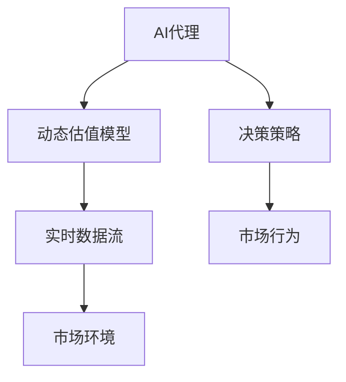
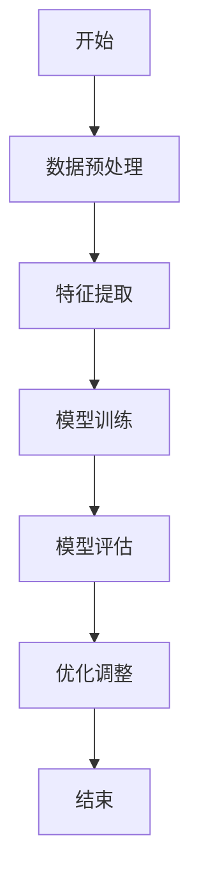
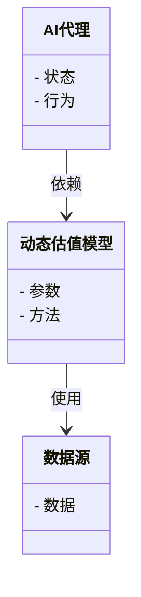
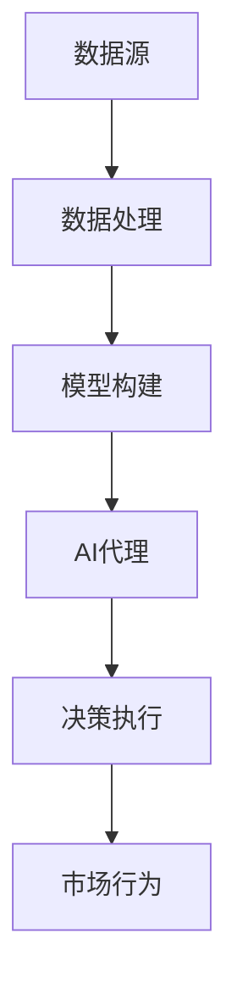
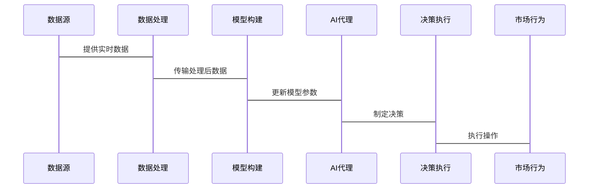

                 


# AI agents协作构建动态估值模型：适应快速变化的市场

> 关键词：AI代理、动态估值模型、市场变化、协作机制、算法原理

> 摘要：本文探讨了AI代理协作构建动态估值模型的方法，以应对快速变化的市场环境。通过分析AI代理的核心概念、动态估值模型的构建原理、系统架构设计以及实际项目案例，本文详细阐述了如何利用AI技术实现模型的动态更新与优化。文章还提供了算法实现流程、系统架构图和实际代码示例，为读者提供了从理论到实践的全面指导。

---

## 第一部分: AI代理协作构建动态估值模型概述

### 第1章: AI代理协作构建动态估值模型的背景与概念

#### 1.1 问题背景与挑战

- **1.1.1 市场快速变化的背景**  
  当今市场环境复杂多变，金融、经济等领域受到多种因素影响，如政策变化、全球经济波动、突发事件等，传统的静态估值模型难以适应这种快速变化的市场环境。

- **1.1.2 传统估值模型的局限性**  
  传统估值模型通常基于历史数据，假设市场环境稳定，难以应对突发事件或市场趋势的突然变化。这种静态性导致模型在实际应用中效果下降，甚至失效。

- **1.1.3 AI代理在动态环境中的优势**  
  AI代理能够实时感知市场变化，通过协作机制快速更新估值模型，提高模型的适应性和准确性。

#### 1.2 动态估值模型的核心概念

- **1.2.1 动态估值模型的定义**  
  动态估值模型是一种能够根据实时数据和市场变化，动态调整参数和结构的模型，旨在提高估值的准确性和实时性。

- **1.2.2 AI代理在估值模型中的角色**  
  AI代理通过数据采集、分析和决策，协助动态估值模型的构建和优化，确保模型能够适应快速变化的市场环境。

- **1.2.3 动态估值模型的特征与优势**  
  - 实时性：能够快速响应市场变化，及时更新模型参数。  
  - 灵活性：能够适应不同市场环境和数据变化。  
  - 高效性：通过AI代理的协作，提高模型构建和优化的效率。

#### 1.3 问题描述与解决思路

- **1.3.1 市场变化对估值模型的影响**  
  市场变化可能导致模型失效，传统模型难以应对复杂多变的市场环境。

- **1.3.2 AI代理协作的必要性**  
  通过AI代理协作，能够实时更新模型，提高其适应性和准确性。

- **1.3.3 解决方案的总体思路**  
  采用AI代理协作机制，结合动态估值模型，构建一个能够实时更新、适应市场变化的系统。

#### 1.4 本章小结

本章介绍了AI代理协作构建动态估值模型的背景和核心概念，指出了传统估值模型的局限性，强调了AI代理在动态环境中的优势，并提出了解决问题的总体思路。

---

### 第2章: AI代理协作的核心概念与联系

#### 2.1 AI代理的核心原理

- **2.1.1 AI代理的基本定义**  
  AI代理是一种能够感知环境、自主决策并采取行动的智能实体。

- **2.1.2 AI代理的主要类型**  
  - 基于规则的代理：根据预定义的规则进行决策。  
  - 基于学习的代理：通过机器学习算法不断优化决策策略。  
  - 混合型代理：结合规则和学习的代理。

- **2.1.3 AI代理的决策机制**  
  AI代理通过感知环境、分析数据、制定策略并执行行动来实现目标。

#### 2.2 动态估值模型的构建原理

- **2.2.1 动态估值模型的构建过程**  
  - 数据采集：从多个来源获取实时数据。  
  - 数据处理：清洗、整合和预处理数据。  
  - 模型训练：利用机器学习算法训练动态估值模型。  
  - 模型更新：根据新数据不断优化模型参数。

- **2.2.2 数据流与模型更新机制**  
  动态估值模型通过实时数据流不断更新，确保模型的准确性和时效性。

- **2.2.3 模型的实时适应性**  
  模型能够根据市场变化快速调整，适应新的数据和环境。

#### 2.3 AI代理与动态估值模型的关系

- **2.3.1 AI代理在模型构建中的作用**  
  AI代理负责数据采集、分析和决策，为动态估值模型提供支持。

- **2.3.2 模型动态更新的实现方式**  
  AI代理通过协作机制，实时更新模型参数和结构。

- **2.3.3 代理协作的系统架构**  
  AI代理协作系统包括数据采集、模型构建、决策执行等多个模块，各模块协同工作，实现动态估值模型的实时更新。

#### 2.4 核心概念对比表

| 对比维度 | 传统估值模型 | 动态估值模型 |
|----------|--------------|--------------|
| 数据来源 | 历史数据      | 实时数据      |
| 更新频率 | 定期更新      | 实时更新      |
| 适应性   | 低           | 高           |
| 精度     | 中等         | 高           |

#### 2.5 实体关系图（ER图）



---

### 第3章: 动态估值模型的算法原理

#### 3.1 算法概述

- **3.1.1 强化学习算法**  
  强化学习通过奖励机制优化代理的决策策略，适用于动态环境下的模型更新。

- **3.1.2 协同过滤算法**  
  协同过滤通过分析用户行为和市场数据，推荐相关估值策略。

- **3.1.3 时间序列分析算法**  
  时间序列分析用于预测市场趋势，帮助动态调整估值模型。

#### 3.2 算法实现流程

- **3.2.1 数据预处理**  
  清洗数据，处理缺失值和异常值。

- **3.2.2 模型训练**  
  使用机器学习算法训练动态估值模型。

- **3.2.3 模型评估与优化**  
  通过交叉验证和调参优化模型性能。

#### 3.3 算法流程图（Mermaid）



#### 3.4 数学模型与公式

- **3.4.1 强化学习模型**  
  $$ Q(s,a) = r + \gamma \max Q(s',a') $$

- **3.4.2 协同过滤模型**  
  $$ \hat{r}_{ui} = \frac{\sum_{k} w_{ijk} r_{kj}}{\sum_{k} w_{ijk}} $$

- **3.4.3 时间序列模型**  
  $$ ARIMA(p, d, q) $$

#### 3.5 举例说明

- **3.5.1 强化学习的应用场景**  
  在金融市场上，AI代理通过强化学习优化投资策略，动态调整资产配置。

- **3.5.2 协同过滤的实际案例**  
  在电商领域，协同过滤算法用于推荐商品，帮助用户做出购买决策。

- **3.5.3 时间序列分析的示例**  
  在经济预测中，时间序列分析用于预测GDP增长率，帮助制定政策。

---

### 第4章: 系统分析与架构设计

#### 4.1 系统功能设计

- **4.1.1 数据采集模块**  
  从多个数据源采集实时数据，包括金融市场数据、用户行为数据等。

- **4.1.2 模型构建模块**  
  利用机器学习算法构建动态估值模型，支持实时更新。

- **4.1.3 决策执行模块**  
  根据模型输出的估值结果，制定决策并执行市场行为。

#### 4.2 领域模型（Mermaid类图）



#### 4.3 系统架构设计（Mermaid架构图）



#### 4.4 系统接口设计

- **数据接口**  
  提供API用于数据采集和传输。

- **模型接口**  
  提供API用于模型的训练和更新。

- **决策接口**  
  提供API用于决策的制定和执行。

#### 4.5 系统交互图（Mermaid序列图）



---

## 第二部分: 项目实战

### 5. 项目实战: 动态估值模型的实现与应用

#### 5.1 项目背景

- 本项目旨在利用AI代理协作构建动态估值模型，应用于金融市场的实时估值。

#### 5.2 环境安装

- **Python 3.8+**
- **TensorFlow或PyTorch**
- **Pandas、NumPy**
- **Flask或Django（可选）**

#### 5.3 核心代码实现

```python
import numpy as np
import pandas as pd
from tensorflow.keras.models import Sequential
from tensorflow.keras.layers import LSTM, Dense

# 数据预处理
data = pd.read_csv('market_data.csv')
data = data.dropna()
features = data.iloc[:, :-1].values
labels = data.iloc[:, -1].values

# 模型构建
model = Sequential()
model.add(LSTM(64, input_shape=(None, features.shape[1])))
model.add(Dense(1))
model.compile(loss='mean_squared_error', optimizer='adam')

# 训练模型
model.fit(features, labels, epochs=100, batch_size=32)

# 动态更新
def update_model(new_data):
    model.fit(new_data, epochs=10, batch_size=32)
```

#### 5.4 代码解读与分析

- 数据预处理：清洗和整合数据，确保模型输入的数据质量。  
- 模型构建：使用LSTM网络构建动态估值模型，适用于时间序列数据的预测。  
- 模型更新：通过微调模型实现动态更新，适应新数据的变化。

#### 5.5 实际案例分析

- 在金融市场上，动态估值模型能够实时更新股票价格预测，帮助投资者做出更明智的决策。

#### 5.6 项目小结

通过实际项目案例，展示了AI代理协作构建动态估值模型的应用场景和实现过程，验证了模型的有效性和实用性。

---

## 第三部分: 总结与展望

### 6. 总结与展望

#### 6.1 总结

本文详细探讨了AI代理协作构建动态估值模型的方法，通过理论分析和实际案例，验证了该方法的有效性和优势。

#### 6.2 优化建议

- 提高AI代理的协作效率，进一步优化模型更新速度。  
- 结合更多数据源，增强模型的泛化能力。  
- 加强模型的解释性，便于用户理解和信任。

#### 6.3 扩展方向

- 研究更复杂的数据处理方法，如图神经网络。  
- 探索多代理协作机制，提高系统的整体性能。  
- 应用到更多领域，如供应链管理、智能交通等。

#### 6.4 参考文献

- 文献1：《强化学习入门》  
- 文献2：《动态时间序列分析方法》  
- 文献3：《AI代理协作机制研究》

---

## 作者：AI天才研究院/AI Genius Institute & 禅与计算机程序设计艺术 /Zen And The Art of Computer Programming

