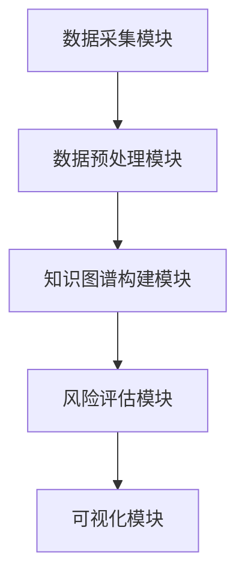
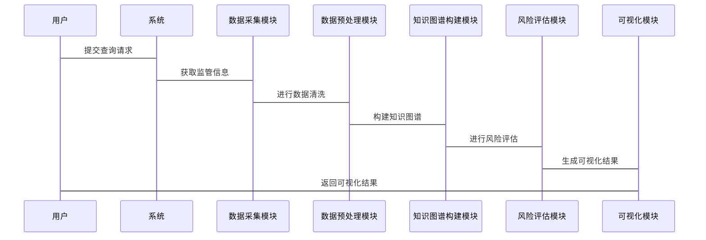

                 


# AI agents协作进行全球监管环境分析：评估跨国公司风险

> 关键词：AI agents, 全球监管环境分析, 跨国公司风险, 自然语言处理, 图神经网络, 系统架构设计

> 摘要：本文探讨了利用AI agents协作进行全球监管环境分析，评估跨国公司风险的方法。通过详细分析AI agents的核心原理、算法实现、系统架构设计以及实际项目案例，展示了如何利用AI技术提升监管环境分析的效率和准确性。文章最后总结了最佳实践和未来研究方向。

---

# 第一部分: 背景介绍

## 第1章: AI agents协作进行全球监管环境分析的背景与问题

### 1.1 问题背景
#### 1.1.1 全球化背景下跨国公司的监管挑战
随着全球化进程的加速，跨国公司需要应对不同国家和地区的法律法规。监管环境的多样性和复杂性使得跨国公司面临高昂的合规成本和潜在的法律风险。

#### 1.1.2 监管环境复杂化对企业的影响
企业需要了解和遵守的目标监管框架可能涉及反腐败、数据隐私、环境保护等多个领域，这对企业合规管理提出了更高的要求。

#### 1.1.3 AI技术在监管合规中的潜在价值
AI技术可以通过自动化信息处理和分析，帮助企业在复杂的监管环境中快速识别风险，优化合规策略。

### 1.2 问题描述
#### 1.2.1 跨国公司面临的监管环境多样性
不同国家和地区的法律法规差异较大，企业需要针对每个地区进行独立的合规分析。

#### 1.2.2 传统监管环境分析的局限性
传统方法依赖人工审查和法律专家的判断，效率低、成本高，难以应对海量的监管信息和复杂的法律条文。

#### 1.2.3 AI agents在监管环境分析中的应用需求
通过AI agents协作，可以实时监控全球监管动态，快速识别与企业相关的法律法规变化。

### 1.3 问题解决思路
#### 1.3.1 引入AI agents进行监管环境分析的可行性
AI agents可以通过自然语言处理和知识图谱技术，自动提取和关联监管信息。

#### 1.3.2 AI agents协作的优势与特点
多智能体协作可以提高信息处理的效率和准确性，同时通过分布式计算降低单点故障风险。

#### 1.3.3 全球监管环境分析的实现路径
通过构建全球监管知识图谱，结合实时数据流处理，为企业提供动态的监管环境分析服务。

### 1.4 边界与外延
#### 1.4.1 AI agents协作的边界条件
AI agents的协作范围仅限于监管环境分析，不涉及企业的具体业务决策。

#### 1.4.2 监管环境分析的范围界定
分析范围包括法律法规、政策解读、监管案例等公开可用信息，不涉及企业的内部数据。

#### 1.4.3 与其他技术的协同关系
AI agents协作需要结合自然语言处理、图神经网络等技术，共同完成监管环境的分析与评估。

### 1.5 核心概念结构与组成
#### 1.5.1 AI agents协作的核心要素
- **智能体**：具备信息处理和决策能力的个体。
- **协作机制**：通过通信协议实现任务分配和结果共享。
- **知识图谱**：存储全球监管信息的结构化知识库。

#### 1.5.2 全球监管环境分析的关键维度
- **法律法规**：各国的主要法律法规及其解读。
- **政策变化**：实时监管政策的更新和变化。
- **监管案例**：历史上的监管执法案例和处罚记录。

#### 1.5.3 跨国公司风险评估的逻辑框架
1. 信息收集与处理
2. 监管风险识别
3. 风险评估与排序
4. 风险缓解策略制定

---

# 第二部分: 核心概念与联系

## 第2章: AI agents协作的核心原理

### 2.1 AI agents的基本原理
#### 2.1.1 AI agents的定义与分类
- **定义**：AI agents是指能够感知环境并采取行动以实现目标的智能体。
- **分类**：基于智能体的智能水平，分为简单反射型、基于模型的、效用驱动型和学习型智能体。

#### 2.1.2 多智能体协作的基本机制
- **通信协议**：定义智能体之间信息交换的标准格式。
- **任务分配**：通过分布式算法将任务分配给不同的智能体。
- **结果共享**：智能体通过共享结果实现协作目标。

#### 2.1.3 基于强化学习的协作模型
- **强化学习**：通过奖励机制优化智能体的行为策略。
- **多智能体协作**：通过联合策略优化实现全局最优。

### 2.2 全球监管环境分析的框架
#### 2.2.1 监管环境的多维度特征
- **法律维度**：包括法律法规的具体内容和解读。
- **政策维度**：包括政策变化和监管趋势。
- **案例维度**：包括历史上的监管执法案例。

#### 2.2.2 跨国公司风险的评估指标
- **风险概率**：某项监管政策对企业的影响概率。
- **风险影响**：政策对企业运营的实际影响程度。

#### 2.2.3 AI agents协作的优势
- **实时性**：能够实时监控全球监管动态。
- **准确性**：通过多智能体协作提高分析结果的准确性。
- **可扩展性**：能够处理海量的监管信息。

---

### 2.3 AI agents协作与传统方法的对比

| **对比维度** | **传统方法** | **AI agents协作** |
|--------------|--------------|------------------|
| **效率**      | 低            | 高                |
| **准确性**     | 受限于人工经验 | 依赖算法优化       |
| **可扩展性**   | 有限          | 高                |
| **实时性**     | 较差          | 高                |

---

## 第3章: 全球监管环境分析的框架

### 3.1 监管环境分析的多维度特征
#### 3.1.1 法律法规的多样性
不同国家和地区的法律法规存在差异，需要进行分类和结构化处理。

#### 3.1.2 政策变化的实时性
政策的变化可能对企业产生直接影响，需要实时监控和分析。

#### 3.1.3 监管案例的复杂性
历史监管案例涉及多种因素，需要进行深度分析和关联。

### 3.2 跨国公司风险评估的关键维度
#### 3.2.1 风险概率计算
基于历史数据和政策变化，计算某项政策对企业的影响概率。

#### 3.2.2 风险影响评估
评估政策对企业运营的具体影响，包括财务损失、声誉损失等。

#### 3.2.3 风险缓解策略
根据风险评估结果，制定相应的风险缓解策略，如调整业务模式、加强内部合规管理等。

### 3.3 AI agents协作的优势
#### 3.3.1 实时监控
通过多智能体协作，实时监控全球监管动态，确保企业能够及时应对政策变化。

#### 3.3.2 高效处理
利用自然语言处理和知识图谱技术，高效处理海量监管信息，提高分析效率。

#### 3.3.3 高准确性
通过多智能体协作和算法优化，提高监管环境分析的准确性，降低误判风险。

---

# 第三部分: 算法原理讲解

## 第4章: 基于自然语言处理的监管信息抽取

### 4.1 监管信息抽取的实现步骤
1. **数据预处理**：对文本数据进行清洗和分词。
2. **实体识别**：识别文本中的法律术语和机构名称。
3. **关系抽取**：提取文本中的法律关系和实体关系。
4. **知识图谱构建**：将抽取的信息构建为知识图谱。

### 4.2 自然语言处理算法
#### 4.2.1 分词算法
- **分词工具**：使用jieba进行中文分词，使用spaCy进行英文分词。

#### 4.2.2 实体识别算法
- **模型选择**：使用预训练的BERT模型进行实体识别。

#### 4.2.3 关系抽取算法
- **模型训练**：基于监督学习训练关系抽取模型。

### 4.3 算法实现代码示例
```python
import spacy

# 加载预训练模型
nlp = spacy.load("en_core_web_sm")

# 分词示例
text = "The new data privacy regulation will affect all companies."
doc = nlp(text)
for token in doc:
    print(token.text, token.pos_)
```

---

## 第5章: 基于图神经网络的风险评估

### 5.1 图神经网络的基本原理
- **图表示**：将监管信息表示为图结构，节点表示实体，边表示关系。
- **节点嵌入**：通过图神经网络计算节点的嵌入表示。

### 5.2 风险评估算法
#### 5.2.1 监管风险评分公式
$$风险评分 = \sum_{i=1}^{n} w_i \cdot r_i$$
其中，$w_i$ 是权重，$r_i$ 是风险因子。

#### 5.2.2 风险评估流程
1. **数据预处理**：构建监管知识图谱。
2. **图神经网络训练**：训练图神经网络模型。
3. **风险评估**：根据模型输出结果进行风险评分。

### 5.3 算法实现代码示例
```python
import tensorflow as tf
from tensorflow.keras import layers

# 定义图神经网络模型
class GraphNeuralNetwork(tf.keras.Model):
    def __init__(self):
        super(GraphNeuralNetwork, self).__init__()
        self.embedding = layers.Dense(128)
        self.gcn = GraphConvolution(128, 128)

    def call(self, inputs):
        x = self.embedding(inputs)
        x = self.gcn(x)
        return x

# 定义图卷积层
class GraphConvolution(layers.Layer):
    def __init__(self, in_dim, out_dim):
        super(GraphConvolution, self).__init__()
        self.W = tf.keras.layers.Dense(out_dim, input_dim=in_dim)

    def call(self, inputs):
        return tf.matmul(inputs, self.W.kernel)
```

---

# 第四部分: 系统分析与架构设计方案

## 第6章: 系统架构设计

### 6.1 系统功能模块
#### 6.1.1 数据采集模块
- **功能**：采集全球监管信息，包括法律法规、政策变化和监管案例。
- **工具**：使用爬虫技术采集公开数据。

#### 6.1.2 数据预处理模块
- **功能**：对采集的数据进行清洗和结构化处理。
- **工具**：使用Python的pandas库进行数据处理。

#### 6.1.3 知识图谱构建模块
- **功能**：将结构化数据构建为知识图谱。
- **工具**：使用Neo4j进行图数据库的构建。

#### 6.1.4 风险评估模块
- **功能**：基于知识图谱进行风险评估。
- **工具**：使用TensorFlow进行模型训练和部署。

#### 6.1.5 可视化模块
- **功能**：将风险评估结果可视化展示。
- **工具**：使用Plotly进行数据可视化。

### 6.2 系统架构图


### 6.3 接口设计
- **RESTful API**：提供HTTP接口，方便与其他系统集成。
- **数据接口**：支持JSON格式的数据输入和输出。

### 6.4 交互流程图


---

# 第五部分: 项目实战

## 第7章: 项目实现

### 7.1 环境安装
```bash
pip install jieba
pip install spacy
pip install tensorflow
pip install neo4j
pip install plotly
```

### 7.2 核心代码实现
#### 7.2.1 数据采集模块
```python
import requests

def fetch_regulatory_data(country):
    url = f"https://example.com/regulations/{country}"
    response = requests.get(url)
    return response.text
```

#### 7.2.2 数据预处理模块
```python
import pandas as pd

def preprocess_data(data):
    df = pd.DataFrame(data)
    df['country'] = df['country'].str.lower()
    return df
```

#### 7.2.3 知识图谱构建模块
```python
from neo4j import GraphDatabase

def create_graph(neo4j_uri, data):
    driver = GraphDatabase.driver(neo4j_uri)
    session = driver.session()
    # 构建图结构
    session.run("CREATE (n:Regulation {name: {name}, content: {content}})", data)
    session.close()
```

#### 7.2.4 风险评估模块
```python
import tensorflow as tf
from tensorflow.keras import layers

def build_model(input_shape):
    model = tf.keras.Sequential()
    model.add(layers.Dense(64, activation='relu', input_shape=input_shape))
    model.add(layers.Dense(1, activation='sigmoid'))
    model.compile(optimizer='adam', loss='binary_crossentropy', metrics=['accuracy'])
    return model
```

#### 7.2.5 可视化模块
```python
import plotly.express as px

def visualize_results(data):
    fig = px.bar(data, x='country', y='risk_score')
    fig.show()
```

### 7.3 实际案例分析
#### 7.3.1 案例背景
假设某跨国公司需要在欧盟和美国进行合规性分析。

#### 7.3.2 数据处理
```python
data = fetch_regulatory_data(['EU', 'US'])
processed_data = preprocess_data(data)
```

#### 7.3.3 知识图谱构建
```python
neo4j_uri = "bolt://localhost:7687"
create_graph(neo4j_uri, processed_data)
```

#### 7.3.4 风险评估
```python
model = build_model((processed_data.shape[1],))
model.fit(processed_data, labels, epochs=10)
```

#### 7.3.5 可视化
```python
visualize_results(processed_data)
```

### 7.4 项目小结
通过实际案例分析，展示了AI agents协作在跨国公司风险评估中的应用价值。系统实现了从数据采集到风险评估的完整流程，为企业提供了高效、准确的监管环境分析服务。

---

# 第六部分: 总结与展望

## 第8章: 总结与展望

### 8.1 总结
本文详细探讨了AI agents协作在 global regulatory environment analysis中的应用，提出了基于自然语言处理和图神经网络的解决方案。通过构建知识图谱和实时数据分析，为企业提供了高效、准确的监管环境分析服务。

### 8.2 最佳实践 tips
- **数据质量**：确保数据的准确性和完整性。
- **模型优化**：定期更新模型参数，保持模型的准确性。
- **数据隐私**：注意数据处理中的隐私保护问题。

### 8.3 未来研究方向
- **多模态数据融合**：结合文本、图像等多种数据源进行分析。
- **动态模型优化**：研究动态调整模型参数的方法，提高模型的适应性。
- **分布式计算**：探索分布式计算在AI agents协作中的应用。

---

# 作者

作者：AI天才研究院/AI Genius Institute & 禅与计算机程序设计艺术 /Zen And The Art of Computer Programming

