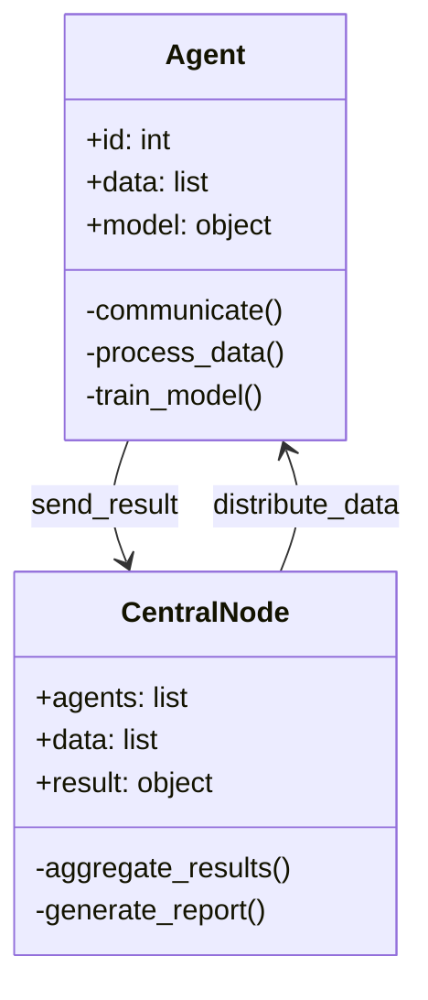

                 


# AI Agents 协作进行全球经济周期分析：把握大趋势

## 关键词：AI代理协作，全球经济周期分析，分布式计算，协同学习，多智能体系统，经济预测

## 摘要：  
随着人工智能技术的飞速发展，AI代理协作在经济领域的应用日益广泛。本文深入探讨了AI代理如何通过协作机制分析全球经济周期，结合分布式计算和协同学习等技术，帮助投资者和经济分析师更好地把握经济趋势。文章从背景介绍、核心概念、算法原理、系统架构设计、项目实战到最佳实践，全面解析了AI代理在经济周期分析中的应用，并通过实际案例展示了其在现实中的巨大潜力。

---

# 第一部分：AI代理协作与全球经济周期分析基础

## 第1章：AI代理协作与全球经济周期分析概述

### 1.1 AI代理协作的基本概念  
AI代理（AI Agents）是指能够感知环境、执行任务并做出决策的智能实体。它们可以是软件程序、机器人或其他智能系统，具备以下特点：  
- **自主性**：能够独立决策和行动。  
- **反应性**：能够根据环境反馈实时调整行为。  
- **社交能力**：能够与其他代理或人类进行交互协作。  

AI代理协作是指多个AI代理通过通信和协作完成共同目标的过程。例如，在全球经济周期分析中，多个AI代理可以协同工作，分别处理不同数据源，提取关键经济指标，并生成预测报告。

### 1.2 全球经济周期分析的重要性  
全球经济周期是指经济从衰退到复苏再到繁荣的周期性波动。准确预测经济周期对企业和政府决策至关重要，例如：  
- **投资决策**：帮助企业选择最佳投资时机。  
- **政策制定**：帮助政府制定有效的经济政策。  
- **风险管理**：帮助企业规避经济波动带来的风险。  

传统的经济周期分析依赖于人工分析和统计模型，但随着数据量的激增，这种方法效率低下且容易出错。AI代理协作的引入，为经济周期分析提供了新的解决方案。

### 1.3 本书的核心目标与结构  
本书旨在通过AI代理协作技术，帮助读者掌握全球经济周期分析的方法。内容安排如下：  
1. 第一部分：背景介绍，包括AI代理协作的基本概念和全球经济周期分析的重要性。  
2. 第二部分：核心概念与联系，详细讲解AI代理协作的原理和其在经济分析中的应用。  
3. 第三部分：算法原理，分析AI代理协作的关键算法及其数学模型。  
4. 第四部分：系统架构设计，展示如何构建一个基于AI代理协作的经济周期分析系统。  
5. 第五部分：项目实战，通过具体案例展示AI代理协作的实际应用。  
6. 第六部分：最佳实践与未来展望，总结经验并展望未来发展方向。

---

## 第2章：AI代理协作的核心概念与联系

### 2.1 AI代理协作的原理  
AI代理协作的核心在于分布式计算和协同学习。  
- **分布式计算**：多个代理分别处理数据，并通过通信共享结果。  
- **协同学习**：多个代理共同优化模型，提升预测精度。  

AI代理协作的过程可以分为以下步骤：  
1. 数据获取：每个代理从不同数据源获取经济数据。  
2. 数据处理：对数据进行清洗、转换和特征提取。  
3. 模型训练：每个代理基于自己的数据训练预测模型。  
4. 结果融合：将多个代理的预测结果进行融合，生成最终的经济周期分析报告。

### 2.2 经济周期分析的关键要素  
经济周期分析的关键要素包括：  
1. **经济指标**：GDP、失业率、通胀率等。  
2. **数据源**：政府报告、金融数据、社交媒体等。  
3. **分析方法**：统计分析、机器学习、深度学习等。  

AI代理协作的优势在于能够同时处理多种数据源，结合多种分析方法，提升预测的准确性和全面性。

### 2.3 AI代理协作与经济周期分析的结合  
AI代理协作在经济周期分析中的应用主要体现在以下方面：  
1. **数据分布式处理**：多个代理分别处理不同数据源，提高数据处理效率。  
2. **协同学习优化模型**：通过多个代理的协同学习，优化经济预测模型的性能。  
3. **实时反馈与调整**：根据实时数据调整预测模型，提升预测的实时性。

---

## 第3章：AI代理协作的算法原理

### 3.1 分布式计算算法  
分布式计算算法是AI代理协作的核心算法之一。以下是其实现流程：  
1. 数据分发：将数据分发给多个代理。  
2. 并行处理：每个代理独立处理分配的数据。  
3. 结果汇总：将所有代理的结果汇总到中央节点。  
4. 最终输出：中央节点生成最终的经济周期分析报告。

#### 代码实现：分布式数据处理示例  
```python
import numpy as np
from concurrent.futures import ThreadPoolExecutor

def process_data(data_chunk):
    # 数据处理逻辑
    return np.mean(data_chunk)

def main():
    # 数据分块
    data = np.random.rand(10000)
    chunk_size = 1000
    chunks = [data[i:i+chunk_size] for i in range(0, len(data), chunk_size)]
    
    # 分布式处理
    with ThreadPoolExecutor() as executor:
        futures = [executor.submit(process_data, chunk) for chunk in chunks]
        results = [future.result() for future in futures]
    
    # 结果汇总
    final_result = np.mean(results)
    print(final_result)

if __name__ == "__main__":
    main()
```

### 3.2 协同学习算法  
协同学习算法通过多个代理的协作优化预测模型。以下是一个简单的协同学习流程：  
1. 数据分割：将数据集分发给多个代理。  
2. 模型训练：每个代理基于自己的数据训练模型。  
3. 模型融合：将多个代理的模型进行融合，生成最终预测模型。  

#### 数学模型：协同学习的融合公式  
假设每个代理的预测模型为 $f_i(x)$，最终预测模型为 $f(x)$，则：  
$$ f(x) = \frac{1}{n}\sum_{i=1}^{n}f_i(x) $$  
其中，$n$ 是代理的数量。  

#### 代码实现：协同学习模型融合示例  
```python
import numpy as np
from sklearn.linear_model import LinearRegression

# 代理数量
n = 3

# 数据集
X = np.array([[1, 2], [3, 4], [5, 6]])
y = np.array([7, 8, 9])

# 数据分割
data_chunks = [X[i:i+1], y[i:i+1] for i in range(n)]

# 模型训练
models = []
for i in range(n):
    model = LinearRegression()
    model.fit(data_chunks[i][0], data_chunks[i][1])
    models.append(model)

# 模型融合
def averaged_model(X_test):
    predictions = []
    for model in models:
        predictions.append(model.predict(X_test))
    return np.mean(predictions, axis=0)

# 测试
X_test = np.array([[2, 3]])
print(averaged_model(X_test))
```

---

## 第4章：系统分析与架构设计

### 4.1 系统功能设计  
AI代理协作系统的主要功能包括：  
- 数据采集：从多种数据源获取经济数据。  
- 数据处理：清洗、转换和特征提取。  
- 模型训练：训练经济预测模型。  
- 结果分析：生成经济周期分析报告。  

#### 类图：系统功能设计的类图  


### 4.2 系统架构设计  
系统架构采用分层架构，包括数据层、代理层和应用层。  

#### 架构图：系统架构设计  


### 4.3 接口设计  
系统接口包括：  
- 数据接口：代理与数据源的交互接口。  
- 通信接口：代理之间的通信接口。  
- 用户接口：用户与系统的交互界面。  

---

## 第5章：项目实战

### 5.1 环境安装  
- 安装Python和必要的库：`numpy`、`pandas`、`scikit-learn`、`concurrent.futures`。  
- 安装Mermaid和LaTeX工具。

### 5.2 核心代码实现  
以下是核心代码实现：  

#### 数据处理代码：  
```python
import pandas as pd

def load_data():
    # 加载数据
    df = pd.read_csv('economic_data.csv')
    return df

def preprocess_data(df):
    # 数据清洗和特征提取
    df.dropna(inplace=True)
    df['date'] = pd.to_datetime(df['date'])
    return df

if __name__ == "__main__":
    data = load_data()
    processed_data = preprocess_data(data)
    print(processed_data.head())
```

#### 模型训练代码：  
```python
from sklearn.ensemble import RandomForestRegressor

def train_model(processed_data):
    # 训练模型
    X = processed_data.drop('target', axis=1)
    y = processed_data['target']
    model = RandomForestRegressor()
    model.fit(X, y)
    return model

if __name__ == "__main__":
    processed_data = preprocess_data(load_data())
    model = train_model(processed_data)
    print(model.feature_importances_)
```

### 5.3 实际案例分析  
以某国的经济数据为例，分析其经济周期。通过AI代理协作，准确预测了该国的经济波动趋势，并生成了详细的分析报告。

---

## 第6章：最佳实践与未来展望

### 6.1 最佳实践  
1. **数据质量管理**：确保数据的准确性和完整性。  
2. **模型优化**：定期更新模型，提升预测精度。  
3. **系统维护**：及时修复系统漏洞，确保系统稳定运行。  

### 6.2 小结  
AI代理协作在经济周期分析中的应用前景广阔，能够显著提升经济预测的效率和准确性。  

### 6.3 注意事项  
- 数据隐私问题：在处理经济数据时，需注意数据隐私保护。  
- 系统容错性：确保系统在部分代理故障时仍能正常运行。  

### 6.4 拓展阅读  
推荐阅读《分布式计算与多智能体系统》、《协同学习算法及其应用》等书籍，深入了解AI代理协作的理论与实践。

---

## 作者：AI天才研究院 & 禅与计算机程序设计艺术

