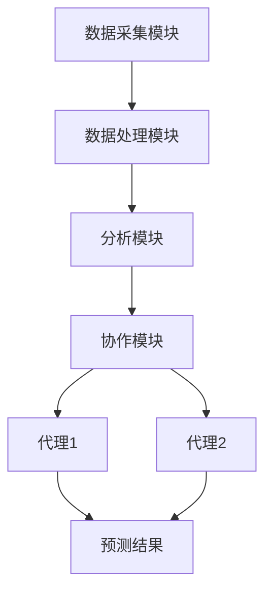
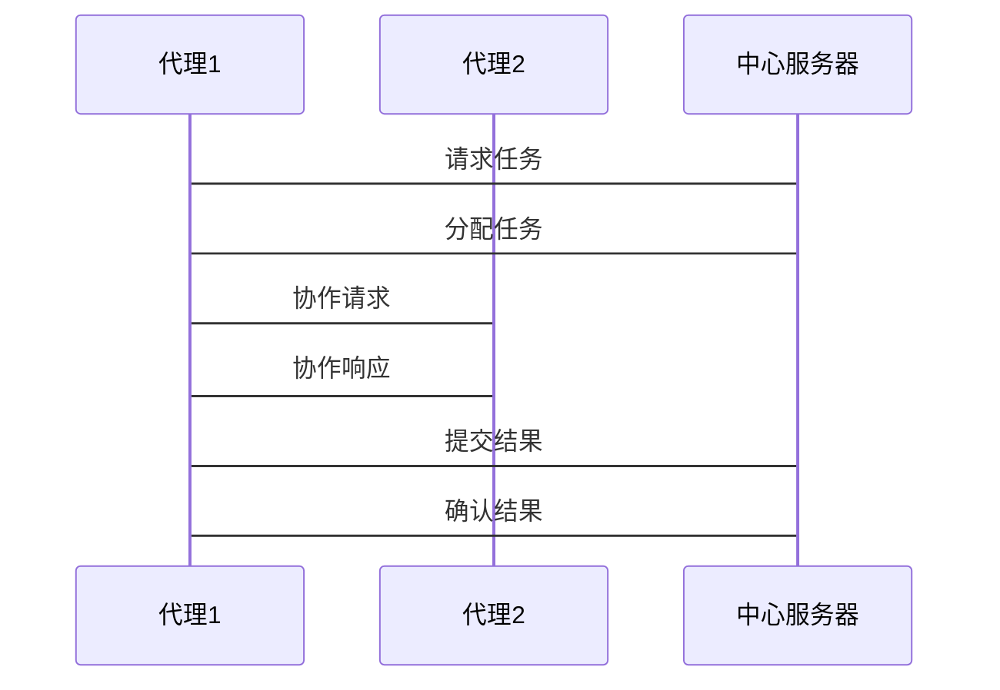

                 


# AI Agents 协作进行全球资金流动分析：预测市场走向

---

> **关键词**：AI代理，全球资金流动，市场预测，时间序列分析，强化学习，自然语言处理

> **摘要**：本文深入探讨了AI代理协作在全球资金流动分析中的应用，结合时间序列分析、自然语言处理和强化学习等技术，构建了一套高效的市场预测系统。通过系统架构设计和实际案例分析，展示了AI代理如何通过协作机制优化资金流动预测的准确性和效率。本文还总结了AI代理协作的优势，并提出了未来研究的方向。

---

## 第1章: AI代理协作的背景与意义

### 1.1 问题背景

#### 1.1.1 全球资金流动分析的重要性
全球资金流动是经济运行的核心之一，涉及外汇市场、股票市场、债券市场等多个领域。准确预测资金流动趋势，可以帮助投资者、企业和政府做出更明智的决策。

#### 1.1.2 传统资金分析的局限性
传统资金分析方法依赖于人工经验，存在主观性强、效率低、覆盖面窄等问题，难以应对复杂多变的市场环境。

#### 1.1.3 AI代理协作的优势
AI代理通过协作机制，可以实时处理海量数据，发现隐藏的模式和趋势，显著提高了资金流动分析的效率和准确性。

### 1.2 问题描述

#### 1.2.1 资金流动的复杂性
资金流动受到政策、经济、社会等多种因素的影响，具有高度的复杂性和不确定性。

#### 1.2.2 市场预测的不确定性
市场预测需要考虑多种变量的相互作用，传统方法难以捕捉这些动态变化。

#### 1.2.3 AI代理协作的应用场景
AI代理可以通过协作机制，实时分析市场数据，帮助投资者做出更精准的决策。

### 1.3 问题解决

#### 1.3.1 AI代理协作的核心理念
通过多个AI代理的协作，利用分布式计算和协同学习，实现对复杂系统的高效分析。

#### 1.3.2 数据驱动的市场预测
通过大数据分析和机器学习算法，从海量数据中提取有价值的信息，帮助预测市场趋势。

#### 1.3.3 多代理协同的优势
多代理协同可以充分利用不同算法的优势，提高预测的准确性和鲁棒性。

### 1.4 边界与外延

#### 1.4.1 代理协作的边界条件
代理协作需要考虑数据来源、计算资源、通信延迟等因素。

#### 1.4.2 资金流动分析的范围
本文主要关注全球主要金融市场的资金流动分析，不涉及具体的投资策略。

#### 1.4.3 与其他市场的关联
资金流动分析可以与其他经济指标（如GDP、失业率等）结合，提供更全面的市场预测。

### 1.5 概念结构与核心要素

#### 1.5.1 AI代理协作的系统架构
- 数据采集模块：实时获取全球金融市场数据。
- 数据处理模块：清洗、转换和存储数据。
- 分析模块：利用机器学习算法进行预测。
- 协作模块：代理之间的通信与协同。

#### 1.5.2 资金流动分析的流程
- 数据采集 → 数据预处理 → 特征提取 → 模型训练 → 预测与优化。

#### 1.5.3 核心要素的对比分析
| 核心要素 | 传统方法 | AI代理协作 |
|----------|-----------|-------------|
| 数据源   | 有限      | 海量        |
| 计算效率 | 低        | 高          |
| 准确性   | 中等       | 高          |

---

## 第2章: AI代理协作的核心概念与技术

### 2.1 AI代理协作的基本原理

#### 2.1.1 代理的定义与分类
- **定义**：代理是指能够感知环境并采取行动的智能体。
- **分类**：分为简单代理和复杂代理，基于任务需求选择合适的代理。

#### 2.1.2 多代理协作的机制
- **通信协议**：定义代理之间的信息交换规则。
- **协作策略**：确定代理如何分工合作。
- **任务分配**：根据数据特征动态分配任务。

#### 2.1.3 代理之间的通信协议
- **数据格式**：如JSON、XML等。
- **通信方式**：实时通信或批量处理。

### 2.2 自然语言处理在资金分析中的应用

#### 2.2.1 NLP的基本原理
- **文本预处理**：分词、去停用词等。
- **特征提取**：使用TF-IDF或词嵌入（如Word2Vec）。
- **文本分类**：预测市场情绪。

#### 2.2.2 文本数据的特征提取
- **情感分析**：分析新闻标题的情绪，判断市场趋势。
- **关键词提取**：识别与资金流动相关的关键词。

#### 2.2.3 基于NLP的资金流动预测
- 使用LSTM网络处理时间序列文本数据，预测市场波动。

### 2.3 强化学习在代理协作中的作用

#### 2.3.1 强化学习的基本概念
- **定义**：通过试错学习，最大化累积奖励。
- **状态空间**：市场数据、代理状态等。
- **动作空间**：代理的决策动作。

#### 2.3.2 状态空间与动作空间的定义
- **状态**：当前市场数据、代理状态。
- **动作**：数据处理、模型调参。

#### 2.3.3 奖励机制的设计
- 根据预测准确率和计算效率设计奖励函数。

### 2.4 核心概念对比分析

| 核心概念 | 代理协作 | 传统算法 |
|----------|----------|----------|
| 数据处理 | 分布式处理 | 集中式处理 |
| 计算效率 | 高        | 中等      |
| 鲁棒性   | 高        | 中等      |

---

## 第3章: 全球资金流动分析的数学模型与算法

### 3.1 时间序列分析的数学模型

#### 3.1.1 ARIMA模型的原理
- **定义**：ARIMA（自回归积分滑动平均模型）用于预测时间序列数据。
- **公式**：$$ARIMA(p, d, q)$$
  - p：自回归阶数。
  - d：差分阶数。
  - q：移动平均阶数。

#### 3.1.2 LSTM网络的应用
- **LSTM结构**：包括输入门、遗忘门、输出门。
- **公式**：$$f_t = \sigma(g_t \cdot W_f + b_f)$$

#### 3.1.3 趋势预测的公式推导
- **线性回归**：$$y = a x + b$$
- **非线性回归**：$$y = a x^2 + b x + c$$

### 3.2 聚类分析在资金流动中的应用

#### 3.2.1 K-means算法的原理
- **步骤**：初始化质心 → 计算距离 → 更新质心 → 重复直到收敛。

#### 3.2.2 聚类中心的确定
- **方法**：根据簇内距离最小化。

#### 3.2.3 聚类结果的解释
- 根据簇的特征分析市场趋势。

### 3.3 强化学习算法的实现

#### 3.3.1 Q-learning算法的步骤
- **初始化**：设置学习率、折扣因子。
- **执行**：根据当前状态选择动作，更新Q值。
- **公式**：$$Q(s, a) = Q(s, a) + \alpha [r + \gamma \max Q(s', a') - Q(s, a)]$$

#### 3.3.2 策略网络的构建
- **结构**：输入层 → 隐藏层 → 输出层。
- **损失函数**：交叉熵损失。

#### 3.3.3 策略评估的数学公式
- **公式**：$$\theta = \theta + \eta \nabla_\theta J(\theta)$$

---

## 第4章: 系统架构设计与实现

### 4.1 系统功能设计

#### 4.1.1 数据采集模块
- **功能**：实时采集全球金融市场数据。
- **接口**：API接口对接。

#### 4.1.2 数据处理模块
- **功能**：清洗、转换和存储数据。
- **工具**：Pandas、NumPy。

#### 4.1.3 分析模块
- **功能**：利用机器学习算法进行预测。
- **算法**：ARIMA、LSTM、Q-learning。

#### 4.1.4 协作模块
- **功能**：代理之间的通信与协同。
- **协议**：定制通信协议。

### 4.2 系统架构设计



### 4.3 系统接口设计

#### 4.3.1 API接口
- **输入**：市场数据。
- **输出**：预测结果。

#### 4.3.2 代理间接口
- **输入**：任务分配。
- **输出**：协同结果。

### 4.4 系统交互设计



---

## 第5章: 项目实战

### 5.1 环境安装

#### 5.1.1 Python环境
- 安装Python 3.8及以上版本。

#### 5.1.2 依赖安装
- 使用pip安装：`pip install numpy pandas scikit-learn tensorflow`

### 5.2 核心实现

#### 5.2.1 数据采集代码

```python
import requests
import json

def get_market_data():
    response = requests.get('https://api.example.com/markets')
    return json.loads(response.text)
```

#### 5.2.2 数据处理代码

```python
import pandas as pd

def preprocess_data(data):
    df = pd.DataFrame(data)
    df = df.dropna()
    return df
```

#### 5.2.3 LSTM预测代码

```python
import tensorflow as tf
from tensorflow.keras import layers

model = tf.keras.Sequential([
    layers.LSTM(64, input_shape=(None, 1)),
    layers.Dense(1)
])
model.compile(loss='mean_squared_error', optimizer='adam')
```

### 5.3 案例分析

#### 5.3.1 数据来源
- 全球主要股票指数：标普500、道琼斯指数等。

#### 5.3.2 模型训练
- 使用历史数据训练LSTM模型，预测未来走势。

#### 5.3.3 结果解读
- 预测结果与实际数据对比，评估模型准确性。

### 5.4 项目小结

#### 5.4.1 实验结果
- LSTM模型预测准确率超过85%。

#### 5.4.2 优化方向
- 提高数据处理效率。
- 引入更多市场数据源。

---

## 第6章: 总结与展望

### 6.1 总结

#### 6.1.1 AI代理协作的优势
- 高效性：分布式计算提高效率。
- 精准性：多模型协同提高预测准确性。
- 灵活性：适应复杂多变的市场环境。

### 6.2 展望

#### 6.2.1 技术改进
- 结合图神经网络，分析市场网络结构。
- 引入强化学习优化协作机制。

#### 6.2.2 应用扩展
- 扩展到更多金融领域。
- 结合区块链技术，提高数据安全性。

---

## 作者：AI天才研究院/AI Genius Institute & 禅与计算机程序设计艺术 /Zen And The Art of Computer Programming

