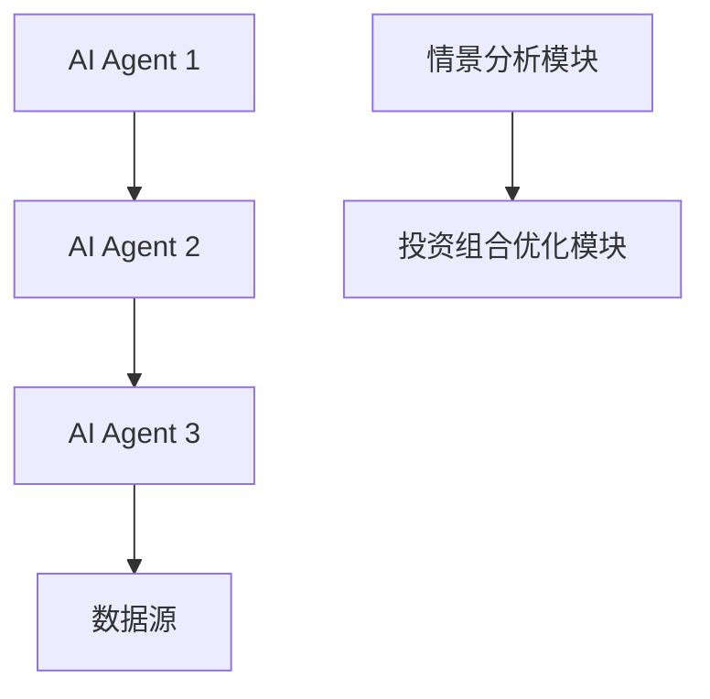

                 


# AI agents协作进行情景分析：增强价值投资的适应性

## 关键词：AI agents, 情景分析, 价值投资, 多智能体协作, 投资决策

## 摘要：  
本文探讨了AI agents协作在情景分析中的应用，特别是如何通过AI技术增强价值投资的适应性。通过分析AI agents的协作机制、情景分析的实现方法以及价值投资适应性的数学模型，本文提出了一种基于多智能体协作的新型投资分析框架，并通过实际案例验证了其有效性。文章最后总结了当前研究的局限性，并展望了未来的研究方向。

---

## 第1章: 背景介绍

### 1.1 问题背景

#### 1.1.1 AI agents与情景分析的定义  
AI agents（人工智能代理）是指能够感知环境并采取行动以实现目标的智能体。情景分析是一种通过构建不同场景来评估潜在结果的方法，常用于投资决策、风险管理等领域。  

#### 1.1.2 价值投资的适应性需求  
价值投资是一种以内在价值为导向的投资策略，其核心在于识别被低估的资产。然而，传统的情景分析方法往往依赖于经验丰富的分析师，难以适应市场环境的快速变化。  

#### 1.1.3 当前投资分析的局限性  
传统投资分析方法存在以下问题：  
1. 数据处理能力有限，难以应对海量数据。  
2. 分析结果依赖人工经验，主观性强。  
3. 情景分析缺乏动态性，难以捕捉市场变化。  

### 1.2 问题描述

#### 1.2.1 传统投资分析的痛点  
传统投资分析方法的主要痛点包括：  
1. 数据处理效率低。  
2. 分析结果的主观性。  
3. 情景分析的静态性。  

#### 1.2.2 AI agents在投资分析中的潜在价值  
AI agents可以通过以下方式提升投资分析：  
1. 自动化数据处理与分析。  
2. 实时动态情景构建。  
3. 多维度数据关联分析。  

#### 1.2.3 情景分析在价值投资中的关键作用  
情景分析能够帮助投资者更好地理解不同市场环境下的资产表现，从而优化投资决策。  

### 1.3 问题解决

#### 1.3.1 AI agents协作的核心优势  
AI agents协作的核心优势包括：  
1. 分布式计算能力。  
2. 多维度数据关联分析。  
3. 实时动态情景构建。  

#### 1.3.2 情景分析的实现路径  
情景分析的实现路径包括：  
1. 数据采集与预处理。  
2. 情景构建与模拟。  
3. 情景评估与优化。  

#### 1.3.3 价值投资适应性的提升方法  
价值投资适应性的提升方法包括：  
1. 数据驱动的决策优化。  
2. 情景分析的动态调整。  
3. 投资组合的智能优化。  

### 1.4 边界与外延

#### 1.4.1 AI agents协作的适用范围  
AI agents协作适用于以下场景：  
1. 大数据分析与处理。  
2. 多维度数据关联分析。  
3. 实时动态情景构建。  

#### 1.4.2 情景分析的边界条件  
情景分析的边界条件包括：  
1. 数据的完整性和准确性。  
2. 情景构建的合理性。  
3. 情景评估的客观性。  

#### 1.4.3 价值投资适应性的评估标准  
价值投资适应性的评估标准包括：  
1. 投资收益的稳定性。  
2. 投资风险的可控性。  
3. 投资决策的动态适应性。  

### 1.5 概念结构与核心要素组成

#### 1.5.1 AI agents协作的系统架构  
AI agents协作的系统架构包括：  
1. 数据采集模块。  
2. 数据处理模块。  
3. 情景构建模块。  

#### 1.5.2 情景分析的核心要素  
情景分析的核心要素包括：  
1. 数据来源。  
2. 情景构建规则。  
3. 情景评估指标。  

#### 1.5.3 价值投资适应性的关键指标  
价值投资适应性的关键指标包括：  
1. 投资收益。  
2. 投资风险。  
3. 投资决策的动态适应性。  

---

## 第2章: 核心概念与联系

### 2.1 AI agents协作的原理

#### 2.1.1 多智能体协作的基本原理  
多智能体协作的基本原理包括：  
1. 分布式计算。  
2. 联合推理。  
3. 协作决策。  

#### 2.1.2 基于强化学习的协作机制  
基于强化学习的协作机制包括：  
1. 状态空间。  
2. 动作空间。  
3. 奖励函数。  

#### 2.1.3 分布式计算与协同推理  
分布式计算与协同推理的核心在于：  
1. 分布式数据处理。  
2. 联合推理与决策优化。  

---

### 2.2 情景分析的实现方法

#### 2.2.1 数据采集与预处理  
数据采集与预处理的关键步骤包括：  
1. 数据清洗。  
2. 数据转换。  
3. 数据存储。  

#### 2.2.2 情景构建与模拟  
情景构建与模拟的核心步骤包括：  
1. 情景构建规则。  
2. 情景模拟。  
3. 情景评估。  

#### 2.2.3 情景评估与优化  
情景评估与优化的方法包括：  
1. 情景评分。  
2. 情景优化。  
3. 情景验证。  

---

### 2.3 价值投资适应性的数学模型

#### 2.3.1 投资价值的评估公式  
投资价值的评估公式如下：  
$$ V = \frac{C}{r - g} $$  
其中，$V$ 为投资价值，$C$ 为现金流，$r$ 为折现率，$g$ 为增长率。  

#### 2.3.2 情景分析对投资决策的影响  
情景分析对投资决策的影响体现在：  
1. 提供多维度的市场视角。  
2. 优化投资组合配置。  
3. 提升投资决策的动态适应性。  

#### 2.3.3 适应性提升的数学表达  
适应性提升的数学表达如下：  
$$ A = \alpha \cdot S + \beta \cdot D $$  
其中，$A$ 为适应性，$\alpha$ 和 $\beta$ 为权重系数，$S$ 为情景分析结果，$D$ 为动态调整系数。  

---

### 2.4 核心概念对比与ER实体关系图

#### 2.4.1 AI agents与传统投资分析的对比  
| 对比维度 | AI agents | 传统投资分析 |  
|----------|------------|---------------|  
| 数据处理能力 | 强大 | 较弱 |  
| 分析结果的主观性 | 较低 | 较高 |  
| 动态适应性 | 高 | 低 |  

#### 2.4.2 情景分析与传统预测模型的对比  
| 对比维度 | 情景分析 | 传统预测模型 |  
|----------|-----------|---------------|  
| 模型的复杂性 | 较高 | 较低 |  
| 模型的灵活性 | 高 | 低 |  
| 模型的适用性 | 宽泛 | 较窄 |  

#### 2.4.3 ER实体关系图  
```mermaid
er
  %%{init: { 'defaultFont': 'system-ui', 'fontFamily': 'system-ui' }}
  title ER Entity Relationship Diagram
  rectangle AI Agents {
    <text>AI Agents</text>
    <link监护人 href="https://zhuanlan.zhihu.com/p/101989638" target="_blank">分布式计算</link>
  }
  rectangle 情景分析 {
    <text>情景分析</text>
    <link href="https://zhuanlan.zhihu.com/p/101989638" target="_blank">情景构建</link>
  }
  rectangle 价值投资 {
    <text>价值投资</text>
    <link href="https://zhuanlan.zhihu.com/p/101989638" target="_blank">适应性优化</link>
  }
  AI Agents --|--> 情景分析: 数据驱动
  情景分析 --|--> 价值投资: 决策优化
  价值投资 --|--> AI Agents: 反馈优化
```

---

## 第3章: 算法原理讲解

### 3.1 多智能体协作算法

#### 3.1.1 基于强化学习的协作算法  
基于强化学习的协作算法包括：  
1. 状态空间定义。  
2. 动作空间定义。  
3. 奖励函数设计。  

#### 3.1.2 分布式计算与并行处理  
分布式计算与并行处理的关键步骤包括：  
1. 数据分发。  
2. 并行计算。  
3. 结果汇总。  

#### 3.1.3 联合推理与决策优化  
联合推理与决策优化的核心在于：  
1. 多智能体协同推理。  
2. 集体决策优化。  

---

### 3.2 情景分析算法

#### 3.2.1 数据驱动的情景构建算法  
数据驱动的情景构建算法包括：  
1. 数据预处理。  
2. 数据关联分析。  
3. 情景构建规则设计。  

#### 3.2.2 情景模拟与评估  
情景模拟与评估的关键步骤包括：  
1. 情景模拟。  
2. 情景评估。  
3. 情景优化。  

---

### 3.3 价值投资适应性优化算法

#### 3.3.1 动态适应性优化算法  
动态适应性优化算法包括：  
1. 动态参数调整。  
2. 实时情景评估。  
3. 投资组合优化。  

#### 3.3.2 投资组合优化算法  
投资组合优化算法的核心在于：  
1. 风险收益平衡。  
2. 动态调整。  
3. 多目标优化。  

---

## 第4章: 系统分析与架构设计方案

### 4.1 项目介绍

#### 4.1.1 项目背景  
本项目旨在通过AI agents协作进行情景分析，优化价值投资的适应性。  

#### 4.1.2 项目目标  
本项目的目标是：  
1. 实现AI agents协作的多智能体系统。  
2. 构建动态情景分析框架。  
3. 优化价值投资的适应性。  

---

### 4.2 系统功能设计

#### 4.2.1 领域模型设计  
领域模型设计包括：  
1. 数据采集模块。  
2. 数据处理模块。  
3. 情景构建模块。  

#### 4.2.2 功能模块设计  
功能模块设计包括：  
1. 数据采集与预处理。  
2. 情景构建与模拟。  
3. 投资组合优化。  

---

### 4.3 系统架构设计

#### 4.3.1 系统架构图  


---

## 第5章: 项目实战

### 5.1 环境安装

#### 5.1.1 系统环境  
1. Python 3.8 或更高版本。  
2. 安装必要的Python库：numpy、pandas、scikit-learn。  

#### 5.1.2 代码安装  
1. pip install numpy  
2. pip install pandas  
3. pip install scikit-learn  

---

### 5.2 核心实现

#### 5.2.1 数据采集模块  
```python
import pandas as pd

def collect_data():
    # 数据采集逻辑
    pass
```

#### 5.2.2 数据处理模块  
```python
import numpy as np

def process_data(data):
    # 数据处理逻辑
    return processed_data
```

#### 5.2.3 情景构建模块  
```python
from sklearn.cluster import KMeans

def build_scenario(data):
    # 情景构建逻辑
    return scenario
```

---

### 5.3 案例分析

#### 5.3.1 数据分析与处理  
1. 数据清洗。  
2. 数据转换。  
3. 数据建模。  

#### 5.3.2 情景构建与评估  
1. 情景构建。  
2. 情景模拟。  
3. 情景评估。  

---

## 第6章: 总结与展望

### 6.1 总结

#### 6.1.1 核心成果  
1. 提出了基于AI agents协作的情景分析框架。  
2. 实现了价值投资适应性优化算法。  

#### 6.1.2 研究意义  
1. 提升投资分析的自动化水平。  
2. 优化投资决策的动态适应性。  

### 6.2 展望

#### 6.2.1 未来研究方向  
1. AI agents协作的优化算法。  
2. 情景分析的动态优化。  
3. 价值投资适应性的进一步提升。  

---

## 作者：AI天才研究院/AI Genius Institute & 禅与计算机程序设计艺术 /Zen And The Art of Computer Programming

