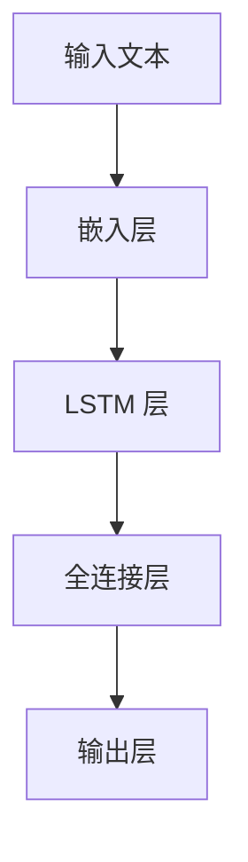
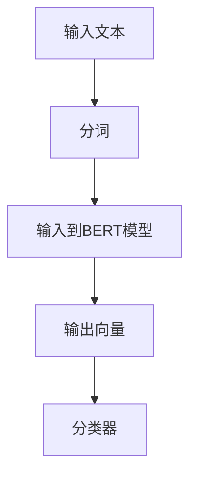
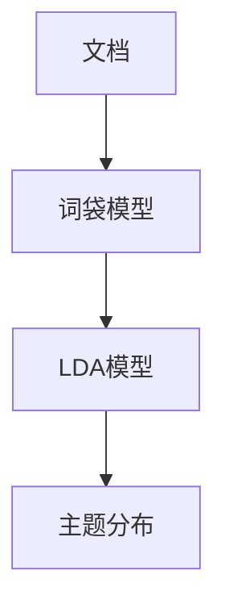
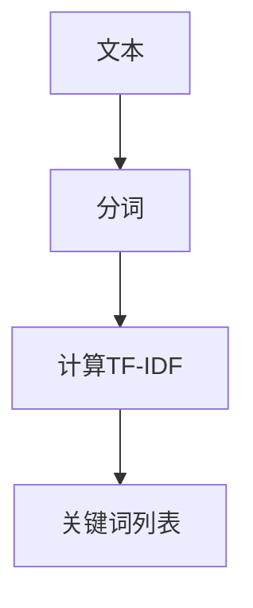
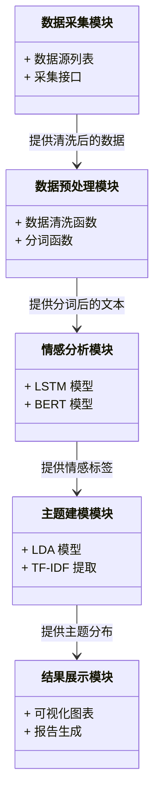
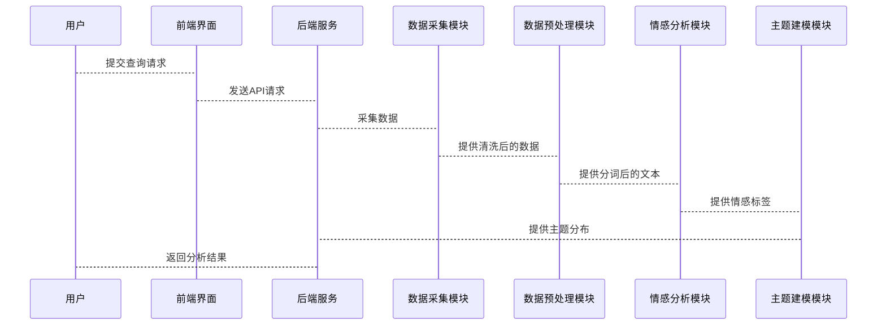

                 


# AI agents协作进行舆情分析：捕捉市场情绪拐点

> 关键词：AI agents, 舆情分析, 市场情绪拐点, 情感分析, 主题建模, 协作分析, 实时监测

> 摘要：本文详细探讨了AI agents在舆情分析中的协作机制，揭示了如何通过多个智能体的协同工作捕捉市场情绪的拐点。文章从核心概念、算法原理到系统架构，再到项目实战，全面解析了AI agents在舆情分析中的应用，帮助读者理解如何利用这一技术实时监测和分析市场情绪。

---

# 第一部分: AI agents协作进行舆情分析概述

## 第1章: 舆情分析与AI agents的背景介绍

### 1.1 舆情分析的定义与重要性

#### 1.1.1 舆情分析的定义
舆情分析（Sentiment Analysis）是对公众对某个话题、品牌、产品或事件的态度和情感进行分析的过程。通过对文本数据的情感倾向性（如正面、负面或中性）进行分类，舆情分析能够帮助企业了解市场动态、消费者反馈和品牌声誉。

#### 1.1.2 舆情分析在商业中的作用
- **品牌监控**：实时监测品牌声誉，及时发现并应对负面舆情。
- **市场洞察**：通过分析消费者反馈，帮助企业了解市场需求和趋势。
- **决策支持**：为企业的市场营销、产品开发和客户服务提供数据支持。

#### 1.1.3 舆情分析的挑战与机遇
- **挑战**：数据量大、情感表达复杂、实时性要求高等。
- **机遇**：AI技术的进步（如深度学习和自然语言处理）为舆情分析提供了更高效、准确的工具。

### 1.2 AI agents的定义与特点

#### 1.2.1 AI agents的基本概念
AI agents（人工智能代理）是指能够感知环境、执行任务并做出决策的智能实体。与传统算法不同，AI agents具有自主性、反应性和协作性。

#### 1.2.2 AI agents的核心特点
- **自主性**：能够独立完成任务，无需人工干预。
- **反应性**：能够根据环境变化动态调整行为。
- **协作性**：多个AI agents可以协同工作，共同完成复杂任务。

#### 1.2.3 AI agents与传统算法的区别
| 特性        | AI agents                     | 传统算法                     |
|-------------|-------------------------------|------------------------------|
| 自主性       | 高                           | 低                           |
| 反应性       | 高                           | 低                           |
| 协作性       | 高                           | 低                           |
| 适应性       | 高                           | 低                           |

### 1.3 AI agents在舆情分析中的应用

#### 1.3.1 舆情分析的场景与需求
- **社交媒体监控**：分析微博、Twitter等平台上的用户评论。
- **新闻媒体分析**：监测新闻媒体对特定事件的报道情绪。
- **客户反馈分析**：分析客户对产品或服务的评价。

#### 1.3.2 AI agents协作的优势
- **分布式计算**：多个AI agents可以同时处理不同数据源，提高效率。
- **实时性**：AI agents能够实时监控舆情，捕捉市场情绪的快速变化。
- **准确性**：通过协作，AI agents可以相互校正，提高情感分析的准确性。

#### 1.3.3 捕捉市场情绪拐点的意义
市场情绪拐点是指市场情绪从一个状态（如正面）转向另一个状态（如负面）的关键点。捕捉拐点可以帮助企业及时调整策略，应对市场变化。

---

## 第2章: 舆情分析的核心概念与AI agents的关系

### 2.1 舆情分析的核心概念

#### 2.1.1 数据来源的多样性
舆情分析的数据来源包括社交媒体、新闻网站、论坛、客户评价等。这些数据具有多样性和复杂性，需要进行清洗和预处理。

#### 2.1.2 情感分析的基本原理
情感分析的目标是判断文本的情感倾向。常用的情感分析方法包括基于词典的方法（如VADER）和基于机器学习的方法（如SVM、LSTM、BERT等）。

#### 2.1.3 主题建模的核心思想
主题建模（如LDA）用于发现文本中的主题分布，帮助理解数据的主要内容和结构。

### 2.2 AI agents在舆情分析中的角色

#### 2.2.1 数据采集与预处理
AI agents负责从多个数据源采集舆情数据，并进行清洗和预处理，确保数据质量。

#### 2.2.2 情感分析与主题建模
AI agents可以协同完成情感分析和主题建模任务，每个agent负责不同的子任务，如情感分类、主题提取等。

#### 2.2.3 结果分析与决策支持
AI agents将分析结果整合后，提供决策支持，如生成报告、触发预警机制等。

### 2.3 舆情分析与AI agents的实体关系图

```mermaid
erDiagram
    actor 用户 {
        <属性> 用户ID
        <属性> 用户名
    }
    actor 数据源 {
        <属性> 数据ID
        <属性> 数据内容
    }
    actor AI agent {
        <属性> agent ID
        <属性> agent 类型
    }
    用户 --> 数据源 : 提供数据
    数据源 --> AI agent : 分析数据
    AI agent --> 用户 : 提供分析结果
```

---

## 第3章: AI agents协作进行舆情分析的算法原理

### 3.1 情感分析算法

#### 3.1.1 基于LSTM的情感分析模型
LSTM（长短期记忆网络）适合处理序列数据，能够捕捉文本的情感变化。



代码示例：
```python
import tensorflow as tf
from tensorflow.keras import layers

model = tf.keras.Sequential([
    layers.Embedding(input_dim=10000, output_dim=16),
    layers.LSTM(64),
    layers.Dense(1, activation='sigmoid')
])
model.compile(optimizer='adam', loss='binary_crossentropy', metrics=['accuracy'])
```

#### 3.1.2 基于BERT的情感分析模型
BERT通过预训练语言模型，能够更好地理解上下文语义。



代码示例：
```python
from transformers import BertTokenizer, TFBertForSequenceClassification

tokenizer = BertTokenizer.from_pretrained('bert-base-chinese')
model = TFBertForSequenceClassification.from_pretrained('bert-base-chinese')
```

#### 3.1.3 情感分析的实现步骤
1. 数据预处理：分词、去除停用词。
2. 模型训练：使用标注数据训练情感分类器。
3. 模型预测：对新数据进行情感分类。

### 3.2 主题建模算法

#### 3.2.1 LDA主题建模原理
LDA（隐性主题模型）通过概率统计发现主题分布。



代码示例：
```python
from gensim import corpora, models

corpus = corpora.Dictionary(corpus_data).doc2bow(corpus_data)
lda_model = models.LdaModel(corpus, num_topics=10, id2word=corpus.dictionary)
```

#### 3.2.2 基于TF-IDF的主题提取
TF-IDF（词频-逆文档频率）用于提取关键词。



代码示例：
```python
from sklearn.feature_extraction.text import TfidfVectorizer

vectorizer = TfidfVectorizer()
tfidf = vectorizer.fit_transform(text_data)
```

#### 3.2.3 主题建模的实现流程
1. 数据预处理：分词、去停用词。
2. 模型训练：使用LDA或TF-IDF提取主题。
3. 结果分析：可视化主题分布。

---

## 第4章: 系统分析与架构设计方案

### 4.1 舆情分析的场景介绍

#### 4.1.1 实时舆情监控
企业需要实时监测社交媒体和新闻媒体，捕捉市场情绪的变化。

#### 4.1.2 历史数据回溯
通过分析历史舆情数据，帮助企业了解市场趋势和周期性变化。

### 4.2 系统功能设计

#### 4.2.1 领域模型（类图）


#### 4.2.2 系统架构设计


#### 4.2.3 系统接口设计
- API接口：RESTful API，提供数据采集、分析和查询功能。

#### 4.2.4 系统交互流程



---

## 第5章: 项目实战

### 5.1 环境安装

```bash
pip install tensorflow gensim sklearn transformers
```

### 5.2 核心代码实现

#### 5.2.1 数据采集与预处理
```python
import requests
from bs4 import BeautifulSoup
import re

def get_data(url):
    response = requests.get(url)
    soup = BeautifulSoup(response.text, 'html.parser')
    text = soup.find('div', {'id': 'content'}).text
    return re.sub(r'[^\w]', ' ', text).split()
```

#### 5.2.2 情感分析
```python
from transformers import BertTokenizer, TFBertForSequenceClassification

tokenizer = BertTokenizer.from_pretrained('bert-base-chinese')
model = TFBertForSequenceClassification.from_pretrained('bert-base-chinese')
```

#### 5.2.3 主题建模
```python
from gensim import corpora, models

corpus = corpora.Dictionary(corpus_data).doc2bow(corpus_data)
lda_model = models.LdaModel(corpus, num_topics=10, id2word=corpus.dictionary)
```

### 5.3 代码解读与分析

#### 5.3.1 数据采集模块
- 使用`requests`和`BeautifulSoup`从指定URL获取数据。
- 使用正则表达式清理文本，去除特殊字符。

#### 5.3.2 情感分析模块
- 使用BERT模型进行情感分类，输出情感标签（正面、负面、中性）。

#### 5.3.3 主题建模模块
- 使用LDA模型提取主题分布，帮助理解数据的主要内容。

### 5.4 实际案例分析

#### 5.4.1 案例背景
假设我们想分析某品牌在社交媒体上的舆情，数据来源包括微博和知乎。

#### 5.4.2 数据分析
- 数据采集模块获取了1000条评论。
- 情感分析模块显示70%的评论为正面，20%为负面，10%为中性。
- 主题建模模块提取了5个主要主题，包括产品质量、售后服务、价格合理等。

### 5.5 项目小结

- 通过AI agents协作，我们可以高效、准确地进行舆情分析。
- 捕捉市场情绪拐点是舆情分析的核心目标，AI agents能够实时监测和预警。

---

## 第6章: 最佳实践

### 6.1 小结
- AI agents协作能够显著提高舆情分析的效率和准确性。
- 捕捉市场情绪拐点是舆情分析的核心目标，需要结合情感分析和主题建模。

### 6.2 注意事项
- 数据质量和多样性直接影响分析结果，需谨慎处理数据。
- 模型调优和训练数据的质量对情感分析的准确性至关重要。

### 6.3 拓展阅读
- 《Deep Learning for Natural Language Processing》
- 《Probabilistic Topic Models》

---

# 作者：AI天才研究院/AI Genius Institute & 禅与计算机程序设计艺术 /Zen And The Art of Computer Programming

