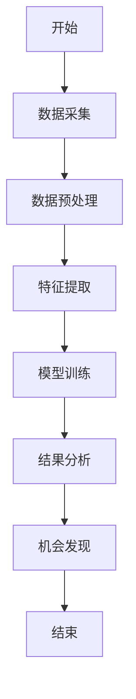
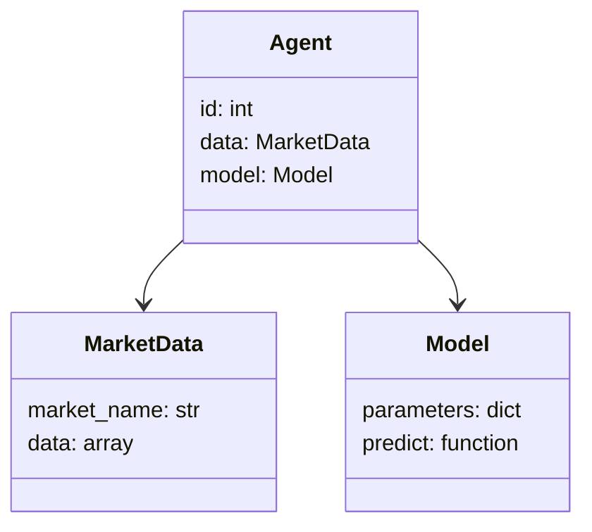
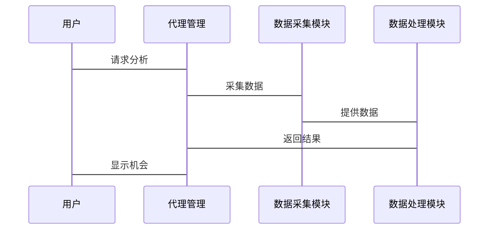

                 


# AI agents协作进行跨市场价值比较：发现全球机会

> 关键词：AI agents, 跨市场价值比较, 全球机会发现, 分布式协作, 市场数据分析, 人工智能投资

> 摘要：本文探讨了AI agents如何通过协作进行跨市场价值比较，发现全球投资机会。从背景介绍、核心概念、算法原理、系统架构到项目实战，详细分析了AI代理在跨市场分析中的应用，并通过实例展示了其优势和实施方法。

---

## 第一部分: 背景介绍

### 第1章: 问题背景

#### 1.1 全球化市场与跨市场投资的挑战

- **全球化市场的复杂性**：全球市场受多种因素影响，包括经济、政治、文化等，使得跨市场分析变得复杂。
- **数据多样性**：不同市场有不同数据格式和特征，需要高效的数据整合和处理能力。
- **传统方法的局限性**：传统跨市场分析依赖人工判断，效率低，难以捕捉实时机会。

#### 1.2 问题描述

- **数据异构性**：不同市场的数据结构和特征差异大，难以直接比较。
- **信息滞后性**：传统分析工具无法实时捕捉市场动态。
- **计算复杂性**：跨市场分析需要处理大量数据，计算复杂。

#### 1.3 问题解决

- **AI代理的优势**：AI代理能够实时处理多源数据，具备分布式协作能力。
- **数据整合与分析**：通过AI代理协作，实现跨市场数据的高效整合与分析。
- **机会发现的新范式**：AI代理协作提供了实时、动态的全球机会发现机制。

### 第2章: 核心概念与联系

#### 2.1 AI agents协作机制

- **分布式协作原理**：AI代理通过分布式网络协作，各自负责特定任务。
- **通信协议与数据交换格式**：定义了代理之间的通信规则和数据格式。
- **任务分工与协调**：通过任务分配算法，确保各代理协同工作。

#### 2.2 跨市场数据特征

- **数据源多样性**：包括股票、债券、外汇等多种金融资产。
- **数据特征的可比性**：需要标准化处理，确保数据可比。
- **数据质量评估**：包括数据完整性、准确性等。

#### 2.3 全球机会发现的评价体系

- **评价指标的设计原则**：包括收益、风险、流动性等多维度指标。
- **评价模型的构建方法**：基于机器学习模型，构建多维评价体系。
- **结果可视化**：通过图表展示机会发现结果，便于决策者理解。

---

## 第二部分: AI agents协作的算法原理

### 第3章: 算法原理

#### 3.1 分布式协作算法

- **分布式协作的基本算法**：基于分布式计算和协调算法，实现多代理协作。
- **跨市场数据匹配算法**：通过特征匹配和相似性度量，实现数据对齐。
- **机会发现的优化算法**：基于强化学习和优化算法，动态调整分析策略。

#### 3.2 算法流程图



#### 3.3 算法实现代码

```python
import pandas as pd
import numpy as np
from sklearn.metrics import pairwise_distances

# 示例数据
class MarketData:
    def __init__(self, market_name, data):
        self.market_name = market_name
        self.data = data

# 特征提取
def extract_features(market_data_list):
    features = []
    for data in market_data_list:
        feature = [
            np.mean(data.data),
            np.std(data.data),
            np.max(data.data),
            np.min(data.data)
        ]
        features.append(feature)
    return features

# 跨市场数据匹配
def market_matching(features_matrix):
    distances = pairwise_distances(features_matrix)
    return np.argmin(distances, axis=1)

# 示例使用
market1 = MarketData('USA', np.array([100, 200, 300]))
market2 = MarketData('EU', np.array([150, 250, 350]))
market3 = MarketData('ASIA', np.array([90, 190, 290]))

features = extract_features([market1, market2, market3])
matches = market_matching(features)
```

#### 3.4 数学模型与公式

- **损失函数**：用于评估模型预测与实际的差异。
$$ \text{损失函数} = \frac{1}{n}\sum_{i=1}^{n}(y_i - \hat{y}_i)^2 $$

- **优化函数**：用于调整模型参数以最小化损失。
$$ \text{优化函数} = \frac{\partial L}{\partial \theta} $$

---

## 第三部分: 系统分析与架构设计

### 第4章: 系统架构设计

#### 4.1 系统应用场景

- **实时数据分析**：AI代理实时监控全球市场数据。
- **动态机会发现**：基于实时数据，快速发现投资机会。
- **分布式协作**：多代理协同工作，提高分析效率。

#### 4.2 领域模型设计



#### 4.3 系统架构设计


#### 4.4 接口设计与交互



---

## 第四部分: 项目实战

### 第5章: 项目实现

#### 5.1 环境安装

- **Python**：安装Python 3.8+
- **库**：安装pandas、numpy、scikit-learn

#### 5.2 核心代码实现

```python
import pandas as pd
from sklearn.cluster import KMeans

# 示例数据加载
data = pd.read_csv('market_data.csv')

# 数据预处理
data_processed = data.dropna()

# 模型训练
model = KMeans(n_clusters=3)
model.fit(data_processed)

# 机会发现
clusters = model.predict(data_processed)
print("发现的投资机会：", clusters)
```

#### 5.3 实际案例分析

- **案例背景**：假设分析三个市场的投资机会。
- **数据处理**：加载并预处理市场数据。
- **模型训练**：使用聚类分析识别市场机会。
- **结果分析**：根据聚类结果，发现投资机会。

#### 5.4 项目小结

- **实现步骤**：数据采集、预处理、模型训练、结果分析。
- **经验总结**：AI代理协作在跨市场分析中的高效性。

---

## 第五部分: 最佳实践、小结、注意事项和拓展阅读

### 第6章: 最佳实践

#### 6.1 小结

- **AI代理协作的优势**：实时性、高效性、全局性。
- **跨市场分析的关键点**：数据整合、模型优化、结果可视化。

#### 6.2 注意事项

- **数据隐私**：确保数据安全和隐私保护。
- **模型选择**：根据具体情况选择合适的模型。
- **实时性优化**：优化系统性能，确保实时分析。

#### 6.3 拓展阅读

- **推荐书籍**：《机器学习实战》、《分布式系统设计》
- **技术博客**：推荐相关技术博客和资源。

---

## 作者：AI天才研究院 & 禅与计算机程序设计艺术

---

**摘要**：本文通过详细分析AI agents在跨市场价值比较中的应用，展示了如何通过协作机制和算法优化发现全球投资机会。通过理论与实践结合，为读者提供了从背景理解到系统实现的全面指导。

