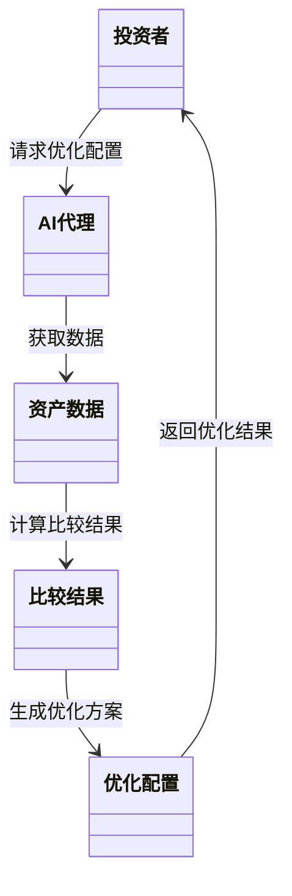
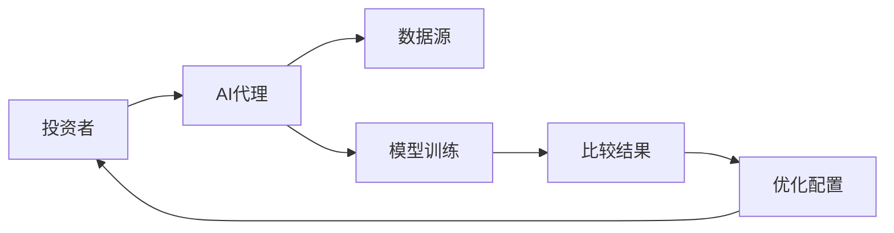
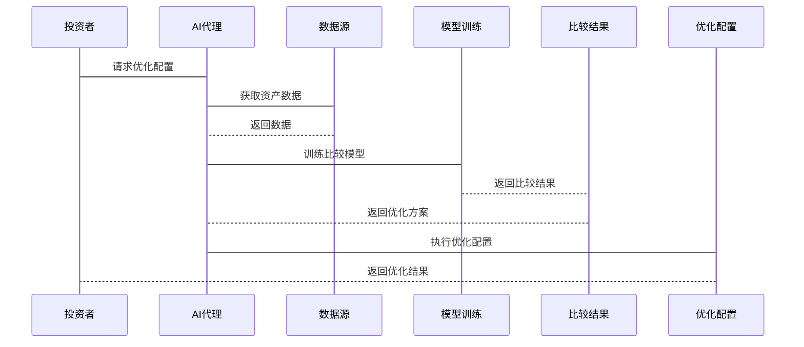

                 


# AI agents协作进行跨资产类别价值比较：优化资产配置

> 关键词：AI代理协作，跨资产类别比较，资产配置优化，数学模型，系统架构设计

> 摘要：本文详细探讨了AI代理协作在跨资产类别价值比较中的应用，通过分析资产类别特点、设计AI代理协作算法、构建系统架构、实现项目实战，最终优化资产配置。文章从背景、概念、算法、系统设计、项目实战等多维度展开，结合数学模型、流程图和代码示例，全面阐述了AI代理协作在金融领域的实践应用。

---

## 第一部分: AI代理协作与跨资产类别价值比较概述

### 第1章: 引言

#### 1.1 问题背景与描述
- **传统资产配置的局限性**：传统资产配置依赖人工经验，难以应对复杂多变的市场环境。
- **跨资产类别比较的复杂性**：不同资产类别具有不同的风险收益特征，直接比较困难。
- **AI代理协作的优势**：通过AI代理协作，实现多维度数据整合与分析，优化资产配置。

#### 1.2 AI代理协作的核心意义
- **智能化资产配置**：利用AI代理协作，实现资产配置的智能化与自动化。
- **风险收益平衡**：通过跨资产类别比较，优化风险收益比，提高资产配置效率。
- **数据驱动决策**：基于大数据分析，提供科学的资产配置建议。

#### 1.3 本文结构
- 本文分为六个部分：引言、核心概念、算法原理、系统架构、项目实战、总结。
- 详细阐述AI代理协作在跨资产类别比较中的应用。

---

## 第二部分: AI代理协作的核心概念与联系

### 第2章: AI代理协作的核心概念

#### 2.1 AI代理协作的背景与定义
- **AI代理**：具备自主决策能力的智能体，能够通过数据驱动的方式完成特定任务。
- **代理协作**：多个AI代理通过信息共享与协同，共同完成复杂任务。
- **金融领域中的代理协作**：通过协作优化资产配置，提升投资收益。

#### 2.2 跨资产类别比较的核心要素
- **资产类别划分**：股票、债券、基金、房地产等。
- **比较指标**：收益率、波动率、流动性等。
- **比较方法**：基于收益、基于风险、基于风险收益比。

#### 2.3 核心概念的关系与对比
- **概念属性特征对比**：表格形式对比AI代理协作与传统资产配置的差异。
- **ER实体关系图**：展示投资者、代理、资产数据、比较结果、优化配置的关系。


---

## 第三部分: AI代理协作的算法原理

### 第3章: 跨资产类别比较的算法原理

#### 3.1 算法原理概述
- **多智能体协作算法**：基于分布式计算的协作机制。
- **资产比较的数学模型**：收益-风险模型、马科维茨均值-方差模型。
- **优化配置的实现方法**：基于动态规划的优化算法。

#### 3.2 算法流程图


#### 3.3 核心算法的数学模型
- **收益-风险模型**：
  $$ E[r_p] = \sum w_i E[r_i] $$
  $$ Var(r_p) = \sum w_i^2 Var(r_i) + 2\sum_{i<j} w_i w_j Cov(r_i, r_j) $$
- **马科维茨均值-方差模型**：
  $$ \text{最小化} \quad \sigma_p^2 $$
  $$ \text{在满足} \quad \sum w_i r_i = E[r_p], \quad \sum w_i = 1 $$

#### 3.4 代码实现与分析
- **Python代码示例**：

```python
import numpy as np
import pandas as pd

# 数据预处理
def preprocess_data(data):
    # 假设data为包含不同资产类别收益和风险的数据框
    return data.dropna().astype(float)

# 特征提取
def extract_features(data):
    features = ['收益率', '波动率', '夏普比率']
    return data[features]

# 模型训练
def train_model(features, labels):
    from sklearn.linear_model import LinearRegression
    model = LinearRegression()
    model.fit(features, labels)
    return model

# 比较结果
def compare_assets(model, features):
    predictions = model.predict(features)
    return predictions

# 优化配置
def optimize_allocation(predictions):
    from scipy.optimize import minimize
    def objective(weights):
        return np.dot(weights.T, predictions)
    constraints = [{'type': 'eq', 'fun': lambda w: np.sum(w) - 1}]
    bounds = [(0, 1)] * len(predictions)
    result = minimize(objective, np.ones(len(predictions))/len(predictions), 
                      bounds=bounds, constraints=constraints)
    return result.x
```

---

## 第四部分: 系统架构设计

### 第4章: 系统架构设计与实现

#### 4.1 问题场景介绍
- **目标**：构建一个基于AI代理协作的资产配置优化系统。
- **主要功能**：数据采集、资产比较、优化配置、结果展示。

#### 4.2 系统功能设计
- **领域模型**：用Mermaid类图展示系统模块及其交互关系。



#### 4.3 系统架构设计
- **整体架构图**：展示系统各模块之间的关系。



#### 4.4 接口设计与交互流程
- **接口设计**：API接口定义。
- **交互流程**：投资者请求优化，AI代理获取数据，计算结果并返回优化配置。



---

## 第五部分: 项目实战与案例分析

### 第5章: 项目实战

#### 5.1 环境安装与数据准备
- **环境安装**：
  ```bash
  pip install numpy pandas scikit-learn scipy
  ```

- **数据准备**：
  ```python
  import pandas as pd
  data = pd.read_csv('assets.csv')
  ```

#### 5.2 核心功能实现
- **数据预处理**：
  ```python
  processed_data = preprocess_data(data)
  ```
- **特征提取**：
  ```python
  features = extract_features(processed_data)
  ```
- **模型训练**：
  ```python
  model = train_model(features, labels)
  ```
- **比较结果**：
  ```python
  predictions = compare_assets(model, features)
  ```
- **优化配置**：
  ```python
  weights = optimize_allocation(predictions)
  ```

#### 5.3 案例分析与解读
- **案例分析**：基于实际数据，展示优化配置结果。
- **结果解读**：分析优化配置的有效性与可行性。

#### 5.4 代码实现与优化
- **代码实现**：详细解读每一步代码的功能与实现。
- **优化建议**：根据实际结果提出优化建议。

---

## 第六部分: 总结与展望

### 第6章: 总结与展望

#### 6.1 本章小结
- **总结**：AI代理协作在跨资产类别比较中的应用，优化资产配置的有效性。
- **不足之处**：当前算法的局限性与改进空间。

#### 6.2 最佳实践
- **数据质量**：确保数据的完整性和准确性。
- **模型选择**：根据具体需求选择合适的模型。
- **结果验证**：通过回测验证模型的有效性。

#### 6.3 注意事项
- **数据隐私**：注意数据隐私与合规性。
- **模型风险**：充分考虑模型的局限性与潜在风险。

#### 6.4 拓展阅读
- 推荐相关领域的书籍与论文，提供进一步学习的方向。

---

## 作者信息

作者：AI天才研究院/AI Genius Institute & 禅与计算机程序设计艺术/Zen And The Art of Computer Programming

---

**全文完。**

