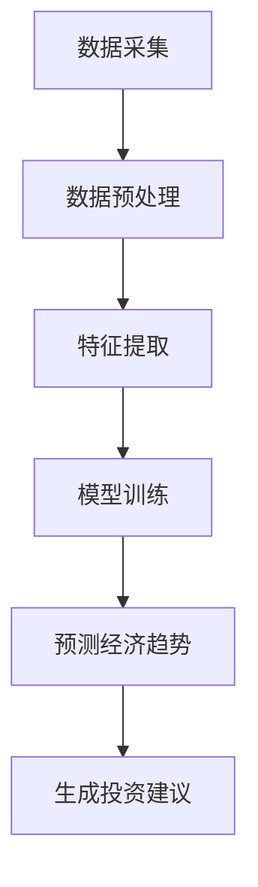
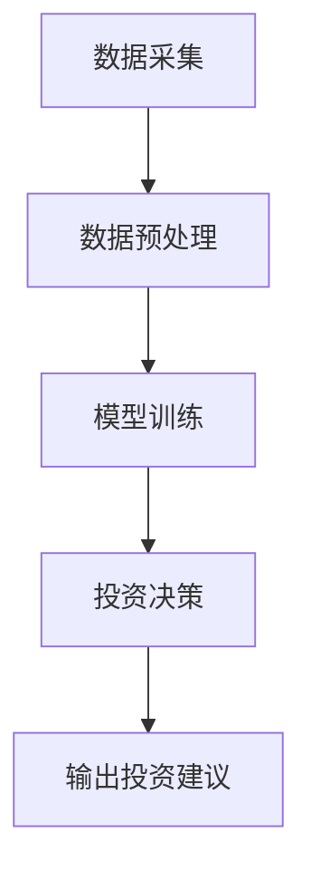
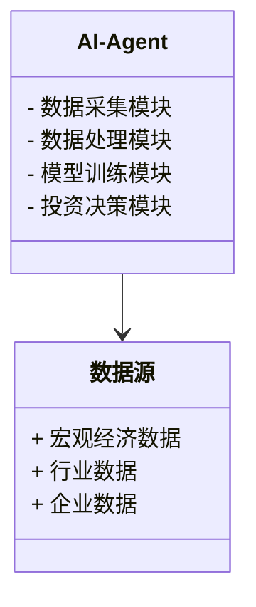
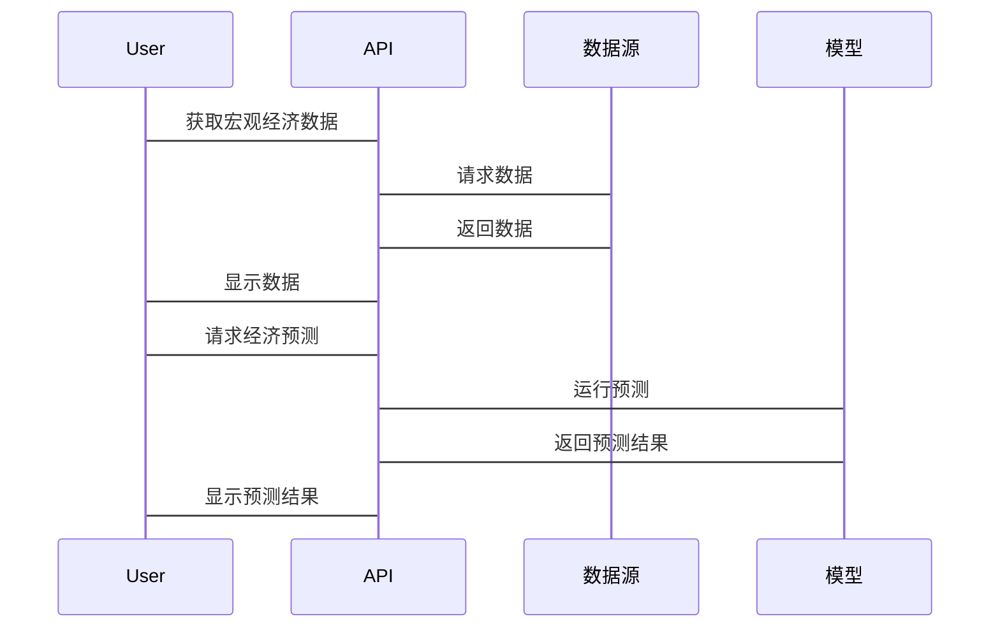

                 


# AI Agents在价值投资中的宏观经济分析应用

## 关键词：AI代理、价值投资、宏观经济分析、算法原理、系统架构设计

## 摘要：  
本文深入探讨了AI代理在价值投资中的宏观经济分析应用。通过分析宏观经济指标、市场趋势和企业基本面，AI代理能够辅助投资者做出更明智的投资决策。文章从AI代理的基本概念出发，详细讲解了其在宏观经济分析中的模型构建、算法原理、系统架构设计以及实际应用案例，展示了AI技术在金融领域的巨大潜力。

---

## 第一章：AI代理与宏观经济分析概述

### 1.1 AI代理的核心概念

#### 1.1.1 AI代理的定义与特点  
AI代理是一种能够感知环境、自主决策并执行任务的智能实体。它具备以下特点：  
1. **自主性**：能够在无外部干预的情况下完成任务。  
2. **反应性**：能够实时感知环境并做出响应。  
3. **学习能力**：通过数据和经验不断优化自身行为。  

#### 1.1.2 宏观经济分析的基本概念  
宏观经济分析关注整体经济运行状况，包括GDP、通货膨胀率、失业率等关键指标。通过分析这些指标，投资者可以更好地理解市场趋势和风险。  

#### 1.1.3 AI代理在宏观经济分析中的应用背景  
随着数据量的激增和计算能力的提升，AI代理能够处理海量宏观经济数据，为价值投资提供更精准的决策支持。

### 1.2 价值投资与宏观经济的关系  

#### 1.2.1 价值投资的基本原理  
价值投资强调以低于内在价值的价格买入优质资产。宏观经济分析是价值投资的重要组成部分，因为它帮助投资者识别经济周期和行业趋势。  

#### 1.2.2 宏观经济对价值投资的影响  
宏观经济环境直接影响企业的盈利能力。例如，低利率环境通常会推高资产价格，而高通胀率可能导致企业利润下降。  

#### 1.2.3 AI代理在价值投资中的优势  
AI代理能够快速处理大量宏观经济数据，识别潜在的投资机会，并提供实时的市场洞察。

---

## 第二章：AI代理与宏观经济分析的核心联系

### 2.1 AI代理的宏观经济分析模型

#### 2.1.1 模型的基本结构  
AI代理的宏观经济分析模型通常包括以下模块：  
1. 数据采集模块：收集宏观经济指标、行业数据和企业基本面信息。  
2. 数据处理模块：对数据进行清洗、转换和特征提取。  
3. 分析模块：利用机器学习算法预测经济趋势和企业价值。  
4. 决策模块：基于分析结果生成投资建议。  

#### 2.1.2 模型的核心要素  
- **数据来源**：政府统计数据、行业报告、企业财报等。  
- **算法选择**：回归分析、时间序列分析、神经网络等。  
- **决策逻辑**：基于模型预测结果，生成买入、卖出或持有信号。  

#### 2.1.3 模型的输入与输出  
- **输入**：宏观经济指标、行业趋势、企业财务数据。  
- **输出**：投资建议、风险评估、资产配置建议。  

### 2.2 宏观经济数据的处理与分析

#### 2.2.1 数据来源与类型  
- **宏观经济指标**：GDP、CPI、失业率等。  
- **行业数据**：行业增长率、市场容量、竞争格局。  
- **企业数据**：收入、利润、资产负债表等。  

#### 2.2.2 数据预处理方法  
- **数据清洗**：处理缺失值、异常值。  
- **数据转换**：标准化、归一化。  
- **特征提取**：使用PCA等方法降维。  

#### 2.2.3 数据分析方法  
- **回归分析**：预测经济趋势。  
- **时间序列分析**：识别周期性波动。  
- **聚类分析**：划分行业或企业类型。  

### 2.3 AI代理在宏观经济分析中的算法原理

#### 2.3.1 算法概述  
常用的算法包括：  
1. **线性回归**：预测经济指标的趋势。  
2. **随机森林**：分类和回归任务。  
3. **LSTM**：处理时间序列数据。  

#### 2.3.2 算法流程图（Mermaid）  



#### 2.3.3 算法实现代码  

```python
import pandas as pd
import numpy as np
from sklearn.ensemble import RandomForestRegressor
from sklearn.metrics import mean_squared_error

# 数据加载与预处理
data = pd.read_csv('macroeconomic_data.csv')
data = data.dropna()
X = data.drop(columns=['target'])
y = data['target']

# 特征提取
from sklearn.decomposition import PCA
pca = PCA(n_components=10)
X_pca = pca.fit_transform(X)

# 模型训练
model = RandomForestRegressor(n_estimators=100)
model.fit(X_pca, y)

# 预测
new_data = pd.read_csv('new_macro_data.csv')
new_data = new_data.dropna()
new_X = new_data.drop(columns=['target'])
new_X_pca = pca.transform(new_X)
predictions = model.predict(new_X_pca)

# 评估
 mse = mean_squared_error(new_data['target'], predictions)
 print(f'Mean Squared Error: {mse}')
```

---

## 第三章：系统架构设计与实现

### 3.1 系统功能设计

#### 3.1.1 系统功能模块  
1. 数据采集模块：实时获取宏观经济数据。  
2. 数据处理模块：清洗和转换数据。  
3. 模型训练模块：训练宏观经济分析模型。  
4. 投资决策模块：生成投资建议。  

#### 3.1.2 系统功能流程图（Mermaid）  



### 3.2 系统架构设计

#### 3.2.1 系统架构图（Mermaid）  



### 3.3 系统接口设计

#### 3.3.1 API接口  
- **数据接口**：提供宏观经济数据的API接口。  
- **模型接口**：提供经济预测和投资建议的API接口。  

#### 3.3.2 交互流程图（Mermaid）  



---

## 第四章：项目实战与案例分析

### 4.1 环境安装与配置

#### 4.1.1 环境要求  
- Python 3.8+  
- Pandas、NumPy、Scikit-learn等库  

#### 4.1.2 安装依赖  
```bash
pip install pandas numpy scikit-learn
```

### 4.2 核心代码实现

#### 4.2.1 数据预处理  
```python
import pandas as pd
import numpy as np

# 数据加载
data = pd.read_csv('macroeconomic_data.csv')

# 数据清洗
data = data.dropna()

# 特征提取
from sklearn.decomposition import PCA
pca = PCA(n_components=5)
X_pca = pca.fit_transform(data.drop(columns='target'))
```

#### 4.2.2 模型训练与预测  
```python
from sklearn.ensemble import RandomForestRegressor
from sklearn.metrics import mean_squared_error

# 模型训练
model = RandomForestRegressor(n_estimators=100)
model.fit(X_pca, data['target'])

# 新数据预测
new_data = pd.read_csv('new_macro_data.csv')
new_X = new_data.drop(columns='target')
new_X_pca = pca.transform(new_X)
predictions = model.predict(new_X_pca)

# 评估
 mse = mean_squared_error(new_data['target'], predictions)
 print(f'Mean Squared Error: {mse}')
```

### 4.3 案例分析

#### 4.3.1 数据分析结果  
假设模型预测未来一年的GDP增长率为3.5%，通胀率为2.2%。  

#### 4.3.2 投资建议  
基于模型预测，AI代理建议投资者增持低通胀环境下的防御性行业（如公用事业、医疗保健）。

### 4.4 项目总结

#### 4.4.1 成功经验  
- 数据预处理和特征提取是关键。  
- 随机森林和LSTM算法在宏观经济预测中表现优异。  

#### 4.4.2 挑战与改进  
- 数据质量和实时性是未来优化的方向。  
- 提高模型的解释性有助于投资者更好地理解决策依据。

---

## 第五章：总结与展望

### 5.1 全文总结  
本文详细探讨了AI代理在价值投资中的宏观经济分析应用，从理论到实践，全面展示了AI技术在金融领域的潜力。

### 5.2 未来展望  
随着AI技术的不断进步，宏观经济分析将更加精准，投资决策将更加智能化。未来的研究方向包括：  
1. 提高模型的实时性和准确性。  
2. 开发更复杂的宏观经济预测模型。  
3. 探索AI代理在多资产配置中的应用。  

### 5.3 注意事项  
- 数据隐私和安全问题需要高度重视。  
- 投资者应结合AI分析结果和市场经验做出决策。  

### 5.4 拓展阅读  
建议读者进一步阅读《机器学习在金融中的应用》和《宏观经济分析的原理与方法》。

---

## 作者：AI天才研究院 & 禅与计算机程序设计艺术

