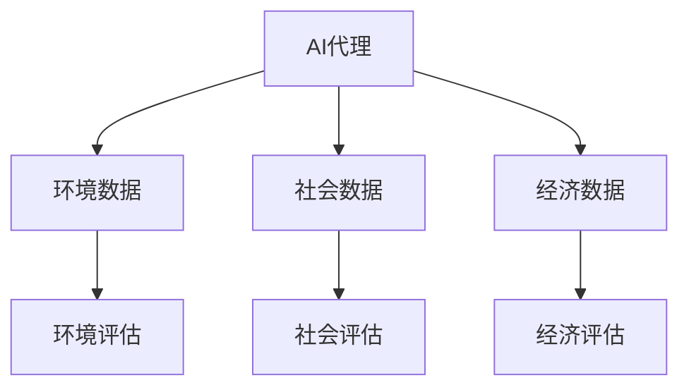
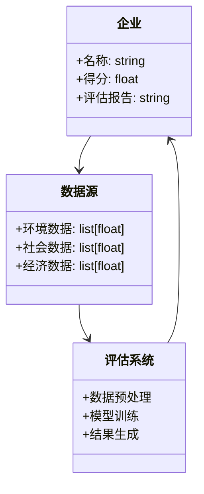
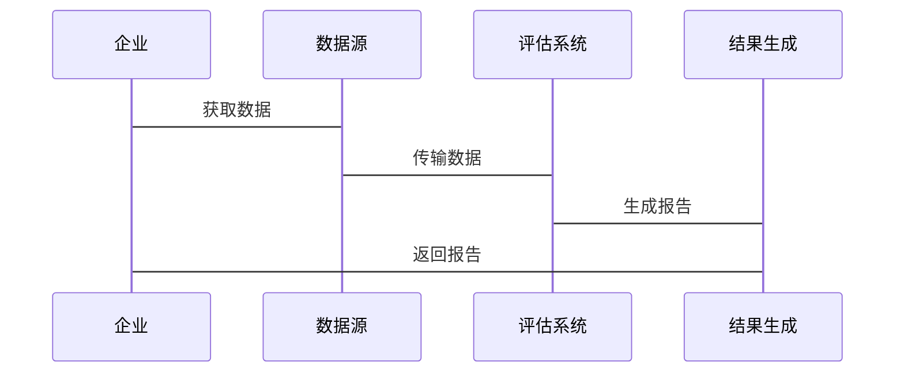

                 


# AI agents在公司可持续发展实践评估中的应用

## 关键词：AI代理、可持续发展、企业评估、机器学习、技术应用

## 摘要：  
随着全球对可持续发展的关注不断增加，企业需要通过有效的评估来衡量其在环境、社会和经济方面的表现。AI代理技术为企业提供了自动化、智能化的解决方案，能够高效地收集、分析和评估数据，从而优化企业的可持续发展战略。本文将探讨AI代理在可持续发展评估中的应用，涵盖其核心概念、算法原理、系统架构设计以及实际案例分析。通过结合机器学习模型和系统设计，本文旨在为企业提供一种创新的方法，以实现可持续发展目标。  

---

# 正文

## 第一部分: 背景介绍

### 第1章: AI代理与可持续发展评估概述

#### 1.1 AI代理的基本概念

##### 1.1.1 AI代理的定义  
AI代理（Artificial Intelligence Agents）是指能够感知环境、执行任务并做出决策的智能实体。它们可以是软件程序、机器人或其他智能系统，通过算法和数据驱动的方式实现自主操作。

##### 1.1.2 AI代理的核心特征  
- **自主性**：能够独立决策和行动。  
- **反应性**：能够实时感知环境并做出反应。  
- **学习能力**：通过数据和经验不断优化性能。  
- **协作性**：能够与其他系统或人类协同工作。  

##### 1.1.3 可持续发展评估的基本概念  
可持续发展评估是对企业在环境、社会和经济三个方面表现的综合评价，旨在帮助企业识别改进空间并制定可持续发展战略。

#### 1.2 可持续发展评估的背景与意义

##### 1.2.1 可持续发展的定义与目标  
可持续发展是指在满足当前需求的同时，不损害后代满足其需求的能力。其核心目标包括减少资源消耗、降低碳排放、促进社会公平等。

##### 1.2.2 企业可持续发展评估的现状  
目前，企业可持续发展评估主要依赖人工数据收集和分析，存在效率低、成本高等问题。AI代理的引入为企业提供了更高效的解决方案。

##### 1.2.3 AI代理在评估中的作用  
AI代理能够快速处理大量数据，提供实时反馈，并帮助企业制定优化策略。它们在数据收集、分析和决策支持方面具有显著优势。

#### 1.3 本章小结  
本章介绍了AI代理的基本概念及其在可持续发展评估中的重要性，为后续内容奠定了基础。

### 第2章: 可持续发展评估的核心要素

#### 2.1 可持续发展评估的主要维度

##### 2.1.1 环境维度  
- 减少碳排放。  
- 节约能源和资源。  

##### 2.1.2 社会维度  
- 提升员工福祉。  
- 促进社会公平。  

##### 2.1.3 经济维度  
- 降低成本。  
- 提高经济效益。  

#### 2.2 企业可持续发展评估的框架

##### 2.2.1 框架的构建原则  
- **全面性**：涵盖环境、社会和经济三个维度。  
- **可操作性**：便于数据收集和分析。  
- **动态性**：能够适应企业战略的变化。  

##### 2.2.2 框架的主要组成部分  
- 数据收集模块。  
- 数据分析模块。  
- 评估报告生成模块。  

##### 2.2.3 框架的实施步骤  
1. 确定评估目标。  
2. 收集相关数据。  
3. 分析数据并生成报告。  

#### 2.3 本章小结  
本章详细介绍了可持续发展评估的核心要素和框架，为后续章节的应用奠定了基础。

---

## 第二部分: 核心概念与联系

### 第3章: AI代理与可持续发展评估的核心概念

#### 3.1 AI代理的核心概念

##### 3.1.1 AI代理的类型  
- **基于规则的代理**：通过预定义规则进行决策。  
- **基于模型的代理**：利用数学模型进行预测和优化。  
- **基于学习的代理**：通过机器学习算法不断优化性能。  

##### 3.1.2 AI代理的关键技术  
- **机器学习**：用于数据分类和预测。  
- **自然语言处理**：用于文本分析和信息提取。  
- **知识图谱**：用于构建领域知识库。  

##### 3.1.3 AI代理的优缺点  
- **优点**：高效、智能、可扩展。  
- **缺点**：依赖数据质量，可能面临伦理问题。  

#### 3.2 可持续发展评估的核心概念

##### 3.2.1 评估指标的选择  
- **环境指标**：碳排放量、能源消耗。  
- **社会指标**：员工满意度、社会责任履行情况。  
- **经济指标**：成本效益分析、投资回报率。  

##### 3.2.2 评估数据的来源  
- **内部数据**：企业运营数据。  
- **外部数据**：行业基准数据、第三方评估数据。  

##### 3.2.3 评估结果的呈现  
- **可视化报告**：通过图表展示评估结果。  
- **基准对比**：与行业平均水平进行对比。  

#### 3.3 核心概念的联系

##### 3.3.1 核心概念属性特征对比（表格）

| 特性       | AI代理                  | 可持续发展评估          |
|------------|-------------------------|--------------------------|
| 数据需求   | 高                     | 高                      |
| 可扩展性   | 高                     | 中                      |
| 实时性     | 高                     | 中                      |

##### 3.3.2 实体关系图（Mermaid）



#### 3.4 本章小结  
本章详细分析了AI代理与可持续发展评估的核心概念，并通过表格和图表展示了它们之间的联系。

---

## 第三部分: 算法原理讲解

### 第4章: 基于机器学习的可持续发展评估算法

#### 4.1 算法原理概述

##### 4.1.1 算法选择  
本文采用基于机器学习的回归算法，用于预测企业的可持续发展表现。

##### 4.1.2 数学模型  
回归模型的公式如下：  
$$ y = mx + b $$  
其中，$y$ 表示企业的可持续发展得分，$x$ 表示输入特征，$m$ 和 $b$ 是模型参数。

#### 4.2 算法实现步骤

##### 4.2.1 数据预处理  
- 删除缺失值。  
- 标准化数据。  

##### 4.2.2 模型训练  
使用训练数据拟合回归模型，计算参数 $m$ 和 $b$。

##### 4.2.3 模型预测  
利用测试数据进行预测，并评估模型的准确性。

#### 4.3 代码实现（Python）

```python
import numpy as np
from sklearn.linear_model import LinearRegression

# 示例数据
X = np.array([[1], [2], [3], [4]])
y = np.array([2, 4, 6, 8])

# 训练模型
model = LinearRegression()
model.fit(X, y)

# 预测
predicted_y = model.predict(X)
print(predicted_y)
```

#### 4.4 算法优化

##### 4.4.1 参数调整  
通过交叉验证优化模型参数。

##### 4.4.2 模型评估  
使用均方误差（MSE）和决定系数（R²）评估模型性能。

#### 4.5 本章小结  
本章详细讲解了基于机器学习的可持续发展评估算法，并通过代码示例展示了其实现过程。

---

## 第四部分: 系统分析与架构设计

### 第5章: 可持续发展评估系统架构设计

#### 5.1 问题场景介绍  
企业需要一个自动化系统来实时监控和评估其可持续发展表现。

#### 5.2 系统功能设计

##### 5.2.1 领域模型（Mermaid 类图）



#### 5.3 系统架构设计（Mermaid 架构图）


#### 5.4 接口与交互设计（Mermaid 序列图）



#### 5.5 本章小结  
本章详细设计了可持续发展评估系统的架构，并通过图表展示了其组成部分和交互流程。

---

## 第五部分: 项目实战

### 第6章: 实际案例分析

#### 6.1 项目介绍  
某制造企业希望通过AI代理优化其可持续发展评估流程。

#### 6.2 核心代码实现

##### 6.2.1 环境安装  
安装必要的Python库，如 `scikit-learn` 和 `pandas`。

##### 6.2.2 数据处理

```python
import pandas as pd

data = pd.read_csv('sustainability.csv')
data.head()
```

##### 6.2.3 模型训练与预测

```python
from sklearn.model

