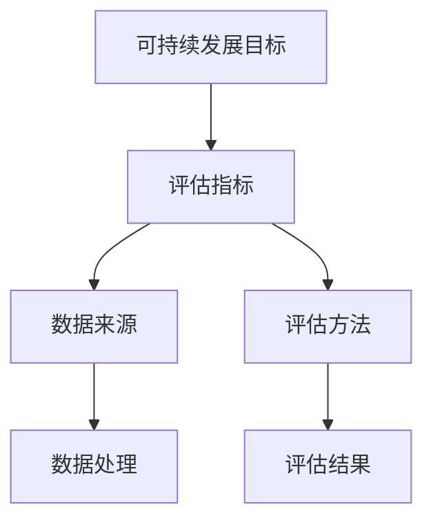
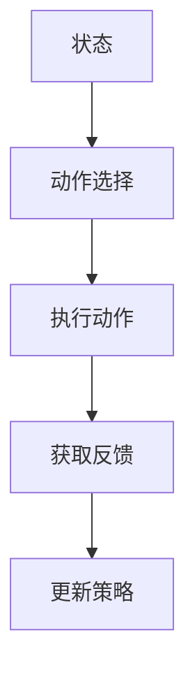
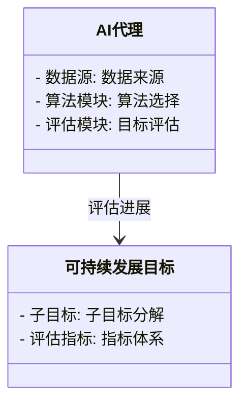
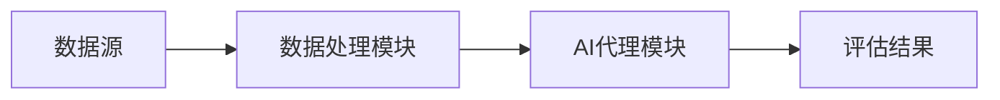
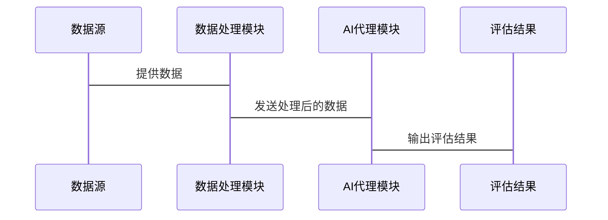

                 


# AI agents在公司可持续发展目标进展评估中的应用

> 关键词：AI代理，可持续发展目标，企业评估，算法原理，系统架构

> 摘要：随着全球对企业可持续发展的关注日益增加，AI代理在评估公司可持续发展目标中的应用变得至关重要。本文将详细探讨AI代理在这一领域的核心概念、算法原理、系统设计以及实际应用，为读者提供全面的技术解读。

---

# 第一部分: 引言

## 1.1 AI代理与可持续发展目标的背景

### 1.1.1 可持续发展目标的定义与重要性
可持续发展目标（Sustainable Development Goals, SDGs）是联合国提出的17个全球目标，旨在促进社会、经济和环境的综合发展。这些目标涵盖了消除贫困、保护地球、促进包容性经济增长等多个方面。对于企业而言，评估自身在实现SDGs方面的进展，不仅是社会责任的体现，也是提升企业形象和竞争力的重要手段。

### 1.1.2 AI代理在企业中的应用现状
AI代理是一种能够感知环境、自主决策并采取行动的智能系统。在企业中，AI代理已经被广泛应用于自动化流程、数据分析、客户服务等领域。然而，将AI代理应用于可持续发展目标的评估，还处于探索阶段，但其潜力巨大。

### 1.1.3 本书的研究目标与意义
本书旨在探讨如何利用AI代理技术，帮助企业更高效、更准确地评估其在可持续发展目标上的进展。通过结合AI代理的智能化和数据处理能力，企业能够更好地识别自身在可持续发展方面的优势与不足，从而制定有效的改进策略。

## 1.2 问题背景与问题描述

### 1.2.1 可持续发展目标评估的难点
可持续发展目标涉及多个维度，且各目标之间可能存在相互影响。传统的方法通常依赖于人工数据收集和分析，效率低下且容易出错。此外，不同目标之间的数据关联性复杂，难以进行统一评估。

### 1.2.2 AI代理在目标评估中的作用
AI代理能够通过大数据分析、机器学习算法和自然语言处理等技术，帮助企业自动化收集、处理和分析与可持续发展目标相关的信息。同时，AI代理可以实时监控目标的进展情况，并根据反馈不断优化评估策略。

### 1.2.3 问题解决的边界与外延
本书将重点探讨AI代理在可持续发展目标评估中的具体应用，包括数据收集、目标分解、评估指标设计等方面。同时，本书也将探讨AI代理在评估过程中的局限性，以及如何通过技术手段加以克服。

## 1.3 本章小结
本章通过介绍可持续发展目标的定义和重要性，以及AI代理在企业中的应用现状，明确了本书的研究目标和意义。同时，通过分析评估过程中的难点和AI代理的作用，为后续章节的展开奠定了基础。

---

# 第二部分: 核心概念与联系

## 2.1 AI代理的核心概念与原理

### 2.1.1 AI代理的基本定义
AI代理是一种能够感知环境、自主决策并采取行动的智能系统。它能够通过传感器或数据源获取信息，并基于预设的目标和规则，采取相应的行动。AI代理可以分为简单反射代理和基于模型的反射代理两大类。

### 2.1.2 AI代理的分类与特点
- **简单反射代理**：这类代理基于直接的条件判断采取行动，通常用于简单的决策场景。
- **基于模型的反射代理**：这类代理具有复杂的状态模型，能够根据环境变化动态调整策略，适用于复杂的决策场景。

### 2.1.3 AI代理与可持续发展目标的关系
AI代理可以通过自动化数据处理、实时监控和智能决策，帮助企业更高效地实现可持续发展目标。例如，AI代理可以监控企业的碳排放数据，并根据设定的目标自动调整生产流程。

## 2.2 可持续发展目标的评估框架

### 2.2.1 可持续发展目标的分解与指标体系
可持续发展目标通常包含多个子目标，每个子目标都有相应的评估指标。例如，目标“消除贫困”可以分解为“减少极端贫困率”、“提高教育水平”等多个子目标。

### 2.2.2 目标评估的核心要素
评估的核心要素包括数据来源、评估指标、评估方法和评估结果。企业需要根据自身特点选择合适的评估指标和方法，确保评估结果的准确性和可操作性。

### 2.2.3 评估框架的实体关系图



## 2.3 AI代理与可持续发展目标的关联性分析

### 2.3.1 AI代理在目标评估中的优势
AI代理能够快速处理大量数据，识别数据之间的关联性，从而提高评估的效率和准确性。此外，AI代理还可以实时监控目标的进展情况，提供及时的反馈和建议。

### 2.3.2 代理行为与目标实现的关系
AI代理通过优化资源配置、提高效率和减少浪费，间接推动可持续发展目标的实现。例如，AI代理可以通过优化供应链管理，减少企业的碳排放。

### 2.3.3 核心概念的对比分析
通过对比分析，可以看出AI代理在目标评估中的优势，尤其是在数据处理和决策优化方面。

## 2.4 本章小结
本章详细介绍了AI代理的核心概念和可持续发展目标的评估框架，并通过实体关系图展示了两者之间的关联性。这些内容为后续章节的算法设计和系统实现奠定了基础。

---

# 第三部分: AI代理的算法原理

## 3.1 AI代理的算法基础

### 3.1.1 强化学习算法
强化学习是一种通过试错机制来优化决策策略的算法。AI代理通过与环境交互，不断学习优化自己的行为，以实现目标的最大化。

### 3.1.2 监督学习算法
监督学习是一种基于标注数据进行学习的算法。AI代理可以通过监督学习，从历史数据中学习评估指标的预测模型。

### 3.1.3 联合学习算法
联合学习是一种通过多个模型协作来提高整体性能的算法。AI代理可以通过联合学习，整合不同数据源的信息，提高评估的准确性。

## 3.2 算法原理的数学模型

### 3.2.1 强化学习的数学模型
强化学习的核心是通过最大化累积奖励来优化策略。数学模型可以表示为：

$$ V(s) = \max_a Q(s,a) $$

其中，\( V(s) \) 表示状态 \( s \) 的价值函数，\( Q(s,a) \) 表示状态 \( s \) 下采取行动 \( a \) 的价值函数。

### 3.2.2 监督学习的数学模型
监督学习的目标是通过训练数据学习预测模型。数学模型可以表示为：

$$ y = f(x) $$

其中，\( y \) 是目标变量，\( x \) 是输入变量，\( f \) 是预测函数。

## 3.3 算法实现的流程图



## 3.4 本章小结
本章详细介绍了AI代理常用的算法，包括强化学习、监督学习和联合学习，并通过数学模型和流程图展示了这些算法的工作原理。

---

# 第四部分: 系统分析与架构设计

## 4.1 问题场景介绍
企业需要评估自身在可持续发展目标上的进展，但由于数据复杂性和目标多样性，传统的评估方法效率低下。通过引入AI代理，企业可以实现自动化、智能化的评估。

## 4.2 系统功能设计

### 4.2.1 领域模型mermaid类图


### 4.2.2 系统架构设计mermaid架构图


### 4.2.3 系统接口设计
系统接口包括数据输入接口、算法选择接口和结果输出接口。这些接口需要与企业的数据源和业务系统无缝对接。

### 4.2.4 系统交互mermaid序列图


## 4.3 本章小结
本章通过系统分析和架构设计，展示了如何利用AI代理实现可持续发展目标的评估。类图、架构图和序列图的使用，使得系统的结构和流程更加清晰。

---

# 第五部分: 项目实战

## 5.1 环境安装
为了实现AI代理，首先需要安装必要的软件和库。例如，Python编程语言、TensorFlow和Scikit-learn等机器学习库。

## 5.2 系统核心实现源代码

```python
# 示例代码：AI代理实现可持续发展目标评估
import numpy as np
from sklearn import linear_model

# 数据预处理
data = np.loadtxt('data.csv', delimiter=',')
X = data[:, :-1]
y = data[:, -1]

# 监督学习模型训练
model = linear_model.LinearRegression()
model.fit(X, y)

# 评估结果预测
new_data = np.array([[5, 6, 7]])
prediction = model.predict(new_data)
print(f'预测结果: {prediction}')
```

## 5.3 代码应用解读与分析
上述代码展示了如何使用监督学习算法对可持续发展目标的评估指标进行预测。通过训练模型，AI代理可以自动预测未来的目标评估结果，并提供相应的建议。

## 5.4 实际案例分析
以减少碳排放为例，企业可以通过AI代理分析生产过程中的能源消耗数据，优化生产流程，从而减少碳排放。

## 5.5 项目小结
通过项目实战，读者可以了解如何将AI代理应用于可持续发展目标的评估。代码示例和案例分析帮助读者更好地理解技术实现和实际应用。

---

# 第六部分: 最佳实践与总结

## 6.1 最佳实践 tips
- 确保数据的准确性和完整性
- 选择合适的算法和模型
- 定期更新和优化系统

## 6.2 本章小结
本章总结了本书的主要内容，并提出了在实际应用中的最佳实践建议。

---

# 作者

作者：AI天才研究院/AI Genius Institute & 禅与计算机程序设计艺术 /Zen And The Art of Computer Programming

