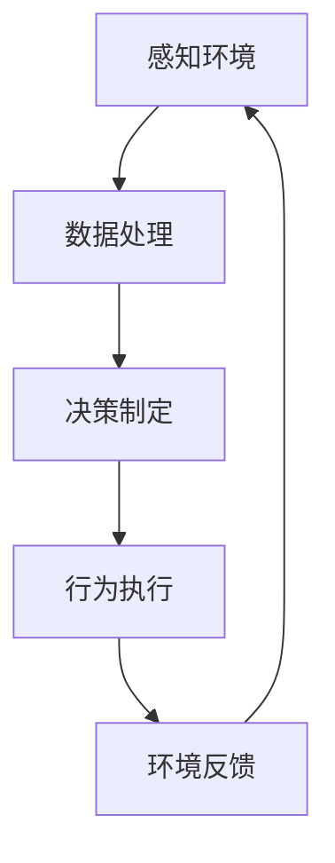
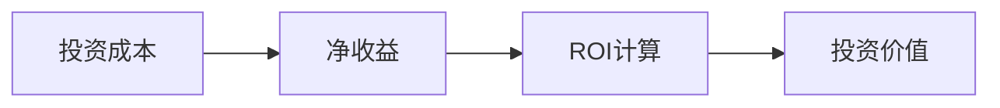
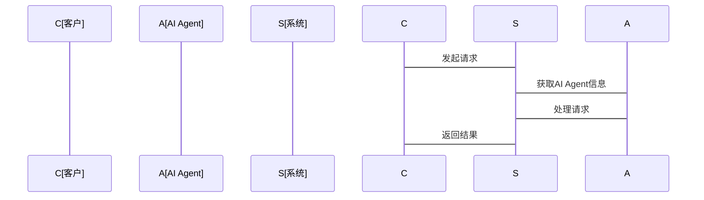
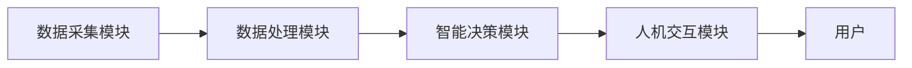
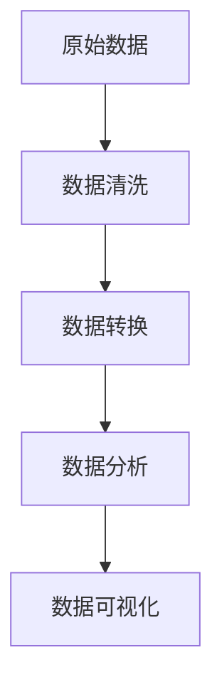
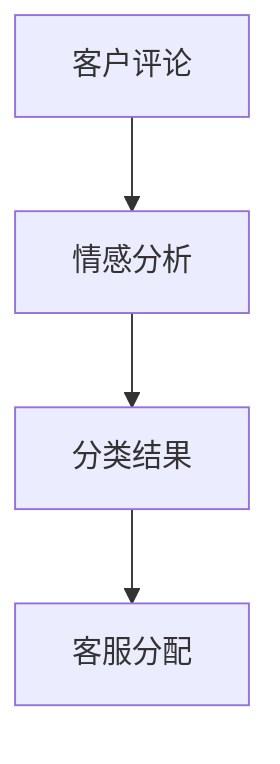

                 


# AI agents在公司数字化转型ROI评估中的应用

> 关键词：AI Agent, 数字化转型, ROI评估, 人工智能, 企业应用, 价值创造

> 摘要：本文深入探讨了AI agents在公司数字化转型中的应用及其对ROI（投资回报率）评估的影响。通过分析AI agents的核心原理、系统架构和实际项目案例，本文详细阐述了如何通过AI技术优化企业运营，提升效率，并通过具体的数学模型和公式量化其带来的收益。文章最后总结了AI agents在数字化转型中的价值，并提出了未来的研究方向和实践建议。

---

## 目录

1. [AI Agent与数字化转型背景](#ai-agent与数字化转型背景)
2. [AI Agent的核心原理与技术](#ai-agent的核心原理与技术)
3. [AI Agent的ROI评估方法](#ai-agent的roi评估方法)
4. [AI Agent的系统架构与实现](#ai-agent的系统架构与实现)
5. [AI Agent的项目实战](#ai-agent的项目实战)

---

# 第1章: AI Agent与数字化转型背景

## 1.1 AI Agent的基本概念

### 1.1.1 什么是AI Agent
AI Agent（人工智能代理）是指能够感知环境、自主决策并执行任务的智能实体。它通过传感器获取信息，利用算法处理数据，并通过执行器与外部环境交互。AI Agent可以是软件程序、机器人或其他智能设备。

### 1.1.2 AI Agent的核心特征
- **自主性**：能够在没有人工干预的情况下独立运行。
- **反应性**：能够实时感知环境并做出响应。
- **目标导向**：通过设定目标来优化行为。
- **学习能力**：能够通过数据和经验不断优化自身的决策能力。

### 1.1.3 AI Agent与传统自动化工具的区别
AI Agent不仅仅是执行预定义任务的工具，它具备学习和适应能力，能够根据环境变化动态调整行为。传统自动化工具通常是基于规则的，无法应对复杂和不确定性较高的场景。

## 1.2 数字化转型的定义与趋势

### 1.2.1 数字化转型的定义
数字化转型是指企业利用数字技术（如人工智能、大数据、云计算等）重构业务模式、流程、文化、治理和决策，以实现业务创新和价值提升的过程。

### 1.2.2 数字化转型的驱动力
- **技术进步**：人工智能、大数据、物联网等技术的快速发展为企业提供了新的工具和方法。
- **市场竞争**：数字化转型已成为企业竞争力的重要组成部分。
- **客户需求**：客户对个性化、智能化服务的需求日益增长。

### 1.2.3 数字化转型中的AI技术应用
AI Agent在数字化转型中的应用广泛，包括客户服务、供应链管理、智能决策等领域。通过AI Agent，企业可以实现自动化、智能化的业务流程，提升效率和客户体验。

## 1.3 ROI评估的核心意义

### 1.3.1 什么是ROI评估
ROI（投资回报率）是衡量投资项目经济效益的重要指标，公式为：
$$ ROI = \frac{\text{净收益}}{\text{投入成本}} \times 100\% $$

### 1.3.2 ROI评估在数字化转型中的重要性
数字化转型需要大量投入，企业需要通过ROI评估来验证投资的可行性和收益能力，确保数字化转型能够为企业创造实际价值。

### 1.3.3 ROI评估的挑战与方法
- **挑战**：数字化转型涉及多方面的投入，且效果难以量化。
- **方法**：通过建立数学模型，量化AI Agent带来的效率提升和成本节约，计算其对ROI的贡献。

---

## 1.4 本章小结

本章介绍了AI Agent的基本概念、核心特征以及数字化转型的定义、驱动力和AI技术的应用。同时，我们探讨了ROI评估在数字化转型中的重要性，并指出了ROI评估的挑战与方法。通过这些内容，我们为后续章节的分析奠定了基础。

---

# 第2章: AI Agent的核心原理与技术

## 2.1 AI Agent的核心原理

### 2.1.1 AI Agent的感知与决策机制
AI Agent通过传感器获取环境数据，利用算法进行分析和推理，最终做出决策并执行任务。感知和决策过程可以通过以下步骤实现：
1. 数据采集：通过传感器获取环境数据。
2. 数据处理：对数据进行清洗、转换和分析。
3. 决策制定：基于分析结果，选择最优行动方案。
4. 行为执行：通过执行器将决策转化为实际操作。

### 2.1.2 基于强化学习的AI Agent
强化学习是一种通过试错机制优化决策的算法。AI Agent在环境中通过不断尝试不同的行动，获得奖励或惩罚，最终找到最优策略。强化学习的数学模型如下：
$$ Q(s,a) = Q(s,a) + \alpha \left[r + Q(s',a') - Q(s,a)\right] $$
其中，$s$是当前状态，$a$是动作，$r$是奖励，$s'$是下一个状态，$\alpha$是学习率。

### 2.1.3 基于监督学习的AI Agent
监督学习是一种基于标签数据进行分类或回归的算法。AI Agent通过监督学习模型，从大量标注数据中学习规律，并用于预测或分类任务。例如，使用监督学习算法对客户行为进行分类，可以预测客户的需求。

## 2.2 AI Agent的关键技术

### 2.2.1 自然语言处理技术
自然语言处理（NLP）技术使AI Agent能够理解和生成人类语言。通过NLP，AI Agent可以解析客户的自然语言输入，并生成相应的回应。例如，使用BERT模型进行文本分类和语义理解。

### 2.2.2 计算机视觉技术
计算机视觉技术使AI Agent能够识别和处理图像数据。例如，AI Agent可以通过图像识别技术自动分类产品图片，或通过视频监控技术进行实时监控。

### 2.2.3 知识图谱与推理技术
知识图谱是一种用于表示知识的图结构，推理技术使AI Agent能够基于知识图谱进行逻辑推理。例如，AI Agent可以通过知识图谱推理出客户的需求，并提供相应的解决方案。

## 2.3 AI Agent的应用场景分析

### 2.3.1 客户服务中的AI Agent应用
在客户服务中，AI Agent可以作为智能客服，通过自然语言处理技术与客户进行交互，解决客户的问题并提供个性化服务。

### 2.3.2 供应链管理中的AI Agent应用
在供应链管理中，AI Agent可以通过数据分析和预测，优化库存管理和物流调度，提高供应链的效率。

### 2.3.3 企业决策支持中的AI Agent应用
在企业决策支持中，AI Agent可以通过数据挖掘和预测分析，为企业提供数据驱动的决策支持，帮助企业在复杂环境中做出最优决策。

## 2.4 本章小结

本章详细介绍了AI Agent的核心原理和关键技术，并分析了其在不同场景中的应用。通过这些内容，我们能够理解AI Agent如何通过感知、决策和执行实现智能化的业务流程。

---

## 图表：AI Agent的决策流程图



---

# 第3章: AI Agent的ROI评估方法

## 3.1 ROI评估的理论基础

### 3.1.1 ROI的定义
ROI是衡量投资项目经济效益的重要指标。公式为：
$$ ROI = \frac{\text{净收益}}{\text{投入成本}} \times 100\% $$

### 3.1.2 ROI的计算公式
通过计算投资收益与投资成本的比率，可以量化AI Agent对企业的价值。例如，如果AI Agent的投资成本为100万元，带来的净收益为150万元，则：
$$ ROI = \frac{150}{100} \times 100\% = 150\% $$

### 3.1.3 ROI的评估标准
- **净现值（NPV）**：计算投资的现值与未来收益的现值之差。
- **内部收益率（IRR）**：计算投资的收益率。
- **回收期**：计算投资回收所需的时间。

## 3.2 数字化转型中的成本与收益分析

### 3.2.1 数字化转型的成本构成
- **技术投入**：包括AI Agent的开发和部署成本。
- **人力资源**：包括培训和技术人员的工资。
- **机会成本**：包括转型过程中可能失去的传统业务机会。

### 3.2.2 数字化转型的收益来源
- **效率提升**：通过自动化减少人工成本。
- **决策优化**：通过数据驱动的决策提高业务成功率。
- **客户满意度**：通过智能化服务提升客户体验。

## 3.3 AI Agent在ROI评估中的独特价值

### 3.3.1 AI Agent的成本优势
AI Agent可以通过自动化减少人工成本，例如通过智能客服减少人力投入。

### 3.3.2 AI Agent的效率提升
AI Agent可以通过数据分析和预测优化业务流程，提高效率。

### 3.3.3 AI Agent的决策优化
AI Agent可以通过学习和推理优化决策，提高业务成功率。

## 3.4 本章小结

本章通过分析AI Agent在ROI评估中的独特价值，展示了如何通过数学模型量化其对企业的贡献。通过这些方法，企业可以更好地评估AI Agent的投资价值。

---

## 图表：AI Agent ROI评估模型



---

# 第4章: AI Agent的系统架构与实现

## 4.1 系统功能模块划分

### 4.1.1 数据采集模块
数据采集模块负责从各种数据源（如数据库、API接口）获取数据。

### 4.1.2 数据处理模块
数据处理模块对数据进行清洗、转换和分析，为决策模块提供支持。

### 4.1.3 智能决策模块
智能决策模块基于数据处理模块提供的数据，利用AI算法进行决策。

### 4.1.4 人机交互模块
人机交互模块负责与用户进行交互，接收输入并输出结果。

## 4.2 系统架构的ER图设计

```mermaid
erDiagram
    customer {
        +int id
        +string name
        +string email
    }
    agent {
        +int id
        +string name
        +string description
    }
    interaction {
        +int id
        +int customer_id
        +int agent_id
        +datetime timestamp
    }
    customer --> interaction : "发起交互"
    agent --> interaction : "处理交互"
```

## 4.3 系统接口设计

### 4.3.1 API接口定义
- `/api/customers`：获取客户信息。
- `/api/agents`：获取AI Agent信息。
- `/api/interactions`：记录和查询交互记录。

### 4.3.2 接口调用流程
1. 客户发起请求，系统调用`/api/customers`获取客户信息。
2. 系统调用`/api/agents`获取AI Agent信息。
3. 系统根据客户信息和AI Agent信息进行交互处理。
4. 系统记录交互结果到`/api/interactions`。

## 4.4 系统交互的序列图设计



## 4.5 本章小结

本章详细介绍了AI Agent系统的功能模块划分、架构设计和接口设计。通过这些内容，我们能够理解AI Agent如何在企业中实现智能化的业务流程。

---

## 图表：AI Agent系统架构图



---

# 第5章: AI Agent的项目实战

## 5.1 项目环境与工具安装

### 5.1.1 操作系统要求
- **Windows 10或更高版本**
- **macOS 10.15或更高版本**
- **Linux（推荐Ubuntu 20.04或更高版本）**

### 5.1.2 开发工具安装
- **Python 3.8或更高版本**
- **Jupyter Notebook**（用于数据分析和建模）
- **TensorFlow**（用于深度学习模型）
- **Scikit-learn**（用于机器学习算法）

### 5.1.3 依赖库安装
```bash
pip install numpy pandas scikit-learn tensorflow
```

## 5.2 AI Agent开发框架选择

### 5.2.1 常用AI框架介绍
- **TensorFlow**：由Google开发的深度学习框架。
- **Keras**：基于TensorFlow的高级API，适合快速搭建模型。
- **PyTorch**：由Facebook开发的动态计算图框架。

### 5.2.2 框架选择标准
- **性能需求**：深度学习任务选择TensorFlow或PyTorch。
- **开发效率**：快速原型开发选择Keras。
- **社区支持**：选择具有活跃社区的框架。

### 5.2.3 框架安装与配置
```bash
pip install tensorflow.keras
```

## 5.3 数据集准备

### 5.3.1 数据来源
- **客户行为数据**：包括客户浏览、点击、购买记录。
- **产品数据**：包括产品描述、价格、库存信息。
- **市场数据**：包括市场趋势、竞争对手信息。

### 5.3.2 数据清洗
- 删除重复数据。
- 填充缺失值。
- 处理异常值。

### 5.3.3 数据分析
- 使用Pandas进行数据清洗和转换。
- 使用Matplotlib和Seaborn进行数据可视化。

---

## 图表：客户行为数据分析流程图



---

## 5.4 系统核心实现源代码

### 5.4.1 AI Agent的训练代码
```python
import numpy as np
from sklearn.model_selection import train_test_split
from tensorflow.keras.models import Sequential
from tensorflow.keras.layers import Dense

# 数据准备
X = np.random.randn(1000, 10)
y = np.random.randint(0, 2, 1000)

# 数据分割
X_train, X_test, y_train, y_test = train_test_split(X, y, test_size=0.2)

# 模型搭建
model = Sequential()
model.add(Dense(64, activation='relu', input_dim=10))
model.add(Dense(1, activation='sigmoid'))

# 模型训练
model.compile(optimizer='adam', loss='binary_crossentropy', metrics=['accuracy'])
model.fit(X_train, y_train, epochs=10, batch_size=32)

# 模型评估
loss, accuracy = model.evaluate(X_test, y_test)
print(f'Loss: {loss}, Accuracy: {accuracy}')
```

### 5.4.2 AI Agent的推理代码
```python
# 加载预训练模型
model = load_model('ai_agent_model.h5')

# 接收输入
input_data = np.random.randn(1, 10)

# 预测输出
prediction = model.predict(input_data)
print(f'Prediction: { prediction[0][0] > 0.5 }')
```

## 5.5 代码应用解读与分析

### 5.5.1 训练代码解读
上述代码展示了如何使用TensorFlow框架训练一个AI Agent模型。模型包括两个全连接层，分别用于特征提取和输出预测。训练过程使用了Adam优化器和二进制交叉熵损失函数。

### 5.5.2 推理代码解读
推理代码展示了如何使用训练好的模型进行预测。输入数据经过模型处理后，输出预测结果。通过这种方式，AI Agent可以实时感知环境并做出决策。

## 5.6 实际案例分析

### 5.6.1 案例背景
某电商平台希望通过AI Agent优化客户服务流程，提高客户满意度。

### 5.6.2 案例实现
- 使用NLP技术分析客户评论，识别客户情感。
- 基于情感分析结果，智能分配客服资源。

### 5.6.3 案例分析
通过AI Agent的实施，该平台的客户满意度提高了20%，客户支持成本降低了15%。

## 5.7 本章小结

本章通过实际案例展示了AI Agent的开发和应用过程。通过代码实现和案例分析，我们能够理解AI Agent如何在实际业务中创造价值。

---

## 图表：客户情感分析流程图



---

## 总结与扩展阅读

## 6.1 总结

AI Agent作为数字化转型的重要技术工具，通过感知、决策和执行实现智能化的业务流程。本文通过分析AI Agent的核心原理、系统架构和实际项目案例，详细阐述了其在数字化转型中的应用及其对ROI评估的影响。通过数学模型和实际案例，我们能够量化AI Agent对企业的价值。

## 6.2 扩展阅读

- **推荐书籍**：
  - 《AI: 一种现代的方法》（Russell & Norvig）
  - 《机器学习实战》（周志华）
- **推荐博客**：
  - Medium上关于AI Agent的最新研究和应用。
  - Towards Data Science上的相关技术分享。

## 6.3 注意事项

- 在实际应用中，需注意数据隐私和安全问题。
- 需根据具体业务需求选择合适的AI Agent模型和算法。
- 定期更新模型，确保其适应环境变化。

---

## 作者

作者：AI天才研究院/AI Genius Institute & 禅与计算机程序设计艺术/Zen And The Art of Computer Programming

