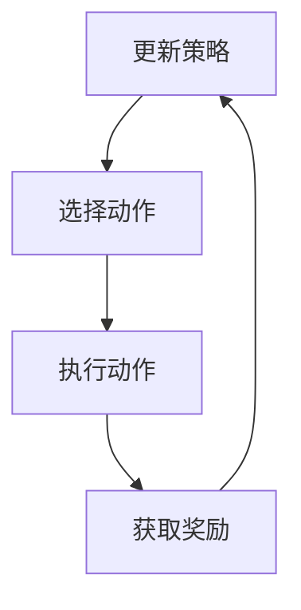
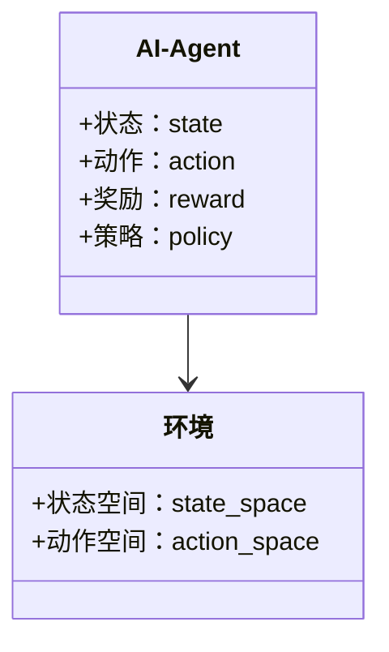
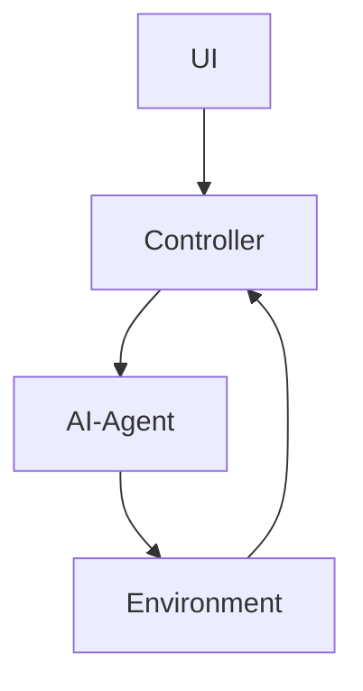
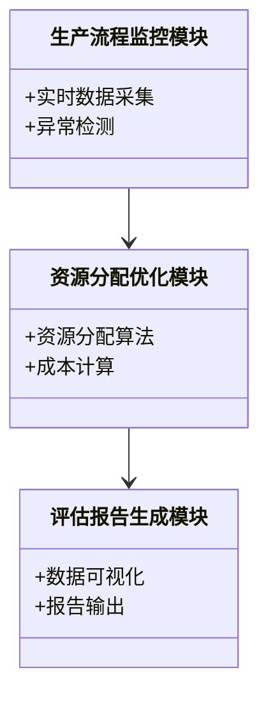
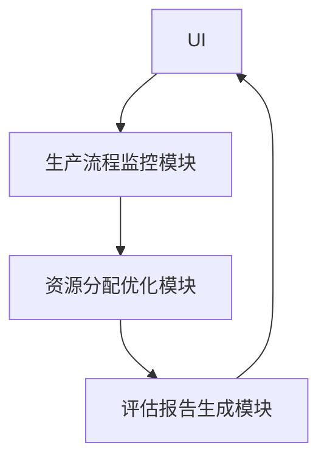

                 


# AI agents在公司数字化转型效果评估中的应用

> 关键词：AI agents，数字化转型，效果评估，智能代理，业务优化

> 摘要：随着人工智能技术的快速发展，AI agents（智能代理）在公司数字化转型中的应用越来越广泛。本文将深入探讨AI agents在公司数字化转型效果评估中的应用，从理论到实践，系统地分析AI agents如何帮助公司优化数字化转型过程，并提升转型效果的评估能力。

---

# 第一部分: AI agents的基本概念与背景

## 第1章: AI agents的基本概念与背景

### 1.1 AI agents的定义与特点

#### 1.1.1 AI agents的定义
AI agents（智能代理）是指能够感知环境、自主决策并执行任务的智能实体。与传统的自动化工具不同，AI agents具备学习和适应能力，能够根据环境反馈动态调整行为。

#### 1.1.2 AI agents的核心特点
- **自主性**：AI agents能够独立决策，无需人工干预。
- **反应性**：能够实时感知环境并做出反应。
- **学习能力**：通过数据和经验不断优化自身行为。
- **协作性**：能够与其他系统或AI agents协同工作。

#### 1.1.3 AI agents与传统自动化工具的区别
| 特性            | AI agents                     | 传统自动化工具                 |
|-----------------|-------------------------------|------------------------------|
| 决策能力        | 具备自主决策能力              | 仅执行预定义任务               |
| 学习能力        | 能够通过数据学习和优化        | 无法学习，依赖人工编程         |
| 环境适应性      | 能够动态调整行为               | 行为固定，无法适应变化         |

### 1.2 数字化转型的背景与挑战

#### 1.2.1 数字化转型的定义
数字化转型是指企业利用数字技术（如人工智能、大数据、云计算等）改变业务模式、流程、文化、管理方式，以实现业务创新和价值增长的过程。

#### 1.2.2 数字化转型的核心目标
- 提高业务效率
- 优化客户体验
- 创新商业模式
- 构建数据驱动的决策能力

#### 1.2.3 数字化转型中的常见挑战
- 数据孤岛问题
- 传统流程与新技术的整合难度
- 人才和技术的双重缺失
- 数据安全和隐私保护问题

### 1.3 AI agents在数字化转型中的作用

#### 1.3.1 AI agents如何提升效率
AI agents可以自动化处理重复性任务，优化资源配置，从而提升整体效率。

#### 1.3.2 AI agents如何优化决策
通过实时数据处理和机器学习算法，AI agents能够提供数据驱动的决策支持，帮助企业在复杂环境中做出更优选择。

#### 1.3.3 AI agents如何支持业务创新
AI agents可以通过智能化的流程设计和创新的交互方式，推动企业业务模式的创新。

### 1.4 本章小结
本章介绍了AI agents的基本概念、特点及其在数字化转型中的作用，为后续内容奠定了基础。

---

# 第二部分: AI agents在公司数字化转型中的应用场景

## 第2章: AI agents在公司数字化转型中的应用场景

### 2.1 生产效率提升

#### 2.1.1 自动化流程优化
AI agents可以通过自动化技术优化生产流程，减少人工干预，提高生产效率。

#### 2.1.2 资源分配优化
AI agents能够根据实时数据和预测模型，优化资源分配，降低浪费。

#### 2.1.3 供应链管理中的应用
AI agents可以实时监控供应链状态，预测需求变化，优化库存管理。

### 2.2 决策优化

#### 2.2.1 数据驱动的决策支持
AI agents通过分析海量数据，为企业提供精准的决策支持。

#### 2.2.2 风险预测与管理
AI agents能够预测潜在风险，并提供应对策略，帮助企业降低损失。

#### 2.2.3 智能推荐系统
AI agents可以根据客户行为和偏好，提供个性化的产品推荐，提升客户满意度。

### 2.3 客户体验优化

#### 2.3.1 智能客服系统
AI agents可以提供24/7的智能客服支持，快速响应客户需求。

#### 2.3.2 个性化客户互动
通过分析客户数据，AI agents能够提供个性化的互动体验，增强客户忠诚度。

#### 2.3.3 客户行为分析
AI agents可以实时分析客户行为，帮助企业更好地理解客户需求。

### 2.4 本章小结
本章探讨了AI agents在生产效率提升、决策优化和客户体验优化中的具体应用，展示了其在数字化转型中的重要价值。

---

# 第三部分: 公司数字化转型效果评估体系设计

## 第3章: 公司数字化转型效果评估体系设计

### 3.1 评估指标的选择

#### 3.1.1 效率提升指标
- 生产流程自动化率
- 人工干预减少比例
- 单位产品成本降低率

#### 3.1.2 决策优化指标
- 预测准确率
- 决策响应时间
- 风险预测命中率

### 3.2 评估模型的构建

#### 3.2.1 数据收集与预处理
- 数据来源：生产数据、客户数据、运营数据等。
- 数据清洗：去除噪声数据，处理缺失值。
- 数据转换：将数据转换为模型可处理的形式。

#### 3.2.2 模型选择与训练
- 使用机器学习算法（如随机森林、支持向量机）进行训练。
- 通过交叉验证优化模型参数。

#### 3.2.3 模型评估与调优
- 使用准确率、召回率、F1分数等指标评估模型性能。
- 调整模型参数，优化预测效果。

### 3.3 评估结果的量化与分析

#### 3.3.1 量化方法
- 综合评估指标：将多个评估指标进行加权计算，得出综合得分。
- 对比分析：将转型前后的数据进行对比，评估转型效果。

#### 3.3.2 可视化分析
- 使用图表展示评估结果，如柱状图、折线图等。
- 生成报告，总结评估发现。

### 3.4 本章小结
本章详细介绍了数字化转型效果评估体系的设计，包括指标选择、模型构建和结果分析，为实际应用提供了指导。

---

# 第四部分: AI agents在数字化转型效果评估中的技术实现

## 第4章: 技术实现与算法原理

### 4.1 算法原理

#### 4.1.1 强化学习算法
- 状态空间：表示环境中的各种状态。
- 行动空间：表示AI agents可以执行的动作。
- 奖励函数：定义每种动作的奖励值，指导AI agents的学习方向。

#### 4.1.2 基于强化学习的评估模型


### 4.2 系统架构设计

#### 4.2.1 系统功能模块


#### 4.2.2 系统架构图


### 4.3 代码实现

#### 4.3.1 简单AI agent实现
```python
class AI-Agent:
    def __init__(self, state_space, action_space):
        self.state_space = state_space
        self.action_space = action_space
        self.policy = {}  # 策略字典

    def take_action(self, state):
        # 根据当前状态选择动作
        if state in self.policy:
            return self.policy[state]
        else:
            return self.exploit_greedy()  # 默认使用贪心策略

    def update_policy(self, state, action, reward):
        # 更新策略
        self.policy[state] = action
        # 调整策略权重（简化版）
        self.policy[action] += reward
```

### 4.4 本章小结
本章详细讲解了AI agents在数字化转型效果评估中的技术实现，包括算法原理和系统架构设计，为后续的案例分析奠定了基础。

---

# 第五部分: 项目实战与案例分析

## 第5章: 项目实战——制造业数字化转型效果评估系统

### 5.1 项目背景与需求分析

#### 5.1.1 项目背景
某制造企业希望利用AI agents优化生产流程，提升效率，降低生产成本。

#### 5.1.2 项目需求
- 实时监控生产流程。
- 自动化处理异常情况。
- 优化资源分配。

### 5.2 系统设计

#### 5.2.1 系统功能设计


#### 5.2.2 系统架构设计


### 5.3 系统实现与测试

#### 5.3.1 环境搭建
- 安装Python、机器学习库（如scikit-learn、TensorFlow）。
- 配置数据库和消息队列。

#### 5.3.2 核心代码实现
```python
def main():
    # 初始化AI agent
    state_space = ['normal', 'abnormal']
    action_space = ['continue', 'stop']
    agent = AI-Agent(state_space, action_space)
    
    # 运行系统
    while True:
        state = collect_realtime_data()
        action = agent.take_action(state)
        reward = get_reward(state, action)
        agent.update_policy(state, action, reward)
```

### 5.4 项目小结
本章通过一个制造业数字化转型的案例，详细展示了AI agents在实际项目中的应用，验证了其在效果评估中的有效性。

---

# 第六部分: 总结与展望

## 第6章: 总结与展望

### 6.1 本章总结
本文系统地探讨了AI agents在公司数字化转型效果评估中的应用，从理论到实践，详细分析了AI agents的优势、应用场景、技术实现和实际案例。

### 6.2 未来展望
随着AI技术的不断进步，AI agents在数字化转型中的应用将更加广泛和深入。未来，AI agents可能会与区块链、物联网等技术结合，进一步提升数字化转型的效果评估能力。

---

# 作者信息

作者：AI天才研究院/AI Genius Institute & 禅与计算机程序设计艺术/Zen And The Art of Computer Programming

---

版权声明：本文版权归作者所有，转载请注明出处。

---

以上是《AI agents在公司数字化转型效果评估中的应用》的完整目录和部分文章内容，您可以根据实际需求进一步扩展和完善各章节内容。

