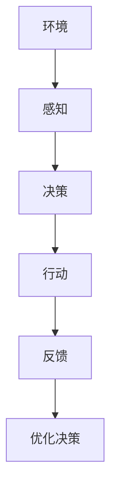
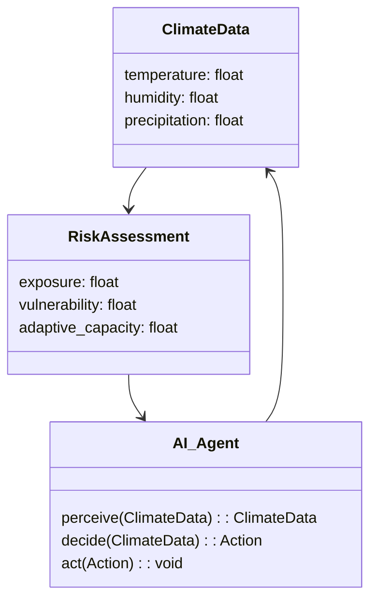
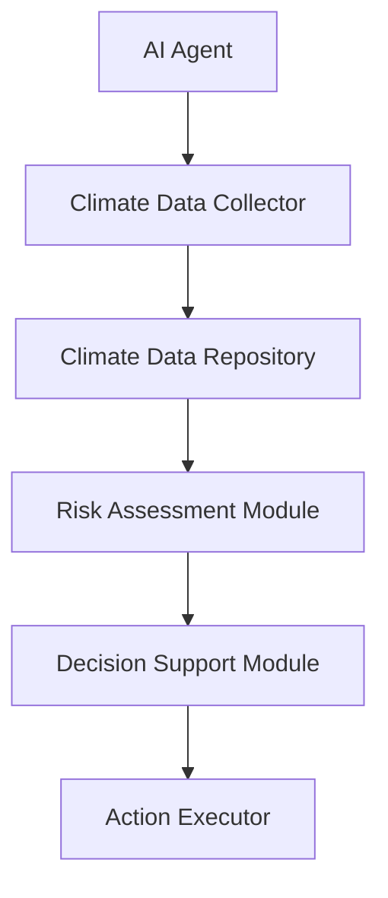
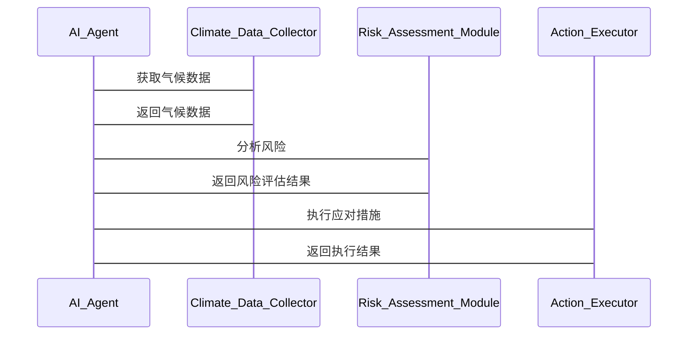

                 


# AI agents在公司气候变化适应能力评估中的应用

> 关键词：AI agents, 气候变化适应能力, 企业风险管理, 智能决策支持, 数据驱动方法

> 摘要：  
随着气候变化的加剧，企业面临的风险日益增加。传统的气候变化适应能力评估方法存在效率低、数据处理复杂、实时性差等问题。AI agents作为一种新兴的人工智能技术，能够通过自动化数据处理、实时反馈和智能决策支持，显著提升企业对气候变化的适应能力。本文从AI agents的基本原理出发，结合实际应用场景，详细探讨了其在气候变化适应能力评估中的应用价值、技术实现和实践案例，为企业应对气候变化提供了新的思路和方法。

---

# 第1章: 气候变化适应能力评估的背景与挑战

## 1.1 气候变化对企业的影响

### 1.1.1 气候变化的定义与现状  
气候变化是指地球气候系统长期的变化趋势，包括温度上升、极端天气事件频发、海平面上升等现象。近年来，气候变化对全球经济、社会和生态系统造成了深远影响，企业作为社会的重要组成部分，必须面对由此带来的各种挑战。

### 1.1.2 企业面临的气候变化风险  
企业在生产和运营过程中，可能会受到气候变化的直接影响，例如：  
1. **供应链中断**：极端天气可能导致原材料供应中断，影响生产计划。  
2. **运营成本增加**：能源价格波动、水资源短缺等会增加企业的运营成本。  
3. **声誉风险**：公众对环境问题的关注度提高，企业若未能采取有效的环保措施，可能会面临声誉损失。  

### 1.1.3 气候变化适应能力的重要性  
气候变化适应能力是指企业在面对气候变化带来的不利影响时，能够采取有效措施减轻损失、维持正常运营的能力。提升适应能力不仅是企业生存发展的需要，也是履行社会责任的重要体现。

---

## 1.2 传统气候变化评估方法的局限性

### 1.2.1 传统评估方法的优缺点  
传统评估方法通常依赖于人工数据收集和分析，存在以下问题：  
1. **效率低**：数据收集和分析过程耗时长，难以满足实时需求。  
2. **数据量有限**：传统方法依赖于历史数据，难以捕捉实时变化。  
3. **缺乏动态性**：传统方法难以应对气候变化的快速变化和不确定性。  

### 1.2.2 企业中的应用挑战  
企业在应用传统评估方法时，常常面临以下挑战：  
1. 数据来源单一，难以全面反映气候变化的影响。  
2. 缺乏专业的数据分析团队，难以处理复杂的气候数据。  
3. 评估结果缺乏动态性，难以支持实时决策。  

### 1.2.3 传统方法的改进方向  
为了克服传统方法的局限性，企业需要引入更高效、更智能的工具和方法。AI agents作为一种智能化的解决方案，能够通过自动化数据处理和实时反馈，显著提升气候变化适应能力评估的效率和准确性。

---

## 1.3 AI agents在企业中的应用前景

### 1.3.1 AI agents的定义与特点  
AI agents（人工智能代理）是指能够感知环境、自主决策并采取行动的智能实体。其核心特点包括：  
1. **自主性**：AI agents能够在没有人工干预的情况下独立完成任务。  
2. **反应性**：能够实时感知环境变化并做出相应反应。  
3. **学习能力**：通过机器学习算法不断优化自身的决策能力。  

### 1.3.2 AI agents在企业中的核心作用  
AI agents在企业中的应用广泛，特别是在气候变化适应能力评估方面，其核心作用包括：  
1. **数据收集与分析**：通过自动化数据采集和分析，帮助企业快速识别气候变化带来的风险。  
2. **决策支持**：基于实时数据和历史数据分析，为企业提供智能化的决策支持。  
3. **风险预警**：通过预测模型，帮助企业提前识别潜在的气候变化风险并制定应对策略。  

### 1.3.3 AI agents与气候变化适应能力评估的结合  
AI agents能够通过以下方式与气候变化适应能力评估相结合：  
1. **实时数据监测**：通过物联网设备实时采集环境数据，如温度、湿度、降水量等。  
2. **风险评估与预测**：利用机器学习算法，对气候变化趋势进行预测，并评估其对企业的影响。  
3. **动态调整策略**：根据实时数据和预测结果，动态调整企业的运营策略，以适应气候变化的影响。  

---

## 1.4 本章小结  
本章从气候变化对企业的影响出发，分析了传统评估方法的局限性，并探讨了AI agents在企业中的应用前景。AI agents作为一种智能化工具，能够通过自动化数据处理和实时反馈，显著提升企业对气候变化的适应能力。

---

# 第2章: AI agents的核心概念与原理

## 2.1 AI agents的基本原理

### 2.1.1 AI agents的定义与分类  
AI agents可以根据功能和应用场景分为多种类型，包括：  
1. **简单反射型AI agents**：基于规则的简单决策，适用于任务单一的场景。  
2. **基于模型的AI agents**：通过构建模型来模拟环境并做出决策，适用于复杂场景。  
3. **强化学习型AI agents**：通过与环境交互，不断优化决策策略，适用于动态变化的场景。  

### 2.1.2 AI agents的核心特征  
AI agents的核心特征包括：  
1. **感知能力**：能够感知环境中的各种信息。  
2. **决策能力**：基于感知信息做出最优决策。  
3. **行动能力**：能够执行决策并采取行动。  
4. **学习能力**：通过经验不断优化自身的决策能力。  

### 2.1.3 AI agents与传统AI的区别  
AI agents与传统AI的主要区别在于其自主性和反应性。AI agents能够独立完成任务，并根据环境变化实时调整行为，而传统AI通常需要人工干预。  

---

## 2.2 AI agents在气候变化适应能力评估中的应用

### 2.2.1 AI agents在数据收集与分析中的作用  
AI agents可以通过以下方式在数据收集与分析中发挥作用：  
1. **实时数据采集**：通过物联网设备实时采集环境数据，如温度、湿度、降水量等。  
2. **数据预处理**：对采集的数据进行清洗、归一化等预处理，确保数据的准确性和一致性。  
3. **数据分析与建模**：利用机器学习算法，对数据进行分析并构建预测模型。  

### 2.2.2 AI agents在决策支持中的应用  
AI agents在决策支持中的作用包括：  
1. **风险评估**：基于历史数据和预测模型，评估气候变化对企业的影响。  
2. **策略优化**：根据风险评估结果，优化企业的运营策略，以降低气候变化带来的风险。  
3. **实时反馈**：在气候变化发生时，实时提供反馈信息，帮助企业快速调整应对措施。  

### 2.2.3 AI agents在风险预警中的优势  
AI agents在风险预警中的优势包括：  
1. **快速响应**：能够实时感知环境变化，快速发出预警信号。  
2. **高准确性**：基于机器学习算法，预测的准确性较高。  
3. **动态调整**：能够根据环境变化动态调整预警阈值和策略。  

---

## 2.3 AI agents的核心算法与数学模型

### 2.3.1 基于强化学习的AI agents  
强化学习是一种通过试错机制优化决策的算法。AI agents通过与环境交互，不断优化自身的决策策略。例如，在气候变化适应能力评估中，AI agents可以通过强化学习优化企业的资源分配策略。  

**算法流程图：**



**Python代码示例：**

```python
import numpy as np
from collections import deque

class AI_Agent:
    def __init__(self, state_space, action_space):
        self.state_space = state_space
        self.action_space = action_space
        self.gamma = 0.99  # 折扣因子
        self.epsilon = 1.0  # 探索率
        self.q_table = deque(maxlen=1000)
    
    def perceive(self, state):
        # 处理状态，返回一个可操作的状态表示
        return state
    
    def choose_action(self, state):
        # 根据当前状态选择动作
        if np.random.random() < self.epsilon:
            return np.random.randint(0, self.action_space)
        else:
            return np.argmax(self.q_table[state])
    
    def learn(self, state, action, reward):
        # 更新Q表
        target = reward + self.gamma * max(self.q_table[state])
        self.q_table[state][action] = target
    
    def decay_epsilon(self):
        # 降低探索率
        self.epsilon = max(0.01, self.epsilon * 0.99)
```

**数学模型与公式：**  
强化学习的核心公式为：  
$$ Q(s, a) = Q(s, a) + \alpha (r + \gamma \max Q(s', a') - Q(s, a)) $$  
其中，$s$ 表示状态，$a$ 表示动作，$r$ 表示奖励，$\gamma$ 表示折扣因子，$\alpha$ 表示学习率。  

---

## 2.4 本章小结  
本章详细介绍了AI agents的核心概念与原理，分析了其在气候变化适应能力评估中的应用，并通过强化学习算法和数学模型进一步阐述了其技术实现的细节。

---

# 第3章: AI agents在气候变化适应能力评估中的系统分析与架构设计

## 3.1 问题场景介绍

### 3.1.1 气候变化适应能力评估的核心要素  
气候变化适应能力评估的核心要素包括：  
1. **企业暴露度**：企业受到气候变化影响的程度。  
2. **企业脆弱性**：企业在面对气候变化时的脆弱程度。  
3. **企业适应能力**：企业应对气候变化的能力。  

### 3.1.2 项目介绍  
本项目旨在通过AI agents技术，构建一个智能化的气候变化适应能力评估系统，帮助企业快速识别风险、优化策略并动态调整应对措施。  

---

## 3.2 系统功能设计

### 3.2.1 领域模型设计  
**领域模型类图：**



### 3.2.2 系统架构设计  
**系统架构图：**



### 3.2.3 系统接口设计  
系统接口设计包括以下内容：  
1. **数据接口**：与物联网设备和数据源对接，获取实时气候数据。  
2. **决策接口**：与企业的业务系统对接，提供决策支持。  
3. **反馈接口**：接收环境变化的反馈信息，优化AI agents的决策策略。  

### 3.2.4 系统交互流程图  



---

## 3.3 本章小结  
本章从系统设计的角度，详细分析了AI agents在气候变化适应能力评估中的应用，包括领域模型设计、系统架构设计和系统交互流程设计。

---

# 第4章: AI agents在气候变化适应能力评估中的项目实战

## 4.1 环境安装与配置

### 4.1.1 系统环境  
- 操作系统：Linux/Windows/MacOS  
- Python版本：3.8以上  
- 需要安装的库：numpy、pandas、scikit-learn、tensorflow  

### 4.1.2 安装步骤  
1. 安装Python环境。  
2. 安装所需的Python库：  
   ```bash
   pip install numpy pandas scikit-learn tensorflow
   ```

---

## 4.2 系统核心实现

### 4.2.1 AI agents的核心代码实现  

```python
import numpy as np
from sklearn.tree import DecisionTreeRegressor
from tensorflow.keras.models import Sequential
from tensorflow.keras.layers import Dense

class ClimateRiskAssessor:
    def __init__(self):
        self.model = self.build_model()
    
    def build_model(self):
        model = Sequential()
        model.add(Dense(64, activation='relu', input_dim=3))
        model.add(Dense(1, activation='linear'))
        model.compile(optimizer='adam', loss='mean_squared_error')
        return model
    
    def predict_risk(self, data):
        return self.model.predict(data)
    
    def train_model(self, data, labels):
        self.model.fit(data, labels, epochs=100, batch_size=32)
```

### 4.2.2 数据处理与分析  

```python
import pandas as pd
import numpy as np

def load_data(file_path):
    data = pd.read_csv(file_path)
    return data

def preprocess_data(data):
    # 数据清洗
    data = data.dropna()
    # 数据归一化
    data = (data - data.mean()) / data.std()
    return data

# 加载数据
data = load_data('climate_data.csv')
# 数据预处理
processed_data = preprocess_data(data)
```

### 4.2.3 风险评估与报告  

```python
from sklearn.metrics import mean_squared_error

def evaluate_model(model, test_data, test_labels):
    predictions = model.predict(test_data)
    mse = mean_squared_error(test_labels, predictions)
    print(f'Mean Squared Error: {mse}')

# 评估模型
evaluate_model(climate_model, test_data, test_labels)
```

---

## 4.3 项目小结  
本章通过实际案例，详细讲解了AI agents在气候变化适应能力评估中的应用。通过代码实现和数据分析，展示了如何利用AI技术提升企业的气候变化适应能力。

---

# 第5章: 总结与展望

## 5.1 本章小结  
本文详细探讨了AI agents在公司气候变化适应能力评估中的应用，从理论基础到实际应用，全面分析了其技术实现和应用价值。通过AI agents，企业能够更高效、更准确地评估和应对气候变化带来的风险。

---

## 5.2 注意事项  
在实际应用中，需要注意以下几点：  
1. 数据的准确性和完整性对评估结果影响重大，必须确保数据来源可靠。  
2. AI agents的决策依赖于历史数据和模型训练，必须定期更新模型以适应环境变化。  
3. 在实际应用中，应结合企业的实际情况，灵活调整AI agents的参数和策略。  

---

## 5.3 最佳实践  
1. **数据驱动**：以数据为基础，结合机器学习算法，构建精准的预测模型。  
2. **动态调整**：定期更新模型参数，确保评估结果的时效性。  
3. **多维度分析**：从企业暴露度、脆弱性和适应能力等多个维度进行综合评估。  

---

## 5.4 拓展阅读  
1. 《机器学习实战》  
2. 《强化学习（书籍）》  
3. 《气候变化与企业风险管理》  

---

# 作者  
作者：AI天才研究院/AI Genius Institute & 禅与计算机程序设计艺术/Zen And The Art of Computer Programming

