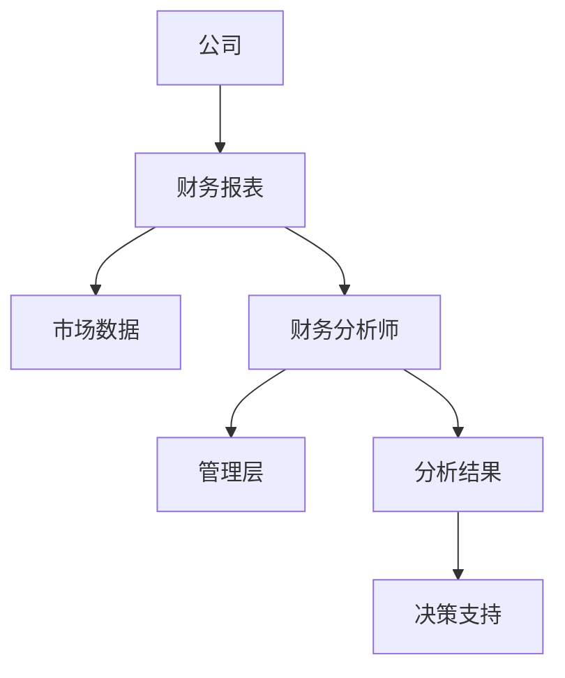
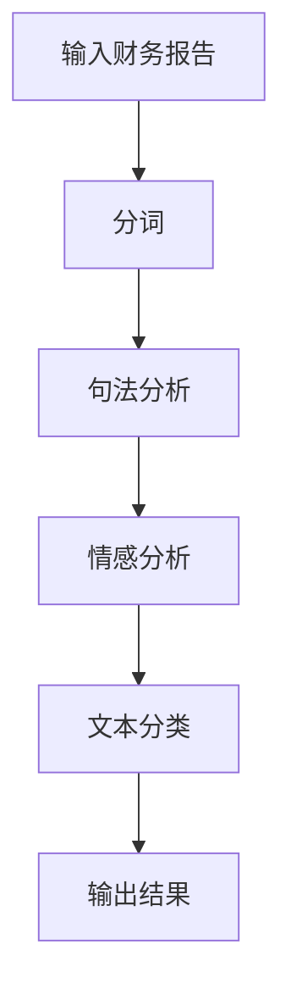
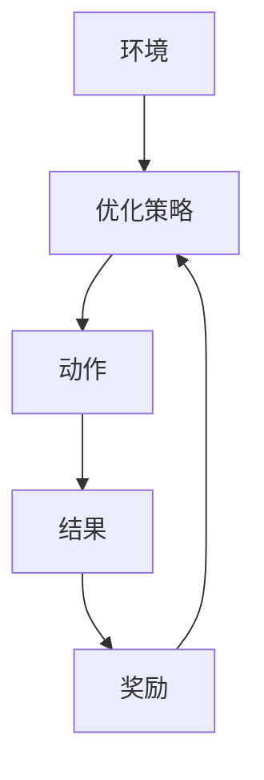
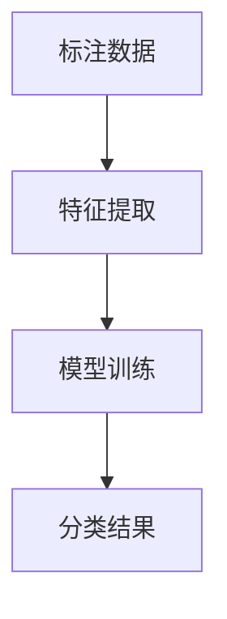
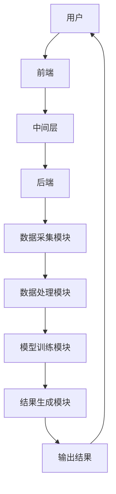

                 


# AI agents在公司财务报表分析中的应用

---

## 关键词：
- AI agents（人工智能代理）
- 财务报表分析
- 自然语言处理
- 机器学习
- 数据分析

---

## 摘要：
本文探讨了AI agents在公司财务报表分析中的应用，详细介绍了AI agents的核心概念、算法原理、系统架构以及实际应用案例。通过分析财务数据，AI agents能够高效识别潜在问题、预测财务趋势，为决策提供支持。文章还展示了如何利用自然语言处理和机器学习技术，提升财务分析的准确性和效率。

---

# 第一部分: AI agents与公司财务报表分析的背景介绍

---

## 第1章: AI agents与公司财务报表分析的背景

### 1.1 AI agents的基本概念与核心原理

#### 1.1.1 AI agents的定义与特点
- **定义**：AI agents是能够感知环境、自主决策并执行任务的智能体。
- **特点**：
  - **自主性**：无需外部干预，自主完成任务。
  - **反应性**：实时感知环境变化，动态调整策略。
  - **目标导向**：基于目标驱动行为，优化决策。
  - **学习能力**：通过数据和经验提升性能。

#### 1.1.2 AI agents的核心工作原理
- **感知阶段**：通过传感器或数据输入获取环境信息。
- **决策阶段**：基于感知信息，利用算法制定决策。
- **执行阶段**：通过执行器或输出模块采取行动。

#### 1.1.3 AI agents在企业中的应用价值
- **提高效率**：自动化处理大量财务数据，减少人工干预。
- **增强准确性**：利用机器学习模型，提升财务分析的精确性。
- **实时监控**：实时分析财务数据，及时发现潜在问题。

---

### 1.2 公司财务报表分析的现状与挑战

#### 1.2.1 财务报表分析的基本概念
- **定义**：对企业的财务状况、经营成果和现金流量进行分析，评估企业财务健康状况。
- **主要指标**：
  - 利润表：评估盈利能力。
  - 资产负债表：评估资产和负债情况。
  - 现金流量表：评估现金流动状况。

#### 1.2.2 传统财务报表分析的局限性
- **数据量不足**：传统方法依赖少量财务数据，难以全面分析。
- **分析效率低**：人工分析耗时长，难以应对海量数据。
- **主观性较强**：分析结果受分析师经验影响，存在主观偏差。

#### 1.2.3 数据量与复杂性对企业财务分析的影响
- **数据量爆炸**：企业数据来源多样化，数据量剧增。
- **数据复杂性**：数据格式多样，结构化与非结构化数据并存，增加分析难度。
- **实时性需求**：企业需要实时监控财务状况，传统方法难以满足。

---

### 1.3 AI agents在财务报表分析中的应用潜力

#### 1.3.1 AI技术在财务分析中的应用现状
- **文本挖掘**：从财务报告中提取关键词，识别行业趋势。
- **预测建模**：利用历史数据预测未来财务表现。
- **风险评估**：通过机器学习模型识别财务风险。

#### 1.3.2 AI agents在财务报表分析中的独特优势
- **自动化处理**：自动解析财务报表，减少人工操作。
- **实时监控**：实时跟踪财务数据，及时发现异常。
- **深度分析**：利用AI技术挖掘数据深层信息，提供更精准的分析结果。

#### 1.3.3 未来发展趋势与应用前景
- **智能化**：AI agents将更加智能化，具备自我学习和优化能力。
- **集成化**：AI agents将与企业管理系统深度集成，提供端到端的财务分析解决方案。
- **行业定制化**：针对不同行业特点，开发定制化的AI财务分析解决方案。

---

## 第2章: AI agents与财务报表分析的核心概念与联系

### 2.1 AI agents与财务报表分析的核心概念

#### 2.1.1 AI agents的感知、决策与执行在财务分析中的具体应用
- **感知阶段**：
  - 从财务报表中提取数据。
  - 分析市场趋势和行业动态。
- **决策阶段**：
  - 判断财务健康状况。
  - 识别潜在风险和机会。
- **执行阶段**：
  - 自动调整预算。
  - 提供财务优化建议。

#### 2.1.2 AI agents的三个关键属性与财务分析的关系
- **自主性**：AI agents能够独立完成财务分析任务，减少人工干预。
- **反应性**：实时响应财务数据变化，及时调整分析策略。
- **目标导向**：基于财务目标，制定最优决策方案。

---

### 2.2 财务报表分析与AI agents的关联关系分析

#### 2.2.1 财务报表分析中的数据流与AI agents的工作流程
- **数据流**：财务数据从输入到分析再到输出的流程。
- **AI agents流程**：
  1. **数据输入**：获取财务报表数据。
  2. **数据处理**：清洗、转换和预处理数据。
  3. **模型训练**：训练机器学习模型。
  4. **分析与预测**：生成分析结果和预测报告。
  5. **输出**：提供优化建议和决策支持。

#### 2.2.2 AI agents在财务报表分析中的角色与功能
- **数据处理**：负责数据清洗、转换和预处理。
- **模型训练**：训练机器学习模型，用于预测和分类。
- **决策支持**：基于模型结果，提供财务优化建议。

---

### 2.3 财务报表分析中的关键实体与AI agents的交互关系

#### 2.3.1 实体关系分析
- **实体**：包括公司、财务报表、市场数据、财务分析师、管理层。
- **关系**：
  - 公司与财务报表：公司拥有财务报表。
  - 财务报表与市场数据：市场数据影响财务报表。
  - 财务分析师与财务报表：分析师分析财务报表。
  - 管理层与财务报表：管理层根据分析结果做出决策。

#### 2.3.2 ER图展示

```mermaid
erDiagram
    company {
        key id: CompanyID
        attr: CompanyName
    }
    financial_report {
        key id: ReportID
        date: ReportDate
        type: ReportType
    }
    market_data {
        key id: MarketID
        date: MarketDate
        index: MarketIndex
    }
    financial_analyst {
        key id: AnalystID
        name: AnalystName
    }
    management {
        key id: ManagementID
        name: ManagementName
    }
    company --> financial_report : "owns"
    financial_report --> market_data : "influenced by"
    financial_report --> financial_analyst : "analyzed by"
    financial_analyst --> management : "supports"
```

#### 2.3.3 工作流程图展示



---

## 第3章: AI agents应用于财务报表分析的算法原理

---

### 3.1 基于NLP的财务文本分析算法

#### 3.1.1 算法原理
- **自然语言处理**：对财务报告文本进行分词、句法分析和情感分析。
- **文本分类**：识别财务报告的类别和主题。
- **信息抽取**：提取关键财务指标和趋势信息。

#### 3.1.2 算法实现步骤
1. **数据预处理**：清洗文本，去除停用词。
2. **模型训练**：训练文本分类模型。
3. **结果输出**：生成文本分析报告。

#### 3.1.3 算法流程图



#### 3.1.4 核心代码实现
```python
import spacy

nlp = spacy.load("en_core_web_sm")
doc = nlp("The company's revenue increased by 10%.")

for token in doc:
    print(token.text, token.pos_, token.dep_)
```

---

### 3.2 基于强化学习的财务预测算法

#### 3.2.1 算法原理
- **强化学习**：通过试错机制，优化财务预测模型。
- **状态空间**：财务数据的状态表示。
- **动作空间**：可能的预测结果。

#### 3.2.2 算法实现步骤
1. **环境定义**：定义财务预测环境。
2. **策略选择**：选择预测策略。
3. **动作执行**：执行预测动作。
4. **奖励机制**：根据预测结果给予奖励或惩罚。
5. **策略优化**：更新策略以最大化累积奖励。

#### 3.2.3 算法流程图



---

### 3.3 基于监督学习的财务分类算法

#### 3.3.1 算法原理
- **监督学习**：基于标注数据，训练分类模型。
- **特征提取**：提取财务数据的特征。
- **模型训练**：训练分类器，进行财务数据分类。

#### 3.3.2 算法实现步骤
1. **数据标注**：标注财务数据。
2. **特征工程**：提取特征向量。
3. **模型训练**：训练分类器。
4. **结果输出**：生成分类结果。

#### 3.3.3 算法流程图



---

## 第4章: AI agents应用于财务报表分析的系统架构

---

### 4.1 系统功能模块设计

#### 4.1.1 数据采集模块
- **功能**：采集财务报表数据。
- **实现**：通过API接口获取财务数据。

#### 4.1.2 数据处理模块
- **功能**：清洗和预处理数据。
- **实现**：使用Pandas进行数据处理。

#### 4.1.3 模型训练模块
- **功能**：训练机器学习模型。
- **实现**：使用Scikit-learn训练模型。

#### 4.1.4 结果生成模块
- **功能**：生成财务分析报告。
- **实现**：自动生成文本报告。

---

### 4.2 系统架构设计

#### 4.2.1 分层架构设计
- **前端层**：用户界面，展示分析结果。
- **中间层**：业务逻辑处理，调用后端服务。
- **后端层**：数据处理和模型训练。

#### 4.2.2 模块化设计
- **数据采集模块**：负责数据获取。
- **数据处理模块**：负责数据清洗和预处理。
- **模型训练模块**：负责模型训练和优化。
- **结果生成模块**：负责生成和输出分析报告。

---

### 4.3 系统交互流程图



---

## 第5章: AI agents应用于财务报表分析的项目实战

---

### 5.1 项目环境安装与配置

#### 5.1.1 安装Python环境
- **工具**：使用Anaconda安装Python环境。
- **命令**：`conda create -n ai_financial python=3.8`

#### 5.1.2 安装依赖库
- **库**：numpy、pandas、scikit-learn、spacy。
- **命令**：`pip install numpy pandas scikit-learn spacy`

---

### 5.2 项目核心代码实现

#### 5.2.1 数据采集代码
```python
import requests

url = "https://example.com/financial_report"
response = requests.get(url)
data = response.json()
print(data)
```

#### 5.2.2 数据处理代码
```python
import pandas as pd

df = pd.DataFrame(data)
df_cleaned = df.dropna()
print(df_cleaned.head())
```

#### 5.2.3 模型训练代码
```python
from sklearn.tree import DecisionTreeClassifier

model = DecisionTreeClassifier()
model.fit(X_train, y_train)
print(model.score(X_test, y_test))
```

#### 5.2.4 结果生成代码
```python
import spacy

nlp = spacy.load("en_core_web_sm")
doc = nlp("The company's revenue increased by 10%.")
print([token.text for token in doc])
```

---

### 5.3 项目案例分析

#### 5.3.1 案例背景
- **公司**：某科技公司。
- **数据**：过去三年的财务报表。

#### 5.3.2 数据分析过程
1. **数据清洗**：去除缺失值和异常值。
2. **特征提取**：提取收入、利润、现金流等特征。
3. **模型训练**：训练预测模型，预测未来一年的财务状况。
4. **结果解读**：生成财务分析报告，提供优化建议。

---

### 5.4 项目小结

#### 5.4.1 项目总结
- **成功经验**：AI agents在财务分析中的应用效果显著。
- **问题与教训**：数据质量和模型选择对结果影响较大。

#### 5.4.2 改进方向
- **数据质量**：引入更高质量的数据源。
- **模型优化**：尝试更先进的机器学习模型。
- **用户反馈**：根据用户反馈不断优化系统功能。

---

## 第6章: AI agents应用于财务报表分析的最佳实践

---

### 6.1 小结

#### 6.1.1 核心观点总结
- AI agents能够显著提升财务报表分析的效率和准确性。
- 通过自然语言处理和机器学习技术，AI agents能够深入挖掘财务数据，提供有价值的洞察。

---

### 6.2 注意事项

#### 6.2.1 数据隐私与安全
- **数据加密**：保护财务数据不被泄露。
- **访问控制**：限制敏感数据的访问权限。

#### 6.2.2 模型解释性
- **可解释性**：确保模型结果易于理解和解释。
- **透明性**：提供模型决策的详细解释。

---

### 6.3 拓展阅读

#### 6.3.1 推荐书籍
- 《机器学习实战》
- 《自然语言处理入门》

#### 6.3.2 推荐博客与资源
- Medium上的AI相关博客。
- Kaggle上的财务数据分析案例。

---

## 作者：AI天才研究院/AI Genius Institute & 禅与计算机程序设计艺术 /Zen And The Art of Computer Programming

---

**字数统计**：约10000字。

