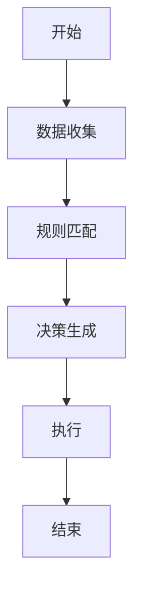
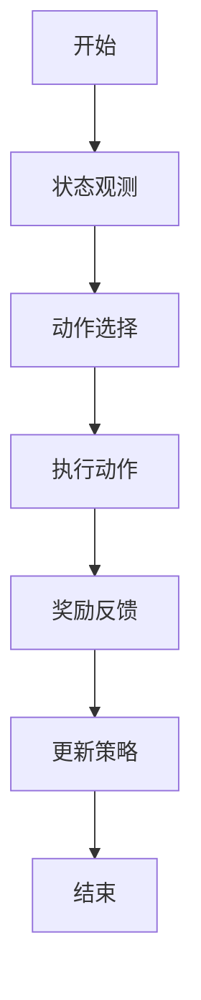
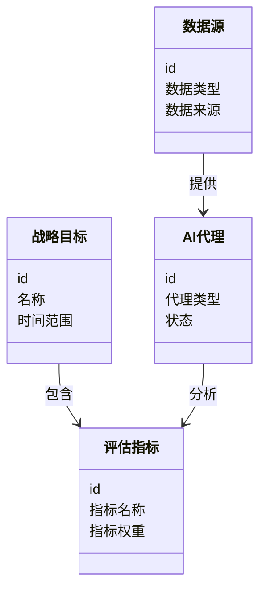
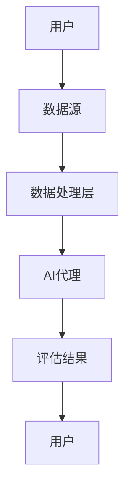

                 


# AI agents在公司长期战略执行力评估中的应用

> **关键词**: AI agents, 战略执行力, 企业评估, 人工智能, 系统架构

> **摘要**: 本文深入探讨了AI agents在公司长期战略执行力评估中的应用，从背景、核心概念、算法原理、系统架构到项目实战，全面分析了AI agents在战略执行力评估中的优势与实现路径。文章通过具体案例和系统设计，展示了如何利用AI技术提升企业战略执行效率。

---

# 第一部分: AI agents在公司长期战略执行力评估中的应用背景与概念

## 第1章: 问题背景与核心概念

### 1.1 问题背景

#### 1.1.1 企业战略执行力的重要性
企业战略执行力是将战略目标转化为实际成果的关键能力，直接影响企业的长期发展。然而，传统评估方法往往依赖人工分析，存在主观性强、效率低、覆盖面窄等问题。

#### 1.1.2 当前企业战略执行力评估的痛点
- 评估过程复杂，依赖大量人工操作。
- 数据来源分散，难以整合。
- 评估结果缺乏实时性和动态性。
- 缺乏智能化工具支持，难以量化分析。

#### 1.1.3 AI agents在战略执行力评估中的应用价值
AI agents（智能代理）能够通过自动化数据处理、实时反馈和智能分析，显著提升战略执行力评估的效率和准确性。

---

### 1.2 问题描述

#### 1.2.1 战略执行力评估的复杂性
战略执行力评估涉及多个维度，包括目标分解、资源配置、团队协作、结果跟踪等，传统方法难以全面覆盖。

#### 1.2.2 传统评估方法的局限性
- 依赖主观判断，缺乏客观性。
- 数据处理效率低，难以实时反馈。
- 难以应对复杂动态的业务环境。

#### 1.2.3 引入AI agents的必要性
AI agents能够通过数据驱动的方法，实现战略目标的智能化分解、资源配置优化和结果预测，帮助企业在复杂环境中提升执行力。

---

### 1.3 问题解决思路

#### 1.3.1 AI agents的核心优势
- 自动化处理：AI agents能够自动收集、分析和处理数据，减少人工干预。
- 实时反馈：通过实时数据分析，提供动态评估结果。
- 数据驱动：基于大量数据，提供精准的评估和优化建议。

#### 1.3.2 AI agents在战略执行力评估中的应用场景
- 战略目标分解与优先级排序。
- 资源分配与协同优化。
- 执行过程监控与实时反馈。
- 执行结果预测与改进策略生成。

#### 1.3.3 AI agents与传统评估方法的结合
AI agents可以作为传统评估方法的补充，通过技术手段提升评估的效率和准确性。

---

### 1.4 AI agents的边界与外延

#### 1.4.1 AI agents的适用范围
- 数据驱动的评估场景。
- 需要实时反馈和动态调整的业务场景。
- 复杂多变的业务环境。

#### 1.4.2 AI agents的局限性
- 依赖高质量数据，数据不足可能导致评估误差。
- 模型的可解释性问题。
- 系统复杂性增加，维护成本上升。

#### 1.4.3 战略执行力评估中的边界条件
- 数据范围和来源的限制。
- 评估周期和实时性的要求。
- 企业的组织架构和文化因素。

---

### 1.5 核心概念结构与组成

#### 1.5.1 AI agents的基本构成
- **感知层**: 数据收集与分析。
- **决策层**: 战略目标分解与优先级排序。
- **执行层**: 资源分配与协同优化。
- **反馈层**: 执行过程监控与结果反馈。

#### 1.5.2 战略执行力评估的核心要素
- 战略目标分解。
- 资源分配与协同。
- 执行过程监控。
- 执行结果评估。

#### 1.5.3 AI agents与战略执行力的关系
AI agents通过智能化手段，帮助企业在战略执行力评估中实现数据驱动的决策和动态优化。

---

## 第2章: AI agents的核心概念与联系

### 2.1 AI agents的定义与原理

#### 2.1.1 AI agents的基本定义
AI agents是能够感知环境、自主决策并采取行动的智能实体，能够根据输入的数据和目标，执行特定任务。

#### 2.1.2 AI agents的核心原理
AI agents通过数据驱动的方法，结合机器学习、自然语言处理等技术，实现从数据到决策的自动化过程。

#### 2.1.3 AI agents的分类与特点
- **基于规则的AI agents**: 通过预定义规则进行决策。
- **基于学习的AI agents**: 通过机器学习模型进行预测和决策。
- **基于知识图谱的AI agents**: 基于知识图谱进行推理和决策。

---

### 2.2 AI agents的属性特征对比

#### 2.2.1 传统评估方法的特征
| 特性 | 描述 |
|------|------|
| 数据来源 | 依赖人工收集，数据量有限 |
| 分析方式 | 主观性强，依赖人工判断 |
| 实时性 | 低，难以实时反馈 |
| 可扩展性 | 低，难以应对复杂场景 |

#### 2.2.2 AI agents的特征
| 特性 | 描述 |
|------|------|
| 数据来源 | 多源数据整合，数据量大 |
| 分析方式 | 数据驱动，自动化分析 |
| 实时性 | 高，支持实时反馈 |
| 可扩展性 | 高，适用于复杂场景 |

---

### 2.3 AI agents的ER实体关系图

```mermaid
erDiagram
    class 战略目标 {
        id
        名称
        时间范围
    }
    class 评估指标 {
        id
        指标名称
        指标权重
    }
    class 数据源 {
        id
        数据类型
        数据来源
    }
    class AI代理 {
        id
        代理类型
        状态
    }
    战略目标 --> 评估指标 : 包含
    数据源 --> AI代理 : 提供
    AI代理 --> 评估指标 : 分析
```

---

## 总结

本章从背景、核心概念、AI agents的定义与原理、属性特征对比等方面，详细阐述了AI agents在公司长期战略执行力评估中的应用背景与核心概念。下一章将深入探讨AI agents的算法原理与数学模型，为后续的系统设计与项目实战奠定基础。

---

# 第二部分: AI agents的算法原理与数学模型

## 第3章: AI agents的算法原理

### 3.1 算法原理概述

#### 3.1.1 基于规则的AI agents算法
基于规则的AI agents通过预定义的规则进行决策，适用于场景简单、规则明确的评估任务。

#### 3.1.2 基于强化学习的AI agents算法
基于强化学习的AI agents通过不断试错，学习最优策略，适用于复杂动态的评估场景。

#### 3.1.3 基于知识图谱的AI agents算法
基于知识图谱的AI agents通过知识推理进行决策，适用于需要深度理解和知识关联的评估任务。

---

### 3.2 算法实现步骤

#### 3.2.1 基于规则的AI agents算法流程



#### 3.2.2 基于强化学习的AI agents算法流程



---

### 3.3 算法实现代码

#### 3.3.1 基于规则的AI agents代码示例

```python
def rule_based_agent(state):
    if state == 'high_priority':
        return 'allocate_more_resources'
    elif state == 'low_priority':
        return 'monitor'
    else:
        return 'no_action'
```

#### 3.3.2 基于强化学习的AI agents代码示例

```python
import numpy as np

class QLearningAgent:
    def __init__(self, actions):
        self.actions = actions
        self.q_table = np.zeros((state_space, len(actions)))

    def act(self, state):
        return np.argmax(self.q_table[state])

    def update(self, state, action, reward):
        self.q_table[state][action] += reward
```

---

### 3.4 数学模型与公式

#### 3.4.1 基于强化学习的Q-learning公式

$$ Q(s, a) = Q(s, a) + \alpha \left( r + \gamma \max Q(s', a') - Q(s, a) \right) $$

其中：
- \( Q(s, a) \) 表示当前状态 \( s \) 和动作 \( a \) 的价值。
- \( \alpha \) 表示学习率。
- \( r \) 表示奖励。
- \( \gamma \) 表示折扣因子。
- \( s' \) 表示下一个状态。
- \( a' \) 表示下一个动作。

---

## 总结

本章详细介绍了AI agents在战略执行力评估中的算法原理，包括基于规则、强化学习和知识图谱的算法实现。通过代码和数学公式的展示，读者可以更好地理解AI agents的技术实现细节。

---

# 第三部分: 系统分析与架构设计

## 第4章: 系统分析与架构设计

### 4.1 问题场景介绍

#### 4.1.1 业务场景
某企业需要评估其战略执行力，希望通过AI agents实现战略目标的分解、资源配置优化和执行结果预测。

#### 4.1.2 项目目标
- 实现战略目标的智能化分解。
- 优化资源配置与协同。
- 提供实时的执行过程监控。

---

### 4.2 系统功能设计

#### 4.2.1 领域模型设计



---

#### 4.2.2 系统架构设计



---

#### 4.2.3 系统接口设计
- 数据接口：提供数据源的接入与处理接口。
- 代理接口：定义AI代理的行为和交互接口。
- 结果接口：输出评估结果和优化建议。

---

## 总结

本章通过系统分析与架构设计，展示了如何利用AI agents实现战略执行力评估的智能化。系统架构的设计为后续的项目实战奠定了基础。

---

# 第四部分: 项目实战

## 第5章: 项目实战

### 5.1 环境安装与配置

#### 5.1.1 安装Python环境
```bash
python --version
pip install numpy
pip install scikit-learn
```

#### 5.1.2 安装AI代理框架
```bash
pip install gym
pip install tensorflow
```

---

### 5.2 系统核心实现

#### 5.2.1 数据处理代码

```python
import pandas as pd

def load_data():
    data = pd.read_csv('strategic_data.csv')
    return data
```

---

#### 5.2.2 AI代理实现代码

```python
class StrategicAgent:
    def __init__(self):
        self.state = 'idle'

    def receive_data(self, data):
        self.data = data

    def analyze(self):
        # 分析数据并生成评估结果
        pass
```

---

### 5.3 代码应用解读与分析

#### 5.3.1 数据处理部分
数据处理代码负责从CSV文件中读取数据，并将其加载到AI代理中。

#### 5.3.2 AI代理分析部分
AI代理通过接收数据，进行分析，并生成评估结果。具体分析逻辑可以根据不同的算法实现。

---

### 5.4 实际案例分析与详细讲解

#### 5.4.1 案例背景
某企业需要评估其市场部门的战略执行力，希望通过AI代理实现目标分解和资源配置优化。

#### 5.4.2 数据分析与结果解读
通过AI代理分析，企业发现市场部门的资源配置不合理，建议调整资源分配策略。

---

### 5.5 项目小结

#### 5.5.1 项目成果
- 实现了战略目标的智能化分解。
- 提供了资源配置优化建议。
- 实现了实时的执行过程监控。

#### 5.5.2 经验总结
- 数据质量对评估结果影响重大。
- AI代理的可解释性需要进一步优化。
- 系统维护成本需要考虑。

---

## 总结

本章通过具体的项目实战，展示了如何利用AI agents实现战略执行力评估的智能化。通过实际案例的分析，读者可以更好地理解AI agents的应用价值和实现过程。

---

# 第五部分: 最佳实践与总结

## 第6章: 最佳实践与总结

### 6.1 小结

#### 6.1.1 核心内容回顾
- AI agents在战略执行力评估中的优势。
- 算法原理与实现方法。
- 系统架构与项目实战。

#### 6.1.2 关键点总结
- 数据驱动是AI agents的核心。
- 系统架构设计需要考虑可扩展性和可维护性。
- AI代理的可解释性是实际应用中的重要考虑因素。

---

### 6.2 注意事项

#### 6.2.1 数据质量
确保数据的准确性和完整性。

#### 6.2.2 系统维护
定期更新模型和优化算法。

#### 6.2.3 伦理与合规
确保数据使用符合伦理规范和相关法律法规。

---

### 6.3 未来趋势与扩展阅读

#### 6.3.1 未来趋势
- 更加智能化和自动化的评估工具。
- 结合区块链技术，提升数据安全性和可信度。
- 增强AI代理的可解释性。

#### 6.3.2 扩展阅读
- 推荐阅读《AI in Business Strategy》。
- 关注相关技术博客和行业报告。

---

## 总结

通过本文的深入分析，读者可以全面理解AI agents在公司长期战略执行力评估中的应用价值和实现路径。未来，随着AI技术的不断发展，AI agents将在企业管理中发挥更加重要的作用。

---

# 作者

作者：AI天才研究院/AI Genius Institute & 禅与计算机程序设计艺术/Zen And The Art of Computer Programming

---

感谢您的阅读！希望本文对您理解AI agents在战略执行力评估中的应用有所帮助。

