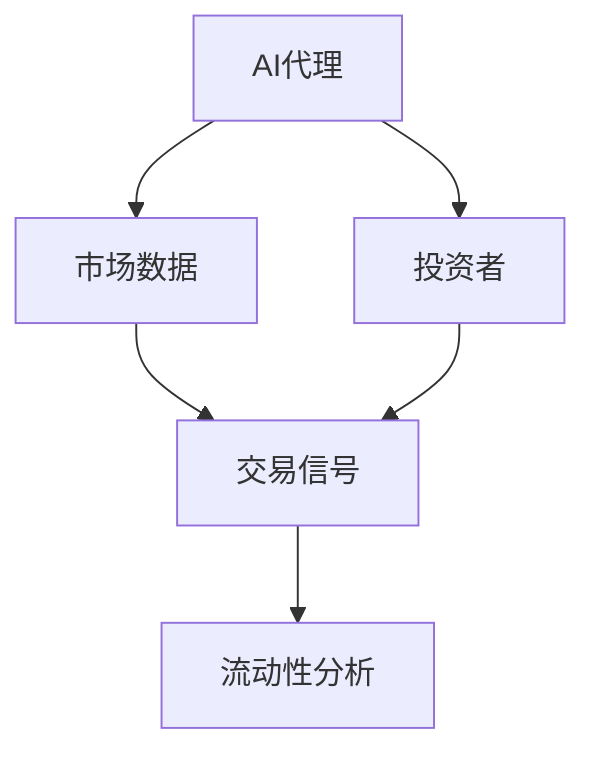

                 


# AI agents增强价值投资的市场流动性分析

## 关键词
AI代理、价值投资、市场流动性、强化学习、系统架构

## 摘要
本文探讨AI代理如何增强价值投资，并分析其对市场流动性的提升作用。通过背景介绍、核心概念、算法原理和系统架构的分析，详细阐述AI代理在价值投资中的应用及其对市场流动性的优化。本文适合金融专业人士和技术爱好者阅读。

---

## 第一部分: AI代理与价值投资的背景与概念

### 第1章: AI代理与价值投资概述

#### 1.1 AI代理的基本概念
- **1.1.1 AI代理的定义与特点**
  - AI代理是能够感知环境并自主决策的智能体，具备自主性、反应性、目标导向和社交能力。
- **1.1.2 AI代理在金融领域的应用**
  - AI代理在金融中的应用包括算法交易、风险管理、客户行为分析和市场预测。
- **1.1.3 价值投资的理论基础**
  - 价值投资强调寻找被市场低估的资产，通过基本面分析和长期持有实现收益。

#### 1.2 价值投资与市场流动性分析
- **1.2.1 价值投资的理论基础**
  - 价值投资基于资产的内在价值，强调长期持有和风险控制。
- **1.2.2 市场流动性的定义与影响**
  - 市场流动性指资产快速转化为现金的能力，影响资产价格和交易成本。
- **1.2.3 AI代理如何增强价值投资**
  - AI代理通过数据处理和决策优化，提高价值投资的效率和准确性。

### 第2章: AI代理与价值投资的结合

#### 2.1 AI代理在价值投资中的作用
- **2.1.1 数据分析与预测**
  - 利用机器学习处理海量数据，识别市场趋势和投资机会。
- **2.1.2 风险评估与管理**
  - 通过AI模型评估投资风险，优化投资组合。
- **2.1.3 投资策略优化**
  - 结合强化学习和遗传算法，优化投资策略，提升收益。

#### 2.2 市场流动性分析的AI代理模型
- **2.2.1 流动性预测模型**
  - 使用时间序列分析预测市场流动性，优化交易时机。
- **2.2.2 流动性风险评估**
  - 通过AI模型评估市场流动性风险，制定应对策略。
- **2.2.3 AI代理在流动性管理中的应用**
  - AI代理实时监控市场流动，调整投资组合，降低风险。

---

## 第二部分: 核心概念与联系

### 第3章: AI代理的核心概念与原理

#### 3.1 AI代理的核心原理
- **3.1.1 代理的感知与决策机制**
  - AI代理通过传感器和数据源感知环境，利用算法进行决策。
- **3.1.2 基于强化学习的代理行为**
  - 使用强化学习优化代理行为，提升决策质量。
- **3.1.3 代理的自适应与进化**
  - 代理通过自适应学习和进化算法，不断优化自身性能。

#### 3.2 价值投资的核心概念
- **3.2.1 资产定价理论**
  - 资产定价基于其内在价值，考虑市场情绪和经济指标。
- **3.2.2 投资组合理论**
  - 通过分散投资降低风险，优化收益。
- **3.2.3 风险与收益的平衡**
  - 在风险可控的前提下，追求最大收益。

### 第4章: 核心概念的联系与对比

#### 4.1 AI代理与价值投资的属性特征对比
| 特性 | AI代理 | 价值投资 |
|------|--------|----------|
| 数据驱动 | 高度依赖数据 | 依赖基本面分析 |
| 决策速度 | 实时决策 | 长期持有 |
| 精准性 | 高度精准 | 受市场波动影响 |

#### 4.2 实体关系图（ER图）


---

## 第三部分: 算法原理与数学模型

### 第5章: AI代理的算法原理

#### 5.1 基于强化学习的代理算法
- **5.1.1 强化学习的基本原理**
  - 通过奖励机制训练代理，优化决策策略。
- **5.1.2 算法流程图**
  ```mermaid
  graph TD
      S[状态] --> A[动作]
      R[奖励] --> S'
  ```

#### 5.2 数学模型与公式
- **马科维茨投资组合理论**
  $$ E[r_p] = \sum w_i E[r_i] $$
  $$ Var(r_p) = \sum w_i^2 Var(r_i) + 2 \sum w_i w_j Cov(r_i, r_j) $$

---

## 第四部分: 系统分析与架构设计

### 第6章: AI代理驱动的流动性分析系统

#### 6.1 项目介绍
- 开发一个基于AI代理的流动性分析系统，提升价值投资效率。

#### 6.2 系统功能设计
- ```mermaid
  classDiagram
      class AI-Agent {
          analyze(data)
          decide(action)
      }
      class Market-Data {
          provide(data)
      }
      AI-Agent --> Market-Data
      Market-Data --> AI-Agent
  ```

#### 6.3 系统架构设计
- ```mermaid
  architecture
      Client --> Server
      Server --> Database
      Server --> AI-Agent
      Database --> AI-Agent
  ```

---

## 第五部分: 项目实战

### 第7章: 实战实现

#### 7.1 环境安装
- 安装Python、TensorFlow、Pandas和Matplotlib。

#### 7.2 核心代码实现
```python
import numpy as np
import tensorflow as tf

# 定义神经网络模型
class MarketAgent(tf.keras.Model):
    def __init__(self):
        super(MarketAgent, self).__init__()
        self.dense1 = tf.keras.layers.Dense(64, activation='relu')
        self.dense2 = tf.keras.layers.Dense(10, activation='softmax')

    def call(self, x):
        x = self.dense1(x)
        x = self.dense2(x)
        return x
```

#### 7.3 代码解读与分析
- 该代码定义了一个简单的神经网络模型，用于分类市场数据。

#### 7.4 实际案例分析
- 使用历史数据训练模型，预测市场流动性，优化投资策略。

---

## 第六部分: 总结与展望

### 第8章: 总结

#### 8.1 最佳实践
- 结合AI代理和传统投资策略，优化投资组合。

#### 8.2 小结
- AI代理在价值投资中的应用潜力巨大，能够显著提升市场流动性分析的效率和准确性。

#### 8.3 注意事项
- 注意模型的过拟合风险，定期更新模型参数。

#### 8.4 拓展阅读
- 推荐阅读相关文献，深入学习AI代理和价值投资的结合应用。

---

## 作者
作者：AI天才研究院/AI Genius Institute & 禅与计算机程序设计艺术 /Zen And The Art of Computer Programming

