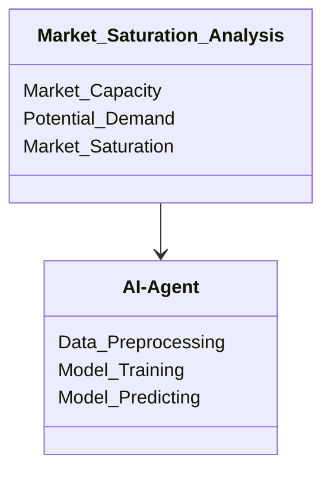
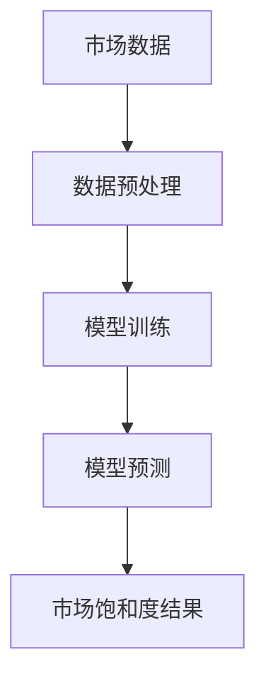
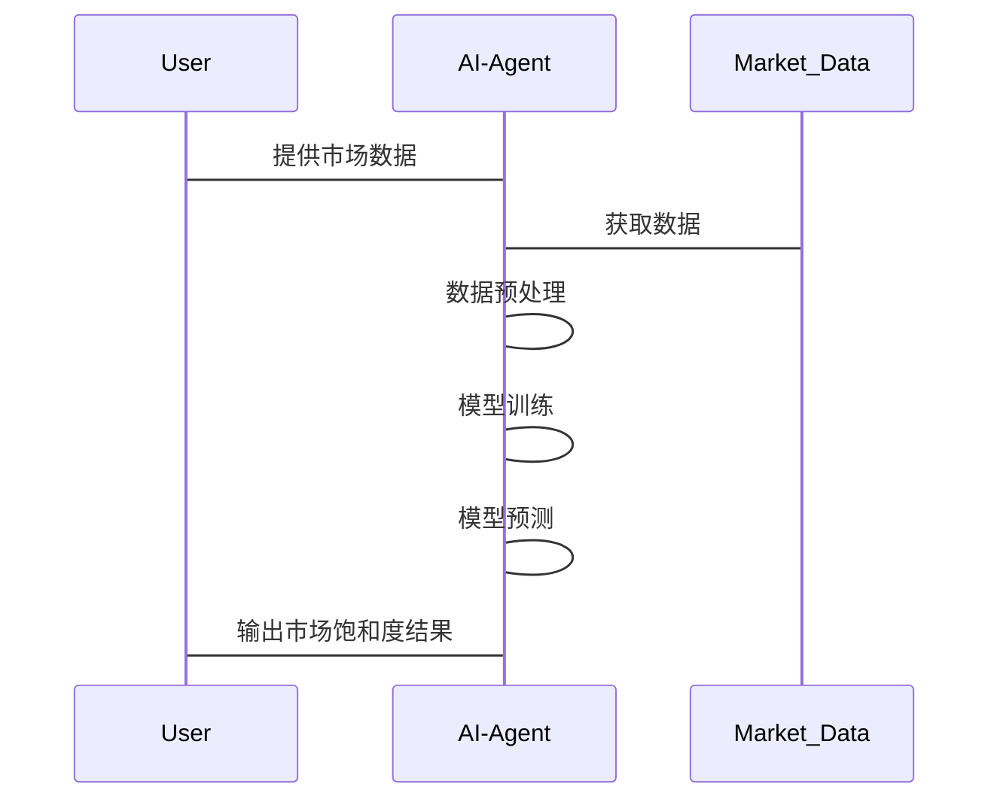

                 


# AI agents增强价值投资的市场饱和度分析

> 关键词：AI代理，价值投资，市场饱和度，金融投资，技术分析

> 摘要：本文探讨了AI代理在价值投资中的应用，特别是如何通过市场饱和度分析来增强投资决策。文章详细介绍了价值投资的基本原理，市场饱和度的定义与计算方法，AI代理的核心原理，以及三者之间的关系。通过分析市场饱和度的数学模型，AI代理如何优化投资策略，提升投资收益。同时，本文还提供了实际案例和代码实现，帮助读者更好地理解和应用这些理论。

---

# 第1章: 价值投资与市场饱和度的背景

## 1.1 价值投资的定义与特点
### 1.1.1 价值投资的定义
价值投资是一种基于对公司内在价值评估的投资策略，旨在以低于内在价值的价格买入股票，长期持有，等待其价值回归。

### 1.1.2 价值投资的特点
- 长期导向：注重长期价值，而非短期价格波动。
- 低风险：通过购买被市场低估的股票，降低投资风险。
- 基本面分析：依赖于对公司财务状况、行业地位和管理团队的深入分析。

## 1.2 市场饱和度的定义与意义
### 1.2.1 市场饱和度的定义
市场饱和度是指某一市场中产品或服务的供需达到平衡或接近平衡的状态，通常表现为市场增长放缓或停止。

### 1.2.2 市场饱和度的意义
- 评估市场容量：判断某一市场的潜力和增长空间。
- 指导投资决策：帮助投资者选择处于成长期而非饱和期的行业或公司。

## 1.3 AI代理在金融领域的应用现状
### 1.3.1 AI代理的基本概念
AI代理是一种能够感知环境、执行任务并做出决策的智能实体，广泛应用于金融领域的数据处理、预测分析和投资决策。

### 1.3.2 AI代理的核心能力
- 数据处理：高效处理大量金融数据。
- 智能分析：利用机器学习和自然语言处理技术，分析市场趋势和公司基本面。
- 自动化决策：根据分析结果，自动执行投资策略。

---

# 第2章: 核心概念与联系

## 2.1 AI代理的核心原理
### 2.1.1 AI代理的工作流程
1. 数据采集：从多个来源获取市场数据，包括股票价格、财务报表等。
2. 数据分析：利用机器学习模型对数据进行特征提取和模式识别。
3. 智能决策：根据分析结果，生成投资建议或自动执行交易。

## 2.2 价值投资的核心原理
### 2.2.1 价值投资的关键指标
- 市盈率（P/E比率）：市价与每股收益的比率。
- 市净率（P/B比率）：市价与每股净资产的比率。
- 股息率：股息与股票价格的比率。

### 2.2.2 价值投资的核心步骤
1. 基本面分析：评估公司的财务状况、行业地位和管理团队。
2. 估值分析：计算公司的内在价值，判断其是否被市场低估。
3. 投资决策：根据分析结果，决定是否买入、持有或卖出股票。

## 2.3 市场饱和度的核心原理
### 2.3.1 市场饱和度的计算方法
市场饱和度可以通过以下公式计算：
$$
\text{市场饱和度} = \frac{\text{市场容量}}{\text{潜在市场需求}}
$$
其中，市场容量是指当前市场的总规模，潜在市场需求是指在理想情况下的最大需求。

### 2.3.2 市场饱和度的影响因素
- 市场需求：消费者对产品或服务的需求量。
- 市场供给：市场上现有产品或服务的供给量。
- 竞争状况：市场上的竞争程度和竞争对手的数量。

## 2.4 核心概念的对比分析
### 2.4.1 AI代理与价值投资的对比
| 对比维度 | AI代理 | 价值投资 |
|----------|---------|----------|
| 数据来源 | 多源数据，包括文本、图像和结构化数据 | 主要依赖财务报表和市场数据 |
| 决策方式 | 自动化决策，基于机器学习模型 | 人工决策，基于基本面分析 |
| 适用场景 | 高频交易、市场预测 | 长期投资、价值发现 |

### 2.4.2 价值投资与市场饱和度的对比
| 对比维度 | 价值投资 | 市场饱和度 |
|----------|----------|------------|
| 分析目标 | 公司内在价值 | 市场整体容量 |
| 分析方法 | 基本面分析 | 市场容量分析 |
| 应用场景 | 选择被低估的股票 | 评估市场潜力 |

### 2.4.3 AI代理与市场饱和度的对比
| 对比维度 | AI代理 | 市场饱和度 |
|----------|---------|------------|
| 分析目标 | 投资策略优化 | 市场容量评估 |
| 数据来源 | 多源数据 | 市场数据 |
| 输出结果 | 投资建议 | 市场容量指标 |

---

# 第3章: 市场饱和度分析的AI解决方案

## 3.1 市场饱和度分析的算法原理
### 3.1.1 数据预处理
1. 数据清洗：处理缺失值、异常值和重复数据。
2. 数据特征提取：提取有用的特征，如市盈率、市净率等。

### 3.1.2 机器学习模型
1. 回归分析：用于预测市场容量。
2. 聚类分析：用于识别市场中的相似公司或行业。

### 3.1.3 算法实现
以下是使用Python实现的市场饱和度分析的代码示例：
```python
import pandas as pd
from sklearn.linear_model import LinearRegression

# 数据预处理
data = pd.read_csv('market_data.csv')
data = data.dropna()
data['Market_Saturation'] = data['Market_Capacity'] / data['Potential_Demand']

# 模型训练
model = LinearRegression()
model.fit(data[['Market_Capacity', 'Potential_Demand']], data['Market_Saturation'])
```

## 3.2 算法的数学模型
市场饱和度分析的数学模型如下：
$$
\text{Market_Saturation} = \beta_0 + \beta_1 \times \text{Market_Capacity} + \beta_2 \times \text{Potential_Demand} + \epsilon
$$
其中，$\beta_0$、$\beta_1$和$\beta_2$是回归系数，$\epsilon$是误差项。

## 3.3 算法实现的步骤
1. 数据预处理：清洗数据，提取特征。
2. 模型训练：使用回归分析训练模型。
3. 模型评估：计算模型的准确性，调整参数。
4. 模型应用：利用模型预测市场饱和度。

---

# 第4章: 系统架构与设计

## 4.1 系统功能设计
### 4.1.1 领域模型


### 4.1.2 系统架构设计


## 4.2 系统交互设计
### 4.2.1 交互流程
1. 用户输入市场数据。
2. 系统进行数据预处理。
3. 模型训练并生成预测结果。
4. 系统输出市场饱和度结果。

### 4.2.2 序列图


---

# 第5章: 项目实战

## 5.1 环境安装
- 安装Python和相关库：
  ```bash
  pip install pandas numpy scikit-learn
  ```

## 5.2 核心代码实现
```python
import pandas as pd
from sklearn.linear_model import LinearRegression

# 数据预处理
data = pd.read_csv('market_data.csv')
data = data.dropna()
data['Market_Saturation'] = data['Market_Capacity'] / data['Potential_Demand']

# 模型训练
model = LinearRegression()
model.fit(data[['Market_Capacity', 'Potential_Demand']], data['Market_Saturation'])
```

## 5.3 案例分析
### 5.3.1 数据来源
使用公开的市场数据，如股票价格、财务报表等。

### 5.3.2 分析过程
1. 数据清洗：处理缺失值和异常值。
2. 特征提取：提取市盈率、市净率等关键指标。
3. 模型训练：使用回归分析训练模型。
4. 模型预测：预测市场饱和度。

---

# 第6章: 最佳实践与总结

## 6.1 最佳实践
1. 数据质量：确保数据准确、完整和可靠。
2. 模型选择：根据具体场景选择合适的算法。
3. 模型调优：通过交叉验证优化模型参数。

## 6.2 小结
AI代理通过增强价值投资的市场饱和度分析，能够帮助投资者做出更科学的投资决策，提升投资收益。

## 6.3 注意事项
1. 数据隐私：确保数据处理符合相关法律法规。
2. 模型局限：AI代理的结果仅供参考，需结合实际情况进行调整。

## 6.4 拓展阅读
- 《机器学习实战》
- 《Python机器学习》
- 《价值投资入门》

---

# 结语

AI代理在价值投资中的应用前景广阔，通过市场饱和度分析，投资者能够更好地识别投资机会，优化投资策略。未来，随着技术的进步，AI代理在金融领域的应用将更加深入，为投资者带来更高的收益。

---

# 参考文献

1. 《机器学习实战》
2. 《Python机器学习》
3. 《价值投资入门》
4. 相关学术论文和研究报告

---

作者：AI天才研究院 & 禅与计算机程序设计艺术

