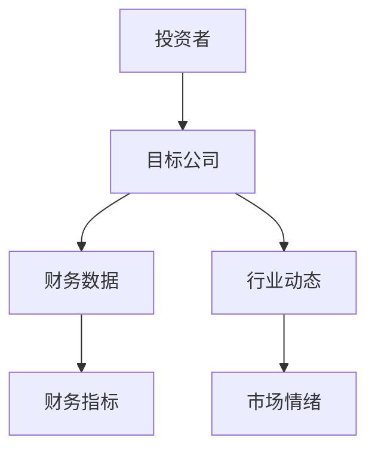
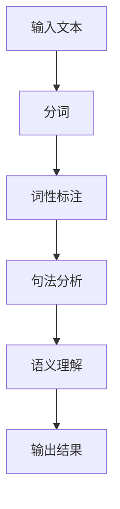
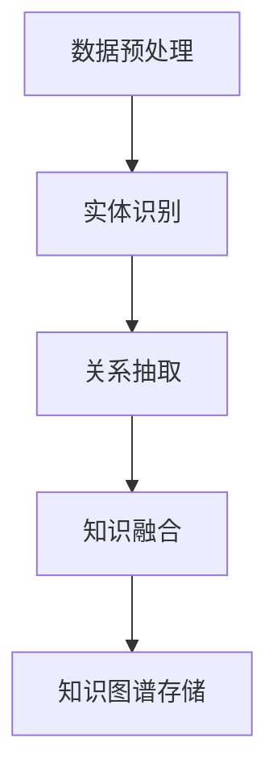

                 


# AI agents辅助价值投资者解读非结构化数据

## 关键词：AI agents，价值投资，非结构化数据，自然语言处理，知识图谱

## 摘要：  
本文探讨了AI agents如何辅助价值投资者解读非结构化数据。通过结合自然语言处理（NLP）和知识图谱技术，AI agents能够有效提取和分析文本数据中的潜在价值，帮助投资者做出更明智的决策。文章从核心概念、技术原理、系统架构到实际项目案例，全面解析了AI agents在金融领域的应用，为读者提供了一套系统化的解决方案。

---

## 第一部分: AI agents辅助价值投资的背景与概念

### 第1章: AI agents与价值投资概述

#### 1.1 AI agents的基本概念  
AI agents是具有目标导向的智能体，能够感知环境、执行任务并优化决策。其核心特征包括主动性、目标性、反应性和适应性。AI agents与传统算法的区别在于，前者具备自主决策能力，而后者依赖固定的规则。  

#### 1.2 价值投资的基本原理  
价值投资是一种长期投资策略，强调通过分析企业的基本面（如财务状况、行业地位、管理团队等）来评估其内在价值。与技术分析不同，价值投资注重企业的长期盈利能力。  

#### 1.3 非结构化数据的定义与特点  
非结构化数据是指未组织成固定格式的数据，如文本、图像和音频等。在金融领域，非结构化数据主要指新闻报道、公司公告、分析师报告等文本信息。这些数据通常包含隐含的市场信号，但难以通过传统数据库直接提取。  

---

### 第2章: AI agents辅助价值投资的核心概念  

#### 2.1 AI agents在金融领域的应用场景  
AI agents在金融领域的应用主要体现在金融文本分析、市场情绪监测和投资决策支持等方面。通过处理非结构化数据，AI agents能够帮助投资者识别潜在的投资机会。  

#### 2.2 AI agents与非结构化数据的结合  
AI agents通过自然语言处理技术，将非结构化文本转化为结构化数据。这种转换过程包括数据预处理、特征提取和语义理解等步骤。AI agents在数据处理中的角色是将复杂的文本信息转化为可分析的格式。  

#### 2.3 核心概念的结构与要素  
核心概念的结构可以表示为：  
- 输入：非结构化文本数据  
- 输出：结构化投资建议  
- 中间过程：文本分析、知识抽取和决策推理  

ER实体关系图如下：  


---

## 第二部分: AI agents辅助价值投资的技术原理  

### 第3章: 自然语言处理技术  

#### 3.1 NLP的基本原理  
NLP的目标是使计算机能够理解人类语言。其核心算法包括分词、词性标注和句法分析。NLP的数学模型通常基于概率论和统计学习方法。例如，文本分类任务可以通过支持向量机（SVM）或随机森林（Random Forest）模型实现。  

#### 3.2 NLP在金融文本分析中的应用  
在金融领域，NLP主要用于情感分析、实体识别和关系抽取。例如，通过分析新闻标题的情感倾向，投资者可以判断市场情绪的变化。  

#### 3.3 NLP的算法流程图  


---

### 第4章: 知识图谱构建  

#### 4.1 知识图谱的基本概念  
知识图谱是一种以实体和关系为核心的知识组织形式。其构建方法包括数据预处理、实体识别和关系抽取。知识图谱的存储通常依赖于图数据库，如Neo4j。  

#### 4.2 知识图谱在金融分析中的应用  
知识图谱可以用于金融实体关系抽取和知识推理。例如，通过抽取公司间的并购关系，投资者可以识别行业趋势。  

#### 4.3 知识图谱的构建流程图  


---

## 第三部分: AI agents辅助价值投资的系统架构  

### 第5章: 系统功能设计  

#### 5.1 领域模型设计  
领域模型是系统功能设计的核心。通过构建投资者、目标公司和市场环境的实体模型，可以实现对金融数据的全面分析。  

#### 5.2 系统架构设计  
系统的整体架构包括数据采集层、数据处理层和决策支持层。数据采集层负责获取非结构化文本数据；数据处理层负责文本分析和知识抽取；决策支持层基于分析结果提供投资建议。  

#### 5.3 系统交互设计  
系统交互设计通常采用图形用户界面（GUI）。投资者可以通过界面输入查询条件，并获得实时的分析结果。  

---

## 第四部分: AI agents辅助价值投资的项目实战  

### 第6章: 项目实施  

#### 6.1 环境安装  
项目实施需要安装Python、TensorFlow和spaCy等工具包。  

#### 6.2 核心代码实现  
以下是NLP文本分析的代码示例：  
```python
import spacy

nlp = spacy.load("en_core_web_sm")
doc = nlp("This company is planning to acquire another company.")

for token in doc:
    print(token.text, token.pos_)
```

#### 6.3 项目小结  
通过项目实战，读者可以掌握AI agents辅助价值投资的核心技术。  

---

## 第五部分: 最佳实践与总结  

### 第7章: 最佳实践  

#### 7.1 技术选型建议  
在选择AI工具时，应优先考虑模型的可解释性和计算效率。  

#### 7.2 小结与展望  
本文系统介绍了AI agents在辅助价值投资中的应用，未来的研究方向包括模型的可解释性和实时性优化。  

---

## 作者：  
AI天才研究院/AI Genius Institute & 禅与计算机程序设计艺术 /Zen And The Art of Computer Programming

