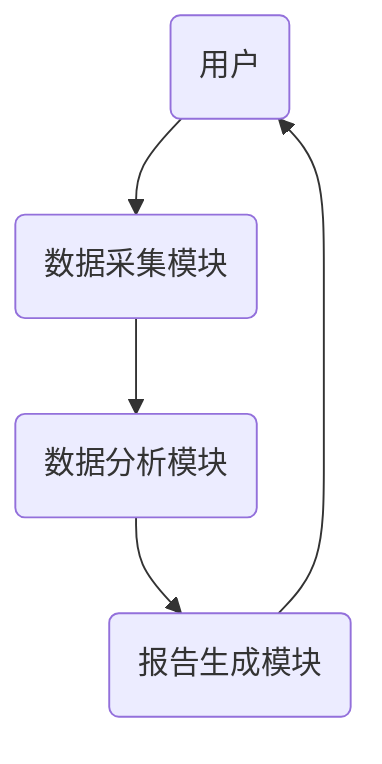

                 


# AI agents辅助价值投资者评估公司的平台生态价值

> 关键词：AI agents, 价值投资, 公司评估, 平台生态, 金融分析

> 摘要：本文探讨了AI agents在辅助价值投资者评估公司平台生态价值中的应用。通过介绍AI agents的基本原理、核心算法、系统架构设计以及实际案例分析，详细阐述了AI如何赋能金融分析，帮助投资者做出更明智的决策。

---

# 正文

## 第一章：AI agents与价值投资的背景

### 1.1 AI agents的基本概念

AI agents（人工智能代理）是能够感知环境、自主决策并采取行动的智能实体。它们通过接收输入数据，利用算法处理信息，生成输出以实现特定目标。AI agents在金融领域的应用尤为广泛，尤其是在数据处理、模式识别和决策支持方面。

#### AI agents的核心特征
- **自主性**：能够独立执行任务，无需人工干预。
- **反应性**：能实时感知环境变化并做出反应。
- **学习能力**：通过机器学习算法不断优化性能。
- **交互性**：能与人类或其他系统进行有效沟通。

### 1.2 价值投资的基本原理

价值投资是一种以公司基本面分析为基础的投资策略，旨在识别被市场低估的公司。其核心在于评估公司的财务状况、市场地位和管理团队，以确定其内在价值。

#### 价值投资的关键要素
- **财务指标**：如市盈率、ROE（净资产收益率）等。
- **市场分析**：行业趋势、竞争对手分析。
- **公司治理**：管理团队的稳定性与能力。

### 1.3 AI agents与价值投资的结合

AI agents通过高效的数据处理和分析能力，帮助投资者快速评估公司价值，识别潜在投资机会。它们能够处理大量非结构化数据（如新闻、财报），生成深入的分析结果，为投资决策提供支持。

---

## 第二章：公司评估的核心要素

### 2.1 财务指标分析

财务指标是评估公司价值的基础。AI agents可以通过自然语言处理技术提取财报中的关键数据，进行自动化分析。

#### 2.1.1 财务指标的分类
- **盈利能力**：净利润率、毛利率。
- **成长能力**：收入增长率、净利润增长率。
- **偿债能力**：资产负债率、流动比率。

### 2.2 市场分析与竞争环境

了解公司所处的市场环境是评估其生态价值的重要环节。AI agents可以通过爬取行业报告、新闻数据，生成市场趋势分析。

#### 2.2.1 市场分析的关键指标
- **市场份额**：公司在行业中的占比。
- **增长潜力**：市场容量、发展趋势。

### 2.3 公司治理与管理团队

公司治理结构和管理团队的稳定性直接影响公司价值。AI agents可以通过分析公司治理结构，评估管理团队的能力。

---

## 第三章：AI agents如何辅助公司评估

### 3.1 数据收集与处理

AI agents从多种数据源收集信息，包括财务报表、新闻、社交媒体等，进行清洗和预处理。

#### 3.1.1 数据源
- 公司财报：收入、利润等财务数据。
- 新闻报道：行业动态、公司新闻。
- 社交媒体：投资者情绪分析。

### 3.2 模型构建与训练

利用机器学习算法训练模型，评估公司价值。

#### 3.2.1 算法选择
- **回归分析**：预测公司股价。
- **聚类分析**：将公司按相似性分组。

### 3.3 结果分析与决策支持

AI agents生成分析报告，为投资者提供决策支持。

#### 3.3.1 分析结果解读
- 公司的估值是否合理。
- 投资的潜在风险。

---

## 第四章：AI agents的核心算法

### 4.1 强化学习在AI agents中的应用

强化学习是一种通过试错优化决策的算法，广泛应用于金融交易中。

#### 4.1.1 强化学习的基本原理
- **状态（State）**：当前环境的描述。
- **动作（Action）**：AI代理采取的行动。
- **奖励（Reward）**：对动作的反馈。

#### 4.1.2 强化学习在金融中的应用
- **股票交易**：AI代理根据市场变化自动买卖股票。
- **风险控制**：通过奖励机制优化投资组合。

### 4.2 自然语言处理在公司分析中的应用

自然语言处理（NLP）技术用于分析公司报告和新闻，提取关键信息。

#### 4.2.1 NLP技术的基本原理
- **词嵌入**：将词语转化为向量表示。
- **文本分类**：识别文本的情感倾向。

#### 4.2.2 NLP在公司分析中的应用
- **情绪分析**：分析投资者情绪对股价的影响。
- **实体识别**：提取公司名称、高管信息。

---

## 第五章：系统架构设计

### 5.1 系统功能设计

系统需要具备数据采集、分析、报告生成等功能。

#### 5.1.1 功能模块
- 数据采集模块：收集财务数据、新闻等。
- 数据分析模块：利用机器学习算法进行评估。
- 报告生成模块：输出评估结果。

### 5.2 系统架构设计

采用微服务架构，确保系统的可扩展性和灵活性。

#### 5.2.1 架构图



---

## 第六章：项目实战

### 6.1 环境安装

安装必要的库，如Python的pandas、numpy、scikit-learn。

```bash
pip install pandas numpy scikit-learn
```

### 6.2 核心代码实现

实现一个简单的股票价格预测模型。

#### 6.2.1 代码示例

```python
import pandas as pd
from sklearn.linear_model import LinearRegression

# 加载数据
data = pd.read_csv('stock.csv')

# 训练模型
model = LinearRegression()
model.fit(data[['open', 'high', 'low']], data['close'])

# 预测
predicted_price = model.predict([[100, 105, 95]])
print(predicted_price)
```

### 6.3 案例分析

分析一家公司的财务数据，生成评估报告。

---

## 第七章：总结与展望

### 7.1 总结

AI agents通过高效的数据处理和分析能力，显著提升了公司评估的效率和准确性。投资者可以借助这些工具，做出更明智的投资决策。

### 7.2 未来展望

随着技术进步，AI agents将在金融领域发挥更大作用，推动投资决策的智能化和自动化。

---

## 作者信息

作者：AI天才研究院/AI Genius Institute & 禅与计算机程序设计艺术 /Zen And The Art of Computer Programming

---

本文详细介绍了AI agents在价值投资中的应用，从理论到实践，为投资者提供了有力的技术支持。通过系统化的分析和实战案例，展示了如何利用AI技术提升投资决策的效率和准确性。

